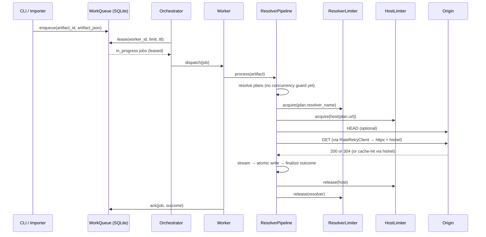

# ContentDownload Orchestrator (PR #8) — **Architecture & Artifact Companion**

> Drop this file into your repo as `src/DocsToKG/ContentDownload/ARCHITECTURE_orchestrator.md`.
> It explains **how the orchestrator, queue, workers, concurrency limiters, and pipeline** fit together; what each artifact does; why we chose this design; and how to operate and extend it confidently. It complements the detailed implementation plan you already have.

---

## 0) What we’re solving (and what we’re not)

**Problem:** Run very large batches of artifacts **safely in parallel** while preserving:

* **Politeness** (per-resolver rate limits, `Retry-After`, host fairness),
* **Idempotence & recovery** (crash-safe queue with resume),
* **Observability** (spans, metrics, audit logs),
* **Simplicity** (single host, SQLite by default).

**Deliberate non-goals (for now):**

* Multi-host distributed scheduling (we keep seams for this),
* Complex priorities/SLAs,
* Speculative prefetching/plan clustering (nice later, not required now).

---

## 1) System overview (components at a glance)

```mermaid
flowchart LR
  subgraph Process["ContentDownload process"]
    Q[(SQLite WorkQueue)]
    SCH[Orchestrator/Scheduler]
    subgraph Pool["Worker Pool (threads)"]
      W1[Worker 1]
      W2[Worker 2]
      Wn[Worker N]
    end
    RL[ResolverLimiter (keyed semaphores)]
    HL[HostLimiter (keyed semaphores)]
    PL[ResolverPipeline]
    RRC[RateRetryClient (per resolver)]
    HC[(httpx.Client)]
    HT[hishel CacheTransport + Controller + Storage]
    TEL[RunTelemetry (CSV/JSONL + OTel)]
  end
  SCH -->|lease jobs| Q
  SCH -->|dispatch| W1 & W2 & Wn
  W1 & W2 & Wn -->|acquire limits| RL & HL
  W1 & W2 & Wn --> PL
  PL --> RRC
  RRC --> HC --> HT -->|GET| Internet[(Origin servers)]
  PL --> TEL
```

**Big ideas:**

* The **WorkQueue** persists work and state transitions (`queued → in_progress → done/skipped/error`).
* The **Orchestrator** leases jobs and feeds a **bounded worker pool**.
* **Keyed semaphores** (per resolver & per host) cap **concurrency** around the **streaming window only** (where network pressure is highest).
* Each network call still flows through our **RateRetryClient** (per resolver) wrapping a **shared httpx.Client** with **hishel** caching.
* **Telemetry** (CSV/JSONL + OTel) records attempts, outcomes, queue depth, throughput, and latencies.

---

## 2) Life of a job (sequence)



**Why guard only the streaming window?**
Resolution is lightweight (one or two API calls) and benefits from extra parallelism. The heavy “apply pressure to host” part is the **GET**; that’s where fairness caps matter.

---

## 3) Data model & invariants (queue)

### Table: `jobs`

| Column                      | Type          | Purpose                                                 |
| --------------------------- | ------------- | ------------------------------------------------------- |
| `id`                        | INTEGER PK    | Row id / lease target                                   |
| `artifact_id`               | TEXT (UNIQUE) | Idempotence key (e.g., `doi:...`, `url:...`)            |
| `artifact_json`             | TEXT          | Serialized artifact payload                             |
| `state`                     | TEXT          | `queued` | `in_progress` | `done` | `skipped` | `error` |
| `attempts`                  | INTEGER       | Pipeline attempts performed so far                      |
| `last_error`                | TEXT          | Last failure reason (truncated)                         |
| `resolver_hint`             | TEXT          | Optional (if pre-known)                                 |
| `created_at` / `updated_at` | TEXT          | ISO timestamps                                          |
| `lease_expires_at`          | TEXT          | Lease timeout (when `in_progress`)                      |
| `worker_id`                 | TEXT          | Owner of current lease                                  |

**Invariants**

* `artifact_id` is **unique** → enqueue is **idempotent**.
* A job is **owned** by at most one worker (via lease).
* If a worker crashes, the **lease expires**; job becomes leaseable again.
* Failures **increment** `attempts`; **retry** until `max_job_attempts`, then `error`.

---

## 4) Concurrency & fairness

**Three layers cooperation:**

1. **Keyed concurrency** (semaphores):

   * `ResolverLimiter`: caps per resolver (`unpaywall: 2`, etc.).
   * `HostLimiter`: caps per host `example.org: 4` (normalized host:port).
   * These **serialize** the streaming window to avoid bursts on a specific upstream.
2. **Rate limiting** (TokenBucket in RateRetryClient):

   * Smooths *request rate* per resolver (seconds granularity).
   * Respects `Retry-After` and refunds tokens on **cache-hit** (no network).
3. **hishel** (shared cache):

   * Avoids network entirely on **cache-hit** (`from_cache && !revalidated`).
   * Turns freshness checks into **304** revalidations most of the time.

**Why both concurrency & rate limit?**
Concurrency caps protect origins from simultaneous connections; rate limits stabilize request **pace** (esp. under retries). They solve different problems, and together they play nicely.

---

## 5) Worker wrapper & pipeline hook

* **Worker**: rehydrates artifact, wraps the whole job in an OTel span, runs `pipeline.process(artifact)`, then **acks/fails**.
* **Pipeline**: unchanged logic, but now calls the **semaphore guards** immediately before streaming:

  * `resolver_limiter.acquire(plan.resolver_name)`
  * `host_limiter.acquire(host(plan.url))`
  * `stream → finalize`
  * `release(...)`

This means **all** download behavior (cache, retries, integrity checks) is preserved identically — just with **bounded parallelism** around GET.

---

## 6) Failure & recovery (scenarios you’ll actually hit)

| Scenario                                 | What happens                                                        | Why it’s safe                                  |
| ---------------------------------------- | ------------------------------------------------------------------- | ---------------------------------------------- |
| Process crash mid-download               | Lease TTL expires; job is re-leased                                 | Idempotent; we re-run safely (cache helps too) |
| Provider returns 429 with Retry-After    | RateRetryClient sleeps/retries; attempt recorded                    | Politeness preserved; dashboard shows cause    |
| Token bucket starvation (burst workload) | Workers wait; optional sleep histogram shows it                     | Prevents overload; smooths pace                |
| Integrity failure (size mismatch)        | Temp removed, manifest error, attempts show `size-mismatch`         | No partial files leak                          |
| Poison jobs (consistently fail)          | Exceed `max_job_attempts` → `error`; can be inspected/retried later | Queue doesn’t jam on bad items                 |

**Crash recovery** pacing is controlled by `lease_ttl_seconds` and `heartbeat_seconds`. Keep TTL comfortably larger than the *longest expected* single-item streaming duration.

---

## 7) Observability you get for free (and where to look)

* **Attempts CSV**: ground truth for per-step events (`http-head`, `http-get`, `cache-hit`, `http-304`, `http-200`, `retry`, reasons).
* **Manifest JSONL**: final per-artifact outcome with size/type.
* **OTel metrics**:

  * `contentdownload_attempts_total{resolver,status,reason,verb}`
  * `contentdownload_http_latency_ms_bucket{resolver,verb}`
  * `contentdownload_retries_total{resolver,reason}`
  * `contentdownload_bytes_total{resolver}`
  * `contentdownload_outcomes_total{resolver,outcome,reason}`
  * Orchestrator: `contentdownload_queue_depth`, `contentdownload_jobs_completed_total`
* **Grafana**:

  * Cache Hit Ratio (overall/by resolver), Revalidation Ratio, Success Rate, GET/HEAD latency p50/p90/p99, Retries by reason, Bytes/sec, Outcomes (stacked), and optional Rate-limit Sleep.

**Tracing (OTel spans):**

* `artifact` (end-to-end per job),
* `prepare`, `stream`, `finalize`,
* `http.request` spans with attributes: resolver, host, `http.status_code`, `hishel.from_cache`, `hishel.revalidated`.

---

## 8) Artifact-by-artifact walkthrough (tie to code)

Below each artifact listed in the implementation plan, here’s **what it is, why it exists, and how you’ll use it.**

### `orchestrator/models.py`

* **What:** small enums and dataclasses (e.g., `JobState`) shared by queue/scheduler/tests.
* **Why:** keep string constants centralized; avoids typos.

### `orchestrator/queue.py` — **WorkQueue**

* **What:** SQLite implementation of enqueue/lease/ack/fail/retry/stats.
* **Why:** durability, idempotence, crash-safety on a single host.
* **Key APIs:**

  * `enqueue(artifact_id, artifact_json, resolver_hint=None) -> bool`
  * `lease(worker_id, limit, lease_ttl_sec) -> list[dict]`
  * `ack(job_id, outcome, last_error=None)`
  * `fail_and_retry(job_id, backoff_sec, max_attempts, last_error)`
  * `stats() -> dict`

### `orchestrator/limits.py` — **KeyedLimiter**

* **What:** keyed semaphores for **per-resolver** and **per-host** concurrency.
* **Why:** fair, simple guard around the hot network section.
* **Key APIs:** `acquire(key)`, `release(key)`, `host_key(url)` (normalizes host:port).

### `orchestrator/workers.py` — **Worker**

* **What:** thread wrapper that runs one job → `pipeline.process` → ack/fail; sets OTel job span.
* **Why:** isolates job orchestration concerns from pipeline logic.
* **Hooks:** uses pipeline with limiters injected; backoff for retry via config knobs.

### `orchestrator/scheduler.py` — **Orchestrator**

* **What:** dispatcher + heartbeat + worker pool; leases jobs and feeds workers.
* **Why:** crunchy bit that guarantees bounded inflight jobs and clean shutdown.
* **Threads:**

  * Dispatcher (lease → queue),
  * Heartbeat,
  * `max_workers` worker threads.
* **Metrics:** queue depth, throughput.

### `httpx/client.py` — **RateRetryClient**

* **What:** per-resolver wrapper adding rate limiting, retries, and retry telemetry **on top of** hishel-enabled httpx.
* **Why:** hishel handles cache/validation; we handle politeness and resilience.
* **Change in PR #8:** make `TokenBucket` **thread-safe** (mutex) because multiple workers share it.

### `bootstrap.py` — **pipeline builder + orchestrator seam**

* **What:** `build_pipeline_from_config(cfg)` and `queue run` entry wiring.
* **Why:** avoid duplicating bootstrap logic between CLI run and orchestrated run.

### `config/models.py` — **OrchestratorConfig, QueueConfig**

* **What:** typed knobs for max workers, per-resolver caps, host cap, TTLs, backoff.
* **Why:** **one source of truth**; defaults chosen to be safe.

### `cli/app.py` — **Queue commands**

* **What:** `queue enqueue`, `queue import`, `queue run --drain`, `queue stats`, `queue retry-failed` (and optional pause/resume).
* **Why:** operators don’t need to write a Python script to use the queue.

### Telemetry

* **What:** orchestrator adds queue depth/throughput metrics; workers preserve existing attempt/outcome sinks.
* **Why:** you can see “Is it working?” and “Where is time spent?” in Grafana.

---

## 9) Operational cookbook (common tasks)

* **Enqueue a file of artifacts (JSONL):**
  `contentdownload queue import ./artifacts.jsonl -c cd.yaml`
* **Run and drain (exit when empty):**
  `contentdownload queue run --drain -c cd.yaml`
* **See queue stats:**
  `contentdownload queue stats -c cd.yaml`
* **Retry all failed:**
  `contentdownload queue retry-failed -c cd.yaml`
* **Interrupt safely:** `Ctrl+C` → orchestrator stops dispatching, workers finish current job, leases on unfinished jobs expire and recover next run.

---

## 10) Testing matrix (what each test proves)

| Test                         | Asserts                                                                       |
| ---------------------------- | ----------------------------------------------------------------------------- |
| `test_queue_basic.py`        | idempotent enqueue, leasing, ack, fail+retry, terminal error                  |
| `test_scheduler_limits.py`   | concurrency never exceeds `max_per_resolver`/`max_per_host` (measure overlap) |
| `test_scheduler_recovery.py` | stale leases re-queue after TTL; job completes on next run                    |
| `test_cli_queue.py`          | CLI flows work end-to-end                                                     |
| Existing download tests      | streaming + finalize + telemetry unchanged                                    |
| Optional OTel tests          | queue depth/throughput counters and job spans emitted                         |

---

## 11) Design choices (and trade-offs)

* **SQLite + WAL**: uber-simple, robust on a single host; WAL enables concurrent readers/writers.
  *Trade-off:* not a distributed queue. We kept seams so you can move to Postgres or Redis Streams later.
* **Guard only streaming**: best throughput/complexity balance; resolution remains unconstrained and fast.
  *Trade-off:* a few wasted resolution calls when limits are tight — acceptable.
* **Shared httpx.Client + per-resolver wrappers**: maximal connection reuse; per-resolver behavior stays isolated.
  *Trade-off:* if a resolver is extremely noisy, a separate Client could isolate pools; currently unnecessary.
* **Throttle + hishel**: rate limit smooths pace, hishel erases network on warm data; together they’re kinder to upstreams.
  *Trade-off:* two mechanisms to reason about — but observability makes it clear when each triggers.

---

## 12) Extension roadmap (when you need more)

* **Multi-host queue:** swap `WorkQueue` to Postgres; add worker `node_id`; shards/partitions by artifact hash.
* **Priorities:** column + ORDER BY in leasing; add “VIP” lanes.
* **Domain fairness v2:** per-domain separate caps (group different sub-hosts).
* **Dynamic throttling:** lower concurrency/rate automatically when `retry-after` spikes.
* **Batch scheduling:** cluster artifacts by host to exploit locality (warmer caches, fewer DNS resolutions).
* **Backpressure from pipeline:** surface slow storage writes to orchestrator, reduce lease rate.

---

## 13) Glossary

* **Lease**: temporary claim on a job; expires if worker crashes.
* **Heartbeat**: periodic extension of lease, proving the worker is alive.
* **Keyed semaphore**: concurrency gate keyed by resolver or host.
* **Retry-After**: origin tells you how long to wait; we honor it.
* **Cache-hit**: hishel served from storage without network; we refund the rate token.
* **Revalidation (304)**: conditional GET proves resource unchanged; no body streamed.

---

## 14) Appendix A — State machine (jobs)

```
            +---------+
   enqueue  | queued  | (lease) → set worker_id, lease_expires_at
   ───────▶ +---------+ ────────────────────────────────────────┐
             ▲      │                                           │ TTL expired
             │      │ ack(done/skipped/error)                    ▼
             │      ▼                                 +------------------+
             │  +-----------+ fail+retry (attempts++) |  in_progress     |
             │  | error     | ◀───────────────────────| (leased by worker)|
             │  +-----------+                         +------------------+
             │
             └─────────────────────────────────────── if attempts >= max → error
```

---

## 15) Appendix B — Tuning guide

* **Throughput**: increase `orchestrator.max_workers` first; then `max_per_host`/`max_per_resolver` cautiously.
* **Politeness**: when throttled (`retry-after` ↑), **lower** rate limiter `capacity/refill` and (optionally) **reduces** `max_per_host`.
* **Stability**: set `lease_ttl_seconds` ≈ *2×* worst-case single download time; `heartbeat_seconds` ≈ 1/10 of TTL.
* **I/O heavy hosts**: consider disabling HEAD (fewer roundtrips) and increase `download.chunk_size_bytes`.

---

### TL;DR

* **Queue** gives you **resume, idempotence, and control**;
* **Limiters + rate limits** keep you **polite**;
* **hishel** makes you **efficient**;
* **Telemetry** makes it **obvious** what’s happening.

If you’d like, I can generate a **Resolver Drilldown** Grafana dashboard and a **runbook** for the queue CLI (copy-paste commands for the top 10 operational tasks).
