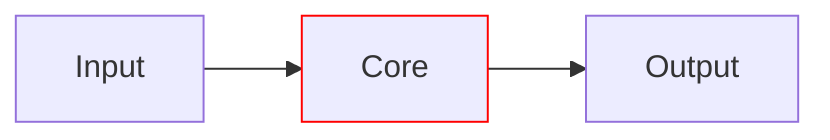
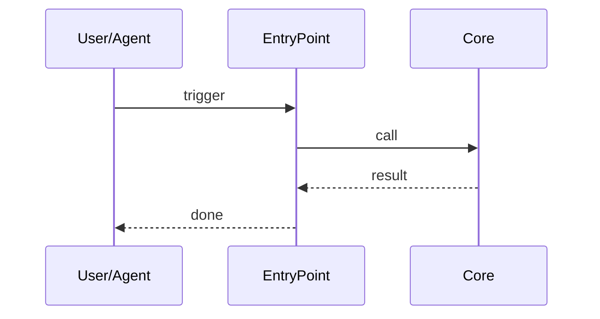

# <REPO NAME> • <SUBDIRECTORY NAME>

Purpose: <ONE-LINE PURPOSE>
Scope boundary: <WHAT THIS SUBMODULE DOES / DOES NOT DO>

---

## Quickstart  <!-- how-to -->
> One-shot setup, then run the main workflow.
```bash
# Dev container (recommended)
# Open in VS Code -> "Reopen in Container"

# Local
python -m venv .venv && source .venv/bin/activate
pip install -U pip
pip install -e ".[dev]"
```

## Common commands  <!-- reference -->
```bash
just --list
just <task>                 # e.g., <subdir>.run
just <task>                 # e.g., <subdir>.test

# Fallback CLI
python -m <package.module> <command> [flags]
```

## Folder map (top N)  <!-- reference -->
- `<file-or-dir>` - <one-line purpose>
- `<file-or-dir>` - <one-line purpose>
- `<file-or-dir>` - <one-line purpose>

## System overview  <!-- explanation -->



## Entry points & contracts  <!-- reference -->
- Entry points: `<cli.py>`, `<handlers.py>`, `<__main__.py>`
- Contracts/invariants:
  - <rule 1>
  - <rule 2>

## Configuration  <!-- reference -->
- Env vars:
  - `VAR_NAME` (default: `<value>`) - <meaning>
- Validate config: `python -m <package> doctor`

## Data contracts & schemas  <!-- reference -->
- JSON Schemas: `schema/*.schema.json`
- OpenAPI: `api/openapi.yaml`
- Validation: `just check-schemas` (or equivalent)

## Interactions with other packages  <!-- explanation/reference -->
- Upstream: `<module>` reads `<path>`
- Downstream: emits `<artifact>` consumed by `<module>`
- ID/path guarantees: `<rule>`

## Observability  <!-- reference -->
- Logs: `<library>` to stdout
- Metrics/tracing: `<how to view>`
- **SLIs/SLOs**: availability X%, latency P50/P95 targets
- Health: `python -m <package> doctor` (exit 0 = healthy)

## Security & data handling  <!-- reference/explanation -->
- ASVS level: L1|L2|L3
- Threats considered (STRIDE): <3–5 bullets>
- Data classification: <PII/no-PII>; secrets handling: <rule>

## Development tasks  <!-- how-to/reference -->
```bash
just fmt && just lint && just typecheck && just test
pytest -q <subdir-tests>
```

## Agent guardrails  <!-- reference -->
- Do:
  - <safe change 1>
  - <safe change 2>
- Do not:
  - <forbidden change 1>
  - <forbidden change 2>
- Danger zone:
  - `<command>` deletes `./cache`

## FAQ  <!-- explanation -->
- Q: <question>
  A: <short answer>

- Q: <question>
  A: <short answer>

<!-- Machine-readable appendix -->
```json x-agent-map
{
  "entry_points":[{"type":"cli","module":"<pkg.cli>","commands":["run","doctor"]}],
  "env":[{"name":"FOO_API_URL","default":"http://localhost:8080","required":true}],
  "schemas":[{"kind":"openapi","path":"api/openapi.yaml"}],
  "artifacts_out":[{"path":"out/*.json","consumed_by":["../analytics"]}],
  "danger_zone":[{"command":"just wipe-cache","effect":"deletes ./cache"}]
}
```
