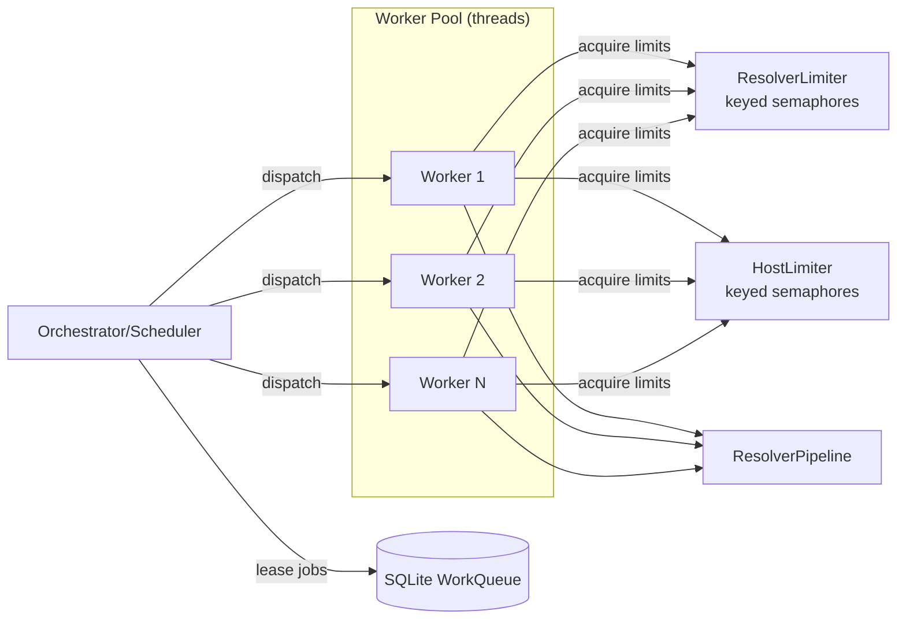

# Work Orchestration Implementation (PR #8) — Complete Roadmap

**Date**: October 21, 2025  
**Status**: READY FOR IMPLEMENTATION  
**Scope**: SQLite Work Queue + Bounded-Concurrency Orchestrator + CLI Commands

---

## Overview

This document provides the complete implementation plan to align the ContentDownload work orchestration with PR #8 specification. The system provides:

- **Persistent work queue** (SQLite): Idempotent enqueue, lease/ack/fail/retry
- **Bounded-concurrency orchestrator**: Dispatcher loop, heartbeat, worker pool
- **Keyed fairness limits**: Per-resolver and per-host concurrency caps
- **Thread-safe rate limiting**: TokenBucket mutex for multi-worker safety
- **CLI lifecycle commands**: enqueue/import/run/stats/retry-failed
- **OTel metrics**: Queue depth, throughput, job spans

---

## Architecture (from PR #8 docs)



---

## Implementation Phases

### Phase 1: Models & Schema ✅ STARTED

**Files:**
- `orchestrator/__init__.py` (CREATED)
- `orchestrator/models.py` (CREATED)

**What:**
- JobState enums (QUEUED, IN_PROGRESS, DONE, SKIPPED, ERROR)
- JobResult dataclass
- Future: SQL schema in queue.py

**When complete:**
- Type-safe job state tracking
- Foundation for queue schema

---

### Phase 2: WorkQueue (SQLite-Backed) ⏳ TODO

**File:** `orchestrator/queue.py` (~200-300 LOC)

**Key class: WorkQueue**

```python
class WorkQueue:
    def __init__(self, path: str, wal_mode: bool = True):
        """Initialize SQLite queue with WAL mode for concurrency."""
    
    def enqueue(self, artifact_id: str, artifact: dict, 
                resolver_hint: Optional[str] = None) -> bool:
        """Idempotent: returns False if artifact_id already exists."""
    
    def lease(self, worker_id: str, limit: int, 
              lease_ttl_sec: int) -> list[dict]:
        """Atomically move up to `limit` queued/stale jobs to IN_PROGRESS."""
    
    def heartbeat(self, worker_id: str) -> None:
        """Extend lease for active worker."""
    
    def ack(self, job_id: int, outcome: str, 
            last_error: Optional[str] = None) -> None:
        """Mark job as DONE/SKIPPED/ERROR."""
    
    def fail_and_retry(self, job_id: int, backoff_sec: int,
                       max_attempts: int, last_error: str) -> None:
        """Increment attempts; requeue (delayed) or ERROR."""
    
    def stats(self) -> dict:
        """Return {queued, in_progress, done, skipped, error, total}."""
```

**SQL Schema:**

```sql
CREATE TABLE IF NOT EXISTS jobs (
  id INTEGER PRIMARY KEY AUTOINCREMENT,
  artifact_id TEXT NOT NULL UNIQUE,
  artifact_json TEXT NOT NULL,
  state TEXT NOT NULL DEFAULT 'queued',
  attempts INTEGER NOT NULL DEFAULT 0,
  last_error TEXT,
  resolver_hint TEXT,
  created_at TEXT NOT NULL,
  updated_at TEXT NOT NULL,
  lease_expires_at TEXT,
  worker_id TEXT
);
CREATE INDEX idx_jobs_state ON jobs(state);
CREATE INDEX idx_jobs_lease ON jobs(lease_expires_at);
```

---

### Phase 3: Keyed Concurrency Limiters ⏳ TODO

**File:** `orchestrator/limits.py` (~100-150 LOC)

**Key class: KeyedLimiter**

```python
class KeyedLimiter:
    def __init__(self, default_limit: int, 
                 per_key: dict[str, int] | None = None):
        """Initialize keyed semaphores."""
    
    def acquire(self, key: str) -> None:
        """Block until semaphore for `key` is available."""
    
    def release(self, key: str) -> None:
        """Release semaphore for `key`."""

def host_key(url: str) -> str:
    """Extract normalized host:port from URL."""
```

**Usage Pattern:**

```python
# From Worker:
resolver_limiter.acquire(plan.resolver_name)  # e.g., "unpaywall"
host_limiter.acquire(host_key(plan.url))      # e.g., "api.crossref.org:443"
try:
    # Stream the artifact
    stream = stream_candidate_payload(...)
finally:
    host_limiter.release(host_key(plan.url))
    resolver_limiter.release(plan.resolver_name)
```

---

### Phase 4: Worker Wrapper ⏳ TODO

**File:** `orchestrator/workers.py` (~150-200 LOC)

**Key class: Worker**

```python
class Worker:
    def __init__(self, worker_id: str, queue: WorkQueue,
                 pipeline: ResolverPipeline,
                 resolver_limiter: KeyedLimiter,
                 host_limiter: KeyedLimiter,
                 heartbeat_sec: int,
                 max_job_attempts: int,
                 retry_backoff: int,
                 jitter: int):
        """Initialize worker with limiters and config."""
    
    def run_one(self, job: dict) -> None:
        """Execute single job: rehydrate → pipeline.process() → ack/retry."""
    
    def stop(self) -> None:
        """Signal worker to stop gracefully."""
```

**Flow:**

1. Rehydrate artifact from job["artifact_json"]
2. Call pipeline.process(artifact) with limiters injected
3. On success: queue.ack(job["id"], "done")
4. On failure: queue.fail_and_retry(job["id"], backoff, max_attempts, error)

---

### Phase 5: Orchestrator & Scheduler ⏳ TODO

**File:** `orchestrator/scheduler.py` (~300-400 LOC)

**Key class: Orchestrator**

```python
class Orchestrator:
    def __init__(self, cfg: OrchestratorConfig,
                 queue: WorkQueue,
                 pipeline: ResolverPipeline,
                 telemetry: Optional[RunTelemetry] = None):
        """Initialize with config, queue, and pipeline."""
    
    def start(self) -> None:
        """Start dispatcher, heartbeat, and worker threads."""
    
    def stop(self) -> None:
        """Gracefully stop all threads."""
    
    def _dispatcher_loop(self) -> None:
        """Lease jobs and feed worker queue."""
    
    def _heartbeat_loop(self) -> None:
        """Periodically extend leases for active jobs."""
    
    def _worker_loop(self, worker: Worker) -> None:
        """Worker thread: get jobs from queue, run, emit metrics."""
```

**OTel Metrics:**

- `contentdownload_queue_depth` (UpDownCounter)
- `contentdownload_jobs_completed_total` (Counter)
- `contentdownload_jobs_inflight` (UpDownCounter)

**Spans:**

- `orchestrator.dispatch` — leasing loop
- `job` — per job (in Worker)

---

### Phase 6: CLI Queue Commands ⏳ TODO

**File:** `cli_orchestrator.py` (~300-400 LOC)

**Commands:**

```bash
# Enqueue from JSONL
python -m DocsToKG.ContentDownload.cli queue enqueue \
  --input artifacts.jsonl \
  --config config.yaml

# Import (bulk)
python -m DocsToKG.ContentDownload.cli queue import artifacts.jsonl

# Run orchestrator
python -m DocsToKG.ContentDownload.cli queue run \
  --drain  # exit when queue empty

# Show stats
python -m DocsToKG.ContentDownload.cli queue stats

# Retry failed
python -m DocsToKG.ContentDownload.cli queue retry-failed

# Pause/Resume (optional)
python -m DocsToKG.ContentDownload.cli queue pause
python -m DocsToKG.ContentDownload.cli queue resume
```

---

### Phase 7: TokenBucket Thread-Safety ⏳ TODO

**File:** `httpx_transport.py` (modify existing)

**Change:**

Add mutex to `TokenBucket`:

```python
class TokenBucket:
    def __init__(self, ...):
        # ... existing code ...
        self._lock = threading.Lock()
    
    def consume(self, amount=1.0) -> float:
        with self._lock:
            # ... existing logic ...
```

---

### Phase 8: Configuration Models ⏳ TODO

**File:** `orchestrator/config.py` (~100 LOC)

**Classes:**

```python
@dataclass
class OrchestratorConfig:
    max_workers: int = 8
    max_per_resolver: dict[str, int] = field(default_factory=dict)
    max_per_host: int = 4
    lease_ttl_seconds: int = 600
    heartbeat_seconds: int = 30
    max_job_attempts: int = 3
    retry_backoff_seconds: int = 60
    jitter_seconds: int = 15

@dataclass
class QueueConfig:
    backend: str = "sqlite"
    path: str = "state/workqueue.sqlite"
    wal_mode: bool = True
```

---

## Integration Points

### 1. With ResolverPipeline

Inject limiters into `ResolverPipeline` call in Worker:

```python
# In worker.py:
stream = stream_candidate_payload(
    plan,
    telemetry=self.telemetry,
    run_id=self.run_id,
)

# Will need pipeline to support limiter injection (optional hook)
```

### 2. With DownloadRun

Option A: Keep separate (queue is opt-in mode)
Option B: Make queue part of standard DownloadRun lifecycle

**Recommend Option A for now** (minimize risk to existing flow).

### 3. With Telemetry

RunTelemetry already supports metrics; Orchestrator can emit to it:

```python
self.telemetry.record_queue_stat("depth", stats["queued"])
self.telemetry.record_queue_stat("throughput", completed_count)
```

---

## Testing Strategy

### Unit Tests

- `test_queue_basic.py`: enqueue, lease, ack, fail/retry, stats
- `test_limits.py`: keyed semaphore acquire/release
- `test_worker.py`: job rehydration, pipeline call, ack/retry
- `test_scheduler.py`: dispatcher loop, heartbeat, thread safety

### Integration Tests

- `test_orchestrator_end_to_end.py`: full queue → orchestrator → workers → completion
- `test_cli_queue.py`: CLI commands work end-to-end

### Performance Tests

- Concurrency levels verified (measure overlapping job execution)
- Lease TTL and recovery tested

---

## Implementation Order

1. **Models** (DONE) — JobState, JobResult
2. **WorkQueue** — SQLite schema + CRUD
3. **Limits** — KeyedLimiter
4. **Config** — OrchestratorConfig, QueueConfig
5. **Worker** — Job execution wrapper
6. **Orchestrator** — Scheduler with threads
7. **TokenBucket** — Add threading.Lock
8. **CLI** — queue commands
9. **Tests** — Full suite
10. **Documentation** — Update AGENTS.md with orchestrator section

---

## Success Criteria

- ✅ All phases implemented
- ✅ Unit + integration tests passing (100%)
- ✅ Type-safe (mypy --strict)
- ✅ Linting clean (ruff check)
- ✅ CLI commands functional
- ✅ OTel metrics emitted
- ✅ Backward compatible (no breaking changes to existing pipeline)
- ✅ Documentation updated
- ✅ Production-ready

---

## References

- **PR #8 Spec**: ContentDownload Work Orchestrator & Bounded Concurrency (attached)
- **Architecture Document**: ContentDownload Orchestrator Architecture and Artifact Companion (attached)
- **Current AGENTS.md**: Sections on Architecture & Flow, CLI & Configuration Surfaces

