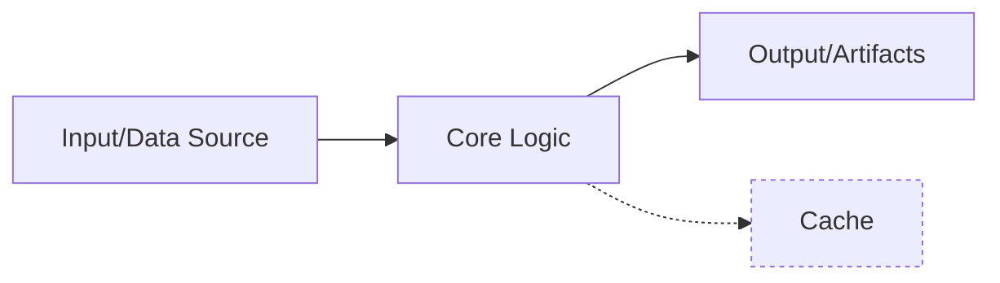

# Agents Guide - <SUBDIRECTORY NAME>

Last updated: 2025-10-18

## Mission and Scope
- Mission: <one sentence describing what excellent code accomplishes here>
- Scope boundary: <in-scope responsibilities> / <out-of-scope responsibilities>

## High-Level Architecture & Data Flow

- Components: <list 3–5 components>
- Primary data edges: <summarize>
- One failure path to consider: <short note>

## Hot Paths & Data Shapes
- Hot paths: `<pkg.module>:func` — why hot: <reason>
- Typical payload sizes: <numbers>/<percentiles>
- Key schemas/models: <paths> (update docstrings if stale)

## Performance Objectives & Baselines
- Targets: P50 <X ms>, P95 <Y ms>, throughput <Z/s> (TODO if unknown)
- Known baseline (if any): <numbers + date> (or `TODO`)
- Measurement recipe:
  ```bash
  pytest -q -k perf  # or example micro-benchmark
  ```

## Profiling & Optimization Playbook
- Quick profile:
  ```bash
  python -m cProfile -m <package.module> <args>
  # or: pyinstrument -r html -o profile.html <command>
  ```
- Tactics to try:
  - Batch & stream (avoid per-item I/O)
  - Vectorize (NumPy/Pandas) or fuse loops
  - Reduce allocations (reuse buffers, pre-size lists)
  - Avoid N^2 joins/scans; prefer indexes and precomputed maps
  - Cache stable transforms (note invalidation rules below)

## Complexity & Scalability Guidance
- Expected complexity of key operations: <O(n log n), O(n), …>
- Memory growth notes: <when N doubles, memory grows by …>
- Large‑N strategy: <chunking, external sort, reservoir sampling, …>

## I/O, Caching & Concurrency
- I/O patterns: <which files/URLs and when>; prefer streaming for large payloads
- Cache keys & invalidation: <what makes entries unique; how to expire>
- Concurrency: <safe parallel sections> | <shared state to avoid>

## Invariants to Preserve (change with caution)
- Ordering/determinism: <rule>
- Idempotency: <rule>
- Stable IDs/hashes and schema field order: <rule>
- Compatibility guarantees: <which callers rely on what>

## Preferred Refactor Surfaces
- Extension points: <adapters/providers/strategies>
- Low‑risk files to optimize: <files/modules>
- Where **not** to optimize first (riskier surfaces): <areas + reason>

## Code Documentation Requirements
- **Module docstrings**: present and up to date
- **Public API docstrings**: include purpose, params, returns, raises, examples
- **NAVMAP blocks** in larger modules: present and aligned with section dividers
- Follow our guides:
  - Module organization: `MODULE_ORGANIZATION_GUIDE.md`
  - Code annotations: `CODE_ANNOTATION_STANDARDS.md`
  - Style & voice: `STYLE_GUIDE.md`
- Example:
  ```python
  def process_documents(ids: list[str]) -> dict[str, Result]:
      """Process documents end-to-end.

      Args:
          ids: Document identifiers

      Returns:
          Mapping from ID to processing result
      """
  ```

## Test Matrix & Quality Gates
```bash
just fmt && just lint && just typecheck
pytest -q -k "unit or integration"
# if available:
pytest --benchmark-only -k perf
```
- Golden files for transforms: <paths>
- Stress test for hot path: <command or TODO>
- Coverage expectations (if any): <target or TODO>

## Failure Modes & Debug Hints
| Symptom | Likely cause | Quick checks |
|---|---|---|
| <timeout> | <N^2 join or chatty I/O> | <profile command / log toggle> |
| <OOM> | <batch too large or leak> | <reduce batch / reuse buffers> |
| <inconsistent outputs> | <ordering not enforced> | <sort keys / stabilize hashing> |

## Canonical Commands
```bash
just <task>                 # e.g., <subdir>.run
just <task>                 # e.g., <subdir>.test

# CLI fallback
python -m <package.module> <command> [flags]
```

## Indexing Hints
- Read first: <files>
- High-signal tests: <paths>
- Key schemas/contracts: <paths>

## Ownership & Documentation Links
- Owners/reviewers: <handles or team>
- See also: `MODULE_ORGANIZATION_GUIDE.md`, `CODE_ANNOTATION_STANDARDS.md`, `STYLE_GUIDE.md`

## Changelog and Update Procedure
- Update **targets, baselines, and hot paths** when behavior changes materially.
- Keep examples runnable or mark them as examples with comments.
