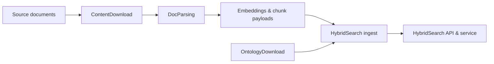

# Overview

## What is DocsToKG?

DocsToKG is a Python toolkit for turning raw documents into searchable, richly annotated knowledge artefacts. It combines document acquisition, Docling-based parsing, ontology enrichment, and a FAISS-backed hybrid search engine to surface relevant context for downstream applications.

## Core Capabilities

### Content Acquisition & Parsing

- Download corpora and metadata from external sources (e.g., Pyalex) using the `ContentDownload` utilities.
- Convert PDFs and HTML into DocTags, chunked Markdown, and embeddings via `DocParsing` pipelines.
- Preserve provenance (page numbers, figure references, captions) for downstream quality checks.

### Hybrid Search

- Fuse lexical (BM25), sparse (SPLADE), and dense (FAISS) retrieval signals for robust ranking.
- Support namespace-aware search, diagnostics, and cursor-based pagination.
- Expose programmatic APIs (`HybridSearchService`, `HybridSearchAPI`) for integration.

### Ontology Integration

- Download, validate, and catalogue ontologies through the `OntologyDownload` CLI.
- Enrich document metadata using controlled vocabularies and reusable resolver logic.
- Keep terminologies current with automated validation and manifests.

## Architecture Overview

## Key Components

- **ContentDownload** – Resolvers and utilities for fetching PDFs and metadata (e.g., Pyalex support).
- **DocParsing** – Docling pipelines that chunk documents, extract captions, and generate embeddings.
- **HybridSearch** – Retrieval service combining FAISS, BM25, and SPLADE with fusion, observability, and API layers.
- **OntologyDownload** – CLI-driven ontology fetcher with validation pipelines and manifest management.
- **Documentation Tooling** – Scripts under `docs/scripts/` to generate API docs, run validations, and build Sphinx sites.

## Use Cases

### Research & Academia

- Literature review automation
- Cross-document concept linking
- Research trend analysis

### Enterprise Knowledge Management

- Document discovery and retrieval
- Knowledge base construction
- Compliance and audit support

### Content Management

- Editorial workflows for large publication archives
- Recommendation and summarisation pipelines
- Dataset curation with ontology alignment

## Technology Stack

- **Language & Runtime**: Python ≥3.12, type hints enforced via `mypy --strict`
- **Parsing & NLP**: Docling, Hugging Face Transformers, vLLM for accelerated inference
- **Retrieval**: FAISS (dense), BM25/SPLADE simulators for sparse signals
- **Ontology & RDF**: `oaklib`, `ols-client`, `ontoportal-client`, `rdflib`, `owlready2`, `pronto`, `arelle`
- **Tooling**: Sphinx, Vale (optional), pytest, ruff, black
- **Automation Scripts**: `docs/scripts/` orchestration, `tests/` for quality gates

## Getting Started

Ready to explore DocsToKG? Here's your path:

1. **[Setup Guide](../02-setup/)** - Get the system running locally
2. **[API Reference](../04-api/)** - Learn to integrate with the system
3. **[Architecture Deep Dive](../03-architecture/)** - Understand the internals
4. **[Development Guide](../05-development/)** - Contribute to the project

## Project Status

- **Current Version**: 0.1.0
- **Development Phase**: Active development
- **Documentation**: Framework established with automated validation
- **Community**: Contributions welcome via GitHub issues and pull requests

For the latest updates, check our [GitHub repository](https://github.com/paul-heyse/DocsToKG) or the [Development Guide](../05-development/index.md).
