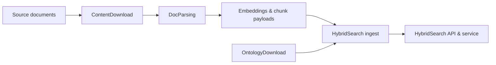

# 1. Overview

## 2. What is DocsToKG?

DocsToKG is a Python toolkit for turning raw documents into searchable, richly annotated
knowledge artefacts. It combines document acquisition, Docling-based parsing, ontology
enrichment, and a FAISS-backed hybrid search engine to surface relevant context for
downstream applications. The current release (0.2.0) ships with modular DocParsing shims,
resolver telemetry improvements, and hybrid search validation harnesses.

## 3. Core Capabilities

### Content Acquisition & Parsing

- Download corpora and metadata from external sources (e.g., Pyalex) using the `DocsToKG.ContentDownload.cli` orchestration entry point.
- Convert PDFs and HTML into DocTags, chunked Markdown, and embeddings via `DocsToKG.DocParsing.chunking` and `DocsToKG.DocParsing.embedding`, backed by Docling.
- Preserve provenance (page numbers, figure references, captions) and telemetry via manifest sinks for downstream quality checks.

### Hybrid Search

- Fuse lexical (BM25), sparse (SPLADE), and dense (FAISS) retrieval signals using `HybridSearchService`.
- Support namespace-aware search, diagnostics, and cursor-based pagination with configurable weighting (`hybrid_config.json`).
- Expose programmatic APIs (`HybridSearchAPI`) for embedding into FastAPI or other web layers.

### Ontology Integration

- Download, validate, and catalogue ontologies with `DocsToKG.OntologyDownload.cli`.
- Enrich document metadata using controlled vocabularies and reusable resolver logic housed in the `OntologyDownload` package.
- Keep terminologies current with automated validation and manifests persisted to object storage.

## 4. Architecture Overview

## 5. Key Components

- **ContentDownload** – Resolver pipelines, telemetry sinks, and download orchestration that pull artefacts from Pyalex, Crossref, Zenodo, Figshare, and more.
- **DocParsing** – Docling-powered chunking and embedding pipelines with CLI shims that feed the unified DocParsing command set.
- **HybridSearch** – Retrieval service combining FAISS, BM25, and SPLADE with fusion, observability hooks, and API layers.
- **OntologyDownload** – CLI-driven ontology fetcher with validation pipelines, storage adapters, and manifest management.
- **Documentation Tooling** – Scripts under `docs/scripts/` for API generation, documentation validation, and link checking; `openspec/` manages spec-driven workflows.

## 6. Use Cases

### Research & Academia

- Literature review automation
- Cross-document concept linking
- Research trend analysis

### Enterprise Knowledge Management

- Document discovery and retrieval
- Knowledge base construction
- Compliance and audit support

### Content Management

- Editorial workflows for large publication archives
- Recommendation and summarisation pipelines
- Dataset curation with ontology alignment

## 7. Technology Stack

- **Language & Runtime**: Python ≥3.13 (bootstrapped via `scripts/bootstrap_env.sh`), type hints enforced via `mypy --strict`
- **Parsing & NLP**: Docling, Hugging Face Transformers, vLLM for accelerated inference
- **Retrieval**: FAISS (dense), BM25/SPLADE for sparse signals, configurable fusion kernels
- **Ontology & RDF**: `oaklib`, `ontoportal-client`, `ols-client`, `rdflib`, `owlready2`, `pronto`, `arelle`
- **Telemetry & Logging**: `structlog`, `prometheus-fastapi-instrumentator`, and staged JSONL/SQLite sinks
- **Tooling**: Sphinx, Vale (optional), pytest, ruff, black, openspec CLI
- **Automation**: `docs/scripts/` for doc hygiene, `tests/` with GPU and integration markers, `scripts/dev.sh` helpers

## 8. Getting Started

Ready to explore DocsToKG? Here's your path:

1. **[Setup Guide](../02-setup/index.md)** - Get the system running locally
2. **[API Reference](../04-api/index.md)** - Learn to integrate with the system
3. **[Architecture Deep Dive](../03-architecture/index.md)** - Understand the internals
4. **[Development Guide](../05-development/index.md)** - Contribute to the project

## 9. Project Status

- **Current Version**: 0.2.0
- **Development Phase**: Active development with spec-driven proposals (`openspec/changes`)
- **Documentation**: Automated validation (code annotations, Sphinx builds, link checks) part of CI
- **Community**: Contributions welcome via GitHub issues and pull requests

For the latest updates, check our [GitHub repository](https://github.com/paul-heyse/DocsToKG) or the [Development Guide](../05-development/index.md).
