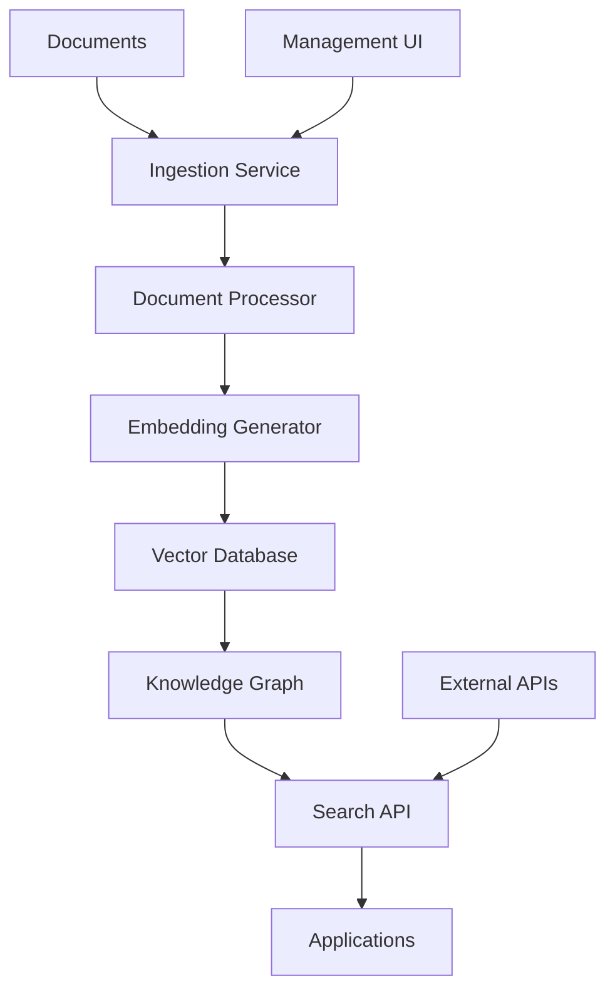

# Overview

## What is DocsToKG?

DocsToKG is a comprehensive system for transforming documents into structured knowledge graphs using vector search, machine learning, and AI technologies. It enables intelligent document processing, semantic search, and knowledge discovery across large document collections.

## Core Capabilities

### Document Processing Pipeline

- **Multi-format Support**: Process PDF, DOCX, TXT, HTML, and other document types
- **Content Extraction**: Extract text, metadata, and structural information
- **AI-Powered Analysis**: Use modern language models for content understanding and classification

### Knowledge Graph Construction

- **Entity Recognition**: Identify and extract key entities, concepts, and relationships
- **Semantic Linking**: Create connections between related content across documents
- **Structured Representation**: Build graph-based representations for complex querying

### Intelligent Search & Discovery

- **Vector Search**: Use Faiss for high-performance similarity search
- **Semantic Queries**: Natural language understanding for search queries
- **Contextual Results**: Return relevant passages with surrounding context

## Architecture Overview

## Key Components

### Ingestion Service

Handles document upload, validation, and initial processing pipeline orchestration.

### Document Processor

Extracts content, metadata, and applies preprocessing transformations.

### Embedding Generator

Creates vector representations using modern language models and domain-specific encoders.

### Vector Database (Faiss)

Stores and indexes document embeddings for fast similarity search operations.

### Knowledge Graph Service

Builds and maintains graph structures representing document relationships and concepts.

### Search API

Provides RESTful endpoints for semantic search, filtering, and result retrieval.

## Use Cases

### Research & Academia

- Literature review automation
- Cross-document concept linking
- Research trend analysis

### Enterprise Knowledge Management

- Document discovery and retrieval
- Knowledge base construction
- Compliance and audit support

### Content Management

- Article and blog organization
- Content recommendation systems
- Automated tagging and categorization

## Technology Stack

- **Backend**: Python, FastAPI, SQLAlchemy
- **Vector Search**: Faiss, Elasticsearch
- **AI/ML**: Transformers, PyTorch, scikit-learn
- **Storage**: PostgreSQL, Redis, MinIO
- **Documentation**: Sphinx, Markdown
- **DevOps**: Docker, Kubernetes, GitHub Actions

## Getting Started

Ready to explore DocsToKG? Here's your path:

1. **[Setup Guide](../02-setup/)** - Get the system running locally
2. **[API Reference](../04-api/)** - Learn to integrate with the system
3. **[Architecture Deep Dive](../03-architecture/)** - Understand the internals
4. **[Development Guide](../05-development/)** - Contribute to the project

## Project Status

- **Current Version**: v1.0.0
- **Development Phase**: Active development
- **Documentation**: Comprehensive framework established
- **Community**: Open to contributors and feedback

For the latest updates, check our [GitHub repository](https://github.com/yourorg/docstokg) or [project roadmap](../05-development/roadmap.md).
