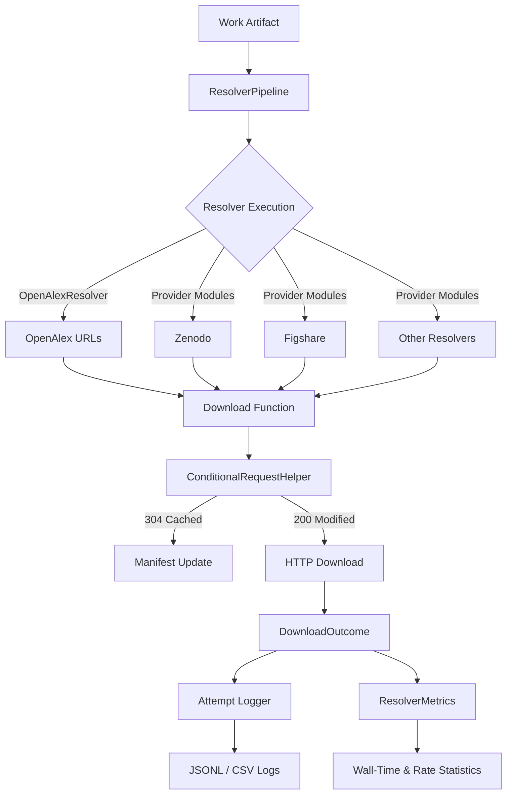

# 1. Content Download Resolver Architecture



## 1. Module Responsibilities

- **`pipeline.py`** – orchestrates resolver execution, respects rate limits,
  enforces concurrency settings, and performs HEAD pre-check filtering.
- **`types.py`** – houses resolver dataclasses, configuration validation, and
  attempt logging interfaces.
- **`providers/*`** – individual resolver implementations with defensive error
  handling and metadata-rich events.
- **`http.py`** – centralised retry/backoff utilities with Retry-After
  compliance and structured logging.
- **`conditional.py`** – interprets cached vs modified responses and validates
  manifest metadata.

## 2. Related DocsToKG References

- `docs/resolver-configuration.md` – configuration details and YAML snippets.
- `docs/adding-custom-resolvers.md` – extensibility guidance for bespoke
  providers.

## 3. Metrics Sidecar Format

Successful runs emit a `<manifest>.metrics.json` file adjacent to the manifest
JSONL stream. The document captures high-level counters for quick dashboard
integration:

```json
{
  "processed": 128,
  "saved": 74,
  "html_only": 19,
  "skipped": 35,
  "resolvers": {
    "attempts": {"unpaywall": 80, "crossref": 42},
    "successes": {"unpaywall": 55, "crossref": 18},
    "html": {"landing_page": 12},
    "skips": {"crossref:duplicate-url": 4},
    "failures": {"core": 2}
  }
}
```

- Counters align with the manifest summary record, so existing parsers can
  compare totals.
- Additional keys may appear under `resolvers` in future releases; treat absent
  keys as zero.
- Files are indented and sorted for readability and deterministic diffs.
- Voluntary skips now emit `reason="skip_large_download"` so dashboards can
  separate operator-driven limits from domain budget enforcement.
- HTTP range resume has been removed; attempts no longer emit any
  `resume_disabled` metadata tag.

## 4. Streaming Hash Performance Benefits

Hashing and byte counting now occur during the initial write loop, eliminating
the second disk scan that previously doubled I/O. Benchmarking a 128 MiB payload
(`notes/streaming-hash-benchmark.md`) shows the streaming approach completing in
~0.31 s versus 0.37 s for the legacy read-then-hash pattern—a 17 % reduction.
Operators processing gigabyte-scale corpora should observe proportionally larger
gains because disk seeks no longer dominate the tail of the pipeline.

## 5. Reliability Improvements

- All HTTP adapters run with `max_retries=0`; retries are orchestrated entirely
  by `http.request_with_retries`, yielding deterministic attempt counts and
  consistent jittered backoff.
- Stub-server tests exercise 429, 5xx, and timeout scenarios to guarantee retry
  sequencing and respect for `Retry-After` guidance (`tests/test_download_retries.py`).
- Logging infrastructure applies per-instance locks to JSONL and CSV writers,
  ensuring multi-worker runs produce well-formed records (see
  `tests/test_jsonl_logging.py` for stress coverage).
- Manifest warm-up is lazy by default, keeping startup memory under 200 MB even
  for 250 k+ row manifests. Operators can opt back into eager loading via
  `--warm-manifest-cache` when working on small datasets.
