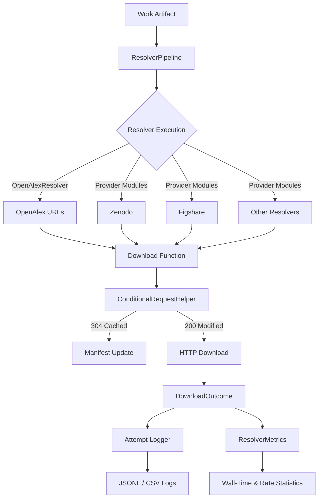

# 1. Content Download Resolver Architecture

## 1. Module Responsibilities

- **`pipeline.py`** – orchestrates resolver execution, respects rate limits,
  enforces concurrency settings, and performs HEAD pre-check filtering.
- **`types.py`** – houses resolver dataclasses, configuration validation, and
  attempt logging interfaces.
- **`providers/*`** – individual resolver implementations with defensive error
  handling and metadata-rich events.
- **`http.py`** – centralised retry/backoff utilities with Retry-After
  compliance and structured logging.
- **`conditional.py`** – interprets cached vs modified responses and validates
  manifest metadata.

## 2. Related DocsToKG References

- `docs/resolver-configuration.md` – configuration details and YAML snippets.
- `docs/adding-custom-resolvers.md` – extensibility guidance for bespoke
  providers.
