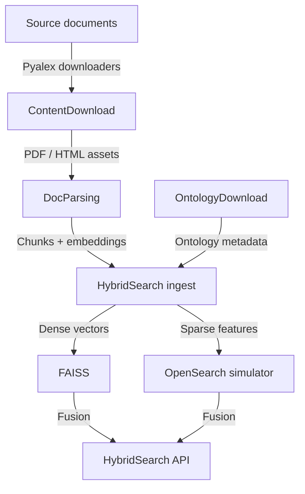

# 1. Architecture Guide

DocsToKG converts raw documents into searchable knowledge graph material using a pipeline
of ingestion utilities, document parsers, ontology tooling, and a hybrid search engine.
This guide explains the major subsystems, their responsibilities, and the data flow
between them.

## 2. Subsystem Overview

### 1. Content Acquisition (`DocsToKG.ContentDownload`)

- Fetches raw documents and metadata from upstream services (for example, Pyalex).
- Utilities live under `src/DocsToKG/ContentDownload/` with resolvers for source-specific logic.
- Outputs structured metadata and document artifacts to the `Data/` directory, ready for parsing.

### 2. Document Parsing (`DocsToKG.DocParsing`)

- Converts PDFs/HTML into DocTags and chunked Markdown using Docling.
- Pipelines such as `DoclingHybridChunkerPipelineWithMin.py` and `run_docling_html_to_doctags_parallel.py` normalise layout, extract captions, and produce chunk boundaries.
- Embedding scripts (`EmbeddingV2.py`) generate dense representations consumed by the hybrid search ingest layer.
- Chunk metadata includes provenance (pages, figure refs) used for highlights and diagnostics.

### 3. Hybrid Search (`DocsToKG.HybridSearch`)

Core packages in `src/DocsToKG/HybridSearch/` provide:

- **Configuration** (`config.py`): Dataclasses for chunking, dense indexing, fusion, and retrieval parameters. The `HybridSearchConfigManager` reloads configs at runtime.
- **Ingest & Storage** (`ingest.py`, `storage.py`): Orchestrate chunk ingestion, maintain FAISS snapshots, and manage the OpenSearch simulator used in tests.
- **Retrieval** (`retrieval.py`): Implements `HybridSearchService` and `HybridSearchRequest/Response` models combining BM25, SPLADE, and FAISS scores.
- **Fusion** (`fusion.py`): Applies Reciprocal Rank Fusion (RRF) and Maximal Marginal Relevance (MMR) for final ranking.
- **Observability** (`observability.py`): Exposes metrics snapshots for monitoring and rebuild decisions.
- **API Layer** (`api.py`): Wraps the service in an HTTP-style interface used by REST deployments.

Dense vectors are stored in FAISS (GPU-capable via the scaffold in `docs/07-reference/faiss/`), while sparse signals are backed by an OpenSearch-compatible registry used for local testing.

### 4. Ontology Tooling (`DocsToKG.OntologyDownload`)

- Command-line interface (`cli.py`) downloads ontologies from OBO, OLS, BioPortal, SKOS, and XBRL sources.
- Configurations (`config.py`) describe resolver options, licensing rules, and validation policies.
- Validators (`validators.py`) run rdflib, Pronto, Owlready2, ROBOT, and Arelle checks depending on flags.
- Stored data supports knowledge enrichment and schema alignment in downstream pipelines.

### 5. Knowledge Graph & Vector Operations

- The `VectorOperations/` package is reserved for future expansion of graph materialisation tasks.
- Hybrid search currently operates over chunked text; graph exports can be layered on top as ontology assets mature.

## 3. Data Flow

1. **Acquisition**: Download raw documents and metadata (`ContentDownload` CLI or scheduled jobs).
2. **Parsing**: Use Docling pipelines to convert assets into DocTags, chunked Markdown, and embeddings (`DocParsing` scripts).
3. **Indexing**: Feed chunk payloads into `HybridSearch.ingest` to update FAISS and sparse stores.
4. **Serving**: Deploy `HybridSearchAPI` behind FastAPI or another HTTP framework, exposing `/v1/hybrid-search`.
5. **Maintenance**: Run ontology downloads and validation periodically to keep terminologies synchronised with search metadata.
6. **Monitoring**: Capture metrics from `HybridSearch.observability` and validation harnesses to detect drift.

## 4. Key Integration Points

- **Config Files**: `config/hybrid_config.json` (runtime toggles), ontology `sources.yaml`, environment variables documented in `docs/02-setup/index.md`.
- **Artifacts**: FAISS snapshots, chunk registries, ontology manifests stored under configurable data roots.
- **Tests**: `tests/` directory covers hybrid search, pipeline behaviour, ontology workflows, and CLI utilities.
- **Documentation**: Generated API docs (`docs/04-api/`) mirror the structure above, while operations references provide day-two guidance.

Refer to `docs/06-operations/index.md` for deployment practices and to `docs/07-reference/` for tuning, security, and troubleshooting guidance.

## 5. Content Download Resolver Architecture

The modular resolver architecture is documented in
[`content-download-resolver-architecture.md`](content-download-resolver-architecture.md),
including a Mermaid diagram that traces work artefacts through the pipeline,
conditional request helper, logging, and metrics subsystems.
