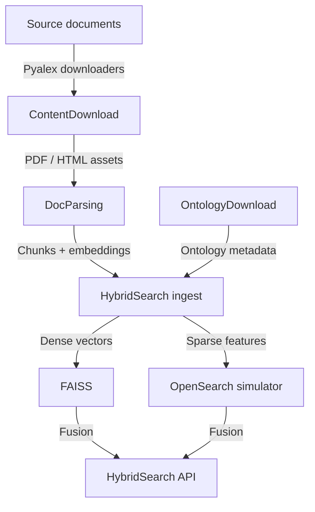

# 1. Architecture Guide

DocsToKG converts raw documents into searchable knowledge graph material using a pipeline
of ingestion utilities, document parsers, ontology tooling, and a hybrid search engine.
This guide explains the major subsystems, their responsibilities, and the data flow
between them.

## 2. Subsystem Overview

### 1. Content Acquisition (`DocsToKG.ContentDownload`)

- Pulls documents and metadata from upstream services (Pyalex, Crossref, Zenodo, Figshare, PubMed Central).
- `DocsToKG.ContentDownload.cli` orchestrates argument parsing, resolver configuration, telemetry sinks, and retries.
- Resolver registry and pipeline control live in `src/DocsToKG/ContentDownload/pipeline.py`; individual resolvers, sinks, and runners sit alongside networking utilities.
- Outputs JSONL manifests and staged artifacts under `$DOCSTOKG_DATA_ROOT`, ready for DocParsing.

### 2. Document Parsing (`DocsToKG.DocParsing`)

- Converts DocTags into chunked text and embeddings using Docling-backed runtimes.
- Unified CLI entry points (``docparse chunk`` / ``docparse embed`` via :mod:`DocsToKG.DocParsing.core`) forward to `_chunking.runtime` and `_embedding.runtime`.
- Shared infrastructure lives in `DocsToKG.DocParsing.core` (config loading, CLI orchestration, telemetry via `StageTelemetry` and `TelemetrySink`).
- Chunk metadata preserves provenance (page numbers, references, figure captions) for accurate highlights and diagnostics downstream.

### 3. Hybrid Search (`DocsToKG.HybridSearch`)

- `config.py` provides dataclasses for dense/sparse weighting, namespace isolation, and fusion strategies, with `HybridSearchConfigManager` hot-reloading JSON configs.
- `pipeline.py` and `store.py` manage ingestion of chunk payloads, FAISS state (`FaissVectorStore`), and sparse registries (OpenSearch simulator or pluggable adapters).
- `service.py` contains `HybridSearchService`, Reciprocal Rank Fusion/MMR implementations, observability hooks, and the HTTP-style `HybridSearchAPI`.
- `router.py` offers FastAPI/Starlette glue code; `types.py` and `interfaces.py` define request/response contracts.

### 4. Ontology Tooling (`DocsToKG.OntologyDownload`)

- CLI (`DocsToKG.OntologyDownload.cli`) plans, pulls, validates, and summarises ontologies sourced from OBO, OLS, BioPortal, and XBRL endpoints.
- `settings.py` supplies Pydantic configuration models; `planning.py` handles fetch plan construction; `formatters.py` renders CLI tables.
- Validation modules invoke rdflib, Owlready2, Pronto, ROBOT, and Arelle depending on CLI flags; storage adapters manage object stores and local caches.
- Manifests and derived metadata enrich downstream search pipelines and schema alignment tasks.

### 5. Knowledge Graph & Vector Operations

- Hybrid search currently serves chunked textual evidence while ontology assets lay groundwork for broader graph exports.
- Emerging utilities reside in `DocsToKG.HybridSearch` modules (`features.py`, `pipeline.py`) with planned expansion under a dedicated `VectorOperations/` namespace.

## 3. Data Flow

1. **Acquisition**: Download raw documents and metadata (`ContentDownload` CLI or scheduled jobs).
2. **Parsing**: Use Docling pipelines to convert assets into DocTags, chunked Markdown, and embeddings (`DocParsing` scripts).
3. **Indexing**: Feed chunk payloads into `HybridSearch.ingest` to update FAISS and sparse stores.
4. **Serving**: Deploy `HybridSearchAPI` behind FastAPI or another HTTP framework, exposing `/v1/hybrid-search`.
5. **Maintenance**: Run ontology downloads and validation periodically to keep terminologies synchronised with search metadata.
6. **Monitoring**: Capture metrics from `HybridSearch.observability` and validation harnesses to detect drift.

## 4. Key Integration Points

- **Config Files**: `config/hybrid_config.json` (runtime toggles), ontology `sources.yaml`, environment variables documented in `docs/02-setup/index.md`.
- **Artifacts**: FAISS snapshots, chunk registries, ontology manifests stored under configurable data roots.
- **Tests**: `tests/` directory covers hybrid search, pipeline behaviour, ontology workflows, and CLI utilities.
- **Documentation**: Generated API docs (`docs/04-api/`) mirror the structure above, while operations references provide day-two guidance.

Refer to `docs/06-operations/index.md` for deployment practices and to `docs/07-reference/` for tuning, security, and troubleshooting guidance.

## 5. Content Download Resolver Architecture

The modular resolver architecture is documented in
[`content-download-resolver-architecture.md`](content-download-resolver-architecture.md),
including a Mermaid diagram that traces work artefacts through the pipeline,
conditional request helper, logging, and metrics subsystems.
