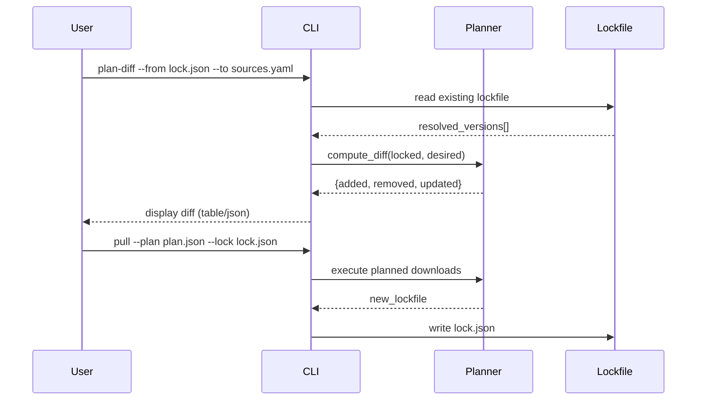

# DocsToKG • OntologyDownload (Level-2 Spec)

> **Go‑Forward Decisions (2025-10-23) — Alignment with Codebase**
>
> The following are *binding decisions* for the OntologyDownload subsystem and supersede any earlier ambiguous wording:
>
> 1. **DuckDB‑backed plan caching is mandatory.** Planning requires an initialized DuckDB catalog. Plans, manifests, and lockfiles are produced against the catalog to guarantee reproducibility and `plan-diff` fidelity. Ad‑hoc planning without the catalog is not supported going forward.
> 2. **Strict validation semantics.** When `--strict` is enabled, any validator failure (rdflib, ROBOT profile, pronto, owlready2, Arelle, **pySHACL**) triggers **full purge** of the staged artifacts for that ontology/release (download/extract/CAS). The run is considered failed and the last good version remains active.
> 3. **Validator set.** The supported validator suite is: rdflib, ROBOT (profile), pronto, owlready2, Arelle, **pySHACL**. For KG release gates, **pySHACL violations must be 0**.
> 4. **Networking & retries.** All HTTP fetches use **Tenacity** with exponential backoff and full respect for **`Retry‑After`** (429/503). **HTTPS** is required; source **allowlists** are enforced; HTTP→HTTPS upgrade occurs when possible.
> 5. **CLI surface.** The supported commands are: `plan`, `pull`, `validate`, `plan-diff`, `show`, `doctor`, `prune`, `plugins`, `config`, `init`, and `db` utilities (`latest`, `versions`, `stats`, `files`, `validations`, **`backup`**).
> 6. **Content‑addressable storage (CAS).** Local CAS mirroring under `.cas/sha256/aa/bb/...` is supported and recommended for integrity/deduplication. **S3 CAS is optional** and may be enabled in future; local FS remains the source‑of‑truth.
> 7. **Observability.** Default output is structured **JSONL** logs. A lightweight **Prometheus exporter** may be enabled to emit `ontofetch_*` counters/gauges (e.g., `downloads_total`, `bytes_downloaded_total`, `validator_errors_total`, `validation_seconds_total`, `http_retries_total`, `planning_seconds_total`).
> 8. **Reproducibility.** Lockfiles pin versions and checksums. `plan-diff` compares *desired* sources to the catalog+lockfile state; any drift is explicit and actionable.
>
> **Rationale:** These choices maximize determinism, auditability, and operational safety, directly supporting the end‑to‑end north‑star (ontology‑aligned KG + hybrid retrieval + RAG).


## Purpose & Non-Goals

**Purpose:** Plan, fetch, validate, normalize, and **lock** ontology releases for reproducible downstream builds with **DuckDB catalog**, **checksum enforcement**, and **plugin-based validation**.  
**Non-Goals**: Reasoning (EL/DL/RL), KG persistence/serving, ontology alignment/matching.

## Interfaces

**CLI**

- `ontofetch plan --sources configs/ontologies.yaml --out runs/ontologies/plan.json [--dry-run]`
- `ontofetch pull --plan runs/ontologies/plan.json --out ontologies/ --lock ontologies.lock.json [--force]`
- `ontofetch validate --dir ontologies/ --strict [--validators rdflib,robot]`
- `ontofetch plan-diff --from ontologies.lock.json --to configs/ontologies.yaml [--update-baseline]`
- `ontofetch doctor [--json] [--check-disk] [--check-credentials]`
- `ontofetch prune --catalog <db-path> --dry-run [--older-than 30d]`
- `ontofetch backup --catalog <db-path> --out backups/ [--incremental]`

**Python API**

```python
from DocsToKG.OntologyDownload import fetch_all, plan_all, about

# Plan fetch
plans = plan_all(sources_yaml="configs/sources.yaml")

# Execute fetch with validation
results = fetch_all(
    sources_yaml="configs/sources.yaml",
    output_dir="ontologies/",
    validators=["rdflib", "robot"],
    force=False
)

# Metadata
info = about()  # Package version, schema, plugins
```

## Sources spec (YAML)

```yaml
version: 1.0

defaults:
  timeout_s: 60
  max_retries: 3
  normalize: true
  validators: ["rdflib-load"]
  enable_cas_mirror: false

sources:
  - id: "hp"
    name: "Human Phenotype Ontology"
    formats: ["owl", "ttl", "obo"]
    canonical_url: "https://purl.obolibrary.org/obo/hp.owl"
    license: "CC-BY-4.0"
    validators: ["rdflib-load", "robot-profile"]
    normalize:
      preferred_format: "ttl"
      remove_imports: false
    expected_checksum:
      algorithm: "sha256"
      value: "abc123..."  # Optional: enforce specific version
    # OR checksum_url for dynamic verification
    checksum_url: "https://purl.obolibrary.org/obo/hp.owl.sha256"

  - id: "go"
    name: "Gene Ontology"
    formats: ["owl", "obo"]
    canonical_url: "https://purl.obolibrary.org/obo/go.owl"
    license: "CC-BY-4.0"
    validators: ["rdflib-load", "pronto"]
    security:
      allowlist_hosts: ["purl.obolibrary.org", "geneontology.org"]
      https_required: true
    retry_policy:
      max_retries: 5
      backoff_base_ms: 500
      backoff_cap_ms: 10000
```

## Lockfile (JSON)

```json
{
  "version": 1,
  "schema_version": "1.0",
  "generated_at": "2025-10-23T00:00:00Z",
  "resolved": [
    {
      "id": "hp",
      "name": "Human Phenotype Ontology",
      "url": "https://purl.obolibrary.org/obo/hp/releases/2025-09-15/hp.owl",
      "format": "owl",
      "checksum": {
        "algorithm": "sha256",
        "value": "abc123..."
      },
      "fetched_at": "2025-10-23T00:00:00Z",
      "license": "CC-BY-4.0",
      "resolver": "obo_purl",
      "version": "2025-09-15",
      "size_bytes": 15728640,
      "validation": {
        "rdflib-load": {"ok": true, "triples": 50000},
        "robot-profile": {"ok": true, "profile": "EL"}
      }
    }
  ]
}
```

## Directory Layout

```
~/.data/ontology-fetcher/
├── .catalog/
│   └── ontofetch.duckdb           # DuckDB metadata catalog
├── ontologies/
│   ├── hp/
│   │   └── 2025-09-15/
│   │       ├── src/
│   │       │   └── archives/
│   │       │       └── hp.owl     # Original download
│   │       ├── data/
│   │       │   ├── hp.owl         # Normalized OWL
│   │       │   ├── hp.ttl         # Normalized Turtle
│   │       │   └── hp.obo         # Normalized OBO
│   │       ├── validation/
│   │       │   ├── rdflib.json    # Validation output
│   │       │   └── robot.log      # ROBOT output
│   │       ├── manifest.json      # Per-ontology manifest
│   │       └── .extract.audit.json
│   └── go/
│       └── 2025-10-20/...
├── .cas/                          # Content-addressed storage
│   └── sha256/
│       ├── aa/
│       │   └── bb/
│       │       └── <full-digest>
│       └── cc/...
└── LATEST.json                    # Latest version marker
```

## DuckDB Catalog Schema

**Database**: `~/.data/ontology-fetcher/.catalog/ontofetch.duckdb`

```sql
-- Schema Version Tracking
CREATE TABLE schema_version (
  version INTEGER PRIMARY KEY,
  applied_at TIMESTAMP DEFAULT CURRENT_TIMESTAMP
);

-- Logical Releases (versioned corpus snapshots)
CREATE TABLE versions (
  version_id VARCHAR PRIMARY KEY,         -- e.g., "2025-10-23T01:23:45Z"
  created_at TIMESTAMP NOT NULL,
  config_hash VARCHAR NOT NULL,           -- SHA-256 of sources.yaml
  total_ontologies INTEGER DEFAULT 0,
  status VARCHAR NOT NULL,                -- "building", "complete", "failed"
  notes TEXT
);

-- Ontology Metadata
CREATE TABLE ontologies (
  ontology_id VARCHAR PRIMARY KEY,
  name VARCHAR NOT NULL,
  description TEXT,
  license VARCHAR,
  homepage_url VARCHAR
);

-- Downloaded Artifacts
CREATE TABLE artifacts (
  artifact_id VARCHAR PRIMARY KEY,        -- SHA-256 hash
  ontology_id VARCHAR NOT NULL,
  version_id VARCHAR NOT NULL,
  url VARCHAR NOT NULL,
  format VARCHAR NOT NULL,                -- "owl", "ttl", "obo", "zip"
  size_bytes BIGINT NOT NULL,
  sha256 VARCHAR NOT NULL,
  downloaded_at TIMESTAMP NOT NULL,
  path VARCHAR NOT NULL,
  is_archive BOOLEAN DEFAULT FALSE,
  FOREIGN KEY (ontology_id) REFERENCES ontologies(ontology_id),
  FOREIGN KEY (version_id) REFERENCES versions(version_id)
);

-- Extracted Files (from archives)
CREATE TABLE extracted_files (
  file_id VARCHAR PRIMARY KEY,
  artifact_id VARCHAR NOT NULL,
  relative_path VARCHAR NOT NULL,
  size_bytes BIGINT NOT NULL,
  sha256 VARCHAR NOT NULL,
  mime_type VARCHAR,
  extracted_at TIMESTAMP NOT NULL,
  FOREIGN KEY (artifact_id) REFERENCES artifacts(artifact_id)
);

-- Validation Results
CREATE TABLE validations (
  validation_id VARCHAR PRIMARY KEY,
  artifact_id VARCHAR NOT NULL,
  validator_name VARCHAR NOT NULL,
  status VARCHAR NOT NULL,                -- "ok", "warning", "error"
  details JSONB,
  duration_ms INTEGER,
  validated_at TIMESTAMP NOT NULL,
  FOREIGN KEY (artifact_id) REFERENCES artifacts(artifact_id)
);

-- Events (structured log)
CREATE TABLE events (
  event_id VARCHAR PRIMARY KEY,
  version_id VARCHAR,
  ontology_id VARCHAR,
  event_type VARCHAR NOT NULL,
  timestamp TIMESTAMP NOT NULL,
  details JSONB,
  correlation_id VARCHAR
);

-- Indexes
CREATE INDEX idx_artifacts_ontology_version ON artifacts(ontology_id, version_id);
CREATE INDEX idx_artifacts_sha256 ON artifacts(sha256);
CREATE INDEX idx_validations_artifact ON validations(artifact_id);
CREATE INDEX idx_events_timestamp ON events(timestamp);
```

## Validation Pipeline

### Strict mode semantics

- Any validator failure purges staged artifacts for that ontology/release (download, extract, CAS) and marks the run failed.
- The last good version remains active; no partially‑validated state persists.


### Available Validators

**1. rdflib-load** (Built-in, Python)

- **Purpose**: Parse RDF/OWL, verify syntax
- **Formats**: owl, ttl, rdf, n3
- **Output**: Parse errors, triple count, namespaces
- **Runtime**: 1-5 seconds

**2. robot-profile** (ROBOT Java tool)

- **Purpose**: Check OWL profile (EL, DL, RL, QL, Full)
- **Formats**: owl
- **Output**: Profile classification, violations
- **Runtime**: 5-30 seconds
- **Requires**: ROBOT jar in PATH

**3. pronto** (Python library)

- **Purpose**: Parse OBO format
- **Formats**: obo
- **Output**: Term count, relationships, obsolete terms
- **Runtime**: 1-10 seconds

**4. owlready2** (Python library)

- **Purpose**: Load OWL, consistency checks
- **Formats**: owl, rdf
- **Output**: Class/property hierarchy
- **Runtime**: 10-60 seconds

**5. pySHACL** (SHACL validator)

- **Purpose**: Validate against SHACL shapes
- **Formats**: ttl, rdf
- **Input**: Ontology + shapes graph
- **Output**: Conformance report
- **Runtime**: 5-30 seconds

**6. Arelle** (XBRL validator)

- **Purpose**: Validate XBRL taxonomies
- **Formats**: xsd, xml
- **Output**: Schema/linkbase validation
- **Runtime**: 5-20 seconds

### Validation Modes

**Strict Mode** (`--strict`)

- All validators must pass
- Purge artifacts on failure
- Exit with error code
- Use for CI/production

**Lenient Mode** (default)

- Log warnings, keep artifacts
- Continue on failures
- Use for inspection/debugging

### Validation Budget

```yaml
validation:
  budget:
    max_duration_per_validator: 120  # seconds
    max_memory_mb: 4096
    max_parallel_validators: 4
  strict: false
  retry_on_timeout: true
  save_outputs: true
```

## CAS Mirroring

**Content-Addressed Storage** enables deduplication:

```
.cas/sha256/aa/bb/<full-sha256-hash>  # Actual file
ontologies/hp/2025-10-23/hp.owl -> ../../.cas/sha256/aa/bb/<hash>  # Symlink
```

**Benefits**:

- Deduplication: Same file stored once
- Integrity: Filename IS checksum
- Immutability: Never modify CAS files
- Cache warmth: Share across versions

**Configuration**:

```yaml
storage:
  enable_cas_mirror: true
  cas_backend: local  # or "s3"
  shard_width: 2      # aa/bb/...
  prefer_hardlink: false
```

## Plugin Architecture

### Resolver Plugins

**Built-in**: obo_purl, bioportal, ols, ontobee, lov, direct

**Custom Resolver**:

```python
from DocsToKG.OntologyDownload.resolvers import ResolverPlugin

class MyResolver(ResolverPlugin):
    name = "my_resolver"
    
    def resolve(self, ontology_id: str) -> list[str]:
        return [f"https://myapi.org/ontologies/{ontology_id}"]
    
    def supports(self, ontology_id: str) -> bool:
        return ontology_id.startswith("MY_")

# Register via entry point in pyproject.toml:
# [project.entry-points."docstokg.ontofetch.resolver"]
# my_resolver = "my_package.my_resolver:MyResolver"
```

### Validator Plugins

**Custom Validator**:

```python
from DocsToKG.OntologyDownload.validation import ValidatorPlugin

class MyValidator(ValidatorPlugin):
    name = "my_validator"
    supported_formats = ["owl", "ttl"]
    
    def validate(self, file_path: Path) -> dict:
        return {
            "ok": True,
            "details": {"custom_metric": 42},
            "duration_ms": 100
        }
```

## Plan-Diff Workflow



## Invariants

- **Lockfile pins versions + checksums**: Reproducible across machines/time
- **DuckDB is single-writer**: File-based locks serialize writes
- **Filesystem is source of truth**: DuckDB catalogs metadata only
- **Normalization is deterministic**: Same input → same TTL output
- **Validation results immutable**: Never update, only append
- **CAS files immutable**: Never modify content-addressed files

## Observability

**Prometheus Metrics:**

- `ontofetch_download_bytes_total{id}` - Bytes downloaded
- `ontofetch_download_duration_seconds{id}` - Download latency
- `ontofetch_validate_failures_total{id, validator}` - Validation failures
- `ontofetch_normalize_seconds_total{id}` - Normalization duration
- `ontofetch_catalog_size_bytes` - DuckDB size

**Structured Logs** (JSONL):

```json
{
  "timestamp": "2025-10-23T00:00:00Z",
  "level": "info",
  "event": "download_complete",
  "ontology_id": "hp",
  "url": "https://purl.obolibrary.org/obo/hp.owl",
  "duration_ms": 3421,
  "size_bytes": 15728640,
  "sha256": "abc123...",
  "correlation_id": "01J..."
}
```

## Failure Modes

| Failure | Detection | Recovery | Prevention |
|---------|-----------|----------|------------|
| Redirect drift | URL != canonical | Allowlist check | Host allowlist |
| Checksum mismatch | SHA-256 != expected | Retry 3x, fail | Lockfile pinning |
| License missing | No license field | Warn/fail | Required in sources.yaml |
| Validation timeout | Validator > 120s | Kill process | Budget enforcement |
| Archive bomb | Extract > 10× compressed | Abort extraction | Streaming size check |
| Network timeout | httpx timeout | Retry + backoff | Conservative timeout |
| Disk full | IOError on write | Abort, cleanup | Pre-flight disk check |

## Networking & Reliability

- **Retries & Backoff**: All outbound HTTP requests (HEAD/GET) are wrapped with **Tenacity** using exponential backoff, jitter, and a bounded max wait. **`Retry-After`** headers from servers (429/503) are honored.
- **TLS & Allowlist**: HTTPS is required; plain HTTP URLs are upgraded when possible. Source hosts must appear on the configured **allowlist**.
- **Timeouts**: Per‑stage timeouts are enforced (connect/read). Global budgets may abort a plan early in strict mode.
- **Identification**: A stable User‑Agent with version/build info is sent to endpoints.

## Security

- **TLS enforcement**: HTTPS required unless explicitly allowed
- **Domain allowlist**: Only trusted hosts
- **Secrets masking**: API keys never logged
- **Local mirror**: Air-gapped environments
- **Sandbox validation**: Isolated processes
- **Archive limits**: Max file count/size

## Tests

**Unit Tests:**

- Lockfile read/write roundtrip
- Validator result schema
- Deterministic TTL normalization
- CAS path generation (sharding)
- Plugin discovery

**Integration Tests:**

- Plan → pull → validate end-to-end
- Plan-diff with baseline
- Checksum enforcement
- Resume from partial download
- DuckDB concurrent reads

**Contract Tests:**

- Resolver plugins return valid URLs
- Validator plugins return schema-compliant results
- Lockfile/manifest schema versioning
