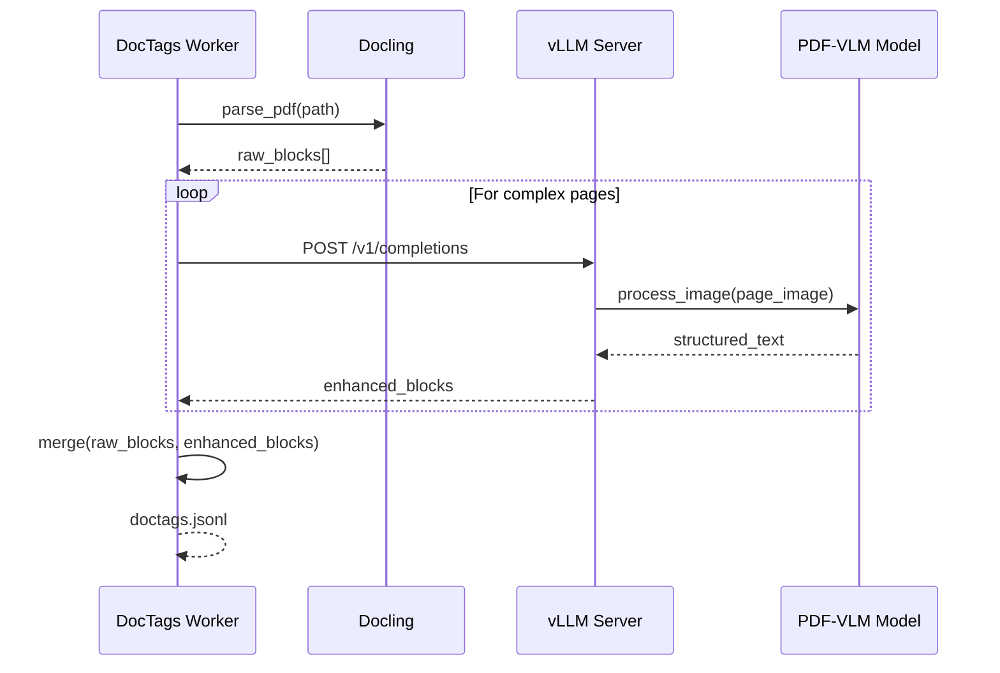

# DocsToKG • DocParsing (Level-2 Spec)

## Purpose & Non-Goals

**Purpose:** Transform artifacts (PDF/HTML) into **DocTags → Chunks → Embeddings** with **reproducible IDs**, **append-only manifests**, **stage runner architecture**, and **pluggable embedding models**.  
**Non-Goals:** External indexing/serving, ontology alignment, knowledge graph construction, RAG orchestration.

## Interfaces

**CLI**

```bash
# Stage 1: Extract structured content from PDFs/HTML
docparse doctags --mode pdf --input Data/PDFs --output Data/DocTagsFiles \
  --workers 4 --gpu true --vllm-endpoint http://localhost:8000

# Stage 2: Chunk DocTags into overlapping segments
docparse chunk --in-dir Data/DocTagsFiles --out-dir Data/ChunkedDocTagFiles \
  --chunker hybrid_v1 --max-tokens 512 --stride 64

# Stage 3: Generate embeddings (dense, sparse, lexical)
docparse embed --chunks-dir Data/ChunkedDocTagFiles --out-dir Data/Embeddings \
  --dense qwen3-8b --sparse splade-v3 --bm25 on --batch-size 32

# Unified pipeline (all stages)
docparse all --resume --data-root Data

# Inspection and planning
docparse plan --data-root Data --mode auto --limit 10
docparse manifest --stage chunk --tail 20
docparse token-profiles --doctags-dir Data/DocTagsFiles
```

**Python API**

```python
from DocsToKG.DocParsing.core import DocTagsRunner, ChunkIngestionPipeline, EmbeddingRunner
from DocsToKG.DocParsing.config import DocTagsConfig, ChunkConfig, EmbedConfig

# Stage 1: DocTags
doctags_config = DocTagsConfig(
    input_dir="Data/PDFs",
    output_dir="Data/DocTagsFiles",
    workers=4,
    use_gpu=True,
    vllm_endpoint="http://localhost:8000"
)
doctags_runner = DocTagsRunner(doctags_config)
doctags_runner.run()

# Stage 2: Chunking
chunk_config = ChunkConfig(
    input_dir="Data/DocTagsFiles",
    output_dir="Data/ChunkedDocTagFiles",
    chunker="hybrid_v1",
    max_tokens=512,
    stride=64
)
chunk_pipeline = ChunkIngestionPipeline(chunk_config)
chunk_pipeline.run()

# Stage 3: Embedding
embed_config = EmbedConfig(
    chunks_dir="Data/ChunkedDocTagFiles",
    output_dir="Data/Embeddings",
    dense_model="qwen3-8b",
    sparse_model="splade-v3",
    bm25_enabled=True,
    batch_size=32
)
embedding_runner = EmbeddingRunner(embed_config)
embedding_runner.run()
```

## Directory Layout

```
Data/
├── PDFs/                              # Input artifacts
│   ├── 2024__example__W12345.pdf
│   └── ...
├── DocTagsFiles/                      # Stage 1 output
│   ├── 2024__example__W12345.doctags.jsonl
│   └── ...
├── ChunkedDocTagFiles/                # Stage 2 output
│   ├── 2024__example__W12345.chunks.jsonl
│   └── ...
├── Embeddings/                        # Stage 3 output
│   ├── dense/
│   │   ├── fmt=parquet/
│   │   │   └── 2025/
│   │   │       └── 10/
│   │   │           └── 2024__example__W12345.parquet
│   ├── sparse/
│   │   └── fmt=parquet/
│   │       └── 2025/10/...
│   └── lexical/
│       └── fmt=parquet/
│           └── 2025/10/...
└── Manifests/                         # Telemetry
    ├── docparse.doctags-pdf.manifest.jsonl
    ├── docparse.doctags-pdf.attempts.jsonl
    ├── docparse.chunks.manifest.jsonl
    ├── docparse.embeddings.manifest.jsonl
    └── manifest.sqlite3
```

## Stage Runner Architecture

All three stages (DocTags, Chunk, Embed) use a **unified runner architecture** with:

### Common Components

**1. StagePlan** (what work to do)

```python
@dataclass
class StagePlan:
    input_files: list[Path]
    output_dir: Path
    config_hash: str
    resume_controller: ResumeController
    workers: int
    batch_size: int
```

**2. Worker** (how to process one item)

```python
class Worker(Protocol):
    def process_one(self, input_path: Path) -> Result:
        """Process single file, return Result with status/output."""
        ...
```

**3. Hooks** (telemetry and lifecycle)

```python
@dataclass
class StageHooks:
    on_start: Callable[[StagePlan], None]
    on_task_start: Callable[[Path], None]
    on_task_complete: Callable[[Path, Result], None]
    on_task_error: Callable[[Path, Exception], None]
    on_complete: Callable[[StagePlan, list[Result]], None]
```

**4. Executor** (orchestration)

```python
def run_stage(plan: StagePlan, worker: Worker, hooks: StageHooks) -> list[Result]:
    """Execute stage with worker pool, resume logic, and hooks."""
    with ProcessPoolExecutor(max_workers=plan.workers) as executor:
        futures = {}
        for input_file in plan.input_files:
            if plan.resume_controller.should_skip(input_file):
                continue
            futures[executor.submit(worker.process_one, input_file)] = input_file
        
        results = []
        for future in as_completed(futures):
            input_file = futures[future]
            try:
                result = future.result()
                hooks.on_task_complete(input_file, result)
                results.append(result)
            except Exception as e:
                hooks.on_task_error(input_file, e)
        
        hooks.on_complete(plan, results)
        return results
```

### Stage-Specific Workers

**DocTags Worker** (PDF → structured blocks)

```python
class DocTagsWorker:
    def __init__(self, vllm_endpoint: str, use_gpu: bool):
        self.vllm_endpoint = vllm_endpoint
        self.use_gpu = use_gpu
    
    def process_one(self, pdf_path: Path) -> DocTagsResult:
        # Use Docling + optional vLLM for PDF parsing
        doctags = self._parse_pdf(pdf_path)
        output_path = self._write_doctags(doctags)
        return DocTagsResult(status="ok", output_path=output_path)
```

**Chunk Worker** (DocTags → overlapping chunks)

```python
class ChunkWorker:
    def __init__(self, chunker: HybridChunker, max_tokens: int):
        self.chunker = chunker
        self.max_tokens = max_tokens
    
    def process_one(self, doctags_path: Path) -> ChunkResult:
        doctags = self._load_doctags(doctags_path)
        chunks = self.chunker.chunk(doctags, max_tokens=self.max_tokens)
        output_path = self._write_chunks(chunks)
        return ChunkResult(status="ok", output_path=output_path, chunk_count=len(chunks))
```

**Embedding Worker** (Chunks → vectors)

```python
class EmbeddingWorker:
    def __init__(self, dense_adapter, sparse_adapter, bm25_adapter):
        self.dense = dense_adapter
        self.sparse = sparse_adapter
        self.bm25 = bm25_adapter
    
    def process_one(self, chunks_path: Path) -> EmbedResult:
        chunks = self._load_chunks(chunks_path)
        
        # Generate dense embeddings
        dense_vectors = self.dense.embed_batch([c.text for c in chunks])
        
        # Generate sparse embeddings
        sparse_vectors = self.sparse.embed_batch([c.text for c in chunks])
        
        # Generate BM25 term vectors
        bm25_vectors = self.bm25.vectorize_batch([c.text for c in chunks])
        
        # Write to Parquet
        self._write_parquet(chunks, dense_vectors, sparse_vectors, bm25_vectors)
        return EmbedResult(status="ok", vector_count=len(chunks))
```

## Manifest Schemas

### DocTags Manifest (JSONL)

```json
{
  "run_id": "01J...",
  "doc_id": "openalex:W12345",
  "input_path": "Data/PDFs/2024__example__W12345.pdf",
  "output_path": "Data/DocTagsFiles/2024__example__W12345.doctags.jsonl",
  "status": "ok",
  "input_hash": "sha256:abc123...",
  "block_count": 142,
  "page_count": 12,
  "duration_ms": 1842,
  "model": "docling-vlm",
  "gpu_used": true,
  "created_at": "2025-10-23T00:00:00Z",
  "config_hash": "sha256:..."
}
```

### Chunks Manifest (JSONL)

```json
{
  "run_id": "01J...",
  "doc_id": "openalex:W12345",
  "input_path": "Data/DocTagsFiles/2024__example__W12345.doctags.jsonl",
  "output_path": "Data/ChunkedDocTagFiles/2024__example__W12345.chunks.jsonl",
  "status": "ok",
  "input_hash": "sha256:abc123...",
  "chunk_count": 38,
  "chunker": "hybrid_v1",
  "max_tokens": 512,
  "stride": 64,
  "duration_ms": 124,
  "created_at": "2025-10-23T00:00:00Z",
  "config_hash": "sha256:..."
}
```

### Embeddings Manifest (JSONL)

```json
{
  "run_id": "01J...",
  "doc_id": "openalex:W12345",
  "input_path": "Data/ChunkedDocTagFiles/2024__example__W12345.chunks.jsonl",
  "output_paths": {
    "dense": "Data/Embeddings/dense/fmt=parquet/2025/10/2024__example__W12345.parquet",
    "sparse": "Data/Embeddings/sparse/fmt=parquet/2025/10/2024__example__W12345.parquet",
    "lexical": "Data/Embeddings/lexical/fmt=parquet/2025/10/2024__example__W12345.parquet"
  },
  "status": "ok",
  "input_hash": "sha256:abc123...",
  "vector_count": 38,
  "dense_model": "qwen3-8b-embed",
  "dense_dim": 8192,
  "sparse_model": "splade-v3",
  "sparse_dim": 30522,
  "batch_size": 32,
  "gpu_used": true,
  "duration_ms": 2456,
  "created_at": "2025-10-23T00:00:00Z",
  "config_hash": "sha256:..."
}
```

## Parquet Vector Format

**Schema** (Partitioned by year/month):

```
dense/fmt=parquet/2025/10/<doc_id>.parquet
```

**Parquet Schema**:

```python
schema = pa.schema([
    ("uuid", pa.string()),           # Chunk UUID
    ("doc_id", pa.string()),         # Document ID
    ("chunk_idx", pa.int32()),       # Chunk index within document
    ("vector", pa.list_(pa.float32())),  # Embedding vector
    ("norm", pa.float32()),          # L2 norm (for cosine similarity)
])
```

**Footer Metadata**:

```python
metadata = {
    "model": "qwen3-8b-embed",
    "dim": "8192",
    "created_at": "2025-10-23T00:00:00Z",
    "config_hash": "sha256:...",
    "doc_id": "openalex:W12345"
}
```

**Benefits**:

- Columnar storage: Fast vector column scans
- Compression: ~40% smaller than JSONL
- Arrow-native: Zero-copy integration with FAISS
- Partitioning: Efficient filtering by date
- Metadata: Self-describing format

## vLLM Integration (PDF Parsing)

**Architecture**:



**vLLM Configuration**:

```yaml
vllm:
  endpoint: "http://localhost:8000"
  model: "naver/docling-vlm"
  max_tokens: 2048
  temperature: 0.0
  timeout_s: 30
  fallback_to_docling: true  # If vLLM unavailable
```

**Fallback Strategy**:

1. Try vLLM endpoint
2. If 503/timeout → use Docling only
3. Log fallback in manifest
4. Continue processing (no hard failure)

## Embedding Model Adapters

**Provider Abstraction**:

```python
class EmbeddingProvider(Protocol):
    def embed_batch(self, texts: list[str]) -> np.ndarray:
        """Embed batch of texts, return (N, D) array."""
        ...
    
    def dimension(self) -> int:
        """Return embedding dimension."""
        ...
    
    def normalize(self) -> bool:
        """Whether embeddings are L2-normalized."""
        ...
```

**Built-in Providers**:

**1. Qwen Dense** (vLLM backend)

```python
class QwenAdapter(EmbeddingProvider):
    def __init__(self, vllm_endpoint: str, model: str = "qwen3-8b-embed"):
        self.endpoint = vllm_endpoint
        self.model = model
        self.dim = 8192
    
    def embed_batch(self, texts: list[str]) -> np.ndarray:
        response = requests.post(f"{self.endpoint}/v1/embeddings", json={
            "model": self.model,
            "input": texts
        })
        embeddings = [e["embedding"] for e in response.json()["data"]]
        return np.array(embeddings, dtype=np.float32)
```

**2. SPLADE Sparse** (local model)

```python
class SPLADEAdapter(EmbeddingProvider):
    def __init__(self, model_name: str = "naver/splade-v3"):
        self.model = AutoModelForMaskedLM.from_pretrained(model_name)
        self.tokenizer = AutoTokenizer.from_pretrained(model_name)
        self.dim = 30522  # BERT vocab size
    
    def embed_batch(self, texts: list[str]) -> np.ndarray:
        inputs = self.tokenizer(texts, return_tensors="pt", padding=True)
        outputs = self.model(**inputs)
        logits = outputs.logits
        # Apply log(1 + ReLU(logits)) transformation
        sparse_vectors = torch.log1p(torch.relu(logits)).max(dim=1).values
        return sparse_vectors.cpu().numpy()
```

**3. BM25 Lexical** (sklearn)

```python
class BM25Adapter(EmbeddingProvider):
    def __init__(self, vocab_size: int = 50000):
        self.vectorizer = TfidfVectorizer(max_features=vocab_size)
        self.dim = vocab_size
    
    def embed_batch(self, texts: list[str]) -> np.ndarray:
        sparse_matrix = self.vectorizer.fit_transform(texts)
        return sparse_matrix.toarray().astype(np.float32)
```

**Swapping Models**:

```python
# Configuration-driven model selection
embed_config = EmbedConfig(
    dense_provider="qwen",      # or "sentence-transformers", "openai"
    dense_model="qwen3-8b",
    sparse_provider="splade",   # or "bm25", "contriever"
    sparse_model="splade-v3"
)

# Runtime adapter selection
dense_adapter = EmbeddingRegistry.get_provider(
    provider=embed_config.dense_provider,
    model=embed_config.dense_model
)
```

## IDs & Invariants

**Stable Identifiers**:

- `doc_id`: From ContentDownload (e.g., `openalex:W12345`)
- `uuid`: Per-chunk UUID (deterministic from doc_id + chunk_idx)
- `input_hash`: SHA-256 of input file (for resume/drift detection)
- `run_id`: ULID for this execution (for telemetry correlation)

**UUID Generation**:

```python
def generate_chunk_uuid(doc_id: str, chunk_idx: int) -> str:
    """Deterministic UUID from doc_id and chunk index."""
    namespace = uuid.UUID("6ba7b810-9dad-11d1-80b4-00c04fd430c8")  # Fixed namespace
    name = f"{doc_id}#{chunk_idx}"
    return str(uuid.uuid5(namespace, name))
```

**Invariants**:

- Append-only manifests (never delete/modify records)
- Deterministic chunk order (same DocTags → same chunks)
- 1:1 uuid ↔ vector row (no duplicates, no gaps)
- Config hash stability (same config → same hash)

## Config & Tuning

**DocTags Defaults**:

```yaml
doctags:
  workers: 4
  use_gpu: true
  pdf_model: "docling-vlm"
  vllm_endpoint: "http://localhost:8000"
  vllm_wait_timeout: 300  # seconds
  fallback_to_docling: true
```

**Chunking Defaults**:

```yaml
chunker:
  type: "hybrid_v1"
  max_tokens: 512
  stride: 64
  keep_titles: true
  min_chunk_chars: 100
  max_chunk_chars: 4096
```

**Embedding Defaults**:

```yaml
embedding:
  dense:
    provider: "qwen"
    model: "qwen3-8b-embed"
    batch_size: 32
    normalize: true
  sparse:
    provider: "splade"
    model: "splade-v3"
    batch_size: 16
  lexical:
    enabled: true
    vocab_size: 50000
```

## Performance Budgets (RTX 5090)

**DocTags**:

- p50 ≤ 1.5 s/page
- p95 ≤ 3.0 s/page
- Throughput ≥ 100 pages/minute (4 workers)
- GPU utilization ≥ 80%

**Chunking**:

- ≥ 30k chars/s/worker
- p50 ≤ 100ms per document
- CPU-only (no GPU required)

**Embedding**:

- Dense: ≥ 2000 chunks/s @ fp32 (fp16 ~2×)
- Sparse: ≥ 1000 chunks/s
- BM25: ≥ 5000 chunks/s (CPU)
- GPU memory ≤ 80% of available

## Observability

**Prometheus Metrics**:

- `docparse_doctags_pages_total` - Pages processed
- `docparse_doctags_duration_seconds` - Per-page latency
- `docparse_chunk_count_total` - Chunks generated
- `docparse_embed_vectors_total{model}` - Vectors generated
- `docparse_embed_dim_mismatch_total` - Dimension mismatches (should be 0)
- `docparse_stage_latency_ms_bucket{stage}` - Stage-level latency

**Structured Logs**:

```json
{
  "timestamp": "2025-10-23T00:00:00Z",
  "level": "info",
  "stage": "embed",
  "event": "batch_complete",
  "doc_id": "openalex:W12345",
  "batch_size": 32,
  "duration_ms": 456,
  "gpu_utilization": 0.85,
  "model": "qwen3-8b-embed"
}
```

**OpenTelemetry Traces**:

- Span per document: `docparse.process_document{doc_id}`
- Child spans: `doctags`, `chunk`, `embed.dense`, `embed.sparse`

## Failure Modes & Recovery

| Failure | Detection | Recovery | Prevention |
|---------|-----------|----------|------------|
| Dim mismatch | Vector shape != expected | Hard fail, log error | Validate config before run |
| Input drift | input_hash changed | Resume with `--verify-hash` | Use strict mode |
| OOM (GPU) | CUDA OOM exception | Reduce batch_size or CPU fallback | Pre-flight GPU mem check |
| vLLM timeout | HTTP timeout | Fallback to Docling only | Increase timeout or disable vLLM |
| Corrupted PDF | PDF parse error | Skip, log in attempts.jsonl | Validate PDFs in ContentDownload |
| Disk full | IOError on write | Graceful shutdown, alert | Pre-flight disk check |

## Security & Data-handling

- **No secrets in manifests**: Never log API keys or tokens
- **Redact home paths**: Replace `/home/user/` with `~/`
- **Minimal snippet exposure**: Limit chunk text in logs to 100 chars
- **No PII**: Do not extract or store personal information
- **Secure temp files**: Use `tempfile.mkstemp()` with mode 0600

## Tests

**Unit Tests**:

- Chunking boundaries (overlap, stride, max_tokens)
- UUID generation (determinism, uniqueness)
- Config hash stability
- Adapter interface compliance

**Contract Tests**:

- DocTags schema validation (JSON Schema)
- Chunks schema validation
- Parquet schema validation
- Manifest schema validation

**Integration Tests**:

- Resume semantics (partial run → resume → completion)
- Drift detection (`--verify-hash`)
- vLLM fallback (mock 503 response)
- Multi-stage pipeline (doctags → chunk → embed)

**Load Tests**:

- Throughput targets (pages/s, chunks/s, vectors/s)
- GPU utilization under sustained load
- Memory stability (no leaks)

**Chaos Tests**:

- Batch abort mid-processing
- Worker crash (process killed)
- Disk full during write
- vLLM server restart
