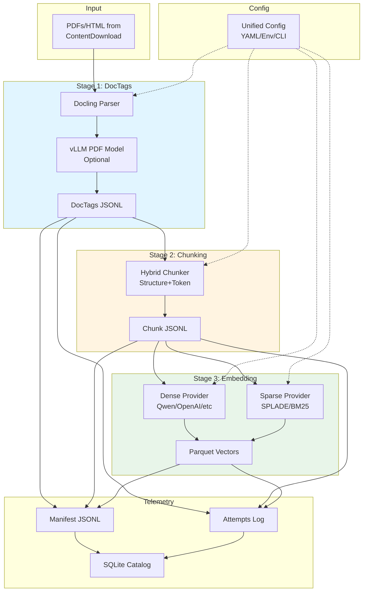

# DocsToKG • DocParsing — Subsystem Architecture

## Purpose & Scope

Convert PDFs/HTML to **DocTags → chunks → embeddings** with **resumable manifests**, **idempotent hashing**, **unified CLI**, **pluggable embedding providers**, and **quarantine handling** for production-grade document processing pipelines.

**In scope**: Document parsing (PDF/HTML), structural extraction, chunking, embedding generation (dense/sparse/lexical), manifest tracking, resume logic, model abstraction, GPU optimization.  
**Out of scope**: External vector store persistence, knowledge graph construction, retrieval serving, RAG orchestration.

## Architecture Overview

DocParsing transforms raw documents through three stages with a unified runner architecture, pluggable model providers, and comprehensive telemetry.



## External Interfaces

**CLI**: `python -m DocsToKG.DocParsing.cli_unified`

```bash
# Individual stages
docparse doctags --mode pdf --input Data/PDFs --output Data/DocTagsFiles \
  --workers 4 --gpu --vllm-endpoint http://localhost:8000

docparse chunk --in-dir Data/DocTagsFiles --out-dir Data/ChunkedDocTagFiles \
  --chunker hybrid_v1 --max-tokens 512 --stride 64

docparse embed --chunks-dir Data/ChunkedDocTagFiles --out-dir Data/Embeddings \
  --dense qwen3-8b --sparse splade-v3 --bm25 --batch-size 32

# Unified pipeline (all stages)
docparse all --resume --data-root Data --profile production

# Inspection commands
docparse plan --data-root Data --mode auto --limit 10
docparse plan-diff --lock-output baseline.json --mode auto
docparse manifest --stage chunk --tail 20 --format json
docparse token-profiles --doctags-dir Data/DocTagsFiles
docparse inspect --file Data/Embeddings/dense/fmt=parquet/2025/10/example.parquet

# Validation
docparse validate --stage embed --config embed-config.yaml --dry-run
```

**Python API**:

```python
from DocsToKG.DocParsing import (
    DocTagsRunner,
    ChunkIngestionPipeline,
    EmbeddingRunner,
    DocParsingOrchestrator
)
from DocsToKG.DocParsing.config import (
    DocParsingConfig,
    load_config
)

# Load unified configuration
config = load_config("docparse-config.yaml")

# Option 1: Run individual stages
doctags_runner = DocTagsRunner(config.doctags)
doctags_runner.run()

chunk_pipeline = ChunkIngestionPipeline(config.chunk)
chunk_pipeline.run()

embedding_runner = EmbeddingRunner(config.embed)
embedding_runner.run()

# Option 2: Run unified pipeline
orchestrator = DocParsingOrchestrator(config)
results = orchestrator.run_all(resume=True)

print(f"Processed: {results.total_documents}")
print(f"Chunks: {results.total_chunks}")
print(f"Vectors: {results.total_vectors}")
```

## Data Layout

```
Data/
├── PDFs/                                    # Input artifacts
│   ├── 2024__example__W12345.pdf
│   └── ...
├── DocTagsFiles/                            # Stage 1 output
│   ├── 2024__example__W12345.doctags.jsonl
│   └── ...
├── ChunkedDocTagFiles/                      # Stage 2 output
│   ├── 2024__example__W12345.chunks.jsonl
│   └── ...
├── Embeddings/                              # Stage 3 output
│   ├── dense/fmt=parquet/
│   │   └── 2025/10/2024__example__W12345.parquet
│   ├── sparse/fmt=parquet/
│   │   └── 2025/10/...
│   └── lexical/fmt=parquet/
│       └── 2025/10/...
├── Manifests/                               # Telemetry
│   ├── docparse.doctags-pdf.manifest.jsonl
│   ├── docparse.doctags-pdf.attempts.jsonl
│   ├── docparse.chunks.manifest.jsonl
│   ├── docparse.embeddings.manifest.jsonl
│   └── manifest.sqlite3
└── Quarantine/                              # Failed items
    ├── doctags/
    │   └── 2024__bad_pdf__W99999.pdf.meta.json
    ├── chunks/
    └── embeddings/
```

## Stage Contracts

### Stage 1: DocTags (PDF/HTML → Structured Blocks)

**Input**: Raw PDF or HTML files  
**Output**: Structured JSONL with blocks, metadata, layout

**Responsibilities**:

- Parse PDF layout with Docling
- Optionally enhance with vLLM PDF model for complex tables/figures
- Extract document structure (title, sections, paragraphs, tables, figures)
- Preserve layout information (page numbers, bounding boxes)
- Generate stable `doc_id` from filename
- Compute `input_hash` (SHA-256) for resume logic

**Key Components**:

- `Docling`: Primary PDF parser (fast, accurate layout detection)
- `vLLM PDF model`: Optional enhancement for complex documents
- Fallback strategy: If vLLM unavailable, use Docling only
- HTML parser: BeautifulSoup4 + custom extractors

**Output Format** (DocTags JSONL):

```json
{
  "doc_id": "openalex:W12345",
  "title": "Example Paper",
  "meta": {
    "page_count": 12,
    "language": "en",
    "doi": "10.1234/example"
  },
  "blocks": [
    {
      "type": "title",
      "text": "Introduction",
      "page": 1,
      "bbox": [72, 100, 540, 120]
    },
    {
      "type": "paragraph",
      "text": "Lorem ipsum...",
      "page": 1,
      "section": "Introduction",
      "bbox": [72, 130, 540, 200]
    }
  ]
}
```

### Stage 2: Chunking (DocTags → Overlapping Segments)

**Input**: DocTags JSONL files  
**Output**: Chunk JSONL with overlapping segments

**Responsibilities**:

- Implement hybrid chunking (structure-aware + token-based)
- Preserve section hierarchy in chunks
- Generate deterministic chunk UUIDs
- Track provenance (char offsets, page numbers, sections)
- Respect token limits (default 512 tokens)
- Apply stride for overlap (default 64 tokens)

**Chunking Strategy**:

1. **Structure preservation**: Keep titles with following content
2. **Token budgeting**: Split when exceeding max_tokens
3. **Overlap**: Include stride tokens from previous chunk
4. **Boundary detection**: Prefer sentence boundaries

**Output Format** (Chunk JSONL):

```json
{
  "uuid": "550e8400-e29b-41d4-a716-446655440000",
  "doc_id": "openalex:W12345",
  "text": "Introduction. Lorem ipsum...",
  "char_start": 0,
  "char_end": 523,
  "token_len": 128,
  "page": 1,
  "section": "Introduction",
  "chunk_idx": 0,
  "overlap_prev": 0,
  "overlap_next": 64
}
```

### Stage 3: Embedding (Chunks → Vectors)

**Input**: Chunk JSONL files  
**Output**: Parquet files with dense, sparse, and lexical vectors

**Responsibilities**:

- Generate dense embeddings (Qwen, OpenAI, Sentence-Transformers, etc.)
- Generate sparse embeddings (SPLADE, learned sparse)
- Generate lexical vectors (BM25, TF-IDF)
- Validate dimensions match configuration
- Normalize vectors (L2 norm for cosine similarity)
- Write Parquet with metadata footer

**Embedding Providers** (Pluggable):

1. **Dense**: Qwen (vLLM), OpenAI API, Sentence-Transformers, Cohere
2. **Sparse**: SPLADE, Contriever, learned sparse models
3. **Lexical**: BM25, TF-IDF (sklearn)

**Output Format** (Parquet):

- Schema: `uuid, doc_id, chunk_idx, vector, norm`
- Footer metadata: `model, dim, created_at, config_hash`
- Partitioning: `fmt=parquet/YYYY/MM/`

## Invariants

### Manifest Append-Only

- Manifests never delete or modify existing records
- New attempts append to JSONL
- SQLite uses UPSERT for latest state
- Enables complete audit trail

### Resume by Status and Hash

```python
def should_resume(doc_id: str, input_path: Path) -> bool:
    """Check if document already processed."""
    manifest = load_manifest()
    previous = manifest.get(doc_id)
    
    if not previous:
        return False  # Never processed
    
    if previous.status != "ok":
        return False  # Failed, retry
    
    current_hash = compute_hash(input_path)
    if current_hash != previous.input_hash:
        return False  # Input changed, reprocess
    
    return True  # Resume, skip this document
```

### Hash Algorithm

- Default: SHA-256 (stronger, future-proof)
- Legacy: SHA-1 supported via `DOCSTOKG_HASH_ALG=sha1`
- Resume compatibility: Match algorithm from manifest

### Stable Identifiers

- `doc_id`: From ContentDownload, stable across runs
- `uuid`: Deterministic from `doc_id + chunk_idx`
- `run_id`: ULID for correlation across stages
- `config_hash`: SHA-256 of normalized config

## Unified Configuration System

### Configuration Sources (Precedence Order)

1. **Default values** (Pydantic model defaults)
2. **YAML/TOML config file** (`--config path/to/config.yaml`)
3. **Environment variables** (`DOCSTOKG_DOCTAGS_*`, `DOCSTOKG_CHUNK_*`, `DOCSTOKG_EMBED_*`)
4. **CLI arguments** (`--workers`, `--batch-size`, etc.)

### Configuration Structure

```yaml
docparsing:
  data_root: "Data"
  model_root: "models"
  hash_algorithm: "sha256"
  
  doctags:
    workers: 4
    use_gpu: true
    mode: "pdf"
    vllm_endpoint: "http://localhost:8000"
    vllm_wait_timeout: 300
    fallback_to_docling: true
  
  chunk:
    chunker: "hybrid_v1"
    max_tokens: 512
    stride: 64
    min_chunk_chars: 100
    max_chunk_chars: 4096
    keep_titles: true
  
  embed:
    dense:
      provider: "qwen"
      model: "qwen3-8b-embed"
      endpoint: "http://localhost:8000"
      batch_size: 32
      normalize: true
      dimension: 8192
    sparse:
      provider: "splade"
      model: "splade-v3"
      batch_size: 16
      dimension: 30522
    lexical:
      enabled: true
      vocab_size: 50000
```

### Environment Variable Examples

```bash
# DocTags stage
export DOCSTOKG_DOCTAGS_WORKERS=8
export DOCSTOKG_DOCTAGS_GPU=true
export DOCSTOKG_DOCTAGS_VLLM_ENDPOINT=http://gpu-server:8000

# Chunk stage
export DOCSTOKG_CHUNK_MAX_TOKENS=1024
export DOCSTOKG_CHUNK_STRIDE=128

# Embed stage
export DOCSTOKG_EMBED_DENSE_MODEL=qwen3-8b-embed
export DOCSTOKG_EMBED_BATCH_SIZE=64
export DOCSTOKG_EMBED_GPU=true
```

## Embedding Providers Abstraction

### Provider Protocol

```python
class EmbeddingProvider(Protocol):
    """Abstract interface for embedding providers."""
    
    def embed_batch(self, texts: list[str]) -> np.ndarray:
        """Embed batch of texts, return (N, D) array."""
        ...
    
    def dimension(self) -> int:
        """Return embedding dimension."""
        ...
    
    def normalize(self) -> bool:
        """Whether embeddings are L2-normalized."""
        ...
    
    def max_batch_size(self) -> int:
        """Maximum recommended batch size."""
        ...
    
    def supports_gpu(self) -> bool:
        """Whether provider uses GPU acceleration."""
        ...
```

### Provider Registry

```python
class EmbeddingRegistry:
    """Central registry for embedding providers."""
    
    _providers = {
        "qwen": QwenAdapter,
        "openai": OpenAIAdapter,
        "sentence-transformers": SentenceTransformerAdapter,
        "cohere": CohereAdapter,
        "splade": SPLADEAdapter,
        "bm25": BM25Adapter,
    }
    
    @classmethod
    def get_provider(cls, provider: str, **kwargs) -> EmbeddingProvider:
        """Instantiate provider by name."""
        if provider not in cls._providers:
            raise ValueError(f"Unknown provider: {provider}")
        
        adapter_class = cls._providers[provider]
        return adapter_class(**kwargs)
    
    @classmethod
    def register_provider(cls, name: str, adapter_class: type):
        """Register custom provider."""
        cls._providers[name] = adapter_class
```

### Custom Provider Example

```python
from DocsToKG.DocParsing.embedding import EmbeddingProvider, EmbeddingRegistry

class MyCustomAdapter(EmbeddingProvider):
    def __init__(self, model_path: str, device: str = "cuda"):
        self.model = load_my_model(model_path)
        self.device = device
        self._dim = 768
    
    def embed_batch(self, texts: list[str]) -> np.ndarray:
        embeddings = self.model.encode(texts, device=self.device)
        return embeddings
    
    def dimension(self) -> int:
        return self._dim
    
    def normalize(self) -> bool:
        return True
    
    def max_batch_size(self) -> int:
        return 64 if self.device == "cuda" else 16
    
    def supports_gpu(self) -> bool:
        return self.device == "cuda"

# Register provider
EmbeddingRegistry.register_provider("my-custom", MyCustomAdapter)

# Use in config
config = EmbedConfig(
    dense_provider="my-custom",
    dense_model_path="/path/to/model",
    dense_device="cuda"
)
```

## Resume Mechanics

### Resume Controller

```python
class ResumeController:
    """Manages resume logic across stages."""
    
    def __init__(self, manifest_path: Path, verify_hash: bool = False):
        self.manifest_path = manifest_path
        self.verify_hash = verify_hash
        self._completed = self._load_completed()
    
    def should_skip(self, input_file: Path) -> bool:
        """Check if file should be skipped (already processed)."""
        doc_id = self._extract_doc_id(input_file)
        
        if doc_id not in self._completed:
            return False
        
        record = self._completed[doc_id]
        
        if record.status != "ok":
            return False  # Failed previously, retry
        
        if self.verify_hash:
            current_hash = compute_hash(input_file)
            if current_hash != record.input_hash:
                return False  # Input changed
        
        return True
    
    def mark_complete(self, doc_id: str, record: ManifestRecord):
        """Mark document as completed."""
        self._completed[doc_id] = record
```

### Resume Strategies

**1. Fast Resume** (default)

- Load manifest once at startup
- Check `doc_id` in completed set
- Skip hash verification (faster)
- Use when inputs are stable

**2. Strict Resume** (`--verify-hash`)

- Load manifest once at startup
- Check `doc_id` in completed set
- Verify `input_hash` matches (slower)
- Use when inputs may change

**3. Force Reprocess** (`--force`)

- Ignore manifest completely
- Reprocess all inputs
- Use for testing or after config changes

## Quarantine Handling

### Quarantine Directory Structure

```
Quarantine/
├── doctags/
│   ├── 2024__bad_pdf__W99999.pdf.meta.json
│   └── 2024__corrupted__W88888.pdf.meta.json
├── chunks/
│   └── 2024__empty_doc__W77777.doctags.jsonl.meta.json
└── embeddings/
    └── 2024__dim_mismatch__W66666.chunks.jsonl.meta.json
```

### Quarantine Metadata

```json
{
  "doc_id": "openalex:W99999",
  "input_path": "Data/PDFs/2024__bad_pdf__W99999.pdf",
  "stage": "doctags",
  "error_type": "PDFParseError",
  "error_message": "Failed to extract text: corrupted PDF structure",
  "quarantined_at": "2025-10-23T00:00:00Z",
  "retry_count": 3,
  "config_hash": "sha256:...",
  "stacktrace": "..."
}
```

### Quarantine Policy

```python
class QuarantinePolicy:
    """Defines when to quarantine failed items."""
    
    QUARANTINE_ERRORS = {
        "PDFParseError",
        "DimensionMismatchError",
        "ChunkGenerationError",
        "EmbeddingTimeoutError",
    }
    
    MAX_RETRIES = 3
    
    @classmethod
    def should_quarantine(cls, error: Exception, retry_count: int) -> bool:
        """Check if error should trigger quarantine."""
        error_name = type(error).__name__
        
        if error_name not in cls.QUARANTINE_ERRORS:
            return False  # Transient error, retry
        
        if retry_count < cls.MAX_RETRIES:
            return False  # Haven't exhausted retries
        
        return True  # Permanent error, quarantine
```

### Quarantine Recovery

```bash
# List quarantined items
docparse quarantine list --stage doctags --format table

# Retry quarantined items (after fixing issue)
docparse quarantine retry --stage doctags --doc-id openalex:W99999

# Clear quarantine (mark as resolved)
docparse quarantine clear --stage doctags --before 2025-10-01

# Export quarantine for analysis
docparse quarantine export --format csv --out quarantine-report.csv
```

## Observability

### Structured Logging

```json
{
  "timestamp": "2025-10-23T00:00:00Z",
  "level": "info",
  "stage": "embed",
  "event": "batch_complete",
  "doc_id": "openalex:W12345",
  "batch_size": 32,
  "duration_ms": 456,
  "gpu_utilization": 0.85,
  "model": "qwen3-8b-embed",
  "provider": "qwen"
}
```

### Per-Stage Manifests

- `docparse.doctags-pdf.manifest.jsonl`: DocTags stage results
- `docparse.chunks.manifest.jsonl`: Chunking stage results
- `docparse.embeddings.manifest.jsonl`: Embedding stage results
- `*.attempts.jsonl`: All attempts (success + failures)

### Validate-Only Mode

```bash
# Preflight check before full run
docparse doctags --mode pdf --input Data/PDFs --validate-only

# Check:
# - vLLM endpoint reachable
# - GPU available if configured
# - Output directory writable
# - Input files readable
```

## Performance Notes

### GPU Recommendations

**DocTags** (PDF parsing with vLLM):

- GPU strongly recommended for complex PDFs
- RTX 5090: ~100 pages/minute (4 workers)
- CPU fallback: ~20 pages/minute
- VRAM: ~8GB for Docling-VLM

**Embedding**:

- GPU strongly recommended for dense embeddings
- RTX 5090: ~2000 chunks/s @ fp32 (fp16 ~2×)
- Batch size: 32-64 optimal
- VRAM: ~12GB for Qwen3-8b-embed

**Chunking**:

- CPU-only (no GPU benefit)
- ≥ 30k chars/s/worker
- Minimal memory footprint

### Worker Auto-Sizing

```python
def auto_size_workers(stage: str, use_gpu: bool) -> int:
    """Automatically determine optimal worker count."""
    cpu_count = os.cpu_count() or 4
    
    if stage == "doctags" and use_gpu:
        # GPU-bound, limit workers
        return min(4, cpu_count)
    elif stage == "embed" and use_gpu:
        # GPU-bound, single worker
        return 1
    else:
        # CPU-bound, use most cores
        return max(1, cpu_count - 2)
```

### Dimension Validation

```python
def validate_embedding_dimension(
    vectors: np.ndarray,
    expected_dim: int,
    tolerance: int = 0
) -> None:
    """Validate embedding dimensions match configuration."""
    actual_dim = vectors.shape[1]
    
    if abs(actual_dim - expected_dim) > tolerance:
        raise DimensionMismatchError(
            f"Expected dim={expected_dim}, got dim={actual_dim}. "
            f"Check model configuration."
        )
```

## Roadmap

### Completed (v1.0)

- ✅ Unified CLI with Typer
- ✅ Stage runner architecture (StagePlan/Worker/Hooks)
- ✅ Parquet vector format (canonical)
- ✅ Embedding provider abstraction
- ✅ vLLM integration with fallback
- ✅ Resume mechanics (fast + strict modes)
- ✅ Quarantine handling
- ✅ Manifest tracking (JSONL + SQLite)
- ✅ GPU optimization
- ✅ Configuration system (YAML + env + CLI)

### In Progress (v1.1)

- 🔄 Additional chunkers (semantic, recursive)
- 🔄 Additional embedding providers (Cohere, Anthropic)
- 🔄 Vector schema enrichment (provenance spans)
- 🔄 Parquet compaction tooling

### Future (v2.0)

- 📋 Fine-tuning workflow integration
- 📋 Active learning for chunk boundaries
- 📋 Multi-modal embeddings (text + images)
- 📋 Streaming inference for real-time processing
- 📋 Distributed processing (Ray, Dask)
