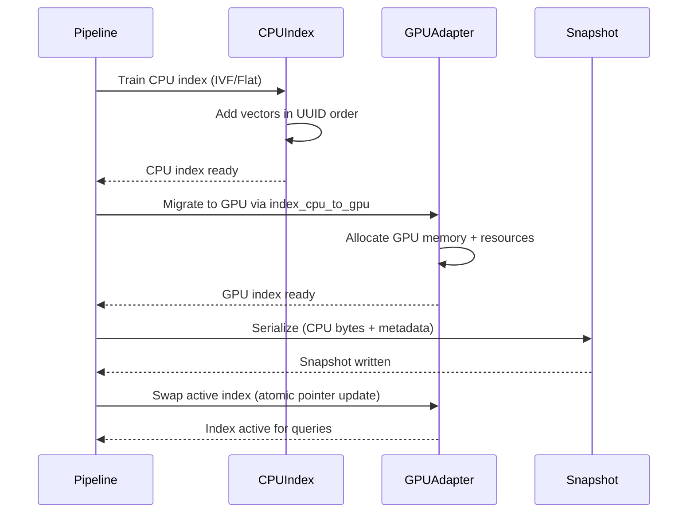

# DocsToKG • HybridSearch (Level-2 Spec)

## Purpose & Non-Goals

**Purpose:** Serve hybrid retrieval with FAISS GPU + lexical scorers, deterministic fusion, snapshots, and diagnostics.

**Scope:**

- Ingest DocParsing chunks + embeddings → GPU-accelerated FAISS indexes + lexical stores
- Query with dense (cosine), BM25, and SPLADE channels → fuse via RRF/MMR
- Namespace routing, snapshot cold starts, observability, deterministic fusion

**Non-Goals:**

- Ontology alignment (deferred to KnowledgeGraph subsystem)
- Answer generation (deferred to RAG Service)
- Embedding model training or fine-tuning (upstream DocParsing responsibility)

---

## Service Interfaces

### Python API

```python
from DocsToKG.HybridSearch import (
    HybridSearchService,
    HybridSearchAPI,
    ChunkIngestionPipeline,
    ManagedFaissAdapter,
    FaissRouter,
)

# Ingestion
pipeline = ChunkIngestionPipeline(
    faiss_index=faiss_adapter,
    opensearch=lexical_store,
    registry=chunk_registry,
    observability=obs,
)
report = pipeline.upsert_documents(
    docs=doc_inputs,
    vector_cache_limit=0,  # Fail on first UUID drift
)

# Querying
service = HybridSearchService(
    config_manager=config_manager,
    feature_generator=feature_gen,
    faiss=faiss_adapter,
    lexical=lexical_store,
    registry=chunk_registry,
)
response = service.search(
    HybridSearchRequest(
        query="hybrid retrieval with faiss",
        namespace="research",
        page_size=10,
        diversification=True,
        diagnostics=True,
    )
)

# Stats & health
stats = service.build_stats_snapshot(router, registry)
```

### HTTP API

**Endpoints:**

- `POST /v1/hybrid/ingest` – Ingest chunks + vectors
- `POST /v1/hybrid/query` – Execute hybrid search
- `GET /v1/hybrid/stats` – Retrieve stats snapshot
- `GET /healthz` – Health check with adapter status

---

## Request/Response Schemas

### Query Request

```json
{
  "query": "hybrid retrieval with faiss gpu",
  "namespace": "research",
  "filters": {"channel": ["docs", "papers"]},
  "page_size": 10,
  "cursor": null,
  "diversification": true,
  "diagnostics": true,
  "recall_first": false
}
```

**Fields:**

- `query` (string, required): Natural language query
- `namespace` (string, optional): Scope search to namespace
- `filters` (object, optional): Key-value filters for metadata
- `page_size` (int, default=10): Results per page
- `cursor` (string, optional): Pagination cursor
- `diversification` (bool, default=false): Enable MMR diversification
- `diagnostics` (bool, default=true): Include per-channel scores
- `recall_first` (bool, default=false): Prefer recall over precision for dense

### Query Response

```json
{
  "results": [
    {
      "doc_id": "doc-123",
      "chunk_id": "chunk-456",
      "vector_id": "1f3b3c9c-d94a-4b71-8f0c-3b0dd2c4d257",
      "namespace": "research",
      "score": 0.89,
      "fused_rank": 1,
      "text": "Hybrid search combines dense and sparse retrieval...",
      "highlights": ["hybrid search", "dense", "sparse"],
      "provenance_offsets": [[0, 12], [22, 27]],
      "diagnostics": {
        "bm25_score": 0.85,
        "splade_score": 0.78,
        "dense_score": 0.91,
        "fusion_weights": {"bm25": 0.35, "splade": 0.0, "dense": 0.65}
      },
      "metadata": {"channel": "papers", "year": 2024}
    }
  ],
  "next_cursor": "eyJ2IjoxLCJjIjoiZ3VpZGU...",
  "total_candidates": 47,
  "timings_ms": {
    "lexical_ms": 12.3,
    "dense_ms": 28.7,
    "fusion_ms": 4.1,
    "total_ms": 45.4
  },
  "fusion_weights": {"bm25": 0.35, "splade": 0.0, "dense": 0.65},
  "stats": {
    "faiss": {"ntotal": 12054, "dimension": 2560, "index_type": "Flat"},
    "lexical": {"bm25_latency_p95_ms": 18.2}
  }
}
```

---

## Directory Layout

```
Data/
├── ChunkedDocTagFiles/
│   └── *.chunk.jsonl               # Chunk text + metadata
├── Embeddings/
│   ├── *.vectors.jsonl             # Dense/sparse vectors (JSONL format)
│   └── *.vectors.parquet           # Dense/sparse vectors (Parquet format, requires pyarrow)
├── Manifests/
│   ├── docparse.chunks.manifest.jsonl
│   └── docparse.embeddings.manifest.jsonl
└── HybridSearch/
    ├── snapshots/
    │   ├── research/
    │   │   ├── faiss_cpu.index     # FAISS CPU index bytes
    │   │   ├── metadata.json       # Snapshot metadata
    │   │   └── uuid_registry.jsonl # UUID→FAISS-id mapping
    │   └── support/
    │       └── ...
    └── configs/
        └── hybrid.yaml             # HybridSearchConfig
```

**Key Files:**

- `*.chunk.jsonl`: One JSON line per chunk with `uuid`, `doc_id`, `chunk_id`, `text`, `num_tokens`, provenance
- `*.vectors.jsonl`: One JSON line per chunk with `uuid`, `BM25`, `SpladeV3`, `Qwen3-4B` (or `Qwen3_4B`)
- `*.vectors.parquet`: Same schema as JSONL but columnar format (faster ingestion, requires `pyarrow`)
- `faiss_cpu.index`: Serialized FAISS CPU index (portable across GPUs)
- `uuid_registry.jsonl`: Mapping from `uuid` → FAISS integer ID for stable reconstruction

---

## Ingestion Contract

### Inputs

1. **Chunk JSONL** (`*.chunk.jsonl`):

   ```json
   {
     "uuid": "1f3b3c9c-d94a-4b71-8f0c-3b0dd2c4d257",
     "doc_id": "guide-restore",
     "chunk_id": "guide-restore#0001",
     "text": "... chunk text ...",
     "num_tokens": 384,
     "source_chunk_idxs": [0, 1],
     "doc_items_refs": ["guide-restore#source"],
     "source_path": "s3://docparse/support/guide-restore.md"
   }
   ```

2. **Vector JSONL** (`*.vectors.jsonl`):

   ```json
   {
     "uuid": "1f3b3c9c-d94a-4b71-8f0c-3b0dd2c4d257",
     "BM25": {"terms": ["restore", "faiss"], "weights": [1.72, 1.11]},
     "SpladeV3": {"terms": ["restore", "backup"], "weights": [0.24, 0.09]},
     "Qwen3-4B": {
       "vector": [... 2560 float32 values ...],
       "model_metadata": {"dim": 2560}
     }
   }
   ```

3. **Vector Parquet** (`*.vectors.parquet`):
   - Schema: `uuid: string`, `BM25: struct`, `SpladeV3: struct`, `Qwen3-4B: struct`
   - Requires `pyarrow` (install `DocsToKG[docparse-parquet]`)
   - Faster ingestion than JSONL (columnar read, zero parse overhead)

### UUID Alignment Invariant

**Strict mode** (`vector_cache_limit ≤ 0`):

- FAISS IDs are contiguous integers `[0, N)` assigned in UUID sort order
- Pipeline maintains a vector cache; if UUID arrives out-of-order beyond the limit, raises `IngestError`
- Ensures deterministic UUID ↔ FAISS-id bijection for snapshot restore

**Example:**

```python
# Strict mode: fail on first drift
pipeline.upsert_documents(docs, vector_cache_limit=0)

# Lenient mode: allow up to 1000 cached vectors before failing
pipeline.upsert_documents(docs, vector_cache_limit=1000)
```

### Atomic Build Workflow



**Steps:**

1. **Train CPU**: Use `faiss.IndexFlatIP` or `IndexIVFFlat` on CPU
2. **Add vectors**: Add all vectors in UUID order to maintain ID alignment
3. **Migrate to GPU**: Call `faiss.index_cpu_to_gpu(_multiple)` with `StandardGpuResources`
4. **Serialize**: Save CPU index bytes + metadata (UUID registry, config hash)
5. **Swap**: Atomically swap active GPU index pointer

---

## FAISS GPU Architecture

### Index Types

| Type | Description | CPU Train | GPU Migrate | Query Latency | Memory |
|------|-------------|-----------|-------------|---------------|---------|
| `Flat` | Brute-force exact search | ✅ | ✅ | Low (150ms p50) | High (N×D×4 bytes) |
| `IVFFlat` | Inverted file with flat quantization | ✅ | ✅ | Medium (200ms p50) | Medium |
| `IVFPQ` | IVF + product quantization | ✅ | ✅ | High (300ms p50) | Low (compressed) |

**Default:** `Flat` for <1M vectors, `IVFFlat` for ≥1M vectors

### GPU Resources (`StandardGpuResources`)

```python
from faiss import StandardGpuResources

resources = StandardGpuResources()
resources.setTempMemory(1 * 1024**3)  # 1 GiB scratch space
resources.noTempMemory()  # Disable if OOM
```

**Configuration (`DenseIndexConfig`):**

```yaml
dense:
  index_type: "flat"  # or "ivf_flat", "ivf_pq"
  gpu_temp_memory_bytes: 1073741824  # 1 GiB
  use_cuvs: null  # null=auto, true=force, false=disable
  fp16: false  # Enable FP16 for 2× memory savings (experimental)
  expected_ntotal: 500000  # Preallocate for this many vectors
  enable_replication: false  # Multi-GPU replication
  replication_gpu_ids: [0, 1]  # GPUs for replication (if enabled)
```

### cuVS Integration

**Current Status:** FAISS wheel built with cuVS support **disabled** (FAISS internals don't call cuVS kernels yet).

**Future:** When enabled, cuVS provides:

- RAPIDS-accelerated ANN algorithms (CAGRA, IVF-PQ GPU)
- Distance primitives (`pairwise_distance`, `knn`)
- Memory management via RMM (RAPIDS Memory Manager)

**Detection:**

```python
from DocsToKG.HybridSearch.store import resolve_cuvs_state

state = resolve_cuvs_state(config)
print(state)  # CuvsState(enabled=False, reason="faiss wheel built without cuVS", ...)
```

**See:** `src/DocsToKG/HybridSearch/libcuvs-reference.md` for loader details.

---

## Fusion & Scoring

### Reciprocal Rank Fusion (RRF)

**Formula:**

```
RRF_score(doc) = Σ_{channel} w_channel / (k + rank_channel(doc))
```

**Where:**

- `w_channel`: Channel weight (BM25: 0.35, SPLADE: 0.0, Dense: 0.65 by default)
- `k`: RRF constant (default: 60.0)
- `rank_channel(doc)`: 1-based rank from that channel (1 = best)

**Example (`k=60`):**

- Doc ranked 1st in Dense, 5th in BM25: `RRF = 0.65/(60+1) + 0.35/(60+5) = 0.0106 + 0.0054 = 0.0160`

**Configuration:**

```yaml
fusion:
  k0: 60.0  # RRF constant (higher = more weight to lower ranks)
  enable_mmr: true  # Apply MMR diversification post-RRF
  mmr_lambda: 0.7  # MMR relevance vs. diversity balance
```

### Maximal Marginal Relevance (MMR)

**Formula:**

```
MMR = argmax_{d in R \ S} [λ · sim(d, q) - (1-λ) · max_{d' in S} sim(d, d')]
```

**Where:**

- `R`: Candidate set from RRF fusion
- `S`: Selected results so far
- `λ`: Balance between relevance (high) and diversity (low), default 0.7
- `sim(d, q)`: Dense cosine similarity to query
- `sim(d, d')`: Dense cosine similarity between candidates

**Workflow:**

1. Rank candidates by RRF score
2. For each position, select the candidate maximizing `λ·relevance - (1-λ)·max_similarity_to_selected`
3. Ensures diverse results (avoids near-duplicates)

---

## Snapshot Mechanics

### Snapshot Structure

```
snapshots/<namespace>/
├── faiss_cpu.index        # FAISS CPU index bytes (portable)
├── metadata.json          # Snapshot metadata
└── uuid_registry.jsonl    # UUID → FAISS-id mapping
```

**`metadata.json`:**

```json
{
  "namespace": "research",
  "created_at": "2025-10-23T00:00:00Z",
  "ntotal": 12054,
  "dimension": 2560,
  "index_type": "Flat",
  "config_hash": "sha256:abc123...",
  "snapshot_version": "1.0"
}
```

**`uuid_registry.jsonl`:**

```jsonl
{"uuid": "1f3b3c9c-...", "faiss_id": 0}
{"uuid": "2a4d5e6f-...", "faiss_id": 1}
...
```

### Cold Start Restore

```python
from DocsToKG.HybridSearch.store import restore_state

# Load snapshot
snapshot_bytes = Path("snapshots/research/faiss_cpu.index").read_bytes()
metadata = json.loads(Path("snapshots/research/metadata.json").read_text())

# Restore adapter
adapter = ManagedFaissAdapter(config, device=0)
adapter.restore(snapshot_bytes, meta=metadata)

# Rehydrate UUID registry
registry = ChunkRegistry()
for line in Path("snapshots/research/uuid_registry.jsonl").read_text().splitlines():
    entry = json.loads(line)
    registry.register_uuid(entry["uuid"], entry["faiss_id"])
```

### Snapshot Refresh Policy

**Throttles** (avoid excessive writes):

```yaml
dense:
  snapshot_refresh_interval_seconds: 60  # Min 60s between snapshots
  snapshot_refresh_writes: 5000  # Min 5000 vectors between snapshots
```

**Triggers:**

- Time: 60+ seconds since last snapshot
- Writes: 5000+ new vectors added
- Manual: `adapter.serialize()` called explicitly

---

## Namespace Routing

### Router Architecture

```python
from DocsToKG.HybridSearch.router import FaissRouter

router = FaissRouter(config)

# Per-namespace adapters
adapter_research = router.get_adapter("research")
adapter_support = router.get_adapter("support")

# Stats aggregation
stats = router.stats()
print(stats["research"])  # {"ntotal": 12054, "last_used": "2025-10-23T00:00:00Z"}
```

**Features:**

- **Lazy instantiation**: Adapters created on first `get_adapter(namespace)` call
- **LRU eviction**: Inactive namespaces evicted to free GPU memory
- **Snapshot caching**: Evicted adapters serialize to disk, restore lazily
- **Stats aggregation**: `router.stats()` returns per-namespace telemetry

### Namespace Isolation

**Guarantees:**

- Queries scoped to single namespace (no cross-namespace leakage)
- Independent snapshots per namespace
- Separate UUID registries per namespace

**Multi-tenant deployment:**

```yaml
routing:
  max_active_namespaces: 3  # Max concurrent GPU adapters
  eviction_policy: "lru"  # Least recently used
```

---

## Configuration & Tuning

### Complete Config Example

```yaml
chunking:
  max_tokens: 900
  overlap: 180

dense:
  index_type: "flat"
  expected_ntotal: 500000
  gpu_temp_memory_bytes: 1073741824  # 1 GiB
  enable_replication: false
  replication_gpu_ids: [0]
  use_cuvs: null  # Auto-detect
  fp16: false  # Experimental
  persist_mode: "cpu_bytes"  # or "disabled"
  snapshot_refresh_interval_seconds: 60
  snapshot_refresh_writes: 5000
  ingest_dedupe_threshold: 0.95  # Dedup if cosine > 0.95

fusion:
  k0: 60.0  # RRF constant
  enable_mmr: true
  mmr_lambda: 0.7  # 0.7 = 70% relevance, 30% diversity

retrieval:
  bm25_top_k: 80
  splade_top_k: 80
  dense_top_k: 60
  dense_overfetch_factor: 1.5  # Fetch 90 for 60 to allow diversification
  bm25_scoring: "true"  # or "bm25plus"
```

### Performance Tuning (RTX 5090)

**Baseline (Flat index):**

- Ingest: ≥50k vectors/sec (CPU build)
- GPU migrate: ≤1.5× CPU build time
- Query p50: ≤150ms, p99: ≤600ms (top-10, no generation)

**Optimizations:**

- **FP16**: 2× memory savings, minimal accuracy loss (experimental)
- **IVF**: 3× faster queries for >1M vectors, slight recall trade-off
- **Replication**: Spread load across multiple GPUs (linear scaling)

---

## Observability

### Metrics (Prometheus)

```
# Ingestion
hybrid_ingest_rows_total{namespace="research"} 12054
hybrid_ingest_duration_seconds{namespace="research"} 24.3

# Query
hybrid_query_latency_seconds_bucket{namespace="research",le="0.15"} 950
hybrid_query_latency_seconds_count{namespace="research"} 1000

# Snapshots
hybrid_snapshot_age_seconds{namespace="research"} 312

# GPU
hybrid_gpu_memory_bytes{device="0"} 15558328320
hybrid_gpu_temp_memory_bytes{device="0"} 1073741824
```

### Structured Logs (JSONL)

```json
{
  "timestamp": "2025-10-23T00:00:00Z",
  "level": "INFO",
  "event": "hybrid_search",
  "namespace": "research",
  "query": "hybrid retrieval faiss",
  "total_candidates": 47,
  "results_count": 10,
  "timings_ms": {"lexical": 12.3, "dense": 28.7, "fusion": 4.1, "total": 45.4},
  "fusion_weights": {"bm25": 0.35, "dense": 0.65}
}
```

### Traces (OpenTelemetry)

```
hybrid_search (45.4ms)
├── validate_request (0.3ms)
├── lexical_search (12.3ms)
│   ├── bm25_search (8.1ms)
│   └── splade_search (4.2ms)
├── dense_search (28.7ms)
│   └── faiss_search (28.4ms)
└── fusion (4.1ms)
    ├── rrf_fusion (2.8ms)
    └── mmr_diversify (1.3ms)
```

---

## Performance Budgets

### RTX 5090 Baseline

| Operation | Target | Notes |
|-----------|--------|-------|
| Ingest (CPU build) | ≥50k vec/s | Flat index, single-threaded |
| GPU migrate | ≤1.5× CPU time | `index_cpu_to_gpu` overhead |
| Query p50 | ≤150ms | Top-10, Flat index |
| Query p99 | ≤600ms | Top-10, Flat index |
| Snapshot serialize | ≤5s | 500k vectors, Flat |
| Snapshot restore | ≤3s | Cold start |

### Scaling Limits

| Index Type | Max Vectors | GPU Memory (RTX 5090 24GB) | Query p50 |
|------------|-------------|---------------------------|-----------|
| Flat | 1M | ~10 GB (2560-dim float32) | 150ms |
| IVFFlat | 5M | ~15 GB (nlist=2048) | 200ms |
| IVFPQ | 20M+ | ~8 GB (m=16, nbits=8) | 300ms |

---

## Failure Modes

| Failure | Detection | Recovery | Degradation |
|---------|-----------|----------|-------------|
| UUID drift | `IngestError` during pipeline | Re-ingest with sorted vectors | ❌ Fail-fast (data integrity) |
| Snapshot missing | Load fails at startup | Fallback to empty index | ⚠️ Degraded (no results until ingest) |
| GPU OOM | CUDA error during migrate | CPU-only index | ⚠️ Degraded (10× slower queries) |
| Namespace eviction | LRU policy triggers | Lazy restore from snapshot | ✅ Transparent (latency spike on first query) |
| Query timeout | Latency > budget | Return partial results | ⚠️ Degraded (fewer candidates) |

---

## Security

### Data Handling

- **No raw vector export**: API never returns dense embeddings (only UUIDs + scores)
- **Namespace isolation**: Queries scoped to single namespace, no cross-tenant leakage
- **Snapshot encryption**: Serialize snapshots with encryption at rest (deployment responsibility)

### Threat Model (STRIDE)

| Threat | Mitigation | Residual Risk |
|--------|------------|---------------|
| **S**poofing | Terminate TLS + authenticate at gateway | LOW (gateway responsibility) |
| **T**ampering | Checksum snapshots, ACL-protected directories | LOW (filesystem permissions) |
| **R**epudiation | Structured logs capture namespace + query | LOW (audit trail available) |
| **I**nformation Disclosure | No raw embeddings in API responses | LOW (only scores/UUIDs exposed) |
| **D**enial of Service | Token budgets, pagination limits, rate limiting | MEDIUM (gateway rate limiting needed) |
| **E**levation of Privilege | Namespace isolation, no admin API | LOW (minimal attack surface) |

---

## Test Plan

### Unit Tests

1. **UUID bijection** (`test_uuid_faiss_id_bijection`):
   - Ingest 1000 vectors in random UUID order (strict mode enabled)
   - Verify `ChunkRegistry.resolve_uuid(uuid)` returns correct FAISS ID
   - Verify `ChunkRegistry.resolve_faiss_id(fid)` returns correct UUID

2. **RRF fusion determinism** (`test_rrf_determinism`):
   - Run same query 10 times with identical config
   - Verify identical ranking every time

3. **MMR diversification** (`test_mmr_diversification`):
   - Ingest 5 near-duplicate chunks (cosine > 0.95)
   - Query with `diversification=True`
   - Verify top-5 results have pairwise cosine < 0.90

### Integration Tests

4. **Snapshot round-trip** (`test_snapshot_restore`):
   - Ingest 10k vectors → serialize → restore
   - Verify query results identical pre/post restore

5. **Namespace isolation** (`test_namespace_isolation`):
   - Ingest "research" (5k vecs) and "support" (3k vecs) namespaces
   - Query "research" → verify 0 results from "support"

### Chaos Tests

6. **Snapshot deletion mid-boot** (`test_snapshot_missing`):
   - Delete snapshot after adapter instantiation but before restore
   - Verify graceful degradation (empty index, log warning)

7. **GPU OOM** (`test_gpu_oom`):
   - Ingest vectors exceeding GPU memory
   - Verify CPU fallback + `degraded=true` flag in stats

---

## Acceptance Criteria

- ✅ Ingest 100k vectors in <5 minutes (RTX 5090)
- ✅ Query p50 <150ms, p99 <600ms (top-10, Flat index)
- ✅ UUID ↔ FAISS-id bijection maintained across restart
- ✅ Fusion deterministic (identical ranking for identical inputs)
- ✅ Namespace isolation verified (zero cross-namespace leakage)
- ✅ Snapshot restore <3 seconds (cold start)
- ✅ All 7 tests passing (unit + integration + chaos)
