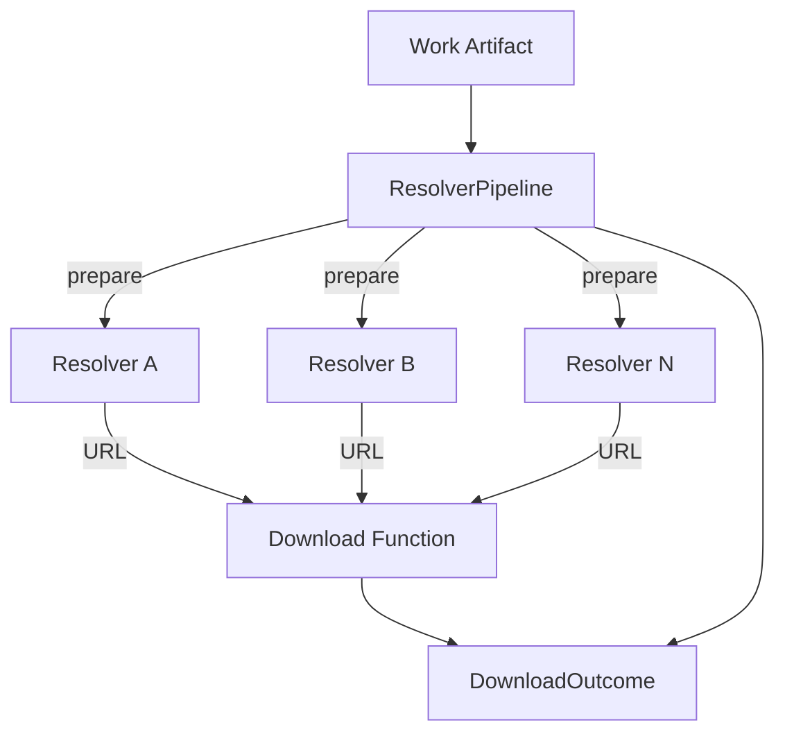

# Content Download Resolver Architecture

The diagram highlights the modular structure introduced by the resolver
refactor:

- `pipeline.py` orchestrates resolver execution, rate limiting, concurrency, and
  logging.
- `types.py` defines `ResolverConfig`, `ResolverResult`, `AttemptRecord`, and
  other shared data structures.
- `providers/` contains individual resolver implementations (Unpaywall, Crossref,
  OpenAlex, Zenodo, Figshare, etc.) exposed via
  `providers/__init__.py` and `default_resolvers()`.

Resolvers yield `ResolverResult` objects that flow back through the pipeline to
produce a `DownloadOutcome`. HEAD pre-checks, conditional requests, and retry
logic run in the pipeline before invoking the shared download function.
