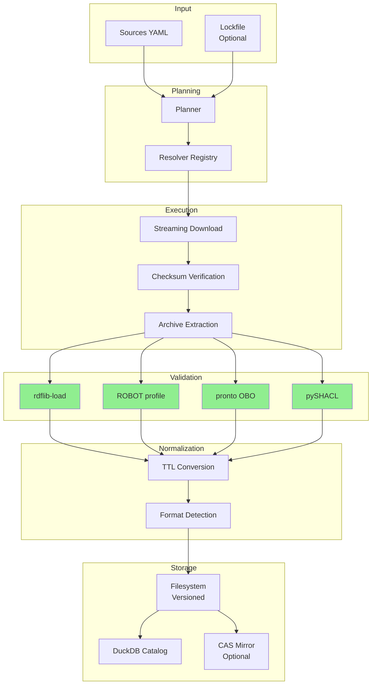
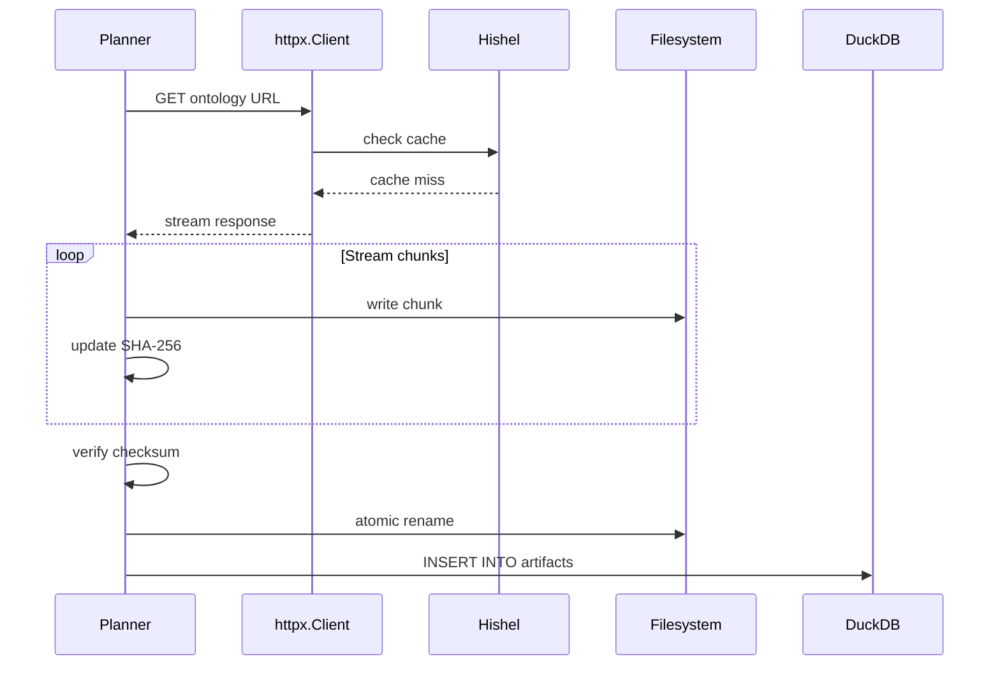

# DocsToKG • OntologyDownload — Subsystem Architecture

> **Go‑Forward Decisions (2025-10-23) — Alignment with Codebase**
>
> The following are *binding decisions* for the OntologyDownload subsystem and supersede any earlier ambiguous wording:
>
> 1. **DuckDB‑backed plan caching is mandatory.** Planning requires an initialized DuckDB catalog. Plans, manifests, and lockfiles are produced against the catalog to guarantee reproducibility and `plan-diff` fidelity. Ad‑hoc planning without the catalog is not supported going forward.
> 2. **Strict validation semantics.** When `--strict` is enabled, any validator failure (rdflib, ROBOT profile, pronto, owlready2, Arelle, **pySHACL**) triggers **full purge** of the staged artifacts for that ontology/release (download/extract/CAS). The run is considered failed and the last good version remains active.
> 3. **Validator set.** The supported validator suite is: rdflib, ROBOT (profile), pronto, owlready2, Arelle, **pySHACL**. For KG release gates, **pySHACL violations must be 0**.
> 4. **Networking & retries.** All HTTP fetches use **Tenacity** with exponential backoff and full respect for **`Retry‑After`** (429/503). **HTTPS** is required; source **allowlists** are enforced; HTTP→HTTPS upgrade occurs when possible.
> 5. **CLI surface.** The supported commands are: `plan`, `pull`, `validate`, `plan-diff`, `show`, `doctor`, `prune`, `plugins`, `config`, `init`, and `db` utilities (`latest`, `versions`, `stats`, `files`, `validations`, **`backup`**).
> 6. **Content‑addressable storage (CAS).** Local CAS mirroring under `.cas/sha256/aa/bb/...` is supported and recommended for integrity/deduplication. **S3 CAS is optional** and may be enabled in future; local FS remains the source‑of‑truth.
> 7. **Observability.** Default output is structured **JSONL** logs. A lightweight **Prometheus exporter** may be enabled to emit `ontofetch_*` counters/gauges (e.g., `downloads_total`, `bytes_downloaded_total`, `validator_errors_total`, `validation_seconds_total`, `http_retries_total`, `planning_seconds_total`).
> 8. **Reproducibility.** Lockfiles pin versions and checksums. `plan-diff` compares *desired* sources to the catalog+lockfile state; any drift is explicit and actionable.
>
> **Rationale:** These choices maximize determinism, auditability, and operational safety, directly supporting the end‑to‑end north‑star (ontology‑aligned KG + hybrid retrieval + RAG).


## Purpose & Scope

Deterministically **plan, fetch, validate, and normalize** third-party ontologies with **lockfiles**, **checksums**, **plugin-based resolvers/validators**, **DuckDB catalog**, and **streaming download** for reproducible knowledge graph construction.

**In scope**: Ontology acquisition, format normalization, validation (rdflib/pronto/ROBOT/pySHACL), lockfile management, DuckDB catalog, CAS mirroring, plugin architecture, plan-diff tooling.  
**Out of scope**: Ontology reasoning (EL/DL classification), knowledge graph persistence, ontology alignment/matching, SPARQL endpoints.

## Architecture Overview

OntologyDownload fetches ontologies from diverse sources (OBO, BioPortal, OLS, Ontobee), validates their structure and syntax, normalizes to standard formats (TTL, OWL, OBO), and catalogs metadata in DuckDB for reproducible builds.



## External Interfaces

**CLI**: `python -m DocsToKG.OntologyDownload.cli`

```bash
# Plan ontology downloads
ontofetch plan --sources configs/sources.yaml --out plan.json --dry-run

# Execute planned downloads with validation
ontofetch pull --plan plan.json --out ontologies/ --lock ontologies.lock.json --validators rdflib,robot

# Validate existing ontologies
ontofetch validate --dir ontologies/ --strict --validators rdflib,robot,pronto

# Compare lockfile to desired state
ontofetch plan-diff --from ontologies.lock.json --to configs/sources.yaml --update-baseline

# System health check
ontofetch doctor --json --check-disk --check-credentials

# Prune old versions
ontofetch prune --catalog ontofetch.duckdb --dry-run --older-than 30d

# Backup catalog
ontofetch backup --catalog ontofetch.duckdb --out backups/ --incremental

# List available plugins
ontofetch plugins --resolvers --validators

# Show configuration
ontofetch config --show --format yaml

# Inspect catalog stats & files
ontofetch db stats --catalog ~/.data/ontology-fetcher/.catalog/ontofetch.duckdb --json
ontofetch db files --catalog ~/.data/ontology-fetcher/.catalog/ontofetch.duckdb --json

# Backup the catalog (incremental)
ontofetch db backup --catalog ~/.data/ontology-fetcher/.catalog/ontofetch.duckdb --out backups/ --incremental

```

**Python API**:

```python
from DocsToKG.OntologyDownload import (
    fetch_all,
    plan_all,
    run_validators,
    about,
    list_plugins
)

# Plan fetch for multiple ontologies
plans = plan_all(
    sources_yaml="configs/sources.yaml",
    force_refresh=False
)

# Execute fetch with validation
results = fetch_all(
    sources_yaml="configs/sources.yaml",
    output_dir="ontologies/",
    validators=["rdflib", "robot"],
    strict=False,
    force=False
)

# Validate existing artifacts
validation_results = run_validators(
    artifact_path="ontologies/hp/2025-10-23/hp.owl",
    validators=["rdflib", "robot-profile"],
    strict=True
)

# Package metadata
info = about()  # Returns: version, schema, available plugins

# List installed plugins
plugins = list_plugins()  # Returns: {resolvers: [...], validators: [...]}
```

## Inputs & Outputs

### Inputs

**1. Sources YAML Configuration**

```yaml
version: 1.0

defaults:
  timeout_s: 60
  max_retries: 3
  normalize: true
  validators: ["rdflib-load"]
  enable_cas_mirror: false

sources:
  - id: "hp"
    name: "Human Phenotype Ontology"
    formats: ["owl", "ttl", "obo"]
    canonical_url: "https://purl.obolibrary.org/obo/hp.owl"
    license: "CC-BY-4.0"
    validators: ["rdflib-load", "robot-profile"]
    expected_checksum:
      algorithm: "sha256"
      checksum_url: "https://purl.obolibrary.org/obo/hp.owl.sha256"
```

**2. Optional Lockfile** (pins versions)

```json
{
  "version": 1,
  "resolved": [
    {
      "id": "hp",
      "url": "https://purl.obolibrary.org/obo/hp/releases/2025-09-15/hp.owl",
      "checksum": {"algorithm": "sha256", "value": "abc123..."},
      "fetched_at": "2025-10-23T00:00:00Z"
    }
  ]
}
```

**3. Environment Variables**

```bash
ONTOFETCH_CACHE_DIR=~/.cache/ontofetch
ONTOFETCH_LOCAL_DIR=~/.data/ontology-fetcher
ONTOFETCH_CATALOG_PATH=~/.data/ontology-fetcher/.catalog/ontofetch.duckdb
ONTOFETCH_HTTP_TIMEOUT=60
ONTOFETCH_MAX_RETRIES=3
ONTOFETCH_BIOPORTAL_API_KEY=<secret>
```

### Outputs

**Artifacts**: Organized by ontology ID and version

```
~/.data/ontology-fetcher/ontologies/
├── hp/
│   └── 2025-09-15/
│       ├── src/archives/hp.owl         # Original download
│       ├── data/
│       │   ├── hp.owl                  # Normalized OWL
│       │   ├── hp.ttl                  # Normalized Turtle
│       │   └── hp.obo                  # Normalized OBO
│       ├── validation/
│       │   ├── rdflib.json
│       │   └── robot.log
│       ├── manifest.json               # Per-ontology manifest
│       └── .extract.audit.json
```

**Manifest Schema (v1.0)**:

```json
{
  "schema_version": "1.0",
  "ontology_id": "hp",
  "name": "Human Phenotype Ontology",
  "version": "2025-09-15",
  "fetched_at": "2025-10-23T00:00:00Z",
  "source_url": "https://purl.obolibrary.org/obo/hp.owl",
  "resolver": "obo_purl",
  "artifacts": [
    {
      "format": "owl",
      "path": "data/hp.owl",
      "size_bytes": 15728640,
      "sha256": "abc123...",
      "is_normalized": true
    }
  ],
  "validation": {
    "rdflib-load": {
      "status": "ok",
      "triples": 50000,
      "duration_ms": 1234
    },
    "robot-profile": {
      "status": "ok",
      "profile": "EL",
      "duration_ms": 5678
    }
  },
  "license": "CC-BY-4.0",
  "checksum_verified": true
}
```

**DuckDB Catalog**: Structured metadata for queries

```sql
SELECT o.name, a.format, a.size_bytes, v.validator_name, v.status
FROM ontologies o
JOIN artifacts a ON o.ontology_id = a.ontology_id
LEFT JOIN validations v ON a.artifact_id = v.artifact_id
WHERE o.ontology_id = 'hp';
```

**Lockfile**: Reproducible versioning

- Generated after successful fetch
- Pins exact URLs and checksums
- Used for deterministic re-downloads
- Enables plan-diff workflow

## Pipeline

### 1. Plan Phase

**Objective**: Merge configuration sources, probe resolvers, generate download plan

**Steps**:

1. Load `sources.yaml` with defaults
2. Override with environment variables (`ONTOFETCH_*`)
3. For each source:
   - Select resolver (obo_purl, bioportal, ols, etc.)
   - Resolve ontology ID to candidate URLs
   - Check host allowlist
   - Validate URL security (HTTPS)
4. Generate `PlannedFetch` objects
5. Optionally probe URLs (HEAD requests)
6. Write plan.json

**Example Plan**:

```json
{
  "version": 1,
  "planned": [
    {
      "ontology_id": "hp",
      "resolver": "obo_purl",
      "url": "https://purl.obolibrary.org/obo/hp.owl",
      "format": "owl",
      "expected_checksum": null,
      "validators": ["rdflib-load", "robot-profile"]
    }
  ]
}
```

### 2. Stream Phase

**Objective**: Download artifacts with resume support, checksum enforcement

**Components**:

- **Shared httpx.Client**: Connection pooling, keep-alive
- **Hishel Cache**: RFC 9111 HTTP caching layer
- **Redirect Audit**: Track redirect chains
- **Resume Support**: Conditional GET with ETag/Last-Modified
- **Checksum Enforcement**: Streaming SHA-256 verification
- **Rate Limiting**: Token bucket per host

**Flow**:



**Security**:

- HTTPS enforced unless host explicitly allowed
- Host allowlist checked before download
- Secrets masked in logs
- Temporary files use secure tempfile module

### 3. Validate Phase

**Objective**: Run pluggable validators, record results

**Built-in Validators**:

**rdflib** (Python, fast)

- Parse RDF/OWL/TTL
- Count triples
- Extract namespaces
- Detect syntax errors
- Runtime: 1-5 seconds

**ROBOT** (Java, comprehensive)

- OWL profile check (EL, DL, RL, QL, Full)
- Consistency checking
- Annotation property validation
- Requires: ROBOT jar in PATH
- Runtime: 5-30 seconds

**pronto** (Python, OBO-specific)

- Parse OBO format
- Validate term structure
- Check relationships
- Detect obsolete terms
- Runtime: 1-10 seconds

**owlready2** (Python, reasoning)

- Load OWL into memory
- Optionally run reasoner (HermiT, Pellet)
- Check consistency
- Runtime: 10-60 seconds (depends on reasoner)

**pySHACL** (Python, SHACL)

- Validate against SHACL shapes
- Generate conformance reports
- Detect violations
- Runtime: 5-30 seconds

**Validation Budget**:

```yaml
validation:
  budget:
    max_duration_per_validator: 120  # Kill after 2 minutes
    max_memory_mb: 4096              # Memory limit
    max_parallel_validators: 4       # Concurrent validators
  strict: false                      # Fail on any error
  retry_on_timeout: true             # Retry if timeout
  save_outputs: true                 # Keep validator logs
```

**Error Handling**:

- **Strict mode**: Any validator failure → purge artifact, exit with error
- **Lenient mode**: Log warnings, keep artifact, continue
- **Timeout**: Kill validator process, mark as timeout
- **Memory exceeded**: Kill process, log error

### 4. Normalize Phase

**Objective**: Convert to standard formats, deterministic output

**Normalization Steps**:

1. **Format detection**: Auto-detect from content (not extension)
2. **Conversion**:
   - OWL → TTL via rdflib
   - OBO → OWL via ROBOT (if available)
   - RDF/XML → TTL via rdflib
3. **Canonicalization**:
   - Sort triples deterministically
   - Remove blank node IDs
   - Normalize whitespace
4. **Output**: Write to `data/<ontology_id>.<format>`

**Determinism Guarantees**:

- Same input → same TTL output (byte-for-byte)
- Independent of Python hash randomization
- Independent of rdflib version (tested 6.x, 7.x)
- Triple ordering: Subject > Predicate > Object (lexicographic)

### 5. Emit Phase

**Objective**: Write manifest, update catalog, optionally generate lockfile

**Manifest Generation**:

```python
manifest = {
    "schema_version": "1.0",
    "ontology_id": ontology_id,
    "version": version_timestamp,
    "fetched_at": datetime.utcnow().isoformat(),
    "source_url": source_url,
    "resolver": resolver_name,
    "artifacts": artifacts_list,
    "validation": validation_results,
    "license": license_info,
    "checksum_verified": bool(checksum_match)
}
```

**DuckDB Catalog Updates**:

```sql
-- Insert version
INSERT INTO versions (version_id, created_at, config_hash, status)
VALUES ('2025-10-23T00:00:00Z', CURRENT_TIMESTAMP, 'sha256:...', 'building');

-- Insert artifact
INSERT INTO artifacts (artifact_id, ontology_id, version_id, url, format, size_bytes, sha256, path, downloaded_at)
VALUES ('sha256:abc123...', 'hp', '2025-10-23T00:00:00Z', 'https://...', 'owl', 15728640, 'abc123...', 'data/hp.owl', CURRENT_TIMESTAMP);

-- Insert validation results
INSERT INTO validations (validation_id, artifact_id, validator_name, status, details, duration_ms, validated_at)
VALUES (uuid(), 'sha256:abc123...', 'rdflib-load', 'ok', '{"triples": 50000}', 1234, CURRENT_TIMESTAMP);

-- Update version status
UPDATE versions SET status = 'complete', total_ontologies = 1 WHERE version_id = '2025-10-23T00:00:00Z';
```

**Lockfile Generation** (optional):

- Include after successful fetch
- Write atomically (temp file → rename)
- Used for `plan-diff` workflow
- Enables deterministic replays

## Invariants & Security

### Manifest Schema

- **Schema v1.0**: Current version
- **Bump on breaking changes**: Requires migration
- **Backward compatibility**: Old schema readable with warnings
- **JSON Schema validation**: Enforce structure

### Host Allowlists

- **Default allowlist**: OBO, BioPortal, OLS, Ontobee, LOV
- **Custom allowlist**: Per-source `security.allowlist_hosts`
- **HTTPS enforcement**: Required unless host explicitly allowed
- **Certificate validation**: Enabled by default

### Masked Secrets

- **API keys**: Never logged or in manifests
- **Tokens**: Redacted from structured logs
- **URLs with credentials**: Scrubbed before storage

### Token-Bucket Rate Limiting

- **Per-host limits**: Default 10 req/s
- **Burst allowance**: 2× sustained rate
- **Backoff on 429**: Honor `Retry-After` header
- **Circuit breaker**: Open after 5 consecutive failures

### Resume and 304 Cache Hits

- **Conditional GET**: Include `If-None-Match` (ETag)
- **Conditional GET**: Include `If-Modified-Since`
- **304 Not Modified**: Skip download, use cached
- **Resume**: Partial downloads not supported (all-or-nothing)

## Observability

### Doctor Checks

```bash
ontofetch doctor --json
```

**Checks**:

- Environment variables present
- Disk space available (> 10GB)
- Network connectivity (ping common hosts)
- Optional dependencies installed (ROBOT, pronto, pySHACL)
- Credentials valid (BioPortal API key)
- Rate-limit configuration valid
- DuckDB catalog schema version

**Output** (JSON):

```json
{
  "status": "healthy",
  "checks": [
    {"name": "disk_space", "status": "ok", "details": {"free_gb": 125}},
    {"name": "network", "status": "ok", "details": {"ping_ms": 45}},
    {"name": "robot_jar", "status": "warning", "details": {"found": false}},
    {"name": "bioportal_key", "status": "ok", "details": {"key_valid": true}}
  ]
}
```

### Structured JSONL Logs

```json
{
  "timestamp": "2025-10-23T00:00:00Z",
  "level": "info",
  "event": "download_start",
  "ontology_id": "hp",
  "url": "https://purl.obolibrary.org/obo/hp.owl",
  "resolver": "obo_purl",
  "correlation_id": "01J..."
}
```

### Inventory of Plugins

```bash
ontofetch plugins
```

**Output**:

```
Resolvers:
  - obo_purl (built-in)
  - bioportal (built-in)
  - ols (built-in)
  - ontobee (built-in)
  - my_custom_resolver (external)

Validators:
  - rdflib-load (built-in)
  - robot-profile (built-in, requires ROBOT)
  - pronto (built-in, requires pronto)
  - pysshacl (built-in, requires pyshacl)
  - my_custom_validator (external)
```

## Roadmap

### Completed (v1.0)

- ✅ Plan/pull/validate/plan-diff commands
- ✅ DuckDB catalog with schema v1.0
- ✅ Built-in resolvers (OBO, BioPortal, OLS, Ontobee, LOV)
- ✅ Built-in validators (rdflib, ROBOT, pronto, pySHACL)
- ✅ Lockfile management
- ✅ CAS mirroring (local filesystem)
- ✅ Plugin architecture (resolvers + validators)
- ✅ Streaming download with resume
- ✅ Checksum enforcement
- ✅ Format normalization (TTL canonical)
- ✅ Doctor command
- ✅ Prune command

### In Progress (v1.1)

- 🔄 Additional resolvers (Semantic Scholar, NCBO ontologies)
- 🔄 S3 backend for CAS mirroring
- 🔄 Enhanced SHACL shape validation
- 🔄 Ontology version diffing

### Future (v2.0)

- 📋 SPARQL endpoint integration
- 📋 Incremental update detection
- 📋 Multi-ontology consistency checking
- 📋 Ontology slicing/modularization
- 📋 Automated ontology recommendations
