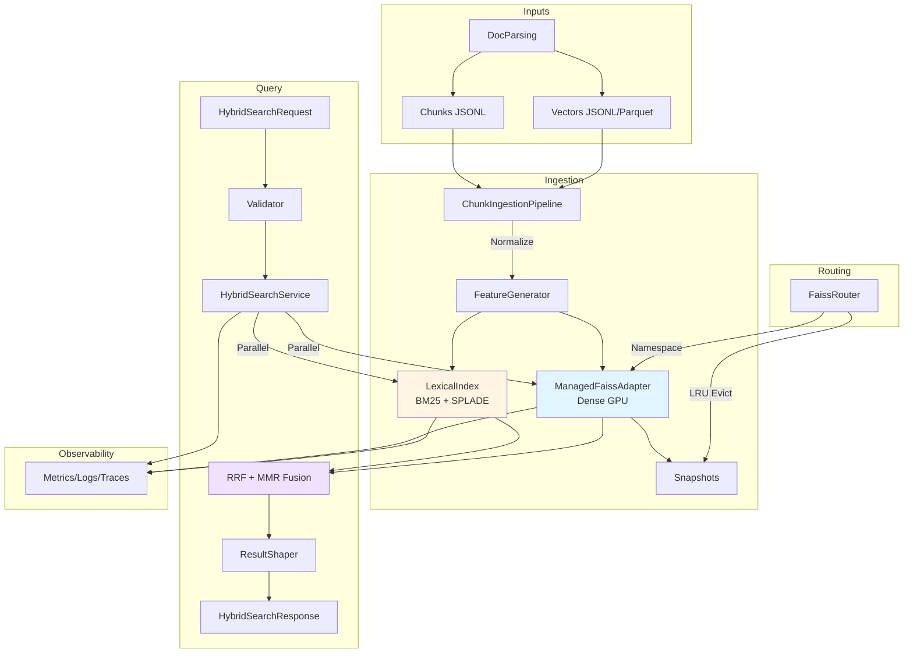
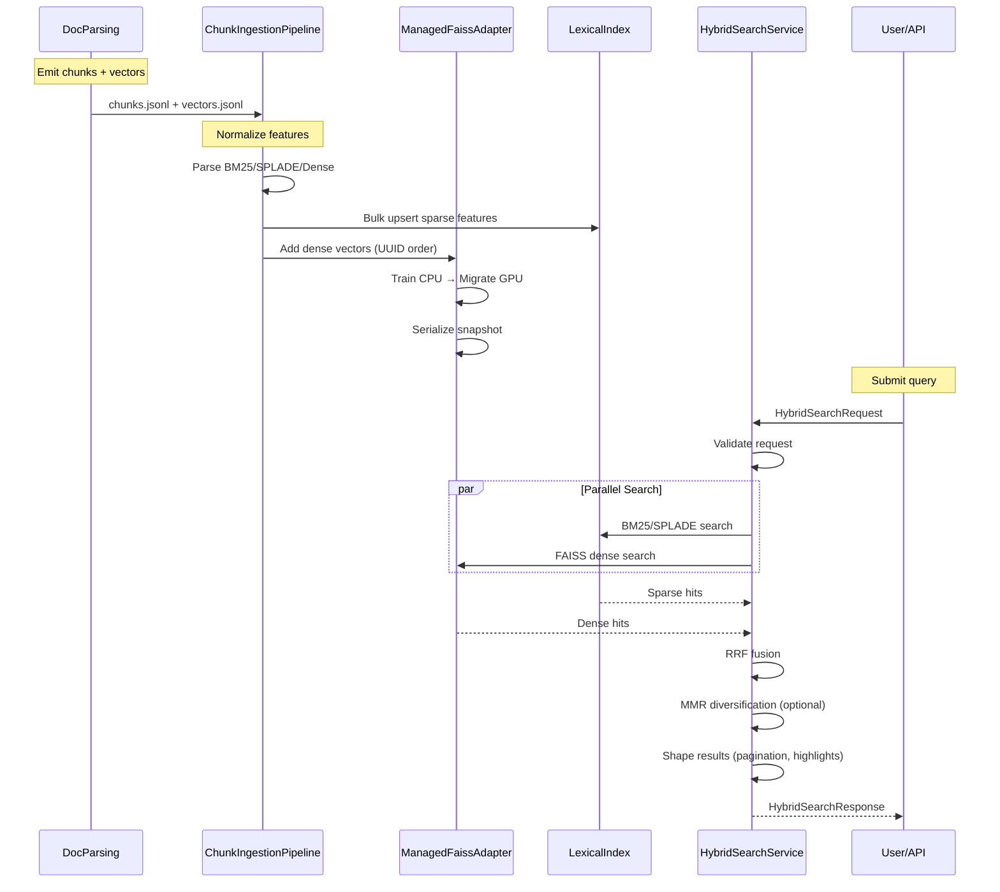
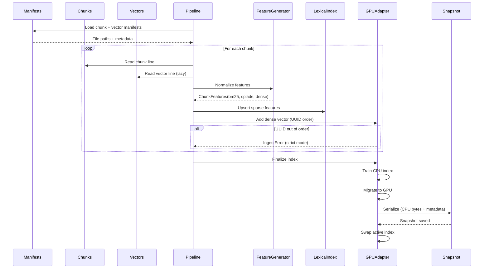
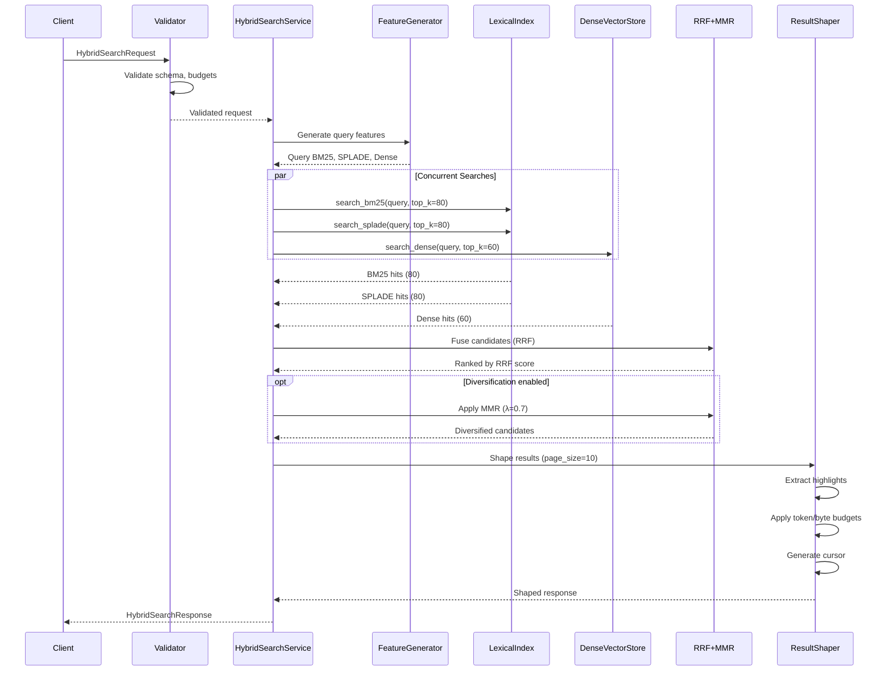
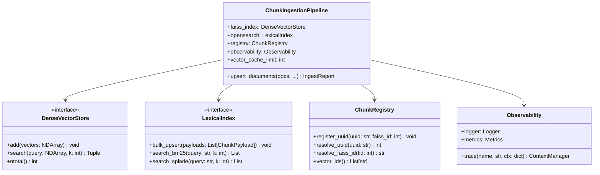
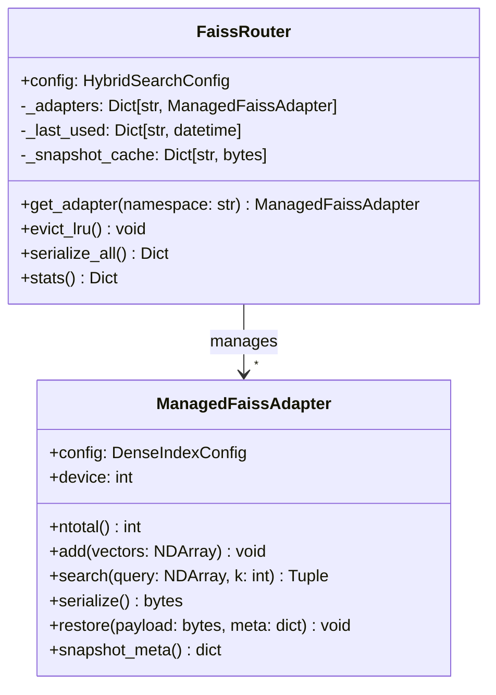

# DocsToKG • HybridSearch — Subsystem Architecture

> **Go‑Forward Decisions (2025-10-23) — HybridSearch**
>
> 1. **Canonical vector format**: **Parquet** is the first‑class vector format for ingestion; JSONL remains supported for compatibility. Partition path: `Embeddings/{family=dense|sparse|lexical}/fmt=parquet/YYYY/MM/<doc_id>.parquet`. Parquet footers carry `docparse.provider`, `model_id`, `dtype`, and `cfg_hash`.
> 2. **UUID alignment (strict)**: Default `vector_cache_limit = 0` (fail on first drift) to guarantee a deterministic UUID ↔ FAISS‑id bijection. Lenient modes are opt‑in.
> 3. **Index selection**: **Flat** < 1M vectors; **IVFFlat** ≥ 1M; **IVFPQ** when memory‑bounded. Defaults match this policy unless explicitly overridden.
> 4. **GPU resources**: Use FAISS **StandardGpuResources** with pre‑allocated scratch (1 GiB default); replicate only when configured. **FP16** remains **experimental** and **off** by default.
> 5. **cuVS preferred**: Enable cuVS by default when available. Set `use_cuvs: auto` to choose cuVS if compiled; fall back to FAISS otherwise. Ingest/query must **not** fail if cuVS is absent; we log diagnostics and use FAISS transparently.
>    - **Index policy with cuVS**: <1M vectors → FAISS **Flat** (GPU); 1–10M → cuVS **IVF-Flat**; ≥10M → cuVS **CAGRA** (or cuVS **IVF-PQ** when memory-bounded).
>    - **Build guidance**: Prefer wheels built with cuVS; expose `--use-cuvs={auto|true|false}` and `--cuvs-index={cagra|ivf_flat|ivf_pq}` on CLI.
>    - **Non-regression guard**: if cuVS path degrades nDCG@10 by >1% against FAISS baseline on a canary sample, route to FAISS for that namespace and emit an alert.
 **Fusion & diversification**: **RRF** default weights `{bm25: 0.35, splade: 0.0, dense: 0.65}`, `k0 = 60.0`; **MMR enabled** by default with `λ = 0.7`.
> 7. **Namespace routing**: LRU‑evict to snapshots when `max_active_namespaces` exceeded; lazy restore on demand. Queries are always **namespace‑scoped**.
> 8. **Observability**: Emit Prometheus metrics prefixed `hybrid_*` (seconds‑based histograms), structured JSONL logs, and OTel spans (`run_id`, `config_hash`, `namespace`). Keep metric names stable with the north‑star dashboard.
> 9. **Security posture**: API must **not** return raw dense vectors; only UUIDs/scores/metadata. Snapshots may be encrypted at rest (deployment policy).
> 10. **Acceptance gates**: Retrieval latencies **p50 ≤ 150ms / p99 ≤ 600ms**, hybrid uplift **≥ +5% nDCG@10** vs best single retriever, deterministic fusion ranking, UUID bijection preserved across restore.


## Purpose & Scope

**Purpose:** Provide hybrid retrieval over chunked corpora by combining lexical (BM25/SPLADE) and dense (FAISS GPU) channels, with deterministic fusion, diversification, and snapshot-based cold starts.

**Scope:**

- **Ingestion**: Stream DocParsing chunks + embeddings → FAISS GPU indexes + lexical stores
- **Query**: Execute concurrent dense/sparse searches → fuse via RRF/MMR → return ranked results
- **Routing**: Per-namespace adapters with lazy instantiation, LRU eviction, and snapshot caching
- **Observability**: Metrics, structured logs, traces for latency/fusion/GPU telemetry

**Boundaries:**

- **Upstream**: DocParsing provides chunks + embeddings (JSONL or Parquet)
- **Downstream**: RAG Service consumes ranked results for answer generation
- **Out of scope**: Embedding model training, answer generation, long-term archival

---

## Overall Architecture



**Key Components:**

1. **ChunkIngestionPipeline**: Streams DocParsing artifacts, normalizes features, enforces UUID alignment
2. **ManagedFaissAdapter**: Trains CPU indexes, migrates to GPU, manages resources, snapshots
3. **FaissRouter**: Per-namespace adapter provisioning with LRU eviction and lazy restore
4. **HybridSearchService**: Validates requests, fans out searches, fuses results via RRF/MMR
5. **ResultShaper**: Applies diversification (MMR), pagination, token budgets

---

## External Interfaces

### Python API

```python
from DocsToKG.HybridSearch import (
    HybridSearchService,
    HybridSearchAPI,
    ChunkIngestionPipeline,
    ManagedFaissAdapter,
    FaissRouter,
    HybridSearchConfigManager,
)

# Configuration
config_manager = HybridSearchConfigManager(Path("configs/hybrid.yaml"))
config = config_manager.get()

# Ingestion
pipeline = ChunkIngestionPipeline(
    faiss_index=faiss_adapter,
    opensearch=lexical_store,
    registry=chunk_registry,
    observability=obs,
    config=config.chunking,
)
report = pipeline.upsert_documents(
    docs=doc_inputs,
    vector_cache_limit=0,  # Strict UUID alignment
)

# Querying
service = HybridSearchService(
    config_manager=config_manager,
    feature_generator=feature_gen,
    faiss=faiss_adapter,
    lexical=lexical_store,
    registry=chunk_registry,
)
response = service.search(
    HybridSearchRequest(
        query="hybrid retrieval with faiss",
        namespace="research",
        page_size=10,
        diversification=True,
        diagnostics=True,
    )
)

# Routing (multi-namespace)
router = FaissRouter(config)
adapter_research = router.get_adapter("research")
adapter_support = router.get_adapter("support")

# Stats & health
stats = service.build_stats_snapshot(router, registry)
```

### HTTP API (via FastAPI/Starlette)

```python
from fastapi import FastAPI
from DocsToKG.HybridSearch import HybridSearchAPI

app = FastAPI()
hybrid_api = HybridSearchAPI(service)

@app.post("/v1/hybrid/query")
async def query(request: dict):
    return hybrid_api.search(request)

@app.get("/v1/hybrid/stats")
async def stats():
    return hybrid_api.stats()
```

### CLI (via Quickstart)

```bash
# Ingest sample dataset + run query
python examples/hybrid_search_quickstart.py --query "hybrid retrieval" --namespace research

# Custom config
python examples/hybrid_search_quickstart.py --config configs/hybrid.yaml --vector-format parquet
```

---

## Inputs & Outputs

### Inputs

1. **Chunk JSONL** (`Data/ChunkedDocTagFiles/*.chunk.jsonl`):

   ```json
   {
     "uuid": "1f3b3c9c-d94a-4b71-8f0c-3b0dd2c4d257",
     "doc_id": "guide-restore",
     "chunk_id": "guide-restore#0001",
     "text": "... chunk text ...",
     "num_tokens": 384,
     "source_chunk_idxs": [0, 1],
     "doc_items_refs": ["guide-restore#source"]
   }
   ```

2. **Vector JSONL** (`Data/Embeddings/*.vectors.jsonl`):

   ```json
   {
     "uuid": "1f3b3c9c-d94a-4b71-8f0c-3b0dd2c4d257",
     "BM25": {"terms": ["restore", "faiss"], "weights": [1.72, 1.11]},
     "SpladeV3": {"terms": ["restore", "backup"], "weights": [0.24, 0.09]},
     "Qwen3-4B": {"vector": [...2560 floats...], "model_metadata": {"dim": 2560}}
   }
   ```

3. **Vector Parquet** (`Data/Embeddings/*.vectors.parquet`):
   - Schema: `uuid: string`, `BM25: struct<terms:list<string>, weights:list<float>>`, `SpladeV3: struct`, `Qwen3-4B: struct<vector:list<float>, model_metadata:struct>`
   - Requires `pyarrow` (install `DocsToKG[docparse-parquet]`)

4. **Config** (`configs/hybrid.yaml`):

   ```yaml
   chunking:
     max_tokens: 900
     overlap: 180
   dense:
     index_type: "flat"
     gpu_temp_memory_bytes: 1073741824
     use_cuvs: null
   fusion:
     k0: 60.0
     enable_mmr: true
     mmr_lambda: 0.7
   retrieval:
     bm25_top_k: 80
     dense_top_k: 60
   ```

### Outputs

1. **HybridSearchResponse** (JSON/Python):

   ```json
   {
     "results": [...],  // Ranked HybridSearchResult objects
     "next_cursor": "eyJ2IjoxLCJjIjoiZ3VpZGU...",
     "total_candidates": 47,
     "timings_ms": {"lexical": 12.3, "dense": 28.7, "fusion": 4.1, "total": 45.4},
     "fusion_weights": {"bm25": 0.35, "dense": 0.65},
     "stats": {"faiss": {"ntotal": 12054}, "lexical": {}}
   }
   ```

2. **Snapshots** (`Data/HybridSearch/snapshots/<namespace>/`):
   - `faiss_cpu.index`: Serialized FAISS CPU index (portable)
   - `metadata.json`: Snapshot metadata (ntotal, dimension, config_hash)
   - `uuid_registry.jsonl`: UUID → FAISS-id mapping

3. **Metrics** (Prometheus):

   ```
   hybrid_ingest_rows_total{namespace="research"} 12054
   hybrid_query_latency_seconds_bucket{namespace="research",le="0.15"} 950
   hybrid_snapshot_age_seconds{namespace="research"} 312
   hybrid_gpu_memory_bytes{device="0"} 15558328320
   ```

---

## Data Flow

### High-Level Flow



### Detailed Ingestion Flow



---

## Control Flow

### Query Execution



### Namespace Routing

```mermaid
flowchart LR
    Q[Query: namespace="research"] --> RTR[FaissRouter]
    RTR --> |Check cache| CACHE{Adapter<br/>in memory?}
    
    CACHE -->|Yes| ACTIVE[Return active adapter]
    CACHE -->|No| LOAD[Load from snapshot]
    
    LOAD --> SNAP[Read faiss_cpu.index]
    SNAP --> META[Read metadata.json]
    META --> REG[Read uuid_registry.jsonl]
    REG --> RESTORE[Restore adapter]
    RESTORE --> ACTIVE
    
    ACTIVE --> GPU[Execute query on GPU]
    GPU --> RESP[Return results]
    
    subgraph LRU Eviction
        EVICT[Max namespaces reached] --> SERIAL[Serialize LRU adapter]
        SERIAL --> DISK[Write to disk]
        DISK --> FREE[Free GPU memory]
    end
```

---

## Ingestion Pipeline

### ChunkIngestionPipeline Architecture



**Key Responsibilities:**

1. **Stream artifacts**: Lazy-load chunks + vectors from manifests
2. **Normalize features**: Parse BM25/SPLADE/Dense payloads into `ChunkFeatures`
3. **Enforce UUID alignment**: Fail on drift when `vector_cache_limit ≤ 0`
4. **Maintain parity**: Lexical + dense stores receive identical add/remove sequences
5. **Emit telemetry**: Metrics, logs, traces for observability

**Vector Cache Guard:**

```python
# Strict mode: fail on first UUID drift
pipeline.upsert_documents(docs, vector_cache_limit=0)

# Lenient mode: cache up to 1000 out-of-order vectors
pipeline.upsert_documents(docs, vector_cache_limit=1000)
```

---

## Registry Design

### ChunkRegistry Architecture

```python
class ChunkRegistry:
    """Bidirectional UUID ↔ FAISS-id mapping."""
    
    def __init__(self):
        self._uuid_to_faiss: Dict[str, int] = {}
        self._faiss_to_uuid: Dict[int, str] = {}
        self._payloads: Dict[str, ChunkPayload] = {}
    
    def register_uuid(self, uuid: str, faiss_id: int) -> None:
        """Register UUID → FAISS-id mapping (immutable once set)."""
        if uuid in self._uuid_to_faiss:
            existing = self._uuid_to_faiss[uuid]
            if existing != faiss_id:
                raise ValueError(f"UUID {uuid} already mapped to {existing}, cannot remap to {faiss_id}")
        self._uuid_to_faiss[uuid] = faiss_id
        self._faiss_to_uuid[faiss_id] = uuid
    
    def resolve_uuid(self, uuid: str) -> int:
        """Resolve UUID → FAISS-id."""
        return self._uuid_to_faiss[uuid]
    
    def resolve_faiss_id(self, faiss_id: int) -> str:
        """Resolve FAISS-id → UUID."""
        return self._faiss_to_uuid[faiss_id]
    
    def register_payload(self, payload: ChunkPayload) -> None:
        """Store full chunk payload for result hydration."""
        self._payloads[payload.vector_id] = payload
    
    def get_payload(self, vector_id: str) -> ChunkPayload:
        """Retrieve chunk payload by UUID."""
        return self._payloads[vector_id]
```

**Invariants:**

- UUID → FAISS-id mapping is **immutable** (once set, cannot change)
- FAISS-id assignment is **contiguous** `[0, N)` in UUID sort order
- Snapshots serialize both directions for fast restoration

---

## Router Architecture

### FaissRouter Design



**Features:**

1. **Lazy instantiation**: Adapters created on first `get_adapter(namespace)` call
2. **LRU eviction**: When max_active_namespaces reached, evict least recently used
3. **Snapshot caching**: Serialize evicted adapters to disk, restore lazily
4. **Stats aggregation**: `router.stats()` returns per-namespace telemetry

**Example:**

```python
router = FaissRouter(config)

# Lazy load
adapter = router.get_adapter("research")  # Creates if not exists
adapter.add(vectors)

# Stats
stats = router.stats()
# {
#   "research": {"ntotal": 12054, "last_used": "2025-10-23T00:00:00Z"},
#   "support": {"ntotal": 3421, "last_used": "2025-10-22T00:00:00Z"}
# }

# Serialize all namespaces
snapshots = router.serialize_all()
# {
#   "research": {"faiss_bytes": b"...", "metadata": {...}},
#   "support": {...}
# }
```

---

## Unified Configuration System

### HybridSearchConfigManager

```python
class HybridSearchConfigManager:
    """Thread-safe config loader with atomic reloads."""
    
    def __init__(self, path: Path):
        self._path = path
        self._lock = threading.RLock()
        self._config: Optional[HybridSearchConfig] = None
        self._last_modified: Optional[float] = None
    
    def get(self) -> HybridSearchConfig:
        """Get current config (load if needed)."""
        with self._lock:
            if self._config is None:
                self._load()
            return self._config
    
    def reload(self) -> HybridSearchConfig:
        """Force reload from disk."""
        with self._lock:
            self._load()
            return self._config
    
    def _load(self) -> None:
        """Load config from YAML/JSON."""
        content = self._path.read_text()
        raw = yaml.safe_load(content) if self._path.suffix == ".yaml" else json.loads(content)
        
        # Normalize legacy keys
        raw = self._normalize_legacy_keys(raw)
        
        # Parse into dataclasses
        self._config = HybridSearchConfig(
            chunking=ChunkingConfig(**raw.get("chunking", {})),
            dense=DenseIndexConfig(**raw.get("dense", {})),
            fusion=FusionConfig(**raw.get("fusion", {})),
            retrieval=RetrievalConfig(**raw.get("retrieval", {})),
        )
        self._last_modified = self._path.stat().st_mtime
```

**Configuration Precedence:**

1. **Explicit config file** (`--config` or `DOCSTOKG_HYBRID_CONFIG`)
2. **Environment variables** (`DOCSTOKG_DENSE_INDEX_TYPE`, etc.)
3. **Defaults** (hardcoded in dataclasses)

---

## Observability Integration

### Structured Logging

```python
# Ingestion
obs.logger.info(
    "ingestion_complete",
    namespace="research",
    chunks_added=12054,
    duration_s=24.3,
    vectors_per_sec=496,
)

# Query
obs.logger.info(
    "hybrid_search",
    namespace="research",
    query="hybrid retrieval faiss",
    total_candidates=47,
    results_count=10,
    timings_ms={"lexical": 12.3, "dense": 28.7, "fusion": 4.1, "total": 45.4},
    fusion_weights={"bm25": 0.35, "dense": 0.65},
)
```

### Metrics

```python
# Ingestion
obs.metrics.increment("hybrid_ingest_rows_total", namespace="research", count=12054)
obs.metrics.observe("hybrid_ingest_duration_seconds", namespace="research", value=24.3)

# Query
obs.metrics.observe("hybrid_query_latency_seconds", namespace="research", value=0.0454)
obs.metrics.set_gauge("hybrid_snapshot_age_seconds", namespace="research", value=312)
obs.metrics.set_gauge("hybrid_gpu_memory_bytes", device="0", value=15558328320)
```

### Traces

```python
with obs.trace("hybrid_search", {"namespace": "research", "query": query}):
    with obs.trace("validate_request"):
        validated = validator.validate(request)
    
    with obs.trace("parallel_search"):
        lexical_hits = lexical.search_bm25(query, top_k=80)
        dense_hits = faiss.search(query_vector, k=60)
    
    with obs.trace("fusion"):
        fused = rrf_fusion(lexical_hits, dense_hits, config.fusion)
    
    with obs.trace("shape_results"):
        response = shaper.shape(fused, request.page_size)
```

---

## Key Invariants

1. **UUID ↔ FAISS-id Bijection**
   - FAISS IDs are contiguous `[0, N)` in UUID sort order
   - Once assigned, UUID → FAISS-id mapping is immutable
   - Snapshots preserve both directions for fast restoration

2. **Fusion Determinism**
   - Identical inputs (queries, candidates, config) → identical ranking
   - RRF formula applied consistently across all queries
   - MMR diversification uses stable random seed (if randomization needed)

3. **Chunk Registry Parity**
   - Lexical + dense stores receive identical add/remove sequences
   - ChunkRegistry holds payloads for both stores
   - Any divergence triggers `IngestError` or log warning

4. **Namespace Isolation**
   - Queries scoped to single namespace (no cross-namespace leakage)
   - Independent snapshots per namespace
   - Separate UUID registries per namespace

---

## Performance Notes

### GPU Recommendations

- **RTX 5090 (24GB)**: Recommended for <1M vectors (Flat index)
- **RTX 5000 (16GB)**: Suitable for <500k vectors (Flat) or <2M (IVFPQ)
- **Multi-GPU**: Enable replication for load balancing (`enable_replication: true`)

### Worker Auto-Sizing

```yaml
# Ingestion workers (CPU-bound for normalization)
ingestion:
  workers: ${NUM_CPUS}  # 1 worker per CPU core

# Query workers (GPU-bound for FAISS search)
query:
  workers: ${NUM_GPUS}  # 1 worker per GPU
```

### Dimension Validation

```python
# Validate embedding dimension matches config
assert vectors.shape[1] == config.dense.expected_dimension, \
    f"Expected {config.dense.expected_dimension}-dim vectors, got {vectors.shape[1]}"
```

---

## Deployment Architectures

### Single-Node Development

```yaml
# Dev config (in-memory, no replication)
dense:
  index_type: "flat"
  enable_replication: false
  persist_mode: "cpu_bytes"
  snapshot_refresh_interval_seconds: 300  # Snapshot every 5min

routing:
  max_active_namespaces: 1  # Single namespace
```

**Limits:** <100k vectors, 1 GPU, single namespace

---

### Enterprise Multi-Namespace

```yaml
# Enterprise config (multi-namespace, snapshot caching)
dense:
  index_type: "flat"
  enable_replication: false
  persist_mode: "cpu_bytes"
  snapshot_refresh_interval_seconds: 60

routing:
  max_active_namespaces: 5  # Up to 5 concurrent namespaces on GPU
  eviction_policy: "lru"
```

**Limits:** <5M vectors total, 1-2 GPUs, 5-10 namespaces

---

### Cloud Multi-GPU

```yaml
# Cloud config (multi-GPU, replication, object storage snapshots)
dense:
  index_type: "ivf_flat"  # IVF for >1M vectors
  enable_replication: true
  replication_gpu_ids: [0, 1, 2, 3]  # 4-GPU cluster
  persist_mode: "cpu_bytes"
  snapshot_refresh_interval_seconds: 60

routing:
  max_active_namespaces: 20  # 20 namespaces, load-balanced
  eviction_policy: "lru"

snapshots:
  storage_backend: "s3"  # S3/GCS/Azure Blob
  bucket: "hybridsearch-snapshots"
```

**Limits:** <50M vectors total, 4-8 GPUs, 20-100 namespaces

---

## Roadmap

### Phase 1: Foundation (COMPLETE)

- ✅ FAISS GPU ingestion + query
- ✅ RRF fusion + MMR diversification
- ✅ Namespace routing + snapshot caching
- ✅ Observability (metrics, logs, traces)

### Phase 2: Optimization (Q1 2026)

- ⏳ cuVS integration (once FAISS wheel enables kernels)
- ⏳ Blue/green snapshot rollover (zero-downtime updates)
- ⏳ FP16 support (2× memory savings)
- ⏳ Query result caching

### Phase 3: Multi-Tenancy (Q2 2026)

- ⏳ Per-tenant quotas (QPS, storage, GPU time)
- ⏳ Cross-index diversification (inter-namespace results)
- ⏳ Tenant isolation auditing

### Phase 4: Scale (Q3-Q4 2026)

- ⏳ Distributed FAISS (sharded indexes across nodes)
- ⏳ Object storage backends (S3, GCS, Azure)
- ⏳ Auto-scaling (dynamic GPU provisioning)


> **Parquet canonicalization:** Prefer `*.vectors.parquet` for ingestion—columnar reads and footer metadata unlock faster ingest and safer auditing. JSONL is supported but not recommended for large batches.


> **Strict mode (default):** `vector_cache_limit = 0` enforces deterministic UUID ordering and fails on the first drift. Use `vector_cache_limit > 0` only when you accept delayed ordering with bounded cache.


## Acceptance Criteria (Go‑Forward)

- Retrieval p50 ≤ 150ms, p99 ≤ 600ms (top‑10, Flat index, namespace‑scoped)
- Hybrid uplift ≥ +5% nDCG@10 vs best single retriever (internal eval)
- UUID ↔ FAISS‑id bijection preserved across snapshot restore
- Fusion deterministic (identical inputs → identical ranking)


## Configuration (cuVS)

```yaml
gpu:
  use_cuvs: auto        # auto|true|false (auto = prefer cuVS if compiled)
  cuvs_index: cagra     # cagra|ivf_flat|ivf_pq (auto policy may override)
  cuvs_build:
    graph_degree: 32
    itopk: 64
    refine_ratio: 2.0
  faiss_index: ivfflat  # fallback index when cuVS unavailable or gated
metrics:
  labels:
    backend: cuvs|faiss # attach to hybrid_* metrics for dashboards
```
