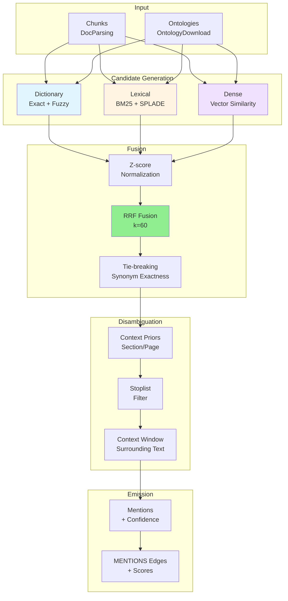

# DocsToKG • KnowledgeGraph (Level-2 Spec)

## Purpose & Non-Goals

**Purpose:** Align document chunks to ontology concepts, detect mentions and triples, validate graph structure with SHACL, and persist a provenance-rich knowledge graph to Neo4j with atomic alias promotion for reproducible builds.

**Scope:**

- Concept mention detection → candidate generation (dictionary, lexical, dense)
- Fusion & disambiguation → RRF scoring + context priors
- Triple extraction → subject/predicate/object with confidence
- Graph persistence → Neo4j nodes/edges with provenance
- SHACL validation → structural constraints + integrity checks
- Atomic promotion → staging → validation → alias switch

**Non-Goals:**

- Embedding generation (upstream: DocParsing)
- Hybrid retrieval (upstream: HybridSearch)
- Answer generation (downstream: RAG Service)
- Ontology reasoning (EL/DL classification, consistency checking)

---

## Neo4j Data Model — v1

### Node Types

```cypher
// Core content nodes
(:Document {
  doc_id: string!,          // Unique document ID
  source: string,           // PDF, HTML, etc.
  title: string,
  year: int,
  doi: string,
  url: string,
  hash: string!,            // SHA-256 of content
  created_at: datetime!
})

(:Chunk {
  uuid: string!,            // Unique chunk UUID (from DocParsing)
  doc_id: string!,          // Parent document ID
  chunk_id: string!,        // Hierarchical chunk ID (e.g., "doc-1#0001")
  start_offset: int,        // Character offset in document
  end_offset: int,
  text: string!,            // Chunk text content
  text_hash: string!,       // SHA-256 of text
  token_len: int!,
  section: string,          // Section heading (if available)
  page: int,                // Page number (if PDF)
  created_at: datetime!
})

// Ontology concept nodes
(:Concept {
  curie: string!,           // Compact URI (e.g., "HP:0001250")
  iri: string!,             // Full IRI
  label: string!,           // Preferred label
  ontology: string!,        // Ontology namespace (e.g., "hp")
  ontology_version: string!, // Version (e.g., "2025-09-15")
  synonyms: list<string>,   // Alternative labels
  definition: string,       // Textual definition
  deprecated: boolean,      // Whether concept is deprecated
  created_at: datetime!
})

// Mention detection nodes
(:Mention {
  id: string!,              // Unique mention ID
  chunk_uuid: string!,      // Parent chunk UUID
  span_start: int!,         // Character offset in chunk text
  span_end: int!,
  surface_form: string!,    // Extracted text span
  confidence: float!,       // Alignment confidence [0, 1]
  method: string!,          // Detection method (dictionary, lexical, dense)
  created_at: datetime!
})

// Relationship extraction nodes
(:Triple {
  id: string!,              // Unique triple ID
  subj_curie: string!,      // Subject concept CURIE
  pred_curie: string!,      // Predicate concept CURIE
  obj_curie: string!,       // Object concept CURIE
  extractor: string!,       // Extraction method (rule, ML, LLM)
  confidence: float!,       // Extraction confidence [0, 1]
  created_at: datetime!
})

// Ontology version tracking
(:OntologyVersion {
  id: string!,              // Ontology namespace + version
  name: string!,            // Human-readable name
  version: string!,         // Version string
  url: string!,             // Download URL
  checksum: string!,        // SHA-256 of ontology file
  format: string!,          // owl, obo, ttl
  downloaded_at: datetime!,
  created_at: datetime!
})

// Provenance tracking
(:Provenance {
  id: string!,              // Unique provenance ID
  run_id: string!,          // Workflow run ID
  stage: string!,           // Processing stage (alignment, extraction)
  config_hash: string!,     // SHA-256 of config
  timestamp: datetime!,
  worker_id: string,        // Worker machine/process ID
  metadata: map             // Additional metadata
})
```

### Relationship Types

```cypher
// Document hierarchy
(Document)-[:HAS_CHUNK]->(Chunk)

// Concept mentions
(Chunk)-[:MENTIONS {
  score: float!,            // Alignment score [0, 1]
  rank: int,                // Rank within chunk (1=best)
  method: string            // Detection method
}]->(Concept)

// Cross-ontology equivalence (optional)
(Concept)-[:SAME_AS {
  source: string,           // Mapping source (manual, SSSOM, etc.)
  confidence: float
}]->(Concept)

// Triple relationships
(Triple)-[:SUBJECT]->(Concept)
(Triple)-[:PREDICATE]->(Concept)
(Triple)-[:OBJECT]->(Concept)

// Evidence for triples
(Chunk)-[:EVIDENCE_FOR {
  score: float,             // Evidence strength
  excerpt: string           // Text snippet supporting triple
}]->(Triple)

// Ontology versioning
(Concept)-[:FROM_ONTOLOGY_VERSION]->(OntologyVersion)

// Provenance tracking
(Provenance)-[:WAS_GENERATED_BY]->(Chunk)
(Provenance)-[:WAS_GENERATED_BY]->(Mention)
(Provenance)-[:WAS_GENERATED_BY]->(Triple)
```

### Indexes & Constraints

```cypher
// Uniqueness constraints
CREATE CONSTRAINT doc_id_unique IF NOT EXISTS 
FOR (d:Document) REQUIRE d.doc_id IS UNIQUE;

CREATE CONSTRAINT chunk_uuid_unique IF NOT EXISTS 
FOR (c:Chunk) REQUIRE c.uuid IS UNIQUE;

CREATE CONSTRAINT concept_curie_unique IF NOT EXISTS 
FOR (c:Concept) REQUIRE c.curie IS UNIQUE;

CREATE CONSTRAINT mention_id_unique IF NOT EXISTS 
FOR (m:Mention) REQUIRE m.id IS UNIQUE;

CREATE CONSTRAINT triple_id_unique IF NOT EXISTS 
FOR (t:Triple) REQUIRE t.id IS UNIQUE;

CREATE CONSTRAINT ontology_version_id_unique IF NOT EXISTS 
FOR (ov:OntologyVersion) REQUIRE ov.id IS UNIQUE;

CREATE CONSTRAINT provenance_id_unique IF NOT EXISTS 
FOR (p:Provenance) REQUIRE p.id IS UNIQUE;

// Lookup indexes
CREATE INDEX concept_label_idx IF NOT EXISTS 
FOR (c:Concept) ON (c.label);

CREATE INDEX concept_ontology_idx IF NOT EXISTS 
FOR (c:Concept) ON (c.ontology);

CREATE INDEX chunk_doc_id_idx IF NOT EXISTS 
FOR (c:Chunk) ON (c.doc_id);

CREATE INDEX mention_chunk_uuid_idx IF NOT EXISTS 
FOR (m:Mention) ON (m.chunk_uuid);

CREATE INDEX triple_subj_idx IF NOT EXISTS 
FOR (t:Triple) ON (t.subj_curie);

CREATE INDEX triple_pred_idx IF NOT EXISTS 
FOR (t:Triple) ON (t.pred_curie);

CREATE INDEX triple_obj_idx IF NOT EXISTS 
FOR (t:Triple) ON (t.obj_curie);

CREATE INDEX provenance_run_id_idx IF NOT EXISTS 
FOR (p:Provenance) ON (p.run_id);

// Full-text search (optional, for free-text queries)
CREATE FULLTEXT INDEX concept_label_fulltext IF NOT EXISTS 
FOR (c:Concept) ON EACH [c.label, c.synonyms];

CREATE FULLTEXT INDEX chunk_text_fulltext IF NOT EXISTS 
FOR (c:Chunk) ON EACH [c.text];
```

---

## Alignment Pipeline

### Overview



### 1. Candidate Generation

**Dictionary Matcher** (Fast path, ~5k chunks/s):

```python
def generate_dictionary_candidates(
    chunk: Chunk,
    concepts: Dict[str, Concept],
    fuzzy_threshold: float = 0.85,
) -> List[Candidate]:
    """Exact + fuzzy string matching against concept labels/synonyms."""
    candidates = []
    
    # Exact matches
    for token_sequence in extract_n_grams(chunk.text, max_n=5):
        normalized = normalize_text(token_sequence)
        if normalized in concepts:
            candidates.append(Candidate(
                concept=concepts[normalized],
                surface_form=token_sequence,
                span=(start, end),
                method="dictionary_exact",
                score=1.0,
            ))
    
    # Fuzzy matches (Levenshtein distance)
    for token_sequence in extract_n_grams(chunk.text, max_n=5):
        normalized = normalize_text(token_sequence)
        for concept_label in concepts.keys():
            similarity = levenshtein_similarity(normalized, concept_label)
            if similarity >= fuzzy_threshold:
                candidates.append(Candidate(
                    concept=concepts[concept_label],
                    surface_form=token_sequence,
                    span=(start, end),
                    method="dictionary_fuzzy",
                    score=similarity,
                ))
    
    return candidates
```

**Lexical Retrieval** (BM25/SPLADE):

```python
def generate_lexical_candidates(
    chunk: Chunk,
    lexical_index: LexicalIndex,
    top_k: int = 50,
) -> List[Candidate]:
    """BM25/SPLADE retrieval against concept definitions."""
    # Query lexical index with chunk text
    bm25_hits = lexical_index.search_bm25(chunk.text, top_k=top_k)
    splade_hits = lexical_index.search_splade(chunk.text, top_k=top_k)
    
    candidates = []
    for hit in bm25_hits:
        candidates.append(Candidate(
            concept=hit.concept,
            surface_form=chunk.text,  # Full chunk as surface form
            span=(0, len(chunk.text)),
            method="bm25",
            score=hit.score,
        ))
    
    for hit in splade_hits:
        candidates.append(Candidate(
            concept=hit.concept,
            surface_form=chunk.text,
            span=(0, len(chunk.text)),
            method="splade",
            score=hit.score,
        ))
    
    return candidates
```

**Dense Vector Similarity** (Optional, GPU-accelerated):

```python
def generate_dense_candidates(
    chunk: Chunk,
    faiss_index: FaissVectorStore,
    concept_embeddings: np.ndarray,
    top_k: int = 50,
) -> List[Candidate]:
    """Dense vector retrieval against concept embeddings."""
    chunk_embedding = embed_text(chunk.text)  # Use same model as concepts
    
    distances, indices = faiss_index.search(chunk_embedding, k=top_k)
    
    candidates = []
    for distance, idx in zip(distances[0], indices[0]):
        candidates.append(Candidate(
            concept=concepts[idx],
            surface_form=chunk.text,
            span=(0, len(chunk.text)),
            method="dense",
            score=1.0 - distance,  # Convert distance to similarity
        ))
    
    return candidates
```

### 2. Fusion & Scoring

**Z-score Normalization** (per-channel):

```python
def normalize_scores(candidates: List[Candidate], method: str) -> List[Candidate]:
    """Z-score normalize scores within each detection method."""
    method_candidates = [c for c in candidates if c.method == method]
    scores = [c.score for c in method_candidates]
    
    mean = np.mean(scores)
    std = np.std(scores)
    
    for candidate in method_candidates:
        candidate.normalized_score = (candidate.score - mean) / (std + 1e-8)
    
    return method_candidates
```

**RRF Fusion** (`k=60`):

```python
def rrf_fusion(
    candidates: List[Candidate],
    channel_weights: Dict[str, float] = {"dictionary": 0.5, "bm25": 0.3, "dense": 0.2},
    k: float = 60.0,
) -> List[Candidate]:
    """Reciprocal Rank Fusion with channel weights."""
    # Group by concept
    concept_candidates = defaultdict(list)
    for candidate in candidates:
        concept_candidates[candidate.concept.curie].append(candidate)
    
    # Compute RRF score per concept
    fused = []
    for curie, cands in concept_candidates.items():
        rrf_score = 0.0
        for candidate in cands:
            weight = channel_weights.get(candidate.method, 0.0)
            rank = candidate.rank  # 1-based rank within method
            rrf_score += weight / (k + rank)
        
        # Take best candidate for this concept
        best_candidate = max(cands, key=lambda c: c.score)
        best_candidate.fused_score = rrf_score
        fused.append(best_candidate)
    
    # Sort by fused score
    fused.sort(key=lambda c: c.fused_score, reverse=True)
    return fused
```

**Tie-breaking** (Synonym Exactness):

```python
def tie_break_synonyms(candidates: List[Candidate]) -> List[Candidate]:
    """Prefer exact synonym matches over fuzzy."""
    for candidate in candidates:
        if candidate.method == "dictionary_exact":
            candidate.tie_break_score = 1.0
        elif candidate.surface_form.lower() in [s.lower() for s in candidate.concept.synonyms]:
            candidate.tie_break_score = 0.9
        else:
            candidate.tie_break_score = candidate.fused_score
    
    candidates.sort(key=lambda c: (c.fused_score, c.tie_break_score), reverse=True)
    return candidates
```

### 3. Disambiguation

**Context Priors** (Section/Page):

```python
def apply_context_priors(
    candidates: List[Candidate],
    chunk: Chunk,
    prior_weights: Dict[str, float] = {},
) -> List[Candidate]:
    """Boost scores based on section/page context."""
    for candidate in candidates:
        prior_boost = 1.0
        
        # Section prior (e.g., "Methods" → boost GO terms)
        if chunk.section and chunk.section.lower() in prior_weights:
            if candidate.concept.ontology in prior_weights[chunk.section.lower()]:
                prior_boost *= 1.2
        
        # Page prior (e.g., early pages → boost paper metadata concepts)
        if chunk.page and chunk.page <= 2:
            if candidate.concept.ontology in ["schema", "foaf"]:
                prior_boost *= 1.1
        
        candidate.prior_score = candidate.fused_score * prior_boost
    
    candidates.sort(key=lambda c: c.prior_score, reverse=True)
    return candidates
```

**Stoplist Filtering**:

```python
def apply_stoplist(
    candidates: List[Candidate],
    stoplist: Set[str] = {"cell", "protein", "gene"},  # Common, ambiguous terms
) -> List[Candidate]:
    """Filter out ambiguous low-information terms."""
    filtered = []
    for candidate in candidates:
        if candidate.surface_form.lower() not in stoplist:
            filtered.append(candidate)
        elif candidate.confidence > 0.9:  # Keep if very confident
            filtered.append(candidate)
    
    return filtered
```

**Context Window** (Surrounding Text):

```python
def apply_context_window(
    candidates: List[Candidate],
    chunk: Chunk,
    window_size: int = 50,  # Characters before/after
) -> List[Candidate]:
    """Boost score if surrounding text supports the concept."""
    for candidate in candidates:
        start, end = candidate.span
        context_before = chunk.text[max(0, start-window_size):start]
        context_after = chunk.text[end:min(len(chunk.text), end+window_size)]
        
        context = context_before + " " + context_after
        
        # Check if context mentions related concepts
        related_score = 0.0
        for synonym in candidate.concept.synonyms:
            if synonym.lower() in context.lower():
                related_score += 0.1
        
        candidate.context_score = candidate.prior_score * (1.0 + related_score)
    
    candidates.sort(key=lambda c: c.context_score, reverse=True)
    return candidates
```

### 4. Mention Emission

```python
def emit_mentions(
    candidates: List[Candidate],
    chunk: Chunk,
    threshold: float = 0.5,
    max_mentions_per_chunk: int = 10,
) -> List[Mention]:
    """Create Mention nodes for top-scoring candidates above threshold."""
    mentions = []
    
    # Filter by threshold
    filtered = [c for c in candidates if c.context_score >= threshold]
    
    # Take top K
    top_candidates = filtered[:max_mentions_per_chunk]
    
    for rank, candidate in enumerate(top_candidates, start=1):
        mention = Mention(
            id=f"{chunk.uuid}:{candidate.span[0]}:{candidate.span[1]}",
            chunk_uuid=chunk.uuid,
            span_start=candidate.span[0],
            span_end=candidate.span[1],
            surface_form=candidate.surface_form,
            confidence=candidate.context_score,
            method=candidate.method,
            created_at=datetime.utcnow(),
        )
        mentions.append(mention)
    
    return mentions
```

---

## Triple Extraction

### Overview

Extract subject-predicate-object triples from chunks where concepts co-occur with high confidence.

### Rule-Based Extraction

```python
def extract_triples_rule_based(
    chunk: Chunk,
    mentions: List[Mention],
    concepts: Dict[str, Concept],
) -> List[Triple]:
    """Extract triples using dependency parsing + templates."""
    triples = []
    
    # Parse dependencies
    doc = spacy_nlp(chunk.text)
    
    for token in doc:
        # Pattern: SUBJ -> VERB -> OBJ
        if token.dep_ == "nsubj":
            subject_span = (token.idx, token.idx + len(token.text))
            subject_mention = find_mention_at_span(mentions, subject_span)
            
            if subject_mention and token.head.pos_ == "VERB":
                for child in token.head.children:
                    if child.dep_ == "dobj":
                        object_span = (child.idx, child.idx + len(child.text))
                        object_mention = find_mention_at_span(mentions, object_span)
                        
                        if object_mention:
                            # Map verb to predicate concept
                            predicate_concept = map_verb_to_predicate(token.head.lemma_)
                            
                            if predicate_concept:
                                triple = Triple(
                                    id=f"{chunk.uuid}:triple:{len(triples)}",
                                    subj_curie=subject_mention.concept.curie,
                                    pred_curie=predicate_concept.curie,
                                    obj_curie=object_mention.concept.curie,
                                    extractor="rule_based",
                                    confidence=min(subject_mention.confidence, object_mention.confidence),
                                    created_at=datetime.utcnow(),
                                )
                                triples.append(triple)
    
    return triples
```

### ML-Based Extraction

```python
def extract_triples_ml(
    chunk: Chunk,
    mentions: List[Mention],
    model: RelationExtractor,
) -> List[Triple]:
    """Extract triples using trained ML model."""
    triples = []
    
    # Generate all pairs of mentions
    for i, subj_mention in enumerate(mentions):
        for obj_mention in mentions[i+1:]:
            # Predict relation between subject and object
            relation_prob, predicate_curie = model.predict(
                text=chunk.text,
                subj_span=subj_mention.span,
                obj_span=obj_mention.span,
            )
            
            if relation_prob > 0.7:  # Threshold
                triple = Triple(
                    id=f"{chunk.uuid}:triple:{len(triples)}",
                    subj_curie=subj_mention.concept.curie,
                    pred_curie=predicate_curie,
                    obj_curie=obj_mention.concept.curie,
                    extractor="ml_model",
                    confidence=relation_prob,
                    created_at=datetime.utcnow(),
                )
                triples.append(triple)
    
    return triples
```

---

## SHACL Validation

### Shape Definitions

**ChunkShape.ttl**:

```turtle
@prefix sh: <http://www.w3.org/ns/shacl#> .
@prefix kg: <http://example.org/kg#> .

kg:ChunkShape
    a sh:NodeShape ;
    sh:targetClass kg:Chunk ;
    sh:property [
        sh:path kg:uuid ;
        sh:minCount 1 ;
        sh:maxCount 1 ;
        sh:datatype xsd:string ;
    ] ;
    sh:property [
        sh:path kg:doc_id ;
        sh:minCount 1 ;
        sh:maxCount 1 ;
        sh:datatype xsd:string ;
    ] ;
    sh:property [
        sh:path kg:text ;
        sh:minCount 1 ;
        sh:maxCount 1 ;
        sh:datatype xsd:string ;
        sh:minLength 1 ;
    ] ;
    sh:property [
        sh:path kg:HAS_CHUNK ;
        sh:class kg:Document ;
        sh:minCount 1 ;  # Every chunk must belong to a document
    ] .
```

**MentionShape.ttl**:

```turtle
kg:MentionShape
    a sh:NodeShape ;
    sh:targetClass kg:Mention ;
    sh:property [
        sh:path kg:chunk_uuid ;
        sh:minCount 1 ;
        sh:maxCount 1 ;
    ] ;
    sh:property [
        sh:path kg:span_start ;
        sh:minCount 1 ;
        sh:datatype xsd:integer ;
        sh:minInclusive 0 ;
    ] ;
    sh:property [
        sh:path kg:span_end ;
        sh:minCount 1 ;
        sh:datatype xsd:integer ;
        sh:minInclusive 0 ;
    ] ;
    sh:sparql [
        sh:message "Mention span must be within chunk text bounds" ;
        sh:select """
            SELECT $this
            WHERE {
                $this kg:chunk_uuid ?chunk_uuid .
                $this kg:span_start ?start .
                $this kg:span_end ?end .
                ?chunk kg:uuid ?chunk_uuid .
                ?chunk kg:text ?text .
                FILTER (?end > STRLEN(?text))
            }
        """ ;
    ] .
```

**TripleShape.ttl**:

```turtle
kg:TripleShape
    a sh:NodeShape ;
    sh:targetClass kg:Triple ;
    sh:property [
        sh:path kg:SUBJECT ;
        sh:class kg:Concept ;
        sh:minCount 1 ;
        sh:maxCount 1 ;
    ] ;
    sh:property [
        sh:path kg:PREDICATE ;
        sh:class kg:Concept ;
        sh:minCount 1 ;
        sh:maxCount 1 ;
    ] ;
    sh:property [
        sh:path kg:OBJECT ;
        sh:class kg:Concept ;
        sh:minCount 1 ;
        sh:maxCount 1 ;
    ] ;
    sh:property [
        sh:path kg:EVIDENCE_FOR ;
        sh:minCount 1 ;  # Every triple must have at least one evidence chunk
        sh:class kg:Chunk ;
    ] .
```

### Validation Implementation

```python
from pyshacl import validate

def validate_graph_shacl(
    graph_rdf: str,  # RDF export of Neo4j graph
    shapes_path: str = "shapes/",
) -> ValidationReport:
    """Validate graph against SHACL shapes."""
    # Load shapes
    shapes_graph = load_turtle_files(shapes_path)
    
    # Validate
    conforms, results_graph, results_text = validate(
        data_graph=graph_rdf,
        shacl_graph=shapes_graph,
        inference='rdfs',
        abort_on_first=False,
    )
    
    report = ValidationReport(
        conforms=conforms,
        violations=[],
        warnings=[],
    )
    
    # Parse violations
    if not conforms:
        for result in parse_validation_results(results_graph):
            report.violations.append(Violation(
                shape=result["focusNode"],
                message=result["message"],
                severity=result["severity"],
                node=result["focusNode"],
                path=result["path"],
            ))
    
    return report
```

---

## Batch Upsert & Atomic Promotion

### KGWriter Architecture

```python
class KGWriter:
    """Batch write nodes/edges to Neo4j with staging → validation → promotion."""
    
    def __init__(self, neo4j_uri: str, credentials: Tuple[str, str]):
        self.driver = GraphDatabase.driver(neo4j_uri, auth=credentials)
        self.staging_db = "kg_staging"
        self.production_db = "kg_prod"
    
    def upsert_batch(
        self,
        documents: List[Document],
        chunks: List[Chunk],
        concepts: List[Concept],
        mentions: List[Mention],
        triples: List[Triple],
        provenance: Provenance,
    ) -> BatchResult:
        """Atomic batch upsert with staging → validation → promotion."""
        with self.driver.session(database=self.staging_db) as session:
            # 1. Write to staging DB
            session.write_transaction(self._upsert_documents, documents)
            session.write_transaction(self._upsert_chunks, chunks)
            session.write_transaction(self._upsert_concepts, concepts)
            session.write_transaction(self._upsert_mentions, mentions)
            session.write_transaction(self._upsert_triples, triples)
            session.write_transaction(self._upsert_provenance, provenance)
        
        # 2. Export staging DB to RDF
        rdf_export = export_neo4j_to_rdf(self.staging_db)
        
        # 3. Validate with SHACL
        validation_report = validate_graph_shacl(rdf_export)
        
        if not validation_report.conforms:
            raise SHACLValidationError(validation_report)
        
        # 4. Promote staging → production (atomic alias switch)
        self._promote_staging_to_production()
        
        return BatchResult(
            documents_written=len(documents),
            chunks_written=len(chunks),
            concepts_written=len(concepts),
            mentions_written=len(mentions),
            triples_written=len(triples),
            validation_passed=True,
        )
    
    def _promote_staging_to_production(self):
        """Atomic alias switch: staging → production."""
        # Neo4j 5+ supports database aliases
        with self.driver.session(database="system") as session:
            session.run("""
                CREATE ALIAS kg FOR DATABASE kg_staging IF NOT EXISTS;
                DROP ALIAS kg IF EXISTS;
                CREATE ALIAS kg FOR DATABASE kg_staging;
            """)
```

### Batch Write Optimization

```python
def _upsert_concepts(tx, concepts: List[Concept]):
    """Batch upsert concepts with UNWIND."""
    query = """
    UNWIND $concepts AS concept
    MERGE (c:Concept {curie: concept.curie})
    SET c += concept
    RETURN count(c) AS concepts_created
    """
    result = tx.run(query, concepts=[c.dict() for c in concepts])
    return result.single()["concepts_created"]

def _upsert_mentions(tx, mentions: List[Mention]):
    """Batch upsert mentions + MENTIONS edges."""
    query = """
    UNWIND $mentions AS mention
    MATCH (chunk:Chunk {uuid: mention.chunk_uuid})
    MATCH (concept:Concept {curie: mention.concept_curie})
    MERGE (m:Mention {id: mention.id})
    SET m += mention
    MERGE (chunk)-[r:MENTIONS {score: mention.confidence}]->(concept)
    RETURN count(m) AS mentions_created
    """
    result = tx.run(query, mentions=[m.dict() for m in mentions])
    return result.single()["mentions_created"]
```

---

## Observability

### Metrics (Prometheus)

```
# Alignment pipeline
kg_alignment_candidates_total{method="dictionary"} 15420
kg_alignment_candidates_total{method="bm25"} 8730
kg_alignment_candidates_total{method="dense"} 4120

kg_alignment_yield_ratio{method="dictionary"} 0.72  # Mentions / Candidates
kg_alignment_yield_ratio{method="bm25"} 0.43
kg_alignment_yield_ratio{method="dense"} 0.31

kg_alignment_latency_seconds_bucket{le="0.1"} 8950
kg_alignment_latency_seconds_count 10000

# SHACL validation
kg_shacl_failures_total{shape="ChunkShape"} 3
kg_shacl_failures_total{shape="MentionShape"} 12
kg_shacl_failures_total{shape="TripleShape"} 5

# Neo4j writes
kg_nodes_written_total{label="Chunk"} 10000
kg_nodes_written_total{label="Mention"} 7200
kg_nodes_written_total{label="Triple"} 1430

kg_edges_written_total{type="MENTIONS"} 7200
kg_edges_written_total{type="EVIDENCE_FOR"} 1430

kg_tx_retries_total{reason="deadlock"} 8
kg_tx_retries_total{reason="timeout"} 2
```

### Structured Logs (JSONL)

```json
{
  "timestamp": "2025-10-23T00:00:00Z",
  "level": "INFO",
  "event": "alignment_complete",
  "run_id": "01J...",
  "chunks_processed": 10000,
  "mentions_emitted": 7200,
  "triples_extracted": 1430,
  "duration_s": 182.4,
  "chunks_per_sec": 54.8,
  "methods": {
    "dictionary": {"candidates": 15420, "yield": 0.72},
    "bm25": {"candidates": 8730, "yield": 0.43},
    "dense": {"candidates": 4120, "yield": 0.31}
  }
}
```

```json
{
  "timestamp": "2025-10-23T00:00:00Z",
  "level": "ERROR",
  "event": "shacl_validation_failure",
  "run_id": "01J...",
  "shape": "MentionShape",
  "violation_count": 12,
  "failing_examples": [
    {
      "node": "mention:chunk-1#0:10",
      "message": "Mention span must be within chunk text bounds",
      "span_end": 512,
      "chunk_text_length": 480
    }
  ]
}
```

---

## Performance Budgets

| Operation | Target | Notes |
|-----------|--------|-------|
| Dictionary alignment | ≥5k chunks/s | Exact + fuzzy matching, single-threaded |
| Lexical alignment | ≥1k chunks/s | BM25/SPLADE retrieval, CPU-bound |
| Dense alignment | ≥500 chunks/s | GPU-accelerated FAISS search |
| RRF fusion | ≥10k candidates/s | In-memory scoring |
| Neo4j writes (nodes) | ≥50k nodes/s | Batch UNWIND, single transaction |
| Neo4j writes (edges) | ≥100k edges/s | Batch UNWIND, single transaction |
| SHACL validation | ≤30s | For 10k nodes + 20k edges |
| Alias promotion | ≤5s | Atomic database alias switch |

---

## Failure Modes

| Failure | Detection | Recovery | Degradation |
|---------|-----------|----------|-------------|
| Ontology lockfile mismatch | Hash comparison at startup | Halt build, re-download ontologies | ❌ Fail-fast (reproducibility) |
| Neo4j transaction deadlock | `Neo4jError` exception | Retry with exponential backoff (max 3 retries) | ⚠️ Transient (succeeds after retry) |
| SHACL validation failure | `conforms=False` in report | Log violations, skip alias promotion | ❌ Fail-fast (data integrity) |
| Mention span out of bounds | SHACL `MentionShape` violation | Log failing chunks, quarantine | ⚠️ Degraded (partial graph) |
| Triple without evidence | SHACL `TripleShape` violation | Log failing triples, drop triples | ⚠️ Degraded (fewer triples) |
| Neo4j connection timeout | Connection error | Retry connection, fallback to local Neo4j | ⚠️ Degraded (slower queries) |

---

## Security

### Authentication & Authorization

- **Separate roles**: `kg_writer` (staging DB only), `kg_reader` (production DB only)
- **Credential rotation**: Rotate Neo4j credentials on each alias promotion
- **TLS enforcement**: All Neo4j connections use TLS 1.3+

### Data Protection

- **Encrypted backups**: Neo4j backups encrypted with AES-256
- **Audit logging**: All writes logged with provenance (run_id, config_hash, worker_id)
- **PII handling**: No PII in graph (only document IDs, not content)

### Supply Chain

- **Ontology verification**: Checksums verified before loading
- **SHACL shapes**: Versioned shapes with integrity checks
- **Provenance tracking**: Every node/edge links to `Provenance` node

---

## Test Plan

### Unit Tests

1. **Candidate generation** (`test_candidate_generation`):
   - Dictionary exact/fuzzy matching
   - BM25 retrieval accuracy
   - Dense vector similarity

2. **RRF fusion math** (`test_rrf_fusion`):
   - RRF formula correctness
   - Tie-breaking logic
   - Channel weight application

3. **Disambiguation** (`test_disambiguation`):
   - Context priors (section/page)
   - Stoplist filtering
   - Context window boost

### Integration Tests

4. **SHACL validation** (`test_shacl_shapes`):
   - Load shapes from TTL files
   - Validate passing graphs
   - Detect violations (span out of bounds, missing evidence)

5. **E2E upsert** (`test_kg_upsert_e2e`):
   - Ingest 1000 chunks
   - Generate mentions + triples
   - Write to staging Neo4j
   - Validate with SHACL
   - Promote to production

### Chaos Tests

6. **Neo4j deadlock** (`test_neo4j_deadlock`):
   - Simulate concurrent writes causing deadlock
   - Verify retry logic succeeds

7. **Alias switch failure** (`test_alias_switch_rollback`):
   - Fail alias promotion mid-operation
   - Verify production DB unchanged

---

## Acceptance Criteria

- ✅ Align 10k chunks in <3 minutes (dictionary + lexical)
- ✅ Generate ≥50% mention yield (mentions / candidates)
- ✅ Extract ≥10% triple yield (triples / mention pairs)
- ✅ Zero SHACL violations on valid input data
- ✅ Neo4j writes ≥50k nodes/s, ≥100k edges/s
- ✅ Alias promotion atomic (all-or-nothing)
- ✅ Provenance tracking on every node/edge
- ✅ All 7 tests passing (unit + integration + chaos)
