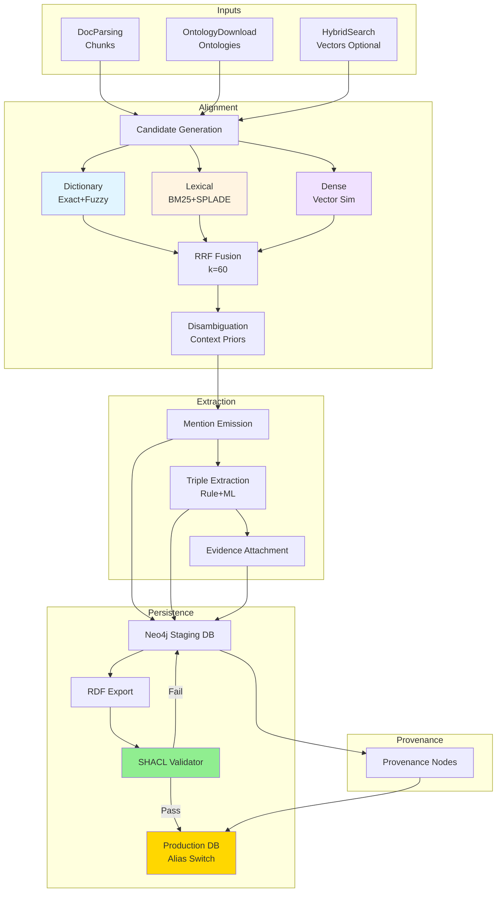
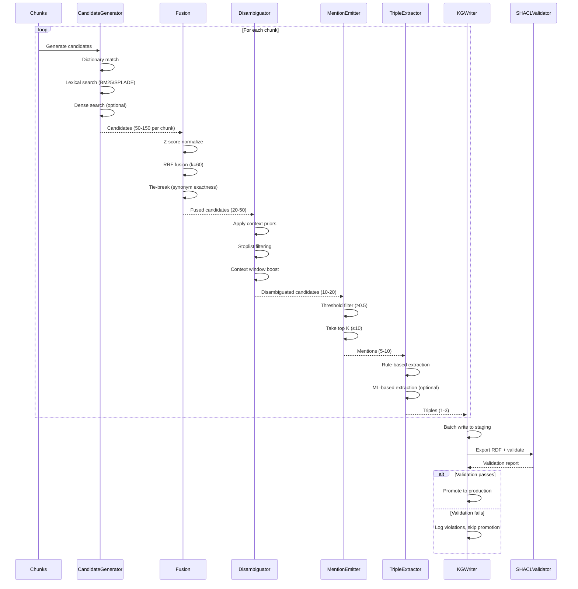
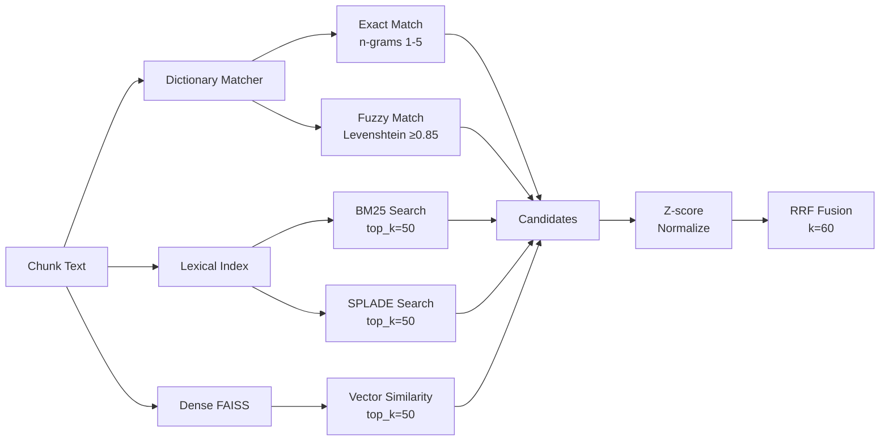

# DocsToKG • KnowledgeGraph — Subsystem Architecture

## Purpose & Scope

**Purpose:** Align document chunks to ontology concepts, detect entity mentions and extract relationships, validate graph structure with SHACL, and persist a provenance-rich knowledge graph to Neo4j with atomic promotion for reproducible, queryable knowledge bases.

**Scope:**

- **Concept Alignment**: Dictionary, lexical (BM25/SPLADE), and dense (vector similarity) candidate generation → RRF fusion → disambiguation → mention emission
- **Triple Extraction**: Rule-based (dependency parsing) and ML-based (relation extraction models) triple detection with evidence attachment
- **Graph Persistence**: Batch write to Neo4j staging database with UNWIND optimization
- **SHACL Validation**: Structural validation (span bounds, evidence links, provenance) before promotion
- **Atomic Promotion**: Staging → validation → production alias switch (all-or-nothing)
- **Provenance Tracking**: Every node/edge linked to run_id, config_hash, worker_id

**Boundaries:**

- **Upstream**: DocParsing provides chunks (JSONL), HybridSearch provides vectors, OntologyDownload provides ontologies
- **Downstream**: RAG Service queries knowledge graph for concept expansion and grounding
- **Out of scope**: Embedding generation, ontology reasoning (EL/DL), SPARQL endpoints, graph analytics

---

## Overall Architecture



**Key Components:**

1. **CandidateGenerator**: Dictionary/lexical/dense matchers for concept detection
2. **AlignmentFusion**: RRF scorer with disambiguation (context priors, stoplist, context window)
3. **TripleExtractor**: Rule-based (spaCy) and ML-based (relation models) triple detection
4. **KGWriter**: Batch Neo4j writer with staging/validation/promotion workflow
5. **SHACLValidator**: pySHACL-based graph structure validator
6. **ProvenanceTracker**: Provenance node generator linking all writes to run metadata

---

## External Interfaces

### Python API

```python
from DocsToKG.KnowledgeGraph import (
    AlignmentPipeline,
    CandidateGenerator,
    TripleExtractor,
    KGWriter,
    SHACLValidator,
)

# Configuration
config = AlignmentConfig.from_yaml("configs/kg_alignment.yaml")

# Candidate generation
generator = CandidateGenerator(
    ontologies=ontologies,
    lexical_index=lexical_index,
    faiss_index=faiss_index,  # Optional
    config=config,
)

# Alignment pipeline
pipeline = AlignmentPipeline(
    generator=generator,
    triple_extractor=TripleExtractor(config.triple_extraction),
    kg_writer=KGWriter(neo4j_uri, credentials),
    validator=SHACLValidator(shapes_path="shapes/"),
    config=config,
)

# Process batch
report = pipeline.process_batch(
    chunks=chunks,
    provenance=Provenance(
        run_id="01J...",
        stage="alignment",
        config_hash="sha256:...",
    ),
)
```

### CLI (Planned)

```bash
# Align chunks to concepts
kg-align --chunks chunks.jsonl --ontologies ontologies/ --output kg_staging.db --config kg.yaml

# Validate graph
kg-validate --db kg_staging.db --shapes shapes/ --report validation_report.json

# Promote to production
kg-promote --staging kg_staging.db --production kg_prod.db --alias kg
```

---

## Inputs & Outputs

### Inputs

1. **Chunks** (`Data/ChunkedDocTagFiles/*.chunk.jsonl`):

   ```json
   {
     "uuid": "1f3b3c9c-d94a-4b71-8f0c-3b0dd2c4d257",
     "doc_id": "guide-restore",
     "chunk_id": "guide-restore#0001",
     "text": "The Human Phenotype Ontology (HPO) provides a standardized vocabulary for phenotypic abnormalities.",
     "num_tokens": 384,
     "section": "Introduction",
     "page": 1
   }
   ```

2. **Ontologies** (`ontologies/<namespace>/`):
   - OWL/OBO/TTL files from OntologyDownload
   - Lockfile with checksums for reproducibility
   - DuckDB catalog with concept labels/synonyms/definitions

3. **Config** (`configs/kg_alignment.yaml`):

   ```yaml
   alignment:
     methods:
       dictionary:
         enabled: true
         fuzzy_threshold: 0.85
         max_n_grams: 5
       lexical:
         enabled: true
         bm25_top_k: 50
         splade_top_k: 50
       dense:
         enabled: false  # Optional, GPU-accelerated
         top_k: 50
     fusion:
       k: 60.0  # RRF constant
       channel_weights:
         dictionary: 0.5
         bm25: 0.3
         splade: 0.2
     disambiguation:
       stoplist: ["cell", "protein", "gene"]
       context_window_size: 50
       section_priors:
         "methods": ["go", "chebi"]
         "results": ["hp", "mondo"]
     thresholds:
       mention_confidence: 0.5
       triple_confidence: 0.7
       max_mentions_per_chunk: 10
   
   triple_extraction:
     enabled: true
     methods:
       rule_based: true
       ml_based: false  # Requires trained model
   
   neo4j:
     uri: "neo4j://localhost:7687"
     staging_db: "kg_staging"
     production_db: "kg_prod"
     batch_size: 1000
   
   shacl:
     shapes_path: "shapes/"
     validation_mode: "strict"  # or "lenient"
   ```

### Outputs

1. **Neo4j Graph** (Production DB):
   - Nodes: Document, Chunk, Concept, Mention, Triple, OntologyVersion, Provenance
   - Edges: HAS_CHUNK, MENTIONS, SUBJECT/PREDICATE/OBJECT, EVIDENCE_FOR, FROM_ONTOLOGY_VERSION, WAS_GENERATED_BY

2. **Alignment Report** (JSON):

   ```json
   {
     "run_id": "01J...",
     "chunks_processed": 10000,
     "mentions_emitted": 7200,
     "triples_extracted": 1430,
     "duration_s": 182.4,
     "chunks_per_sec": 54.8,
     "methods": {
       "dictionary": {"candidates": 15420, "yield": 0.72},
       "bm25": {"candidates": 8730, "yield": 0.43}
     },
     "validation": {
       "conforms": true,
       "violations": []
     },
     "promoted_to_production": true
   }
   ```

3. **SHACL Validation Report** (JSON):

   ```json
   {
     "conforms": false,
     "violations": [
       {
         "shape": "MentionShape",
         "node": "mention:chunk-1#0:10",
         "message": "Mention span must be within chunk text bounds",
         "severity": "Violation",
         "details": {
           "span_end": 512,
           "chunk_text_length": 480
         }
       }
     ]
   }
   ```

---

## Alignment Pipeline

### High-Level Flow



### Detailed Candidate Generation Flow



---

## Key Invariants

1. **Mention Span Integrity**
   - Every mention `span_start` and `span_end` must be within `[0, len(chunk.text)]`
   - SHACL `MentionShape` validates this constraint before promotion

2. **Triple Evidence Requirement**
   - Every triple must have ≥1 `EVIDENCE_FOR` link to a chunk
   - SHACL `TripleShape` enforces this constraint

3. **Provenance Tracking**
   - Every node/edge must link to a `Provenance` node
   - Provenance includes: `run_id`, `stage`, `config_hash`, `timestamp`, `worker_id`

4. **Atomic Promotion**
   - Staging → production is all-or-nothing (database alias switch)
   - Failed validation → no promotion, staging DB preserved for debugging

5. **Ontology Reproducibility**
   - Ontology checksums verified before alignment
   - Lockfile mismatch → halt build (fail-fast)

---

## Observability Integration

### Structured Logging

```python
# Alignment complete
logger.info(
    "alignment_complete",
    run_id="01J...",
    chunks_processed=10000,
    mentions_emitted=7200,
    triples_extracted=1430,
    duration_s=182.4,
    chunks_per_sec=54.8,
)

# SHACL validation failure
logger.error(
    "shacl_validation_failure",
    run_id="01J...",
    shape="MentionShape",
    violation_count=12,
    failing_examples=[...],
)

# Neo4j deadlock retry
logger.warning(
    "neo4j_tx_retry",
    run_id="01J...",
    attempt=2,
    reason="deadlock",
    retry_delay_s=2.0,
)
```

### Metrics

```python
# Alignment pipeline
metrics.inc("kg_alignment_candidates_total", method="dictionary", count=15420)
metrics.inc("kg_alignment_mentions_total", method="dictionary", count=11102)
metrics.observe("kg_alignment_yield_ratio", method="dictionary", value=0.72)

# SHACL validation
metrics.inc("kg_shacl_failures_total", shape="ChunkShape", count=3)
metrics.inc("kg_shacl_failures_total", shape="MentionShape", count=12)

# Neo4j writes
metrics.inc("kg_nodes_written_total", label="Chunk", count=10000)
metrics.inc("kg_edges_written_total", type="MENTIONS", count=7200)
metrics.inc("kg_tx_retries_total", reason="deadlock", count=8)
```

### Traces

```python
with tracer.trace("kg_alignment_batch", {"run_id": run_id, "chunks": len(chunks)}):
    with tracer.trace("candidate_generation"):
        candidates = generator.generate(chunks)
    
    with tracer.trace("rrf_fusion"):
        fused = fusion.fuse(candidates)
    
    with tracer.trace("disambiguation"):
        disambiguated = disambiguator.disambiguate(fused, chunks)
    
    with tracer.trace("mention_emission"):
        mentions = emitter.emit(disambiguated)
    
    with tracer.trace("triple_extraction"):
        triples = extractor.extract(chunks, mentions)
    
    with tracer.trace("neo4j_write"):
        kg_writer.upsert_batch(mentions, triples)
    
    with tracer.trace("shacl_validation"):
        report = validator.validate(neo4j_staging_db)
    
    if report.conforms:
        with tracer.trace("alias_promotion"):
            kg_writer.promote_to_production()
```

---

## Deployment Architectures

### Single-Node Development

```yaml
# Dev config (in-memory, single namespace)
neo4j:
  uri: "bolt://localhost:7687"
  staging_db: "kg_staging"
  production_db: "kg_prod"

alignment:
  methods:
    dictionary: {enabled: true}
    lexical: {enabled: true}
    dense: {enabled: false}  # No GPU
  
triple_extraction:
  enabled: false  # Skip triples for faster dev

shacl:
  validation_mode: "lenient"  # Allow warnings
```

**Limits:** <10k chunks, single ontology namespace, no triples

---

### Enterprise Multi-Ontology

```yaml
# Enterprise config (multi-ontology, staging/prod separation)
neo4j:
  uri: "neo4j://neo4j-cluster:7687"
  staging_db: "kg_staging"
  production_db: "kg_prod"
  batch_size: 5000

alignment:
  methods:
    dictionary: {enabled: true, fuzzy_threshold: 0.85}
    lexical: {enabled: true, bm25_top_k: 80}
    dense: {enabled: false}  # No GPU, CPU-only deployment
  
triple_extraction:
  enabled: true
  methods:
    rule_based: true
    ml_based: false

shacl:
  validation_mode: "strict"

observability:
  prometheus_port: 9090
  structured_logs: true
```

**Limits:** <100k chunks, 5-10 ontology namespaces, staging/prod separation

---

### Cloud GPU-Accelerated

```yaml
# Cloud config (GPU-accelerated dense alignment, ML triple extraction)
neo4j:
  uri: "neo4j+s://cluster.neo4j.io:7687"
  staging_db: "kg_staging"
  production_db: "kg_prod"
  batch_size: 10000
  connection_pool_size: 50

alignment:
  methods:
    dictionary: {enabled: true, fuzzy_threshold: 0.88}
    lexical: {enabled: true, bm25_top_k: 100, splade_top_k: 100}
    dense: {enabled: true, top_k: 100, gpu_device: 0}  # GPU-accelerated
  workers: 8  # Parallel alignment workers
  
triple_extraction:
  enabled: true
  methods:
    rule_based: true
    ml_based: true  # Trained relation extraction model
  model_path: "models/relation_extractor.pt"
  gpu_device: 0

shacl:
  validation_mode: "strict"
  parallel_validation: true  # Parallel shape validation

snapshots:
  storage_backend: "s3"  # Backup to S3
  bucket: "kg-snapshots"
  encryption: "AES-256"

observability:
  prometheus_port: 9090
  opentelemetry_endpoint: "otel-collector:4317"
  structured_logs_format: "json"
```

**Limits:** <1M chunks, 10-20 ontology namespaces, GPU-accelerated alignment + ML triple extraction

---

## Roadmap

### Phase 1: Foundation (COMPLETE - Design)

- ✅ Neo4j data model v1 (nodes, relationships, constraints)
- ✅ Alignment pipeline (dictionary, lexical, dense)
- ✅ RRF fusion + disambiguation
- ✅ SHACL validation shapes
- ✅ Atomic promotion (staging → production)

### Phase 2: Implementation (Q1 2026)

- ⏳ CandidateGenerator implementation (dictionary + lexical)
- ⏳ AlignmentFusion implementation (RRF + tie-breaking)
- ⏳ KGWriter implementation (batch writes + promotion)
- ⏳ SHACLValidator integration (pySHACL)
- ⏳ Provenance tracking

### Phase 3: Triple Extraction (Q2 2026)

- ⏳ Rule-based triple extraction (spaCy dependency parsing)
- ⏳ ML-based triple extraction (relation extraction models)
- ⏳ Evidence attachment (EVIDENCE_FOR links)
- ⏳ Triple validation (SHACL TripleShape)

### Phase 4: Advanced Features (Q3-Q4 2026)

- ⏳ Cross-ontology alignment (SAME_AS links)
- ⏳ Incremental updates (delta writes)
- ⏳ Query optimization (graph index tuning)
- ⏳ Distributed Neo4j (sharded writes)
