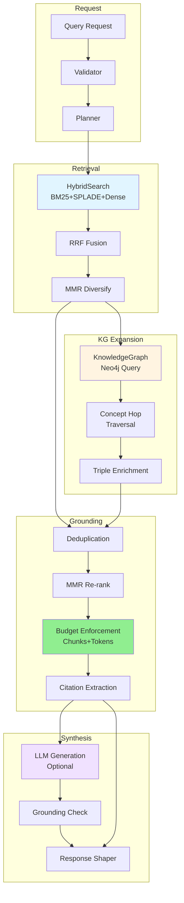
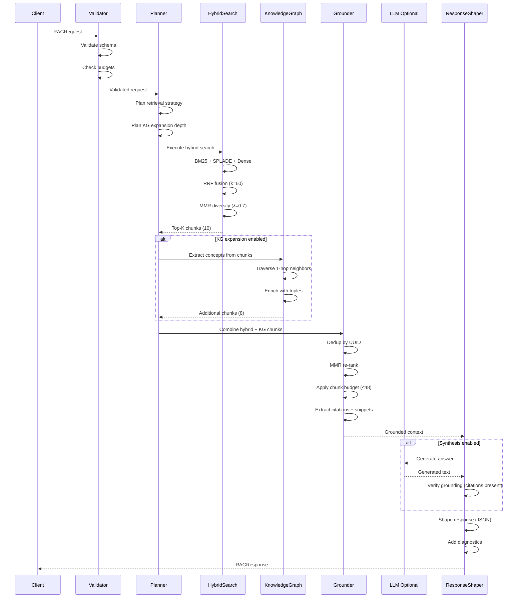

# DocsToKG • RAG Service (Level-2 Spec)

## Purpose & Non-Goals

**Purpose:** Orchestrate hybrid retrieval (HybridSearch) + knowledge graph expansion (KnowledgeGraph) into grounded, citation-rich answers with strict budget enforcement, provenance tracking, and optional LLM synthesis for agent-ready knowledge delivery.

**Scope:**

- Request validation (query, budgets, namespaces)
- Orchestration planning (channel selection, KG expansion depth)
- Hybrid retrieval execution (HybridSearch API)
- KG expansion (concept hop traversal, triple enrichment)
- Grounding strategy (citation extraction, snippet generation)
- Budget enforcement (chunks, tokens, timeouts)
- Optional LLM synthesis (answer generation with citations)
- Response shaping (structured JSON with diagnostics)

**Non-Goals:**

- Training/fine-tuning LLMs (upstream responsibility)
- Agent autonomy/planning (downstream Agent Gateway)
- Vector embedding generation (upstream DocParsing)
- Long-term conversation memory (stateless service)

---

## HTTP API Schemas

### Request Schema

```json
{
  "query": "What are the phenotypic abnormalities associated with HP:0001250?",
  "top_k": 10,
  "namespace": "biomedical",
  "budget": {
    "max_chunks": 48,
    "max_tokens_gen": 1024,
    "timeout_s": 12
  },
  "kg_expansion": {
    "enabled": true,
    "hops": 1,
    "limit": 32,
    "concept_types": ["hp", "mondo"]
  },
  "synthesis": {
    "enabled": false,
    "model": "gpt-4o-mini",
    "temperature": 0.0,
    "system_prompt": "You are a biomedical expert. Answer based only on the provided context."
  },
  "diagnostics": true,
  "cache_key": null
}
```

**Fields:**

- `query` (string, required): Natural language question
- `top_k` (int, default=10): Initial retrieval size before KG expansion
- `namespace` (string, default="default"): HybridSearch namespace
- `budget.max_chunks` (int, default=48): Max chunks in final context
- `budget.max_tokens_gen` (int, default=0): Max tokens for LLM generation (0=no synthesis)
- `budget.timeout_s` (float, default=12): Total request timeout
- `kg_expansion.enabled` (bool, default=true): Enable KG concept expansion
- `kg_expansion.hops` (int, default=1): Max graph hops from retrieved concepts
- `kg_expansion.limit` (int, default=32): Max additional chunks from KG
- `kg_expansion.concept_types` (list, optional): Filter concept types (e.g., ["hp", "mondo"])
- `synthesis.enabled` (bool, default=false): Generate answer with LLM
- `synthesis.model` (string, default="gpt-4o-mini"): LLM model name
- `synthesis.temperature` (float, default=0.0): LLM temperature
- `synthesis.system_prompt` (string, optional): Custom system prompt
- `diagnostics` (bool, default=true): Include timing/budget diagnostics
- `cache_key` (string, optional): Deterministic cache key for idempotent requests

### Response Schema

```json
{
  "answer": "Seizures (HP:0001250) are associated with various phenotypic abnormalities including intellectual disability (HP:0001249), delayed speech development (HP:0000750), and microcephaly (HP:0000252).",
  "citations": [
    {
      "doc_id": "PMC8765432",
      "uuid": "1f3b3c9c-d94a-4b71-8f0c-3b0dd2c4d257",
      "chunk_id": "PMC8765432#0042",
      "page": 3,
      "score": 0.87,
      "snippet": "Patients with seizures (HP:0001250) commonly exhibit intellectual disability...",
      "source": "hybrid",
      "rank": 1,
      "concepts_mentioned": ["HP:0001250", "HP:0001249"],
      "provenance": {
        "run_id": "01J...",
        "retrieved_at": "2025-10-23T00:00:00Z"
      }
    },
    {
      "doc_id": "PMC7654321",
      "uuid": "2a4d5e6f-8b9c-4d71-9e0f-4c1ee3d5e368",
      "chunk_id": "PMC7654321#0015",
      "page": 1,
      "score": 0.76,
      "snippet": "Microcephaly (HP:0000252) has been observed in 45% of patients with seizure disorders...",
      "source": "kg_expansion",
      "rank": 2,
      "concepts_mentioned": ["HP:0000252", "HP:0001250"],
      "kg_path": ["HP:0001250", "MONDO:0005027", "HP:0000252"],
      "provenance": {
        "run_id": "01J...",
        "retrieved_at": "2025-10-23T00:00:00Z"
      }
    }
  ],
  "diagnostics": {
    "timings_ms": {
      "validation": 2.1,
      "hybrid_retrieval": 45.3,
      "kg_expansion": 23.7,
      "dedup_mmr": 8.4,
      "citation_extraction": 12.5,
      "llm_synthesis": 0,
      "total": 92.3
    },
    "channels": {
      "bm25": {"candidates": 80, "selected": 4},
      "splade": {"candidates": 80, "selected": 3},
      "dense": {"candidates": 60, "selected": 3}
    },
    "kg_stats": {
      "concepts_expanded": 12,
      "hops_executed": 1,
      "chunks_added": 8,
      "triples_traversed": 24
    },
    "fusion": {
      "method": "RRF+MMR",
      "k": 60,
      "lambda": 0.7
    },
    "budget_used": {
      "chunks": 18,
      "tokens_context": 14234,
      "tokens_gen": 0
    },
    "budget_limits": {
      "chunks": 48,
      "tokens_gen": 0,
      "timeout_s": 12
    },
    "degraded": false,
    "degraded_reasons": [],
    "cache_hit": false
  },
  "metadata": {
    "namespace": "biomedical",
    "top_k": 10,
    "kg_expansion_enabled": true,
    "synthesis_enabled": false
  }
}
```

---

## Orchestration Flow

### High-Level Pipeline



### Detailed Sequence



---

## Orchestration Stages

### 1. Request Validation

```python
def validate_request(request: RAGRequest) -> ValidationReport:
    """Validate request schema and budgets."""
    errors = []
    
    # Schema validation
    if not request.query or len(request.query) < 3:
        errors.append("query must be at least 3 characters")
    
    # Budget validation
    if request.budget.max_chunks < 1 or request.budget.max_chunks > 100:
        errors.append("max_chunks must be in [1, 100]")
    
    if request.budget.max_tokens_gen < 0 or request.budget.max_tokens_gen > 4096:
        errors.append("max_tokens_gen must be in [0, 4096]")
    
    if request.budget.timeout_s < 1 or request.budget.timeout_s > 60:
        errors.append("timeout_s must be in [1, 60]")
    
    # KG expansion validation
    if request.kg_expansion.enabled:
        if request.kg_expansion.hops < 1 or request.kg_expansion.hops > 3:
            errors.append("kg_expansion.hops must be in [1, 3]")
        
        if request.kg_expansion.limit < 0 or request.kg_expansion.limit > 100:
            errors.append("kg_expansion.limit must be in [0, 100]")
    
    # Synthesis validation
    if request.synthesis.enabled:
        if request.budget.max_tokens_gen == 0:
            errors.append("max_tokens_gen must be > 0 when synthesis enabled")
    
    return ValidationReport(
        valid=len(errors) == 0,
        errors=errors,
    )
```

### 2. Query Planning

```python
def plan_retrieval(request: RAGRequest) -> RetrievalPlan:
    """Plan retrieval strategy based on request."""
    plan = RetrievalPlan(
        # Hybrid retrieval
        hybrid_top_k=request.top_k,
        hybrid_namespace=request.namespace,
        hybrid_diversification=True,
        
        # KG expansion
        kg_enabled=request.kg_expansion.enabled,
        kg_hops=request.kg_expansion.hops,
        kg_limit=request.kg_expansion.limit,
        kg_concept_types=request.kg_expansion.concept_types,
        
        # Budget allocation
        budget_chunks=request.budget.max_chunks,
        budget_tokens_gen=request.budget.max_tokens_gen,
        budget_timeout=request.budget.timeout_s,
        
        # Synthesis
        synthesis_enabled=request.synthesis.enabled,
        synthesis_model=request.synthesis.model,
        synthesis_temperature=request.synthesis.temperature,
    )
    
    return plan
```

### 3. Hybrid Retrieval

```python
def execute_hybrid_retrieval(
    plan: RetrievalPlan,
    hybrid_search: HybridSearchService,
) -> List[Chunk]:
    """Execute hybrid search."""
    response = hybrid_search.search(
        HybridSearchRequest(
            query=plan.query,
            namespace=plan.hybrid_namespace,
            page_size=plan.hybrid_top_k,
            diversification=plan.hybrid_diversification,
            diagnostics=True,
        )
    )
    
    chunks = []
    for result in response.results:
        chunk = Chunk(
            doc_id=result.doc_id,
            chunk_id=result.chunk_id,
            uuid=result.vector_id,
            text=result.text,
            score=result.score,
            rank=result.fused_rank,
            source="hybrid",
            diagnostics=result.diagnostics,
        )
        chunks.append(chunk)
    
    return chunks
```

### 4. KG Expansion

```python
def expand_via_knowledge_graph(
    chunks: List[Chunk],
    plan: RetrievalPlan,
    kg: KnowledgeGraphService,
) -> List[Chunk]:
    """Expand chunks via KG concept traversal."""
    if not plan.kg_enabled:
        return []
    
    # Extract concepts mentioned in retrieved chunks
    concepts = []
    for chunk in chunks:
        # Query KG for concepts in this chunk
        chunk_concepts = kg.extract_concepts(chunk.uuid)
        concepts.extend(chunk_concepts)
    
    # Deduplicate concepts
    unique_concepts = list(set([c.curie for c in concepts]))
    
    # Traverse KG graph (1-hop neighbors)
    expanded_chunks = []
    for concept in unique_concepts:
        # Get neighbors via MENTIONS relationship
        neighbors = kg.traverse_concepts(
            concept_curie=concept,
            hops=plan.kg_hops,
            limit=plan.kg_limit,
            concept_types=plan.kg_concept_types,
        )
        
        for neighbor in neighbors:
            # Get chunks that mention this neighbor concept
            neighbor_chunks = kg.get_chunks_for_concept(neighbor.curie)
            
            for nc in neighbor_chunks:
                expanded_chunk = Chunk(
                    doc_id=nc.doc_id,
                    chunk_id=nc.chunk_id,
                    uuid=nc.uuid,
                    text=nc.text,
                    score=nc.score * 0.8,  # Discount KG-expanded chunks
                    rank=len(expanded_chunks) + 1,
                    source="kg_expansion",
                    kg_path=[concept, neighbor.curie],
                    concepts_mentioned=[neighbor.curie],
                )
                expanded_chunks.append(expanded_chunk)
    
    # Limit KG expansion
    expanded_chunks = expanded_chunks[:plan.kg_limit]
    
    return expanded_chunks
```

### 5. Grounding Strategy

**Deduplication:**

```python
def deduplicate_chunks(chunks: List[Chunk]) -> List[Chunk]:
    """Remove duplicate chunks by UUID."""
    seen_uuids = set()
    deduped = []
    
    for chunk in chunks:
        if chunk.uuid not in seen_uuids:
            seen_uuids.add(chunk.uuid)
            deduped.append(chunk)
    
    return deduped
```

**MMR Re-ranking:**

```python
def mmr_rerank(
    chunks: List[Chunk],
    query_embedding: np.ndarray,
    lambda_param: float = 0.7,
) -> List[Chunk]:
    """Apply MMR diversification to combined chunks."""
    selected = []
    candidates = chunks.copy()
    
    while candidates and len(selected) < len(chunks):
        mmr_scores = []
        for candidate in candidates:
            # Relevance to query
            relevance = cosine_similarity(query_embedding, candidate.embedding)
            
            # Max similarity to already selected
            if selected:
                max_sim = max([
                    cosine_similarity(candidate.embedding, s.embedding)
                    for s in selected
                ])
            else:
                max_sim = 0
            
            # MMR score
            mmr_score = lambda_param * relevance - (1 - lambda_param) * max_sim
            mmr_scores.append((mmr_score, candidate))
        
        # Select best MMR score
        mmr_scores.sort(key=lambda x: x[0], reverse=True)
        best_candidate = mmr_scores[0][1]
        selected.append(best_candidate)
        candidates.remove(best_candidate)
    
    return selected
```

**Budget Enforcement:**

```python
def enforce_budget(
    chunks: List[Chunk],
    budget: Budget,
) -> List[Chunk]:
    """Apply chunk and token budgets."""
    # Chunk budget
    chunks = chunks[:budget.max_chunks]
    
    # Token budget (if synthesis enabled)
    if budget.max_tokens_gen > 0:
        total_tokens = 0
        budgeted_chunks = []
        
        for chunk in chunks:
            chunk_tokens = estimate_tokens(chunk.text)
            if total_tokens + chunk_tokens <= budget.max_tokens_context:
                budgeted_chunks.append(chunk)
                total_tokens += chunk_tokens
            else:
                break
        
        chunks = budgeted_chunks
    
    return chunks
```

**Citation Extraction:**

```python
def extract_citations(
    chunks: List[Chunk],
    max_snippet_chars: int = 800,
) -> List[Citation]:
    """Extract citations with snippets."""
    citations = []
    
    for rank, chunk in enumerate(chunks, start=1):
        # Extract snippet (truncate if needed)
        snippet = chunk.text[:max_snippet_chars]
        if len(chunk.text) > max_snippet_chars:
            snippet += "..."
        
        citation = Citation(
            doc_id=chunk.doc_id,
            uuid=chunk.uuid,
            chunk_id=chunk.chunk_id,
            page=chunk.page,
            score=chunk.score,
            snippet=snippet,
            source=chunk.source,
            rank=rank,
            concepts_mentioned=chunk.concepts_mentioned,
            kg_path=chunk.kg_path,
            provenance=Provenance(
                run_id=chunk.run_id,
                retrieved_at=datetime.utcnow(),
            ),
        )
        citations.append(citation)
    
    return citations
```

### 6. Optional LLM Synthesis

```python
def synthesize_answer(
    query: str,
    citations: List[Citation],
    config: SynthesisConfig,
) -> str:
    """Generate answer with LLM (optional)."""
    if not config.enabled:
        return ""
    
    # Build context from citations
    context = "\n\n".join([
        f"[{i+1}] (Doc: {c.doc_id}, Score: {c.score:.2f})\n{c.snippet}"
        for i, c in enumerate(citations)
    ])
    
    # Build prompt
    system_prompt = config.system_prompt or """You are an expert assistant. 
Answer the question based ONLY on the provided context. 
Include citation numbers [1], [2], etc. in your answer.
If the context doesn't contain enough information, say so."""
    
    user_prompt = f"""Context:
{context}

Question: {query}

Answer:"""
    
    # Call LLM
    response = openai.ChatCompletion.create(
        model=config.model,
        messages=[
            {"role": "system", "content": system_prompt},
            {"role": "user", "content": user_prompt},
        ],
        temperature=config.temperature,
        max_tokens=config.max_tokens,
    )
    
    answer = response.choices[0].message.content
    
    # Verify grounding (citations present)
    if not verify_citations_present(answer, len(citations)):
        logger.warning("LLM answer missing citations", query=query)
    
    return answer
```

---

## Budget Enforcement

### Budget Types

| Budget Type | Default | Max | Enforcement |
|-------------|---------|-----|-------------|
| `max_chunks` | 48 | 100 | Truncate ranked chunks |
| `max_tokens_gen` | 0 | 4096 | LLM generation limit |
| `timeout_s` | 12 | 60 | Request-level timeout |

### Budget Allocation

```python
class BudgetTracker:
    def __init__(self, budget: Budget):
        self.budget = budget
        self.used_chunks = 0
        self.used_tokens_context = 0
        self.used_tokens_gen = 0
        self.start_time = time.time()
    
    def check_timeout(self):
        elapsed = time.time() - self.start_time
        if elapsed > self.budget.timeout_s:
            raise BudgetTimeoutError(f"Request timeout after {elapsed:.1f}s")
    
    def check_chunks(self, additional_chunks: int):
        if self.used_chunks + additional_chunks > self.budget.max_chunks:
            raise BudgetExceededError(f"Chunk budget exceeded: {self.used_chunks + additional_chunks} > {self.budget.max_chunks}")
    
    def add_chunks(self, count: int):
        self.used_chunks += count
        self.check_timeout()
    
    def add_tokens_context(self, count: int):
        self.used_tokens_context += count
        self.check_timeout()
    
    def add_tokens_gen(self, count: int):
        self.used_tokens_gen += count
        if self.used_tokens_gen > self.budget.max_tokens_gen:
            raise BudgetExceededError(f"Token generation budget exceeded: {self.used_tokens_gen} > {self.budget.max_tokens_gen}")
    
    def summary(self) -> Dict:
        return {
            "chunks": self.used_chunks,
            "tokens_context": self.used_tokens_context,
            "tokens_gen": self.used_tokens_gen,
            "elapsed_s": time.time() - self.start_time,
        }
```

---

## Configuration & Tuning

```yaml
rag:
  # Evidence retrieval
  evidence:
    max_snippet_chars: 800
    min_score_threshold: 0.3
    dedupe_cosine_threshold: 0.95
  
  # Budget defaults
  budgets:
    default_max_chunks: 48
    default_max_tokens_gen: 0  # 0 = no synthesis
    default_timeout_s: 12
    max_allowed_chunks: 100
    max_allowed_tokens_gen: 4096
    max_allowed_timeout_s: 60
  
  # KG expansion
  kg_expansion:
    default_enabled: true
    default_hops: 1
    default_limit: 32
    max_hops: 3
    max_limit: 100
    discount_factor: 0.8  # Score multiplier for KG-expanded chunks
  
  # Synthesis
  synthesis:
    default_enabled: false
    default_model: "gpt-4o-mini"
    default_temperature: 0.0
    default_max_tokens: 1024
    supported_models: ["gpt-4o-mini", "gpt-4o", "claude-3-haiku"]
  
  # Grounding
  grounding:
    strict_citations: true  # Require citations in LLM answers
    min_citation_coverage: 0.7  # Min fraction of context cited
  
  # Caching
  cache:
    enabled: true
    ttl_seconds: 3600
    deterministic_keys: true
```

---

## Observability

### Metrics (Prometheus)

```
# Request counts
rag_requests_total{namespace="biomedical",synthesis="false"} 15420
rag_requests_total{namespace="biomedical",synthesis="true"} 3210

# Latency
rag_request_latency_seconds_bucket{synthesis="false",le="0.1"} 12450
rag_request_latency_seconds_bucket{synthesis="true",le="1.0"} 2890

# Budget usage
rag_budget_chunks_used{namespace="biomedical"} 32
rag_budget_tokens_gen_used{namespace="biomedical"} 0

# KG expansion
rag_kg_concepts_expanded{namespace="biomedical"} 12
rag_kg_chunks_added{namespace="biomedical"} 8

# Degradation
rag_degraded_requests_total{reason="timeout"} 5
rag_degraded_requests_total{reason="missing_snapshot"} 2
```

### Structured Logs (JSONL)

```json
{
  "timestamp": "2025-10-23T00:00:00Z",
  "level": "INFO",
  "event": "rag_request_complete",
  "query": "What are the phenotypic abnormalities...",
  "namespace": "biomedical",
  "timings_ms": {
    "hybrid_retrieval": 45.3,
    "kg_expansion": 23.7,
    "grounding": 12.5,
    "total": 92.3
  },
  "budget_used": {"chunks": 18, "tokens_gen": 0},
  "citations_count": 18,
  "degraded": false
}
```

---

## Performance Budgets

| Operation | Target | Notes |
|-----------|--------|-------|
| Hybrid retrieval | ≤150ms p50 | From HybridSearch SLO |
| KG expansion | ≤50ms p50 | Neo4j query (1-hop) |
| Grounding | ≤30ms p50 | Dedup + MMR + citation extraction |
| LLM synthesis | ≤2s p50 | GPT-4o-mini, 1024 tokens |
| Total (no synthesis) | ≤250ms p50 | Retrieval + grounding |
| Total (with synthesis) | ≤2.5s p50 | Includes LLM call |

---

## Failure Modes

| Failure | Detection | Recovery | Degradation |
|---------|-----------|----------|-------------|
| Timeout (budget) | `elapsed > timeout_s` | Return partial results | ⚠️ Degraded (`degraded=true`, fewer chunks) |
| Missing snapshot | HybridSearch 503 | Skip dense channel | ⚠️ Degraded (lexical-only) |
| KG unavailable | Neo4j connection error | Skip KG expansion | ⚠️ Degraded (hybrid-only) |
| LLM timeout | OpenAI API timeout | Return citations only | ⚠️ Degraded (no synthesis) |
| LLM quota exceeded | OpenAI API 429 | Return citations only | ⚠️ Degraded (no synthesis) |
| Invalid grounding | Citations missing in answer | Log warning, return answer | ⚠️ Warning (citation coverage low) |

---

## Security

### Data Handling

- **Redact snippets in logs**: Snippet content replaced with `<REDACTED>` in production logs
- **Dev-mode reveal**: Flag `RAG_LOG_SNIPPETS=true` enables full logging for debugging
- **No PII in diagnostics**: Diagnostics exclude query text, only include timings/counts

### Grounding Verification

```python
def verify_grounding(answer: str, citations: List[Citation]) -> GroundingReport:
    """Verify LLM answer is grounded in citations."""
    # Extract citation numbers from answer
    cited_numbers = extract_citation_numbers(answer)  # [1, 2, 3]
    
    # Check coverage
    coverage = len(cited_numbers) / len(citations)
    
    # Check for hallucinations (citations not provided)
    invalid_citations = [n for n in cited_numbers if n > len(citations)]
    
    report = GroundingReport(
        cited_count=len(cited_numbers),
        total_citations=len(citations),
        coverage=coverage,
        invalid_citations=invalid_citations,
        grounded=coverage >= 0.7 and len(invalid_citations) == 0,
    )
    
    return report
```

---

## Test Plan

### Unit Tests

1. **Request validation** (`test_request_validation`):
   - Valid requests pass
   - Invalid budgets rejected
   - Invalid KG params rejected

2. **Budget tracking** (`test_budget_tracker`):
   - Chunk budget enforced
   - Token budget enforced
   - Timeout enforced

3. **Citation extraction** (`test_citation_extraction`):
   - Snippets truncated to max length
   - Provenance included
   - Concepts preserved

### Integration Tests

4. **Hybrid + KG integration** (`test_hybrid_kg_integration`):
   - Retrieve 10 chunks from HybridSearch
   - Expand via KG (1-hop)
   - Verify KG chunks added
   - Verify deduplication

5. **Grounding verification** (`test_grounding_verification`):
   - Generate answer with LLM
   - Verify citations present
   - Detect hallucinations (invalid citation numbers)

### Chaos Tests

6. **Timeout handling** (`test_timeout_degradation`):
   - Set timeout=1s
   - Slow HybridSearch response (2s)
   - Verify partial results returned
   - Verify `degraded=true`

7. **LLM failure** (`test_llm_failure_fallback`):
   - Enable synthesis
   - Simulate OpenAI API timeout
   - Verify citations-only response
   - Verify `degraded=true`

---

## Acceptance Criteria

- ✅ Orchestrate HybridSearch + KnowledgeGraph
- ✅ Enforce chunk/token/timeout budgets
- ✅ Extract citations with snippets (≤800 chars)
- ✅ Optional LLM synthesis with grounding verification
- ✅ Request latency p50 ≤250ms (no synthesis), ≤2.5s (with synthesis)
- ✅ Degraded mode on failures (partial results, `degraded=true`)
- ✅ All 7 tests passing (unit + integration + chaos)
