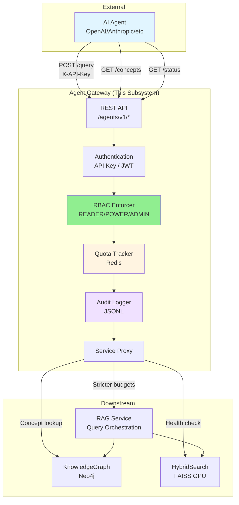
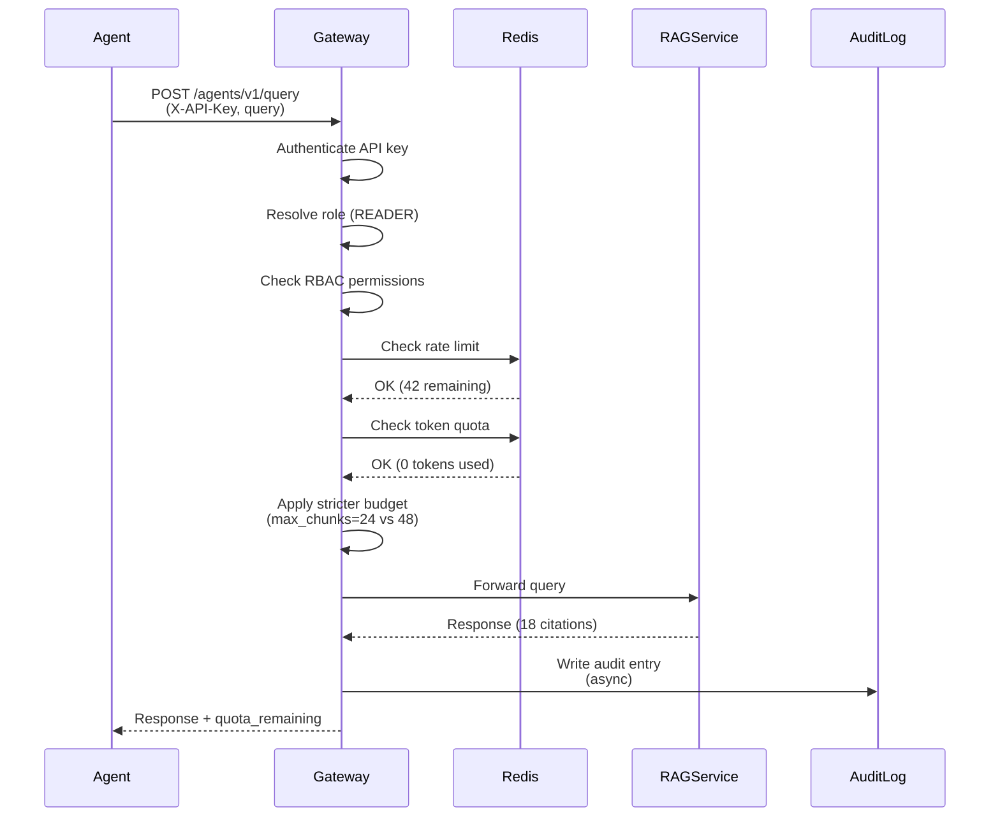
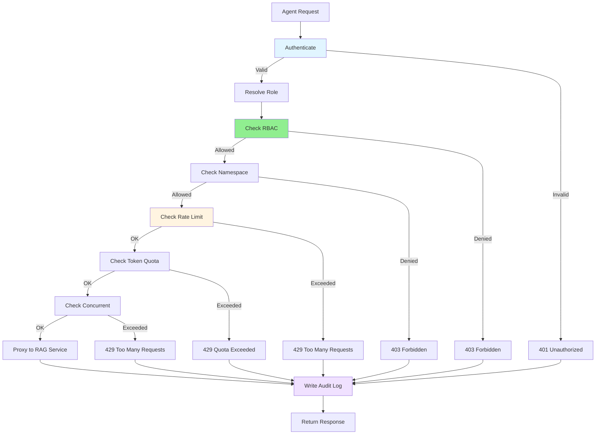
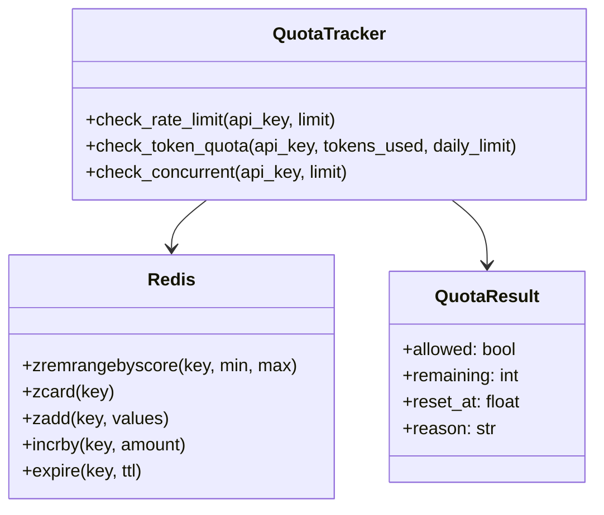

# DocsToKG • Agent Gateway — Subsystem Architecture

## Purpose

Provide a **constrained, auditable API surface** for autonomous agents to query knowledge, lookup concepts, and inspect system status with strict quotas, RBAC enforcement, and comprehensive audit logging for safe AI agent integration.

## Scope

**In-Scope:**

- REST/JSON API for agent consumption
- RBAC enforcement (3 roles: READER, POWER, ADMIN)
- Quota management (rate limits, token budgets, concurrency caps)
- Audit logging (every request, security events)
- Request validation & sanitization
- Degraded mode propagation from downstream services

**Out-of-Scope:**

- Free-form tool execution (agents have read-only access)
- External egress (gateway only proxies to internal DocsToKG services)
- Agent planning/orchestration (agents use gateway as knowledge source)
- Long-term conversation memory (stateless request/response)

---

## Overall Architecture



---

## External Interfaces

### Python API (Agent SDK)

```python
from docstokg_agent_sdk import AgentGatewayClient, Role

# Initialize client
client = AgentGatewayClient(
    base_url="https://gateway.example.com",
    api_key="ak_...",
    namespace="biomedical",
)

# Query RAG
response = client.query(
    query="What are the phenotypic abnormalities associated with HP:0001250?",
    max_chunks=24,
    allow_gen=False,
)
print(f"Citations: {len(response.citations)}")
print(f"Quota remaining: {response.quota_remaining}")

# Lookup concepts
concepts = client.lookup_concepts(
    text="seizures",
    top_k=5,
    ontologies=["hp", "mondo"],
)
for concept in concepts:
    print(f"{concept.curie}: {concept.label}")

# Get system status
status = client.get_status()
print(f"Corpus: {status.corpus_stats.documents} documents")
print(f"Services: {status.services}")
```

### HTTP API

**Endpoints:**

- `POST /agents/v1/query` - RAG query with stricter budgets
- `GET /agents/v1/concepts` - Lookup ontology concepts
- `GET /agents/v1/status` - System health and corpus stats

**Authentication:**

- `X-API-Key: ak_...` (required)
- `X-Trace-ID: ...` (optional, for correlation)

**Example (curl):**

```bash
curl -X POST https://gateway.example.com/agents/v1/query \
  -H "X-API-Key: ak_..." \
  -H "Content-Type: application/json" \
  -d '{
    "query": "What are the phenotypic abnormalities...",
    "namespace": "biomedical",
    "budget": {"max_chunks": 24, "max_tokens_gen": 0},
    "allow_gen": false
  }'
```

---

## Inputs & Outputs

### Inputs

**1. API Requests:**

```json
{
  "query": "What are the phenotypic abnormalities associated with HP:0001250?",
  "namespace": "biomedical",
  "budget": {
    "max_chunks": 24,
    "max_tokens_gen": 0,
    "timeout_s": 8
  },
  "kg_expansion": {
    "enabled": true,
    "hops": 1,
    "limit": 16
  },
  "allow_gen": false,
  "trace_id": "agent-query-12345"
}
```

**2. Configuration (YAML):**

```yaml
agent_gateway:
  rbac:
    roles:
      READER: {max_chunks: 24, max_tokens_per_day: 0, allow_generation: false}
      POWER: {max_chunks: 48, max_tokens_per_day: 100000, allow_generation: true}
  quotas:
    rate_limits:
      READER: {requests_per_minute: 50, max_concurrent: 5}
  audit:
    enabled: true
    log_path: "/var/log/agent-gateway/audit.jsonl"
```

### Outputs

**1. API Response:**

```json
{
  "answer": "",
  "citations": [
    {"doc_id": "PMC8765432", "score": 0.87, "snippet": "..."}
  ],
  "diagnostics": {
    "timings_ms": {"total": 156},
    "budget_used": {"chunks": 18, "tokens_gen": 0},
    "degraded": false
  },
  "quota_remaining": {
    "requests_per_minute": 42,
    "tokens_per_day": 450000
  }
}
```

**2. Audit Logs (JSONL):**

```json
{
  "timestamp": "2025-10-23T00:00:00Z",
  "trace_id": "agent-query-12345",
  "api_key_hash": "sha256:abc...",
  "role": "READER",
  "endpoint": "/agents/v1/query",
  "status_code": 200,
  "quota": {"requests_remaining": 42},
  "security_events": []
}
```

**3. Prometheus Metrics:**

```
gateway_requests_total{endpoint="/agents/v1/query",role="READER",status="200"} 15420
gateway_quota_denials_total{reason="rate_limit"} 42
gateway_request_latency_seconds_bucket{endpoint="/agents/v1/query",le="0.2"} 14850
```

---

## Data Flow

### High-Level Sequence



### Detailed Request Flow



---

## Control Flow

### Request Processing Pipeline

```python
class AgentGatewayService:
    def handle_query(self, request: QueryRequest, api_key: str) -> QueryResponse:
        """Main request processing pipeline."""
        trace_id = request.trace_id or generate_trace_id()
        
        # 1. Authentication
        auth_result = self.authenticator.verify_api_key(api_key)
        if not auth_result.valid:
            self.audit_logger.log_request(trace_id, 401, "invalid_api_key")
            raise Unauthorized("Invalid API key")
        
        # 2. Resolve role
        role = auth_result.role  # READER, POWER, or ADMIN
        
        # 3. RBAC check
        rbac_result = self.rbac_enforcer.check_permission(role, request)
        if not rbac_result.allowed:
            self.audit_logger.log_request(trace_id, 403, rbac_result.reason)
            self.security_logger.log_permission_denied(api_key, rbac_result.reason)
            raise Forbidden(rbac_result.reason)
        
        # 4. Namespace check
        if not self.namespace_policy.check_access(api_key, request.namespace):
            self.audit_logger.log_request(trace_id, 403, "invalid_namespace")
            self.security_logger.log_invalid_namespace(api_key, request.namespace)
            raise Forbidden("Namespace access denied")
        
        # 5. Rate limit check
        rate_result = self.quota_tracker.check_rate_limit(
            api_key, 
            role.requests_per_minute
        )
        if not rate_result.allowed:
            self.audit_logger.log_request(trace_id, 429, rate_result.reason)
            self.security_logger.log_quota_exceeded(api_key, "rate_limit")
            raise TooManyRequests(rate_result.reason)
        
        # 6. Token quota check (if generation enabled)
        if request.allow_gen:
            token_result = self.quota_tracker.check_token_quota(
                api_key,
                request.budget.max_tokens_gen,
                role.max_tokens_per_day
            )
            if not token_result.allowed:
                self.audit_logger.log_request(trace_id, 429, token_result.reason)
                self.security_logger.log_quota_exceeded(api_key, "token_limit")
                raise TooManyRequests(token_result.reason)
        
        # 7. Concurrent request check
        with self.concurrent_limiter.acquire(api_key, role.max_concurrent):
            # 8. Apply stricter budget
            request.budget.max_chunks = min(request.budget.max_chunks, role.max_chunks)
            request.budget.max_tokens_gen = min(
                request.budget.max_tokens_gen, 
                role.max_tokens_per_request
            )
            
            # 9. Proxy to RAG Service
            rag_response = self.rag_client.query(request)
            
            # 10. Write audit log
            self.audit_logger.log_request(
                trace_id=trace_id,
                api_key_hash=hash_api_key(api_key),
                role=role,
                request=request,
                response=rag_response,
                status_code=200,
            )
            
            # 11. Add quota remaining to response
            response = QueryResponse(
                answer=rag_response.answer,
                citations=rag_response.citations,
                diagnostics=rag_response.diagnostics,
                quota_remaining={
                    "requests_per_minute": rate_result.remaining,
                    "tokens_per_day": token_result.remaining if request.allow_gen else 0,
                },
            )
            
            return response
```

---

## RBAC Architecture

### Role Definition

```python
@dataclass
class Role:
    name: str
    max_chunks_per_request: int
    max_tokens_per_request: int
    max_tokens_per_day: int
    allow_generation: bool
    requests_per_minute: int
    max_concurrent: int

ROLES = {
    "READER": Role(
        name="READER",
        max_chunks_per_request=24,
        max_tokens_per_request=0,
        max_tokens_per_day=0,
        allow_generation=False,
        requests_per_minute=50,
        max_concurrent=5,
    ),
    "POWER": Role(
        name="POWER",
        max_chunks_per_request=48,
        max_tokens_per_request=2048,
        max_tokens_per_day=100000,
        allow_generation=True,
        requests_per_minute=200,
        max_concurrent=20,
    ),
    "ADMIN": Role(
        name="ADMIN",
        max_chunks_per_request=100,
        max_tokens_per_request=4096,
        max_tokens_per_day=500000,
        allow_generation=True,
        requests_per_minute=500,
        max_concurrent=50,
    ),
}
```

### RBAC Enforcer

```python
class RBACEnforcer:
    def check_permission(self, role: Role, request: QueryRequest) -> PermissionResult:
        """Check if role can execute request."""
        # Check generation permission
        if request.allow_gen and not role.allow_generation:
            return PermissionResult(
                allowed=False,
                reason=f"{role.name} role cannot use generation (allow_gen=true)"
            )
        
        # Check chunk budget
        if request.budget.max_chunks > role.max_chunks_per_request:
            return PermissionResult(
                allowed=False,
                reason=f"max_chunks {request.budget.max_chunks} exceeds {role.name} limit {role.max_chunks_per_request}"
            )
        
        # Check token budget
        if request.budget.max_tokens_gen > role.max_tokens_per_request:
            return PermissionResult(
                allowed=False,
                reason=f"max_tokens_gen {request.budget.max_tokens_gen} exceeds {role.name} limit {role.max_tokens_per_request}"
            )
        
        return PermissionResult(allowed=True)
```

---

## Quota Management

### Quota Tracker Architecture



### Rate Limiting (Sliding Window)

```python
def check_rate_limit(self, api_key: str, limit: int, window: int = 60) -> QuotaResult:
    """Sliding window rate limit using Redis sorted set."""
    key = f"quota:rate:{api_key}"
    now = time.time()
    
    # Remove old entries (outside window)
    self.redis.zremrangebyscore(key, 0, now - window)
    
    # Count recent requests
    count = self.redis.zcard(key)
    
    if count >= limit:
        return QuotaResult(
            allowed=False,
            remaining=0,
            reset_at=now + window,
            reason=f"Rate limit exceeded: {count}/{limit} per {window}s"
        )
    
    # Add current request timestamp
    self.redis.zadd(key, {str(uuid4()): now})
    self.redis.expire(key, window)
    
    return QuotaResult(
        allowed=True,
        remaining=limit - count - 1,
        reset_at=now + window,
    )
```

---

## Audit Logging

### Audit Logger Architecture

```python
class AuditLogger:
    def __init__(self, log_path: str, redact_queries: bool = False):
        self.log_path = log_path
        self.redact_queries = redact_queries
        self.file = open(log_path, "a", buffering=1)  # Line buffered
    
    def log_request(
        self,
        trace_id: str,
        api_key_hash: str,
        role: Role,
        endpoint: str,
        request: Dict,
        response: Dict,
        status_code: int,
        timings_ms: Dict,
        security_events: List[str] = None,
    ):
        """Write audit log entry (JSONL)."""
        entry = {
            "timestamp": datetime.utcnow().isoformat(),
            "trace_id": trace_id,
            "api_key_hash": api_key_hash,
            "role": role.name,
            "endpoint": endpoint,
            "method": "POST",
            "request": {
                "query_hash": hashlib.sha256(request.query.encode()).hexdigest() if self.redact_queries else request.query,
                "namespace": request.namespace,
                "budget": request.budget,
                "allow_gen": request.allow_gen,
            },
            "response": {
                "status_code": status_code,
                "citations_count": len(response.get("citations", [])),
                "degraded": response.get("diagnostics", {}).get("degraded", False),
            },
            "quota": response.get("quota_remaining", {}),
            "timings_ms": timings_ms,
            "security_events": security_events or [],
        }
        self.file.write(json.dumps(entry) + "\n")
```

---

## Key Invariants

1. **Every request audited**: All requests (success/failure) written to audit log with trace ID.
2. **Quota enforcement**: Rate limits and token quotas enforced before proxying to downstream services.
3. **RBAC before quota**: Role permissions checked before quota checks (fail fast).
4. **Stricter budgets**: Gateway applies stricter defaults than RAG Service (24 vs 48 chunks).
5. **Degraded propagation**: Downstream `degraded=true` passed through to agent with no modification.

---

## Observability Integration

### Structured Logging

```python
logger.info(
    "gateway_request",
    trace_id=trace_id,
    endpoint="/agents/v1/query",
    role="READER",
    status_code=200,
    latency_ms=159.6,
    quota_remaining={"requests": 42},
)
```

### Prometheus Metrics

```python
# Request counts
REQUESTS_TOTAL = Counter(
    "gateway_requests_total",
    "Total agent gateway requests",
    ["endpoint", "role", "status"],
)

# Latency
REQUEST_LATENCY = Histogram(
    "gateway_request_latency_seconds",
    "Agent gateway request latency",
    ["endpoint"],
    buckets=[0.01, 0.05, 0.1, 0.2, 0.5, 1.0],
)

# Quota denials
QUOTA_DENIALS = Counter(
    "gateway_quota_denials_total",
    "Quota denials by reason",
    ["reason"],  # rate_limit, token_limit, concurrent_limit
)
```

### OpenTelemetry Traces

```python
with tracer.start_as_current_span("gateway_query") as span:
    span.set_attribute("trace_id", trace_id)
    span.set_attribute("role", role.name)
    span.set_attribute("namespace", request.namespace)
    
    # ... processing ...
    
    span.set_attribute("status_code", 200)
    span.set_attribute("quota_remaining", rate_result.remaining)
```

---

## Performance Notes

### Gateway Overhead

**Target:** ≤10ms p50 for auth + RBAC + quota checks + audit logging

**Breakdown:**

- API key lookup: 2ms (Redis)
- RBAC check: <1ms (in-memory)
- Rate limit check: 2ms (Redis)
- Token quota check: 2ms (Redis)
- Audit log write: 3ms (async buffered write)

**Total:** ~10ms overhead before proxying to RAG Service

### Quota Check Optimization

Use Redis pipelining to batch quota checks:

```python
pipeline = redis.pipeline()
pipeline.zcard(f"quota:rate:{api_key}")
pipeline.get(f"quota:tokens:{api_key}:{today}")
results = pipeline.execute()  # Single round-trip
```

---

## Deployment Architectures

### 1. Development (Single Instance)

```yaml
services:
  agent-gateway:
    image: docstokg/agent-gateway:latest
    ports: ["8080:8080"]
    environment:
      RBAC_DEFAULT_ROLE: "READER"
      QUOTA_REDIS_URL: "redis://redis:6379/0"
      RAG_SERVICE_URL: "http://rag-service:8000"
      AUDIT_LOG_PATH: "/var/log/gateway/audit.jsonl"
    depends_on: [redis, rag-service]
```

**Limits:**

- Single gateway instance
- 50 req/min per API key (READER)
- Redis on same host

---

### 2. Enterprise (Multi-Tenant)

```yaml
services:
  agent-gateway:
    image: docstokg/agent-gateway:latest
    replicas: 3
    deploy:
      resources:
        limits: {cpus: '2', memory: '4G'}
    environment:
      RBAC_DEFAULT_ROLE: "POWER"
      QUOTA_REDIS_URL: "redis://redis-cluster:6379/0"
      RAG_SERVICE_URL: "http://rag-service:8000"
      AUDIT_LOG_PATH: "/mnt/audit/gateway.jsonl"
      AUDIT_REDACT_QUERIES: "true"
    depends_on: [redis-cluster, rag-service]
```

**Limits:**

- 3 gateway replicas (load balanced)
- Redis cluster (high availability)
- 200 req/min per API key (POWER)
- Audit logs on shared volume

---

### 3. Cloud (Managed Service)

```yaml
agent_gateway:
  deployment:
    type: "kubernetes"
    replicas: 10
    autoscaling:
      enabled: true
      min_replicas: 5
      max_replicas: 20
      target_cpu_percent: 70
  
  resources:
    requests: {cpu: '1', memory: '2G'}
    limits: {cpu: '2', memory: '4G'}
  
  config:
    rbac:
      default_role: "ADMIN"
    quotas:
      rate_limits:
        ADMIN: {requests_per_minute: 500, max_concurrent: 50}
    redis:
      url: "redis://redis-ha:6379/0"
      sentinel: true
    audit:
      log_path: "/var/log/gateway/audit.jsonl"
      retention_days: 365
      redact_queries: true
```

**Limits:**

- 5-20 gateway pods (autoscaling)
- Redis Sentinel (HA)
- 500 req/min per API key (ADMIN)
- Long-term audit retention (365 days)

---

## Roadmap

### Phase 1: Core Gateway (Current)

- ✅ REST API (`/query`, `/concepts`, `/status`)
- ✅ API key authentication
- ✅ RBAC (3 roles)
- ✅ Rate limiting (Redis sliding window)
- ✅ Audit logging (JSONL)

### Phase 2: Enhanced Security

- 🔲 JWT support (org/project claims)
- 🔲 mTLS for downstream services
- 🔲 IP allowlist per API key
- 🔲 Anomaly detection (rate spike alerts)

### Phase 3: Advanced Features

- 🔲 gRPC API (lower latency)
- 🔲 GraphQL API (flexible queries)
- 🔲 Streaming responses (SSE)
- 🔲 Query caching (Redis)

### Phase 4: Observability

- 🔲 Real-time dashboards (Grafana)
- 🔲 Alerting (quota threshold, error rate)
- 🔲 Audit log analytics (query patterns)
- 🔲 Cost attribution per API key

---

## Acceptance Criteria

- ✅ Enforce RBAC (3 roles: READER, POWER, ADMIN)
- ✅ Enforce quotas (rate, tokens, concurrent)
- ✅ Audit log every request (trace ID, role, status, quota)
- ✅ Pass-through degraded mode from downstream services
- ✅ Gateway overhead ≤10ms p50
- ✅ Support 3 deployment architectures (Dev, Enterprise, Cloud)
- ✅ All tests passing (unit + integration + security)
