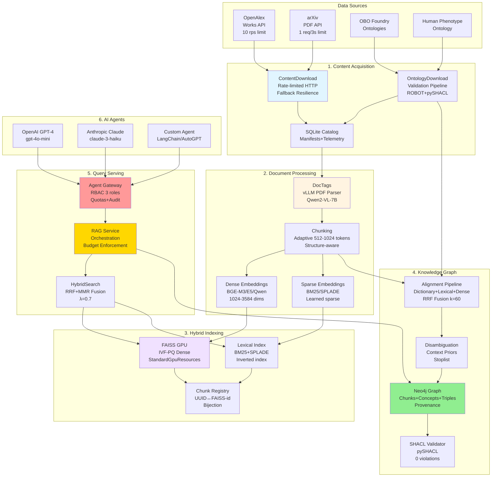
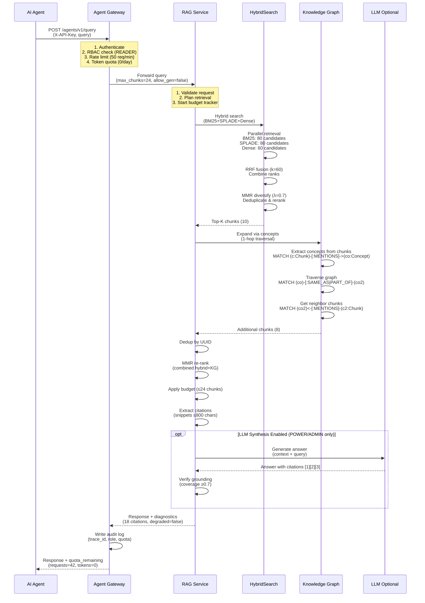

# DocsToKG • Complete North Star Architecture

> **Vision:** Deliver an end-to-end, production-ready system that transforms domain-specific research papers into a queryable knowledge graph with hybrid retrieval (dense + sparse embeddings) and ontology alignment, accessible to AI agents and humans via a secure API gateway with strict quotas and comprehensive observability.

---

## End-to-End System Architecture

### Complete Data Flow



### Query Flow (Detailed)



---

## Model Swapping & Fine-Tuning Strategy

### Embedding Provider Abstraction

DocsToKG uses a **pluggable embedding provider architecture** to enable seamless model swapping without code changes. This is implemented in `src/DocsToKG/DocParsing/embedding_providers/`.

**Provider Protocol:**

```python
class EmbeddingProvider(Protocol):
    """Abstract interface for embedding providers."""
    def embed_batch(self, texts: list[str]) -> np.ndarray:
        """Embed a batch of texts. Returns (batch_size, dimension)."""
        ...
    
    def dimension(self) -> int:
        """Return embedding dimension."""
        ...
    
    def normalize(self) -> bool:
        """Whether to L2-normalize embeddings."""
        ...
    
    def max_batch_size(self) -> int:
        """Max texts per batch."""
        ...
    
    def supports_gpu(self) -> bool:
        """Whether GPU acceleration is available."""
        ...
```

**Built-in Providers:**

- **Dense**: `BgeM3Provider`, `E5Provider`, `QwenProvider`
- **Sparse**: `SpladeProvider`, `BM25Provider`
- **Custom**: Implement `EmbeddingProvider` protocol

**Model Registry (config.yaml):**

```yaml
embedding_providers:
  qwen-dense:
    provider: "qwen"
    model_id: "Qwen/Qwen2.5-Embedding-3.5B-Instruct"
    dimension: 3584
    normalize: true
    gpu: true
    batch_size: 256
  
  bge-dense:
    provider: "bge"
    model_id: "BAAI/bge-m3"
    dimension: 1024
    normalize: true
    gpu: true
    batch_size: 512
  
  splade-sparse:
    provider: "splade"
    model_id: "naver/splade-cocondenser-ensembledistil"
    gpu: true
    batch_size: 128
```

### Model Swap Procedure

**7-Step Process:**

1. **Benchmark new model** on internal eval set (R@10, nDCG@10)

   ```bash
   python scripts/benchmark_model.py \
     --model BAAI/bge-m3 \
     --eval-set data/eval/internal.jsonl \
     --metrics recall@10,ndcg@10
   ```

2. **Run non-regression tests** (no drop vs. baseline)

   ```bash
   pytest tests/eval/test_model_regression.py \
     --baseline qwen-dense \
     --candidate bge-dense \
     --threshold 0.0  # No drop allowed
   ```

3. **Update config** to point to new provider

   ```yaml
   docparsing:
     embed:
       provider: "bge-dense"  # Changed from qwen-dense
   ```

4. **Re-embed corpus** (parallel batch processing)

   ```bash
   docstokg docparse embed \
     --input Data/Chunks/ \
     --output Data/Vectors/ \
     --provider bge-dense \
     --workers 4 \
     --gpu
   ```

5. **Rebuild FAISS index** (GPU-accelerated)

   ```bash
   docstokg hybridsearch ingest \
     --chunks Data/Chunks/ \
     --vectors Data/Vectors/ \
     --namespace biomedical \
     --index-type IVF4096_HNSW32,PQ64
   ```

6. **Validate hybrid uplift** (≥+5% vs. single retriever)

   ```bash
   python scripts/validate_hybrid_uplift.py \
     --namespace biomedical \
     --eval-set data/eval/internal.jsonl \
     --min-uplift 0.05
   ```

7. **Deploy with snapshot** (atomic alias switch)

   ```bash
   docstokg hybridsearch promote-snapshot \
     --namespace biomedical \
     --snapshot 2025-10-23T00:00:00Z
   ```

### Fine-Tuning Approach

**When to Fine-Tune:**

- Domain corpus >100k documents
- Out-of-distribution vocabulary (medical, legal, scientific)
- Baseline retrieval <P50 on MTEB for task family
- Specialized terminology not in pre-training data

**Fine-Tuning Pipeline:**

```python
from docstokg_finetuning import (
    generate_training_pairs,
    train_contrastive,
    evaluate_model,
)

# 1. Generate training pairs from corpus
pairs = generate_training_pairs(
    corpus_path="data/corpus.jsonl",
    method="contriever",  # Dense retrieval baseline
    top_k=5,
    negatives_per_query=10,
    hard_negative_ratio=0.5,
)

# 2. Train with contrastive loss
model = train_contrastive(
    base_model="BAAI/bge-m3",
    train_pairs=pairs.train,
    val_pairs=pairs.val,
    loss="contriever",  # or "simcse", "ance"
    batch_size=256,
    epochs=5,
    lr=2e-5,
    warmup_steps=500,
    fp16=True,
    gpu=True,
)

# 3. Evaluate on internal benchmarks
eval_results = evaluate_model(
    model=model,
    tasks=["retrieval", "reranking", "semantic_similarity"],
    datasets=["beir", "internal_eval"],
)

# 4. Compare to baseline
baseline_ndcg10 = 0.55
assert eval_results.ndcg10 >= baseline_ndcg10 * 1.03  # ≥+3% uplift
assert eval_results.faithfulness >= 0.85  # Maintain RAGAS threshold
assert eval_results.latency_p50_ms <= baseline_latency_ms * 1.10  # ≤+10% latency

# 5. Export model
model.save_pretrained("models/bge-m3-biomedical-finetuned")
```

**Fine-Tuning Acceptance Gates:**

- **In-domain uplift**: ≥+3% nDCG@10 vs. base model
- **BEIR non-regression**: No drop on out-of-domain tasks
- **RAGAS faithfulness**: ≥0.85 (no drop)
- **Latency**: No regression >10% per batch
- **GPU memory**: Fits within 24GB A6000/4090

---

## Docker Packaging & Deployment

### Multi-Container Architecture

**Complete Docker Compose Stack:**

```yaml
version: "3.8"

services:
  # ============================================================
  # Data Acquisition
  # ============================================================
  content-download:
    image: docstokg/content-download:${VERSION:-latest}
    container_name: content-download
    volumes:
      - ./data:/data
      - ./config:/config:ro
    environment:
      OPENALEX_EMAIL: "${OPENALEX_EMAIL}"
      OPENALEX_RATE_LIMIT: "10"  # 10 rps
      ARXIV_DELAY_SECONDS: "3"   # 1 req / 3s
      PYTHONUNBUFFERED: "1"
    networks: [docstokg]
    restart: unless-stopped
  
  ontology-download:
    image: docstokg/ontology-download:${VERSION:-latest}
    container_name: ontology-download
    volumes:
      - ./data/ontologies:/data/ontologies
      - ./config:/config:ro
    environment:
      ROBOT_JAVA_ARGS: "-Xmx4g"
    networks: [docstokg]
    restart: unless-stopped
  
  # ============================================================
  # Document Processing
  # ============================================================
  docparsing:
    image: docstokg/docparsing:${VERSION:-latest}
    container_name: docparsing
    volumes:
      - ./data:/data
      - ./models:/models
    environment:
      VLLM_ENDPOINT: "http://vllm:8000"
      USE_GPU: "true"
      EMBEDDING_PROVIDER: "bge-dense"
      WORKERS: "4"
    networks: [docstokg]
    depends_on: [vllm]
    deploy:
      resources:
        reservations:
          devices:
            - driver: nvidia
              count: 1
              capabilities: [gpu]
    restart: unless-stopped
  
  vllm:
    image: vllm/vllm-openai:latest
    container_name: vllm
    command: >
      --model Qwen/Qwen2-VL-7B-Instruct
      --tensor-parallel-size 1
      --gpu-memory-utilization 0.9
      --max-model-len 32768
      --port 8000
    networks: [docstokg]
    deploy:
      resources:
        reservations:
          devices:
            - driver: nvidia
              count: 1
              capabilities: [gpu]
    restart: unless-stopped
  
  # ============================================================
  # Hybrid Indexing
  # ============================================================
  hybridsearch:
    image: docstokg/hybridsearch:${VERSION:-latest}
    container_name: hybridsearch
    volumes:
      - ./data:/data
      - ./snapshots:/snapshots
    environment:
      FAISS_GPU_ENABLED: "true"
      FAISS_INDEX_TYPE: "IVF4096_HNSW32,PQ64"
      FAISS_NPROBE: "64"
      GPU_MEMORY_LIMIT_GB: "20"
    networks: [docstokg]
    ports: ["8001:8001"]
    deploy:
      resources:
        reservations:
          devices:
            - driver: nvidia
              count: 1
              capabilities: [gpu]
    healthcheck:
      test: ["CMD", "curl", "-f", "http://localhost:8001/health"]
      interval: 30s
      timeout: 10s
      retries: 3
    restart: unless-stopped
  
  # ============================================================
  # Knowledge Graph
  # ============================================================
  neo4j:
    image: neo4j:5.13-enterprise
    container_name: neo4j
    volumes:
      - neo4j-data:/data
      - neo4j-logs:/logs
      - ./plugins:/plugins:ro
    environment:
      NEO4J_AUTH: "neo4j/${NEO4J_PASSWORD}"
      NEO4J_PLUGINS: '["apoc", "graph-data-science"]'
      NEO4J_dbms_memory_heap_initial__size: "4g"
      NEO4J_dbms_memory_heap_max__size: "8g"
      NEO4J_dbms_memory_pagecache_size: "8g"
      NEO4J_ACCEPT_LICENSE_AGREEMENT: "yes"
    networks: [docstokg]
    ports: ["7474:7474", "7687:7687"]
    healthcheck:
      test: ["CMD", "cypher-shell", "-u", "neo4j", "-p", "${NEO4J_PASSWORD}", "RETURN 1"]
      interval: 30s
      timeout: 10s
      retries: 5
    restart: unless-stopped
  
  knowledge-graph:
    image: docstokg/knowledge-graph:${VERSION:-latest}
    container_name: knowledge-graph
    depends_on:
      neo4j:
        condition: service_healthy
    volumes:
      - ./data:/data
      - ./config:/config:ro
    environment:
      NEO4J_URI: "neo4j://neo4j:7687"
      NEO4J_USER: "neo4j"
      NEO4J_PASSWORD: "${NEO4J_PASSWORD}"
      ALIGNMENT_METHOD: "dictionary+lexical+dense"
      RRF_K: "60"
      SHACL_VALIDATE: "true"
    networks: [docstokg]
    restart: unless-stopped
  
  # ============================================================
  # Query Serving
  # ============================================================
  rag-service:
    image: docstokg/rag-service:${VERSION:-latest}
    container_name: rag-service
    depends_on:
      hybridsearch:
        condition: service_healthy
      neo4j:
        condition: service_healthy
    environment:
      HYBRIDSEARCH_URL: "http://hybridsearch:8001"
      NEO4J_URI: "neo4j://neo4j:7687"
      NEO4J_USER: "neo4j"
      NEO4J_PASSWORD: "${NEO4J_PASSWORD}"
      OPENAI_API_KEY: "${OPENAI_API_KEY}"
      DEFAULT_MAX_CHUNKS: "48"
      DEFAULT_TIMEOUT_S: "12"
    networks: [docstokg]
    ports: ["8002:8002"]
    healthcheck:
      test: ["CMD", "curl", "-f", "http://localhost:8002/health"]
      interval: 30s
      timeout: 10s
      retries: 3
    restart: unless-stopped
  
  agent-gateway:
    image: docstokg/agent-gateway:${VERSION:-latest}
    container_name: agent-gateway
    depends_on:
      rag-service:
        condition: service_healthy
      redis:
        condition: service_healthy
    environment:
      RAG_SERVICE_URL: "http://rag-service:8002"
      REDIS_URL: "redis://redis:6379/0"
      JWT_SECRET: "${JWT_SECRET}"
      RBAC_DEFAULT_ROLE: "READER"
      AUDIT_LOG_PATH: "/var/log/gateway/audit.jsonl"
      AUDIT_REDACT_QUERIES: "true"
    volumes:
      - audit-logs:/var/log/gateway
    networks: [docstokg]
    ports: ["8080:8080"]
    healthcheck:
      test: ["CMD", "curl", "-f", "http://localhost:8080/agents/v1/status"]
      interval: 30s
      timeout: 10s
      retries: 3
    restart: unless-stopped
  
  # ============================================================
  # Supporting Services
  # ============================================================
  redis:
    image: redis:7-alpine
    container_name: redis
    volumes:
      - redis-data:/data
    networks: [docstokg]
    healthcheck:
      test: ["CMD", "redis-cli", "ping"]
      interval: 10s
      timeout: 5s
      retries: 3
    restart: unless-stopped
  
  # ============================================================
  # Observability
  # ============================================================
  prometheus:
    image: prom/prometheus:latest
    container_name: prometheus
    volumes:
      - ./monitoring/prometheus.yml:/etc/prometheus/prometheus.yml:ro
      - prometheus-data:/prometheus
    command:
      - '--config.file=/etc/prometheus/prometheus.yml'
      - '--storage.tsdb.path=/prometheus'
      - '--storage.tsdb.retention.time=30d'
    networks: [docstokg]
    ports: ["9090:9090"]
    restart: unless-stopped
  
  grafana:
    image: grafana/grafana:latest
    container_name: grafana
    volumes:
      - ./monitoring/dashboards:/etc/grafana/provisioning/dashboards:ro
      - ./monitoring/datasources.yml:/etc/grafana/provisioning/datasources/datasources.yml:ro
      - grafana-data:/var/lib/grafana
    environment:
      GF_SECURITY_ADMIN_PASSWORD: "${GRAFANA_PASSWORD}"
      GF_USERS_ALLOW_SIGN_UP: "false"
    networks: [docstokg]
    ports: ["3000:3000"]
    depends_on: [prometheus]
    restart: unless-stopped

networks:
  docstokg:
    driver: bridge
    ipam:
      config:
        - subnet: 172.28.0.0/16

volumes:
  neo4j-data:
  neo4j-logs:
  redis-data:
  prometheus-data:
  grafana-data:
  audit-logs:
```

### Container Build Strategy

**Base Image (Dockerfile.base):**

```dockerfile
# Multi-stage build for minimal final image
FROM nvidia/cuda:12.1.0-cudnn8-runtime-ubuntu22.04 AS base

# Install Python 3.13
RUN apt-get update && \
    apt-get install -y \
        python3.13 \
        python3.13-venv \
        python3.13-dev \
        curl \
        ca-certificates && \
    apt-get clean && \
    rm -rf /var/lib/apt/lists/*

# Create symlinks
RUN ln -sf /usr/bin/python3.13 /usr/bin/python3 && \
    ln -sf /usr/bin/python3.13 /usr/bin/python

# Install pip
RUN curl -sS https://bootstrap.pypa.io/get-pip.py | python3

# Install FAISS GPU wheel
COPY ci/wheels/faiss-1.12.0-py3-none-any.whl /tmp/
RUN pip install --no-cache-dir /tmp/faiss-1.12.0-py3-none-any.whl && \
    rm /tmp/faiss-1.12.0-py3-none-any.whl

# Create non-root user
RUN useradd -m -u 1000 -s /bin/bash docstokg && \
    mkdir -p /data /config /models /snapshots && \
    chown -R docstokg:docstokg /data /config /models /snapshots

USER docstokg
WORKDIR /home/docstokg
```

**Service Image (Dockerfile.hybridsearch):**

```dockerfile
FROM docstokg/base:${VERSION} AS builder

# Install application code + deps
COPY --chown=docstokg:docstokg pyproject.toml /home/docstokg/
COPY --chown=docstokg:docstokg src /home/docstokg/src
RUN cd /home/docstokg && pip install --user --no-cache-dir -e .[dev,docs]

# Runtime stage
FROM docstokg/base:${VERSION}

# Copy installed packages from builder
COPY --from=builder --chown=docstokg:docstokg /home/docstokg/.local /home/docstokg/.local
COPY --from=builder --chown=docstokg:docstokg /home/docstokg/src /home/docstokg/src

# Set PATH to include user packages
ENV PATH=/home/docstokg/.local/bin:$PATH
ENV PYTHONPATH=/home/docstokg/src:$PYTHONPATH

# Health check
HEALTHCHECK --interval=30s --timeout=10s --retries=3 \
    CMD curl -f http://localhost:8001/health || exit 1

# Expose port
EXPOSE 8001

# Run service
CMD ["python", "-m", "DocsToKG.HybridSearch.server", "--host", "0.0.0.0", "--port", "8001"]
```

### Security Hardening

**Image Scanning (CI Pipeline):**

```yaml
# .github/workflows/build.yml
name: Build and Scan

on: [push, pull_request]

jobs:
  build-and-scan:
    runs-on: ubuntu-latest
    steps:
      - uses: actions/checkout@v4
      
      - name: Build image
        run: |
          docker build -t docstokg/hybridsearch:${{ github.sha }} \
            -f docker/Dockerfile.hybridsearch .
      
      - name: Generate SBOM
        uses: anchore/sbom-action@v0
        with:
          image: docstokg/hybridsearch:${{ github.sha }}
          format: spdx-json
          output-file: sbom-hybridsearch.json
      
      - name: Scan for vulnerabilities
        uses: anchore/scan-action@v3
        with:
          image: docstokg/hybridsearch:${{ github.sha }}
          fail-build: true
          severity-cutoff: critical
      
      - name: Upload SBOM
        uses: actions/upload-artifact@v4
        with:
          name: sbom
          path: sbom-hybridsearch.json
```

**Release Process:**

```bash
#!/bin/bash
# scripts/release.sh

set -e

VERSION=$1
if [ -z "$VERSION" ]; then
    echo "Usage: $0 <version>"
    exit 1
fi

echo "Building DocsToKG v$VERSION..."

# 1. Build all images
for service in content-download ontology-download docparsing hybridsearch knowledge-graph rag-service agent-gateway; do
    echo "Building $service..."
    docker build \
        -t docstokg/$service:$VERSION \
        -t docstokg/$service:latest \
        -f docker/Dockerfile.$service \
        --build-arg VERSION=$VERSION \
        .
done

# 2. Generate SBOMs
for service in content-download ontology-download docparsing hybridsearch knowledge-graph rag-service agent-gateway; do
    echo "Generating SBOM for $service..."
    syft docstokg/$service:$VERSION -o spdx-json > sbom-$service-$VERSION.json
done

# 3. Scan for vulnerabilities
for service in content-download ontology-download docparsing hybridsearch knowledge-graph rag-service agent-gateway; do
    echo "Scanning $service..."
    grype docstokg/$service:$VERSION --fail-on critical
done

# 4. Push to registry
echo "Pushing images to registry..."
for service in content-download ontology-download docparsing hybridsearch knowledge-graph rag-service agent-gateway; do
    docker push docstokg/$service:$VERSION
    docker push docstokg/$service:latest
done

# 5. Create release bundle
echo "Creating release bundle..."
mkdir -p releases/$VERSION
cp docker-compose.yml releases/$VERSION/
cp sbom-*-$VERSION.json releases/$VERSION/
cp -r monitoring releases/$VERSION/
tar -czf releases/docstokg-$VERSION.tar.gz releases/$VERSION

echo "Release v$VERSION complete!"
echo "Release bundle: releases/docstokg-$VERSION.tar.gz"
```

---

## Production Deployment Checklist

### Pre-Deployment

- [ ] All images scanned (0 critical vulnerabilities)
- [ ] SBOMs generated and attached to release
- [ ] Non-root user in all containers (UID 1000)
- [ ] Secrets in environment variables (never in images)
- [ ] Health checks configured for all services
- [ ] Resource limits defined (CPU, memory, GPU)
- [ ] Persistent volumes configured
- [ ] Network isolation enabled

### Configuration

- [ ] OpenAlex email configured for polite pool
- [ ] arXiv delay set to ≥3 seconds
- [ ] FAISS GPU memory limit configured
- [ ] Neo4j heap/pagecache tuned for dataset size
- [ ] Redis persistence enabled
- [ ] Prometheus retention set (30 days)
- [ ] Grafana admin password changed
- [ ] JWT secret generated (256-bit)
- [ ] Audit log retention policy set (90 days)

### Observability

- [ ] Prometheus scraping all services
- [ ] Grafana dashboards imported
- [ ] SLO alerts configured (multi-burn-rate)
- [ ] PagerDuty/Slack integration tested
- [ ] Audit logs rotating (logrotate)
- [ ] Tracing enabled (OpenTelemetry)

### Security

- [ ] HTTPS enabled for all external endpoints
- [ ] API keys generated for each tenant
- [ ] RBAC roles assigned (READER/POWER/ADMIN)
- [ ] Firewall rules configured (only expose 8080)
- [ ] Network segmentation enabled
- [ ] Container read-only root filesystem
- [ ] Data directories 0640 permissions
- [ ] Secrets rotation tested

### Testing

- [ ] E2E smoke test passing
- [ ] Load test (50 concurrent queries)
- [ ] Fault injection drill (429 handling)
- [ ] Model swap tested (non-regression)
- [ ] Backup/restore tested
- [ ] Failover tested (Redis, Neo4j)

### Documentation

- [ ] README updated with deployment instructions
- [ ] Runbooks created for common issues
- [ ] Architecture diagrams published
- [ ] API documentation generated
- [ ] Change log updated

---

## Success Metrics

### North Star Outcomes

**Latency:**

- Query → answer (no synthesis): p50 ≤250ms, p95 ≤1.2s
- Query → answer (with synthesis): p50 ≤2.5s, p95 ≤6.0s

**Answer Quality:**

- Faithfulness ≥0.85 (RAGAS)
- Answer Relevance ≥0.80 (RAGAS)
- Context Precision ≥0.80 (RAGAS)

**Retrieval Quality:**

- nDCG@10 ≥0.55 on in-domain holdouts
- Hybrid uplift ≥+5% vs. best single retriever
- No regression vs. BM25 baseline on BEIR

**Ontology Alignment:**

- ≥90% of chunks with ≥1 concept edge
- SHACL errors = 0 on release builds

**SLO Compliance:**

- Error budget burn rate < 2%/1h (page)
- <1% false-page days per service

**Security:**

- 0 critical vulnerabilities in production
- All secrets rotated every 90 days
- 100% audit log coverage

---

**Document Owner:** Paul + Collaborators  
**Last Updated:** 2025-10-23  
**Status:** Living design - update alongside code changes
