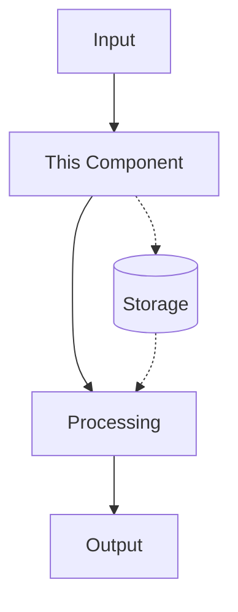

# Component: [COMPONENT_NAME]

## Overview

[Brief description of what this component does and its role in the system]

## Purpose and Responsibilities

- [Primary responsibility 1]
- [Primary responsibility 2]
- [Primary responsibility 3]

## Architecture Context

### Position in System

```
┌─────────────────┐    ┌─────────────────┐
│   [Upstream]    │───▶│ [This Component]│───▶│  [Downstream]   │
└─────────────────┘    └─────────────────┘    └─────────────────┘
```

### Component Diagram



## Dependencies

### Internal Dependencies

- **[Component Name]**: [Description of dependency and data flow]
- **[Component Name]**: [Description of dependency and data flow]

### External Dependencies

- **[Library/Service]**: [Version requirements and purpose]
- **[Library/Service]**: [Version requirements and purpose]

### Configuration Dependencies

- **Environment Variables**: [List required/optional env vars]
- **Configuration Files**: [Path and purpose of config files]

## Data Flow

### Input Data

- **Source**: [Where data comes from]
- **Format**: [Data structure description]
- **Volume**: [Expected data volume/frequency]

### Processing

1. [Step 1 description]
2. [Step 2 description]
3. [Step 3 description]

### Output Data

- **Destination**: [Where processed data goes]
- **Format**: [Output data structure]
- **Volume**: [Expected output volume]

## API Interfaces

### Public Methods/Properties

```python
class ComponentClass:
    """Component class description."""

    def public_method(self, param: str) -> dict:
        """Method description.

        Args:
            param: Parameter description

        Returns:
            Return value description
        """
        pass
```

### Events/Callbacks

- **Event Name**: [Trigger condition and handling]

## Performance Characteristics

- **Throughput**: [Expected requests/second or similar metric]
- **Latency**: [Expected response time]
- **Resource Usage**: [Memory, CPU, storage requirements]
- **Scalability**: [Horizontal/vertical scaling capabilities]

## Error Handling

### Common Error Scenarios

- **[Error Type]**: [When it occurs and impact]
- **[Error Type]**: [When it occurs and impact]

### Recovery Mechanisms

- **[Recovery Strategy]**: [How the component recovers]
- **[Recovery Strategy]**: [How the component recovers]

## Monitoring and Observability

### Key Metrics

- **Metric Name**: [Description and alerting thresholds]
- **Metric Name**: [Description and alerting thresholds]

### Logging

- **Log Levels**: [What gets logged at each level]
- **Structured Fields**: [Key fields in log entries]

### Health Checks

- **Endpoint**: [Health check URL if applicable]
- **Checks**: [What health checks verify]

## Deployment and Operations

### Deployment Requirements

- **Container/Docker**: [Image requirements]
- **Resource Allocation**: [CPU, memory, storage needs]
- **Network**: [Port requirements and connectivity]

### Operational Tasks

- **Startup**: [Initialization sequence]
- **Shutdown**: [Graceful shutdown process]
- **Maintenance**: [Regular maintenance tasks]

## Security Considerations

- **Authentication**: [How component handles auth]
- **Authorization**: [Access control mechanisms]
- **Data Protection**: [Encryption, PII handling]
- **Audit Trail**: [What gets logged for security]

## Testing Strategy

### Unit Tests

- [What units are tested]
- [Test coverage goals]

### Integration Tests

- [Integration points tested]
- [Test scenarios covered]

### Performance Tests

- [Load testing approach]
- [Benchmarking strategy]

## Future Enhancements

### Planned Improvements

- [Enhancement 1 with rationale]
- [Enhancement 2 with rationale]

### Technical Debt

- [Known issues or improvements needed]
- [Refactoring opportunities]
