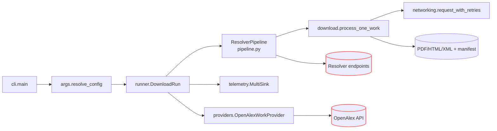

# Agents Guide - ContentDownload

Last updated: 2025-10-19

## Mission & Scope
- **Mission**: Coordinate resolver-driven acquisition of OpenAlex-derived scholarly artifacts into structured manifests with deterministic retry, resume, and telemetry semantics.
- **Scope**: Resolver orchestration, download pipeline, caching/resume semantics, manifest generation, telemetry sinks, polite networking safeguards.
- **Out-of-scope**: Knowledge-graph ingestion, DocTags conversion, ontology-aware fetching, downstream analytics/embedding.

## Quickstart (same as README)
```bash
python -m venv .venv
source .venv/bin/activate
pip install -U pip
pip install -e ".[dev]"
export UNPAYWALL_EMAIL=you@example.org  # polite OpenAlex/Unpaywall contact (optional)
python -m DocsToKG.ContentDownload.cli \
  --topic "machine learning" \
  --year-start 2023 \
  --year-end 2024 \
  --mailto you@example.org \
  --out runs/content \
  --staging \
  --resolver-preset fast \
  --workers 4
```
- Toggle `--dry-run` to exercise resolver coverage without writes; use `--list-only` for manifest logging only.

## Architecture & Flow

- `cli.main()` wires frozen `ResolvedConfig` into `DownloadRun`.
- `DownloadRun.run()` initialises telemetry sinks, resolver pipeline, OpenAlex provider, then iterates works either sequentially or via `ThreadPoolExecutor`.
- `ResolverPipeline.run()` enforces resolver ordering, token buckets, circuit breakers, global URL dedupe, and manifests attempt metadata through `AttemptRecord`.
- Telemetry fan-out (`RunTelemetry`, `MultiSink`) writes JSONL/CSV/SQLite manifests plus summaries used for resume and analytics.

## Storage Layout & Run Outputs
- **Run identifiers**: Each invocation issues a UUID `run_id` stamped onto manifests/summaries and staging directories when `--staging` is used.
- **Content roots**: `DownloadConfig` coordinates sibling `PDF/`, `HTML/`, `XML/` directories. `--content-addressed` adds hashed payload paths + symlinks.
- **Resume caches**: `manifest.jsonl` (+ rotations), `manifest.index.json`, and `manifest.sqlite3` function as a unit; keep them together for resumes.
- **Scratch space**: Streaming writes create `*.part` temp files beside the target until `finalize_candidate_download` promotes them atomically.
- **Artifacts emitted**:
  - `manifest.jsonl` / rotated segments (`--log-rotate`) with `record_type`.
  - `manifest.index.json` URL index for dedupe.
  - `manifest.summary.json`, `manifest.metrics.json`, `manifest.last.csv` quick-glance outputs.
  - `manifest.sqlite3` backing `ManifestUrlIndex` (`SQLITE_SCHEMA_VERSION = 4`).
  - Optional `manifest.csv` when `--log-format csv` or `--log-csv` is set.
  - Artifact directories (`PDF/`, `HTML/`, `XML/`) with HTML text sidecars when extraction enabled.

## CLI & Configuration Surfaces
- CLI selectors: `--topic`/`--topic-id`, `--year-start`, `--year-end`.
- Run controls: `--max`, `--dry-run`, `--list-only`, `--workers`, `--sleep`, `--resume-from`, `--verify-cache-digest`, OpenAlex retry knobs (`--openalex-retry-attempts`, `--openalex-retry-backoff`, `--openalex-max-retry-delay`).
- Resolver controls: `--resolver-config`, `--resolver-order`, `--resolver-preset {fast,broad}`, `--enable-resolver`, `--disable-resolver`, `--max-resolver-attempts`, `--resolver-timeout`, `--concurrent-resolvers`, `--max-concurrent-per-host`, `--domain-min-interval`, `--domain-token-bucket`, `--global-url-dedup`, `--global-url-dedup-cap`, `--head-precheck`, `--accept`.
- Telemetry flags: `--manifest`, `--log-format {jsonl,csv}`, `--log-csv`, `--log-rotate`, `--warm-manifest-cache`.
- Classifier tuning: `--sniff-bytes`, `--min-pdf-bytes`, `--tail-check-bytes`, `--extract-text`.

**Resolver configuration excerpt**
```yaml
# resolvers/config.fast.yaml
resolver_order:
  - openalex
  - unpaywall
  - crossref
max_concurrent_resolvers: 8
max_concurrent_per_host: 4
polite_headers:
  User-Agent: "DocsToKG-Downloader/1.0 (+mailto:you@example.org)"
  Accept: "application/pdf, text/html;q=0.9, */*;q=0.7"
resolver_toggles:
  wayback: false
resolver_min_interval_s:
  unpaywall: 0.5
domain_token_buckets:
  crossref.org:
    rate_per_second: 4
    capacity: 12
    breaker_threshold: 15
    breaker_cooldown: 120
domain_content_rules:
  arxiv.org:
    allowed_types:
      - application/pdf
resolver_circuit_breakers:
  unpaywall:
    failure_threshold: 6
    cooldown_seconds: 90
```
- Unknown keys raise `ValueError`; extend `ResolverConfig` before adding new options.
- Domain rate limits cascade to networking token buckets; resolver toggles override defaults per provider.

## Telemetry, Data Contracts & Error Handling
- Manifest/attempt schemas defined in `telemetry.py` (`MANIFEST_SCHEMA_VERSION = 3`, `SQLITE_SCHEMA_VERSION = 4`); keep `record_type`, `run_id`, classification/reason fields stable.
- `statistics.DownloadStatistics` + `ResolverStats` feed aggregated metrics into `summary.build_summary_record()` (`manifest.metrics.json`).
- Error taxonomy from `errors.py` (`DownloadError`, `NetworkError`, `ContentPolicyError`, `RateLimitError`) surfaces remediation suggestions through `log_download_failure`.
- Reason codes (`core.ReasonCode` e.g. `robots_blocked`, `content_policy_violation`) drive analytics; extend only with coordination.
- Console output (`emit_console_summary`) mirrors JSON summary for human inspection.

## Networking, Rate Limiting & Politeness
- `networking.ThreadLocalSessionFactory` maintains per-thread sessions; call `close_all()` during teardown.
- `request_with_retries()` implements exponential backoff + equal jitter, respecting `Retry-After` and CLI caps.
- Token buckets/circuit breakers defined in `ResolverConfig` throttle host+resolver concurrency; prefer adjusting configs to hard sleeps.
- `download.RobotsCache` enforces robots.txt unless `--ignore-robots`; override only with explicit approval.
- `ConditionalRequestHelper` builds `If-None-Match` / `If-Modified-Since` headers for cache-conscious downloads.
- `statistics.BandwidthTracker` (opt-in) can expose throughput for tuning `--workers`.

## Operational Playbooks
- **Resume interrupted run**: `python -m DocsToKG.ContentDownload.cli --resume-from runs/content/manifest.jsonl --staging --out runs/content`.
- **CSV export**: `python scripts/export_attempts_csv.py runs/content/manifest.jsonl reports/content_attempts.csv`; keep paired SQLite cache nearby.
- **Resolver health audit**: `jq 'select(.record_type=="attempt") | {resolver_name, reason}' runs/content/manifest.jsonl | sort | uniq -c`.
- **Cache hygiene**: delete artifact directory and corresponding `manifest.*`/`manifest.sqlite3` together; regenerate manifests immediately if manual cleanup occurs.
- **Concurrency validation**: run small `--dry-run --log-format jsonl` workloads, inspect `manifest.metrics.json` latency blocks before raising `--workers`.

## Invariants & Safe Change Surfaces
- Leave `ResolvedConfig` frozen; add helper constructors rather than mutating runtime state.
- `DownloadRun.setup_sinks()` must run before pipeline initialisation; telemetry depends on sink readiness.
- Resolver registration centralised in `resolvers/__init__.py`; new resolvers extend `ApiResolverBase`.
- Global URL dedupe depends on `ManifestUrlIndex` schema; bump `SQLITE_SCHEMA_VERSION` with downstream coordination.
- Use `networking` or `pipeline.ResolverConfig` for shared HTTP behaviour changes; avoid bespoke rate limiting.

## Test Matrix & Diagnostics
```bash
ruff check src/DocsToKG/ContentDownload tests/content_download
mypy src/DocsToKG/ContentDownload
pytest -q tests/cli/test_cli_flows.py
pytest -q tests/content_download/test_runner_download_run.py
pytest -q tests/content_download/test_rate_control.py
python -m DocsToKG.ContentDownload.cli --topic "vision" --year-start 2024 --year-end 2024 --max 5 --dry-run --manifest tmp/manifest.jsonl
```
- High-signal suites: `tests/content_download/test_networking.py`, `test_download_execution.py`, `test_runner_download_run.py`, `tests/cli/test_cli_flows.py`.
- Maintain golden fakes under `tests/content_download/fakes/` when altering manifest/telemetry fields.

## Reference Docs
- `src/DocsToKG/ContentDownload/README.md`
- Resolver-specific docs under `src/DocsToKG/ContentDownload/resolvers/`
- Related tools: `tools/manifest_to_index.py`, `scripts/export_attempts_csv.py`
