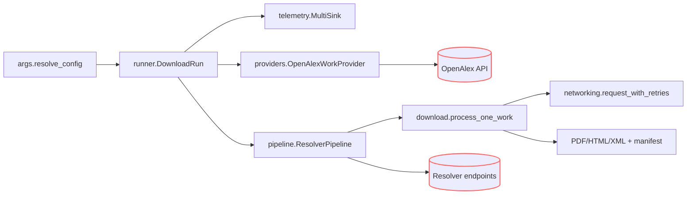

# Agents Guide - ContentDownload

Last updated: 2025-10-18

## Mission & Scope
- Mission: Deliver resilient, high-throughput acquisition of scholarly artifacts from OpenAlex-derived metadata with deterministic manifests, retry semantics, and resumable runs.
- Scope boundary: In-scope—resolver orchestration, download pipeline, caching/resume logic, telemetry sinks, and polite-networking safeguards. Out-of-scope—DocTags conversion, chunking/embedding, ontology-aware fetching, and downstream KG ingestion.

## Architecture & Flow

- `cli.main()` wires argument parsing to `DownloadRun`. `ResolvedConfig` is frozen; helpers prepare filesystem layout, resolver instances, and rate-limit structures.
- `DownloadRun.run()` initialises sinks, the resolver pipeline, the OpenAlex provider, and the thread-local session factory before iterating works sequentially or via `ThreadPoolExecutor`.
- `ResolverPipeline.run()` coordinates resolver ordering, rate limits, token buckets, and dedupe before handing candidates to `download.download_candidate()`.
- Telemetry flows through `RunTelemetry` into JSONL, CSV, SQLite, and summary sinks. Resume reads both JSONL (including rotated segments) and SQLite state.

## Hot Paths & Data Shapes
- Hot paths: `runner.DownloadRun.run()`, `download.process_one_work()`, `pipeline.ResolverPipeline.run()`, `download.download_candidate()`, `networking.request_with_retries()`.
- Core models: `core.WorkArtifact`, `pipeline.DownloadOutcome`, `telemetry.ManifestEntry`, `pipeline.AttemptRecord`.
- Typical payload sizes: PDF 100 KB–10 MB, HTML a few KB–MB, manifest rows ~1 KB. HEAD responses kept small; downloads stream to disk to bound memory.

## Performance Objectives & Baselines
- Targets (tune per provider):
  - Resolver success rate ≥95% on recent OpenAlex topics with default stack.
  - P95 resolver latency <5 s; pipeline enforces jittered backoff when exceeded.
  - Worker failure count stays at 0 for dry-run smoke tests.
- Measurement recipe:
  ```bash
  python -m DocsToKG.ContentDownload.cli --topic "computer vision" --year-start 2024 --year-end 2024 --max 50 --dry-run --manifest tmp/manifest.jsonl
  python -m DocsToKG.ContentDownload.cli --topic "computer vision" --year-start 2024 --year-end 2024 --max 50 --workers 4 --resolver-preset fast --manifest tmp/full-run/manifest.jsonl
  ```
  Inspect `manifest.metrics.json` and `manifest.summary.json` for resolver counts, latency, and reason distributions.

## Profiling & Optimisation Playbook
- CPU profile single-thread run:
  ```bash
  python -m cProfile -m DocsToKG.ContentDownload.cli --topic "ml" --year-start 2024 --year-end 2024 --max 20 --dry-run >/tmp/profile.txt
  ```
- Sample-based profile (install `pyinstrument`):
  ```bash
  pyinstrument -r html -o profile.html -- python -m DocsToKG.ContentDownload.cli --topic "nlp" --year-start 2024 --year-end 2024 --max 20 --workers 4 --dry-run
  ```
- Optimisation levers:
  - Adjust `ResolverConfig.{resolver_min_interval_s,domain_min_interval_s,domain_token_buckets}` to throttle hot hosts without stalling the pipeline.
  - Ensure resolver implementations reuse HTTP sessions and respect `head_precheck` to filter HTML responses quickly.
  - Tweak `DownloadConfig.sniff_bytes`/`tail_check_bytes` when classifier heuristics mislabel payloads (legacy guides may refer to `DownloadOptions`, which now subclasses `DownloadConfig`).
  - Use `--warm-manifest-cache` for large resumes so SQLite indexes load once.

## Complexity & Scalability Guidance
- Work processing is O(number_of_documents). Concurrency is bounded by `workers * max_concurrent_resolvers`; avoid exceeding provider policies even if capacity allows.
- Memory footprint is dominated by active downloads and manifest buffers; streaming writes keep consumption near constant.
- Large-N strategies: split topics/year ranges, enable staging runs for parallel batches, and configure per-domain token buckets to avoid hot-spot throttling.

## I/O, Caching & Concurrency Notes
- Artifact layout: staging runs create `RUN_ID/{PDF,HTML,XML}`. Non-staging reuses `--out` plus sibling HTML/XML directories.
- Resume: `telemetry.load_previous_manifest()` consumes JSONL (including rotated files) and `manifest.sqlite3`. Keep `record_type` fields intact.
- Global URL dedupe hydration only runs when `ResolverConfig.enable_global_url_dedup` is true; `--global-url-dedup-cap` bounds the manifest scan (0 disables the cap) to keep persistent resume state lightweight.
- Robots policies: `download.RobotsCache` respects `robots.txt` unless `--ignore-robots` is set. User agent defaults derive from `ResolverConfig.polite_headers`.
- Concurrency: `ThreadLocalSessionFactory` maintains per-thread sessions; host-level concurrency is gated by semaphores and token buckets.

## Invariants to Preserve
- Keep `ResolvedConfig` frozen; pass new run metadata through helper functions or new dataclass fields with defaults.
- Every manifest row must include `record_type`, `schema_version`, `run_id`, and normalised classifications/reasons.
- `DownloadRun.setup_sinks()` must precede `setup_resolver_pipeline()`; pipeline logging expects fully initialised sinks.
- Resolver registration happens through `resolvers/__init__.py` so toggles/order stay canonical.
- `ManifestUrlIndex` schema (`SQLITE_SCHEMA_VERSION = 4`) and JSONL rotation strategy must stay backwards compatible for resume.

## Preferred Refactor Surfaces
- New resolvers live under `resolvers/` and extend `ApiResolverBase`; register in `resolvers/__init__.py`.
- Shared HTTP/polite behaviour changes belong in `networking.py` or `pipeline.ResolverConfig`.
- Manifest/telemetry tweaks go through `telemetry.py` (update sinks + schema version) and `summary.py`.
- Avoid large-scale rewrites of `DownloadRun` or `ResolverPipeline` without design review—tests exercise nuanced concurrency and telemetry interactions.

## Code Documentation Expectations
- Maintain NAVMAP headers in modules that already include them (`pipeline.py`, `networking.py`, `resolvers/__init__.py`, etc.).
- Exported CLI helpers (`cli.py`, `args.py`) require docstrings describing side effects and return values.
- Update this guide and the README when adding CLI flags, manifest fields, or resolver controls.
- Follow `MODULE_ORGANIZATION_GUIDE.md`, `CODE_ANNOTATION_STANDARDS.md`, and `STYLE_GUIDE.md`.

## Test Matrix & Quality Gates
```bash
ruff check src/DocsToKG/ContentDownload tests/content_download
mypy src/DocsToKG/ContentDownload
pytest -q tests/cli/test_cli_flows.py
pytest -q tests/content_download/test_runner_download_run.py
pytest -q tests/content_download/test_rate_control.py
pytest -q tests/pipeline/test_execution.py -k ResolverPipeline
```
- Golden fixtures: `tests/content_download/fakes/` contains manifest and resolver stubs.
- Stress CI suggestion: nightly `--max 200 --workers 4 --resolver-preset fast --dry-run` covering multiple topics to validate rate limiting and resume.

## Failure Modes & Debug Hints
| Symptom | Likely cause | Quick checks |
|---|---|---|
| Repeated HTTP 429/503 | Domain throttle misconfigured | Inspect logs for `retry_after`, adjust `domain_token_buckets` or `domain_min_interval_s`. |
| Manifest gaps | Exceptions before telemetry flush | Ensure `RunTelemetry.record_pipeline_result` is invoked; check `DownloadRun` worker error logs. |
| Duplicate downloads | Missing URL normalisation or disabled dedupe | Confirm `ResolverConfig.enable_global_url_dedup` and `ManifestUrlIndex` contents. |
| robots.txt errors | User agent missing | Verify `polite_headers` and `UNPAYWALL_EMAIL`/`--mailto`. |
| Worker crashes | Resolver exceptions propagating | Tail logs for `worker_crash`, add defensive handling in resolver or download strategy. |

## Canonical Commands
```bash
python -m DocsToKG.ContentDownload.cli --help
python -m DocsToKG.ContentDownload.cli --topic "oncology" --year-start 2023 --year-end 2024 --max 25 --dry-run --manifest tmp/oncology/manifest.jsonl
python -m DocsToKG.ContentDownload.cli --topic-id https://openalex.org/T12345 --year-start 2021 --year-end 2024 --workers 4 --resolver-preset fast --manifest runs/T12345/manifest.jsonl
python tools/manifest_to_index.py runs/T12345/manifest.jsonl runs/T12345/manifest.index.json
python scripts/export_attempts_csv.py runs/T12345/manifest.jsonl reports/T12345_attempts.csv
```

- Pagination retries against OpenAlex are configurable via `--openalex-retry-attempts` (default 3) and `--openalex-retry-backoff` (default 1.0s, exponential backoff). Tests often override the backoff to 0 to avoid real sleeps.

## Indexing Hints
- Read first: `pipeline.py`, `download.py`, `runner.py`, `telemetry.py`, `networking.py`.
- High-signal tests: `tests/cli/test_cli_flows.py`, `tests/content_download/test_runner_download_run.py`, `tests/content_download/test_rate_control.py`, `tests/content_download/test_networking.py`.
- Schemas/contracts: `telemetry.py` (`ManifestEntry`), `pipeline.ResolverConfig`, `core.WorkArtifact`.

## Ownership & Documentation Links
- Owners/reviewers: see repo `CODEOWNERS` entry for `src/DocsToKG/ContentDownload/`.
- Supplemental docs: `src/DocsToKG/ContentDownload/README.md`, resolver-specific docs under `src/DocsToKG/ContentDownload/resolvers/`.

## Changelog & Update Procedure
- When adding CLI flags, manifest fields, or resolver toggles: update README, AGENTS, and adjust `MANIFEST_SCHEMA_VERSION`/`SQLITE_SCHEMA_VERSION` as needed.
- Keep Quickstart commands runnable; verify telemetry artifacts before publishing changes.
- Refresh `Last updated` after substantial edits.
