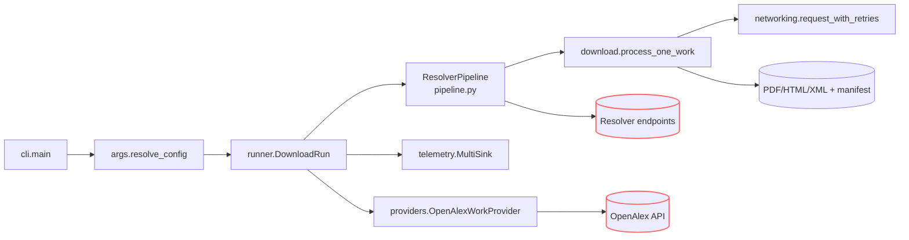

## Table of Contents

- [0) Guard rails (set once per session)](#0-guard-rails-set-once-per-session)
- [1) Verify the environment exists (no install)](#1-verify-the-environment-exists-no-install)
- [2) Run commands strictly from the project `.venv`](#2-run-commands-strictly-from-the-project-venv)
- [3) Quick health checks (no network)](#3-quick-health-checks-no-network)
- [4) Typical tasks (all no-install)](#4-typical-tasks-all-no-install)
- [5) Troubleshooting (stay no-install)](#5-troubleshooting-stay-no-install)
- [6) “Absolutely no installs” policy (what you may do)](#6-absolutely-no-installs-policy-what-you-may-do)
- [7) Fallback (only with **explicit approval** to install)](#7-fallback-only-with-explicit-approval-to-install)
- [8) One-page quick reference (copy/paste safe)](#8-one-page-quick-reference-copy-paste-safe)
- [Mission & Scope](#mission-scope)
- [Quickstart (same as README)](#quickstart-same-as-readme)
- [Architecture & Flow](#architecture-flow)
- [Storage Layout & Run Outputs](#storage-layout-run-outputs)
- [CLI & Configuration Surfaces](#cli-configuration-surfaces)
- [Telemetry, Data Contracts & Error Handling](#telemetry-data-contracts-error-handling)
- [Networking, Rate Limiting & Politeness](#networking-rate-limiting-politeness)
- [Operational Playbooks](#operational-playbooks)
- [Invariants & Safe Change Surfaces](#invariants-safe-change-surfaces)
- [Test Matrix & Diagnostics](#test-matrix-diagnostics)
- [Reference Docs](#reference-docs)
- [Coding Standards & Module Organization](#coding-standards-module-organization)

# Project Environment — **No-Install** Runbook (for AI agents)

> **Prime directive:** **Use the packages already installed in `./.venv`.**
> Do **not** fetch or install anything unless you are explicitly told to. The project `.venv` includes custom wheels and GPU-specific builds that must not be disturbed.

---

## 0) Guard rails (set once per session)

To make accidental installs impossible:

```bash
# Always run inside the project venv (enforced)
export PIP_REQUIRE_VIRTUALENV=1

# Never hit the network/package index unless explicitly allowed
export PIP_NO_INDEX=1

# Don’t read user site-packages (avoid leakage)
export PYTHONNOUSERSITE=1
```

> If you later receive explicit approval to install, temporarily unset `PIP_NO_INDEX` (and only follow the “Fallback (with approval)” section at the end).

---

## 1) Verify the environment exists (no install)

```bash
# from repo root
test -x .venv/bin/python || { echo "ERROR: .venv is missing — STOP (no installs)."; exit 1; }
```

If missing or broken: **stop and report**. Do **not** create or modify the environment without authorization.

---

## 2) Run commands strictly from the project `.venv`

Pick **one** method below. All of them resolve **imports and console scripts from `./.venv`** and avoid installs.

### A) Most explicit (activation-free; recommended for agents)

```bash
# Call tools by absolute path inside the venv
./.venv/bin/python -m pip --version      # proves you're on ./.venv/bin/python
./.venv/bin/python -m DocsToKG.ContentDownload.cli --help
./.venv/bin/pytest -q
./.venv/bin/ruff check .
./.venv/bin/mypy src
```

### B) `direnv` (auto-env; if available)

```bash
direnv allow                             # trust once per machine
direnv exec . python -m pip --version
direnv exec . python -m DocsToKG.ContentDownload.cli --help
direnv exec . pytest -q
```

### C) `./scripts/dev.sh` (portable wrapper; no direnv needed)

```bash
./scripts/dev.sh doctor                  # prints interpreter/env and importability
./scripts/dev.sh python -m DocsToKG.ContentDownload.cli --help
./scripts/dev.sh exec pytest -q
./scripts/dev.sh pip list                # safe: listing does not install
```

### D) Classic activation (if explicitly requested)

```bash
# Linux/macOS
source .venv/bin/activate
export PYTHONPATH="\$PWD/src:${PYTHONPATH:-}"    # mirrors project behavior
python -m pip --version
python -m DocsToKG.ContentDownload.cli --help
pytest -q
```

> Prefer **A–C** for automation. **D** is acceptable in interactive shells but easier to get wrong.

---

## 3) Quick health checks (no network)

Run these **before** heavy work:

```bash
# 1) Interpreter identity (must be the project venv)
./.venv/bin/python - <<'PY'
import sys
assert sys.executable.endswith("/.venv/bin/python"), sys.executable
print("OK: using", sys.executable)
PY

# 2) Package presence WITHOUT installing (examples)
./.venv/bin/python -c "import DocsToKG, pkgutil; print('DocsToKG OK');"
./.venv/bin/python -c "import faiss; print('FAISS OK')"
./.venv/bin/python -c "import cupy; import numpy; print('CuPy OK', cupy.__version__)"
```

If any import fails: **do not install**. Go to Troubleshooting.

---

## 4) Typical tasks (all no-install)

```bash
# CLIs (module form)
./.venv/bin/python -m DocsToKG.ContentDownload.cli --help

# Tests
./.venv/bin/pytest -q

# Lint/format
./.venv/bin/ruff check .
./.venv/bin/black --check .

# Type check
./.venv/bin/mypy src
```

> Always prefer `python -m <module>` and `.venv/bin/<tool>` — these guarantee resolution from the project environment.

---

## 5) Troubleshooting (stay no-install)

**Symptom → Action (no installs):**

- **`ModuleNotFoundError`**
  You’re not using the project interpreter. Re-run via one of §2 methods, then re-check `sys.executable`.

- **GPU/FAISS/CuPy errors** (e.g., missing `.so`/DLL)
  Do **not** build or fetch wheels. Report the exact error. These packages are customized; replacing them may break GPU paths.

- **`pip` tries to fetch**
  You forgot the guard rails. Ensure `PIP_REQUIRE_VIRTUALENV=1` and `PIP_NO_INDEX=1` are set. Never pass `-U/--upgrade`.

---

## 6) “Absolutely no installs” policy (what you may do)

- You **may**:

  - Inspect environment: `./.venv/bin/pip list`, `./.venv/bin/pip show <pkg>`.
  - Run any console script from `./.venv/bin/…`.
  - Read code and run module CLIs with `python -m …`.

- You **must not**:

  - Run `pip install`, `pip wheel`, `pip cache purge`, or `pip uninstall`.
  - Upgrade/downgrade packages (including `pip` itself).
  - Recreate or modify `./.venv` without explicit approval.

---

## 7) Fallback (only with **explicit approval** to install)

If (and only if) you have written approval to modify the environment, apply the **smallest necessary** action **inside** the venv:

```bash
# ensure you are in the project venv first:
source .venv/bin/activate  # or use ./.venv/bin/python -m pip ...
unset PIP_NO_INDEX         # allow index access if instructed

# project code (editable) and pinned deps ONLY:
pip install -e .
pip install -r requirements.txt

# If a local wheelhouse exists (to avoid network):
# pip install --no-index --find-links ./ci/wheels -r requirements.txt
```

> Never “try versions” or compile GPU libs. If a wheel is missing, escalate.

---

## 8) One-page quick reference (copy/paste safe)

```bash
# Guard rails (no accidental installs)
export PIP_REQUIRE_VIRTUALENV=1 PIP_NO_INDEX=1 PYTHONNOUSERSITE=1

# Verify venv exists (stop if missing)
test -x .venv/bin/python || { echo "Missing .venv — STOP (no installs)."; exit 1; }

# Preferred run patterns (choose ONE)
./.venv/bin/python -m DocsToKG.ContentDownload.cli --help
./.venv/bin/pytest -q
# or
direnv exec . python -m DocsToKG.ContentDownload.cli --help
direnv exec . pytest -q
# or
./scripts/dev.sh doctor
./scripts/dev.sh python -m DocsToKG.ContentDownload.cli --help
./scripts/dev.sh exec pytest -q

# Health checks (no network)
./.venv/bin/python - <<'PY'
import sys; assert sys.executable.endswith("/.venv/bin/python"); print("OK:", sys.executable)
PY
./.venv/bin/python -c "import DocsToKG, faiss, cupy; print('Core imports OK')"
```

---

### Final note for agents

This repository’s environment includes **custom wheels and GPU-optimized packages**. Treat the `.venv` as **immutable** unless you are explicitly told to modify it. Your default posture is **execute only**: run what’s already installed, verify, and report issues rather than “fixing” them by installing.

# Agents Guide - ContentDownload

Last updated: 2025-10-19

## Mission & Scope

- **Mission**: Coordinate resolver-driven acquisition of OpenAlex-derived scholarly artifacts into structured manifests with deterministic retry, resume, and telemetry semantics.
- **Scope**: Resolver orchestration, download pipeline, caching/resume semantics, manifest generation, telemetry sinks, polite networking safeguards.
- **Out-of-scope**: Knowledge-graph ingestion, DocTags conversion, ontology-aware fetching, downstream analytics/embedding.

## Quickstart (same as README)

```bash
# Guard rails (safe to repeat)
export PIP_REQUIRE_VIRTUALENV=1 PIP_NO_INDEX=1 PYTHONNOUSERSITE=1

# Ensure the project virtualenv exists (never install)
test -x .venv/bin/python || { echo "Missing .venv — STOP (no installs)."; exit 1; }

# Optional polite contact for resolver credentials
export UNPAYWALL_EMAIL=you@example.org

# Wrapper workflow (preferred)
./scripts/dev.sh doctor
./scripts/dev.sh python -m DocsToKG.ContentDownload.cli --help

# Direct invocation without activation
./.venv/bin/python -m DocsToKG.ContentDownload.cli \
  --topic "machine learning" \
  --year-start 2023 \
  --year-end 2024 \
  --mailto you@example.org \
  --out runs/content \
  --staging \
  --resolver-preset fast \
  --workers 4 \
  --dry-run
```

- Drop `--dry-run` once configuration looks correct; combine with `--list-only` for manifest logging only.

## Architecture & Flow



- `cli.main()` wires the frozen `ResolvedConfig` into `DownloadRun`, seeding resolver instances, telemetry factories, and configurable hooks (`download_candidate_func`, sink factories) for tests.
- `DownloadRun.run()` stages the lifecycle in order: `setup_sinks()` → `setup_resolver_pipeline()` → `setup_work_provider()` → `setup_download_state()` → work execution (sequential or `ThreadPoolExecutor`). A `ThreadLocalSessionFactory` provides per-thread `requests.Session` objects and is closed during teardown.
- `DownloadRun.setup_download_state()` hydrates resume metadata from JSONL/CSV manifests or SQLite caches, seeds `DownloadConfig` (robots cache, content-addressed toggle, digest verification, global dedupe sets), and registers cleanup callbacks on the exit stack.
- `ResolverPipeline.run()` enforces resolver ordering, per-resolver spacing, domain token buckets, circuit breakers, global URL dedupe, and emits structured `AttemptRecord` telemetry while updating `ResolverMetrics`.
- `download.process_one_work()` normalises work payloads, evaluates resume decisions, coordinates download strategies (PDF/HTML/XML), finalises artifacts atomically, and logs manifest + summary records via `RunTelemetry`.
- Telemetry fan-out (`RunTelemetry`, `MultiSink`) writes JSONL, optional CSV, SQLite, manifest index, summary, metrics, and last-attempt outputs, keeping rotation and resume surfaces consistent.
- `providers.OpenAlexWorkProvider` streams `WorkArtifact` objects either from live `pyalex` queries or supplied iterables, reusing `iterate_openalex()` with equal-jitter backoff, optional `Retry-After` cap, per-page bounds, and `--max` truncation for dry-run testing.

## Storage Layout & Run Outputs

- **Run identifiers**: Each invocation issues a UUID `run_id` stamped onto manifests/summaries and staging directories when `--staging` is used.
- **Content roots**: `DownloadConfig` coordinates sibling `PDF/`, `HTML/`, `XML/` directories. `--content-addressed` adds hashed payload paths + symlinks.
- **Resume caches**: `manifest.jsonl` (+ rotations), `manifest.index.json`, and `manifest.sqlite3` function as a unit; keep them together for resumes.
- **Global dedupe**: `ManifestUrlIndex` hydrates up to `global_url_dedup_cap` successful URLs into in-memory sets so subsequent works skip resolver execution; only PDF/CACHED/XML classifications are considered.
- **Scratch space**: Streaming writes create `*.part` temp files beside the target until `finalize_candidate_download` promotes them atomically.
- **Artifacts emitted**:
  - `manifest.jsonl` / rotated segments (`--log-rotate`) with `record_type`.
  - `manifest.index.json` URL index for dedupe.
  - `manifest.summary.json`, `manifest.metrics.json`, `manifest.last.csv` quick-glance outputs.
  - `manifest.sqlite3` backing `ManifestUrlIndex` (`SQLITE_SCHEMA_VERSION = 4`).
  - Optional `manifest.csv` when `--log-format csv` or `--log-csv` is set.
  - Artifact directories (`PDF/`, `HTML/`, `XML/`) with HTML text sidecars when extraction enabled.

## CLI & Configuration Surfaces

- CLI selectors & pagination: `--topic`, `--topic-id`, `--year-start`, `--year-end`, `--per-page`, `--oa-only`.
- Output & lifecycle controls: `--out`, `--html-out`, `--xml-out`, `--staging`, `--content-addressed`, `--manifest`, `--log-format {jsonl,csv}`, `--log-csv`, `--log-rotate`, `--warm-manifest-cache`, `--resume-from`, `--verify-cache-digest`.
- Runtime controls: `--mailto`, `--max`, `--workers`, `--sleep`, `--dry-run`, `--list-only`, `--ignore-robots`, `--openalex-retry-attempts`, `--openalex-retry-backoff`, `--openalex-retry-max-delay`.
- Resolver knobs & credentials: `--resolver-config`, `--resolver-order`, `--resolver-preset {fast,broad}`, `--enable-resolver`, `--disable-resolver`, `--max-resolver-attempts`, `--resolver-timeout`, `--retry-after-cap`, `--concurrent-resolvers`, `--max-concurrent-per-host`, `--domain-min-interval`, `--domain-token-bucket`, `--global-url-dedup`/`--no-global-url-dedup`, `--global-url-dedup-cap`, `--head-precheck`/`--no-head-precheck`, `--accept`, `--unpaywall-email`, `--core-api-key`, `--semantic-scholar-api-key`, `--doaj-api-key`. The CLI threads `--retry-after-cap` into `DownloadConfig.extra` so downloader retries honour the ceiling even outside resolver config files.
- Classifier & extraction tuning: `--sniff-bytes`, `--min-pdf-bytes`, `--tail-check-bytes`, `--extract-text`.

**Resolver configuration excerpt**

```yaml
# resolvers/config.fast.yaml
resolver_order:
  - openalex
  - unpaywall
  - crossref
max_concurrent_resolvers: 8
max_concurrent_per_host: 4
polite_headers:
  User-Agent: "DocsToKG-Downloader/1.0 (+mailto:you@example.org)"
  Accept: "application/pdf, text/html;q=0.9, */*;q=0.7"
resolver_toggles:
  wayback: false
resolver_min_interval_s:
  unpaywall: 0.5
domain_token_buckets:
  crossref.org:
    rate_per_second: 4
    capacity: 12
    breaker_threshold: 15
    breaker_cooldown: 120
domain_content_rules:
  arxiv.org:
    allowed_types:
      - application/pdf
resolver_circuit_breakers:
  unpaywall:
    failure_threshold: 6
    cooldown_seconds: 90
```

- Unknown keys raise `ValueError`; extend `ResolverConfig` before adding new options.
- Domain rate limits cascade to networking token buckets; resolver toggles override defaults per provider.

## Telemetry, Data Contracts & Error Handling

- Manifest/attempt schemas defined in `telemetry.py` (`MANIFEST_SCHEMA_VERSION = 3`, `SQLITE_SCHEMA_VERSION = 4`); keep `record_type`, `run_id`, classification/reason fields stable.
- `RunTelemetry` + `MultiSink` coordinate JSONL (`JsonlSink`/`RotatingJsonlSink`), `CsvSink`, `LastAttemptCsvSink`, `ManifestIndexSink`, `SqliteSink`, and `SummarySink` ensuring manifest/index/summary/metrics files stay in sync even when rotation is active.
- Resume helpers (`JsonlResumeLookup`, `SqliteResumeLookup`, `ManifestUrlIndex`, `load_resume_completed_from_sqlite`) hydrate completed work IDs and normalized URLs; JSONL absence triggers a warning when resuming purely from SQLite caches.
- `statistics.DownloadStatistics` + `ResolverStats` feed aggregated metrics into `summary.build_summary_record()` (`manifest.metrics.json`).
- Error taxonomy from `errors.py` (`DownloadError`, `NetworkError`, `ContentPolicyError`, `RateLimitError`) surfaces remediation suggestions through `log_download_failure`.
- Reason codes (`core.ReasonCode` e.g. `robots_blocked`, `content_policy_violation`) drive analytics; extend only with coordination.
- Console output (`emit_console_summary`) mirrors JSON summary for human inspection.

## Networking, Rate Limiting & Politeness

- `networking.ThreadLocalSessionFactory` + `create_session()` maintain per-thread sessions with shared adapter pools, polite defaults, and consistent timeouts; call `close_all()` during teardown.
- `request_with_retries()` implements exponential backoff + equal jitter, respecting `Retry-After`, `--retry-after-cap`, and emitting `CachedResult` / `ModifiedResult` wrappers for conditional requests.
- Token buckets/circuit breakers defined in `ResolverConfig` throttle host+resolver concurrency; host semaphores and `CircuitBreaker` instances (`resolver_circuit_breakers`, domain breakers) share telemetry and enforce cooldowns.
- `download.RobotsCache` enforces robots.txt unless `--ignore-robots`; override only with explicit approval.
- `ConditionalRequestHelper` builds `If-None-Match` / `If-Modified-Since` headers; `head_precheck` downgrades to conditional GETs when HEAD is unsupported.
- `statistics.BandwidthTracker` (opt-in) can expose throughput for tuning `--workers`.

## Operational Playbooks

- **Resume interrupted run**: `python -m DocsToKG.ContentDownload.cli --resume-from runs/content/manifest.jsonl --staging --out runs/content`.
- **CSV export**: `python scripts/export_attempts_csv.py runs/content/manifest.jsonl reports/content_attempts.csv`; keep paired SQLite cache nearby.
- **Resolver health audit**: `jq 'select(.record_type=="attempt") | {resolver_name, reason}' runs/content/manifest.jsonl | sort | uniq -c`.
- **Cache hygiene**: delete artifact directory and corresponding `manifest.*`/`manifest.sqlite3` together; regenerate manifests immediately if manual cleanup occurs.
- **Concurrency validation**: run small `--dry-run --log-format jsonl` workloads, inspect `manifest.metrics.json` latency blocks before raising `--workers`.

## Invariants & Safe Change Surfaces

- Leave `ResolvedConfig` frozen; add helper constructors rather than mutating runtime state.
- `DownloadRun.setup_sinks()` must run before pipeline initialisation; telemetry depends on sink readiness.
- Resolver registration centralised in `resolvers/__init__.py`; new resolvers extend `ApiResolverBase`.
- Global URL dedupe depends on `ManifestUrlIndex` schema; bump `SQLITE_SCHEMA_VERSION` with downstream coordination.
- Use `networking` or `pipeline.ResolverConfig` for shared HTTP behaviour changes; avoid bespoke rate limiting.

## Test Matrix & Diagnostics

```bash
ruff check src/DocsToKG/ContentDownload tests/content_download
mypy src/DocsToKG/ContentDownload
pytest -q tests/cli/test_cli_flows.py
pytest -q tests/content_download/test_runner_download_run.py
pytest -q tests/content_download/test_rate_control.py
python -m DocsToKG.ContentDownload.cli --topic "vision" --year-start 2024 --year-end 2024 --max 5 --dry-run --manifest tmp/manifest.jsonl
```

- High-signal suites: `tests/content_download/test_networking.py`, `test_download_execution.py`, `test_runner_download_run.py`, `tests/cli/test_cli_flows.py`.
- Maintain golden fakes under `tests/content_download/fakes/` when altering manifest/telemetry fields.

## Reference Docs

- `src/DocsToKG/ContentDownload/README.md`
- Resolver-specific docs under `src/DocsToKG/ContentDownload/resolvers/`
- Related tools: `tools/manifest_to_index.py`, `scripts/export_attempts_csv.py`

## Coding Standards & Module Organization

- Follow the documentation in [CODE_ANNOTATION_STANDARDS.md](../../../docs/CODE_ANNOTATION_STANDARDS.md) when adding or updating inline documentation and NAVMAP headers.
- Structure modules according to [MODULE_ORGANIZATION_GUIDE.md.txt](../../../docs/html/_sources/MODULE_ORGANIZATION_GUIDE.md.txt), ensuring imports, type aliases, dataclasses, and public API sections remain predictable for downstream agents.
