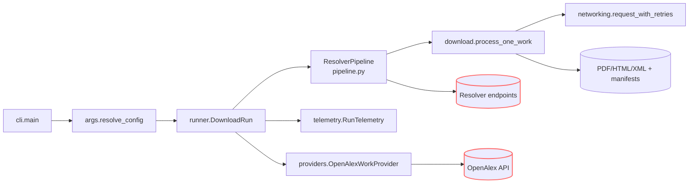

## Table of Contents

- [0) Guard rails (set once per session)](#0-guard-rails-set-once-per-session)
- [1) Verify the environment exists (no install)](#1-verify-the-environment-exists-no-install)
- [2) Run commands strictly from the project `.venv`](#2-run-commands-strictly-from-the-project-venv)
- [3) Quick health checks (no network)](#3-quick-health-checks-no-network)
- [4) Typical tasks (all no-install)](#4-typical-tasks-all-no-install)
- [5) Troubleshooting (stay no-install)](#5-troubleshooting-stay-no-install)
- [6) “Absolutely no installs” policy (what you may do)](#6-absolutely-no-installs-policy-what-you-may-do)
- [7) Fallback (only with **explicit approval** to install)](#7-fallback-only-with-explicit-approval-to-install)
- [8) One-page quick reference (copy/paste safe)](#8-one-page-quick-reference-copy-paste-safe)
- [Mission & Scope](#mission-scope)
- [Quickstart (same as README)](#quickstart-same-as-readme)
- [Architecture & Flow](#architecture-flow)
- [Storage Layout & Run Outputs](#storage-layout-run-outputs)
- [CLI & Configuration Surfaces](#cli-configuration-surfaces)
- [Telemetry, Data Contracts & Error Handling](#telemetry-data-contracts-error-handling)
- [Networking, Rate Limiting & Politeness](#networking-rate-limiting-politeness)
- [Operational Playbooks](#operational-playbooks)
- [Invariants & Safe Change Surfaces](#invariants-safe-change-surfaces)
- [Test Matrix & Diagnostics](#test-matrix-diagnostics)
- [Reference Docs](#reference-docs)
- [Coding Standards & Module Organization](#coding-standards-module-organization)
- [Idempotency & Job Coordination](#idempotency--job-coordination)
- [Observability & SLOs](#observability-slos)

# Project Environment — **No-Install** Runbook (for AI agents)

> **Prime directive:** **Use the packages already installed in `./.venv`.**
> Do **not** fetch or install anything unless you are explicitly told to. The project `.venv` includes custom wheels and GPU-specific builds that must not be disturbed.

---

## 0) Guard rails (set once per session)

To make accidental installs impossible:

```bash
# Always run inside the project venv (enforced)
export PIP_REQUIRE_VIRTUALENV=1

# Never hit the network/package index unless explicitly allowed
export PIP_NO_INDEX=1

# Don’t read user site-packages (avoid leakage)
export PYTHONNOUSERSITE=1
```

> If you later receive explicit approval to install, temporarily unset `PIP_NO_INDEX` (and only follow the “Fallback (with approval)” section at the end).

---

## 1) Verify the environment exists (no install)

```bash
# from repo root
test -x .venv/bin/python || { echo "ERROR: .venv is missing — STOP (no installs)."; exit 1; }
```

If missing or broken: **stop and report**. Do **not** create or modify the environment without authorization.

---

## 2) Run commands strictly from the project `.venv`

Pick **one** method below. All of them resolve **imports and console scripts from `./.venv`** and avoid installs.

### A) Most explicit (activation-free; recommended for agents)

```bash
# Call tools by absolute path inside the venv
./.venv/bin/python -m pip --version      # proves you're on ./.venv/bin/python
./.venv/bin/python -m DocsToKG.ContentDownload.cli --help
./.venv/bin/pytest -q
./.venv/bin/ruff check .
./.venv/bin/mypy src
```

### B) `direnv` (auto-env; if available)

```bash
direnv allow                             # trust once per machine
direnv exec . python -m pip --version
direnv exec . python -m DocsToKG.ContentDownload.cli --help
direnv exec . pytest -q
```

### C) `./scripts/dev.sh` (portable wrapper; no direnv needed)

```bash
./scripts/dev.sh doctor                  # prints interpreter/env and importability
./scripts/dev.sh python -m DocsToKG.ContentDownload.cli --help
./scripts/dev.sh exec pytest -q
./scripts/dev.sh pip list                # safe: listing does not install
```

### D) Classic activation (if explicitly requested)

```bash
# Linux/macOS
source .venv/bin/activate
export PYTHONPATH="\$PWD/src:${PYTHONPATH:-}"    # mirrors project behavior
python -m pip --version
python -m DocsToKG.ContentDownload.cli --help
pytest -q
```

> Prefer **A–C** for automation. **D** is acceptable in interactive shells but easier to get wrong.

---

## 3) Quick health checks (no network)

Run these **before** heavy work:

```bash
# 1) Interpreter identity (must be the project venv)
./.venv/bin/python - <<'PY'
import sys
assert sys.executable.endswith("/.venv/bin/python"), sys.executable
print("OK: using", sys.executable)
PY

# 2) Package presence WITHOUT installing (examples)
./.venv/bin/python -c "import DocsToKG, pkgutil; print('DocsToKG OK');"
./.venv/bin/python -c "import faiss; print('FAISS OK')"
./.venv/bin/python -c "import cupy; import numpy; print('CuPy OK', cupy.__version__)"
```

If any import fails: **do not install**. Go to Troubleshooting.

---

## 4) Typical tasks (all no-install)

```bash
# CLIs (module form)
./.venv/bin/python -m DocsToKG.ContentDownload.cli --help

# Tests
./.venv/bin/pytest -q

# Lint/format
./.venv/bin/ruff check .
./.venv/bin/black --check .

# Type check
./.venv/bin/mypy src
```

> Always prefer `python -m <module>` and `.venv/bin/<tool>` — these guarantee resolution from the project environment.

---

## 5) Troubleshooting (stay no-install)

**Symptom → Action (no installs):**

- **`ModuleNotFoundError`**
  You’re not using the project interpreter. Re-run via one of §2 methods, then re-check `sys.executable`.

- **GPU/FAISS/CuPy errors** (e.g., missing `.so`/DLL)
  Do **not** build or fetch wheels. Report the exact error. These packages are customized; replacing them may break GPU paths.

- **`pip` tries to fetch**
  You forgot the guard rails. Ensure `PIP_REQUIRE_VIRTUALENV=1` and `PIP_NO_INDEX=1` are set. Never pass `-U/--upgrade`.

- **Stale HTTP cache / unexpected 304 hits**
  Call `DocsToKG.ContentDownload.httpx_transport.purge_http_cache()` (or delete `${DOCSTOKG_DATA_ROOT}/cache/http/ContentDownload`) and re-run. Cache keys are derived from `urls.canonical_for_index`; normalize any direct calls before comparing.

- **Telemetry shows `cache_hit=true` but payload missing**
  Confirm the cached path still exists; `ConditionalRequestHelper` raises when metadata is incomplete. Recompute manifests with `--verify-cache-digest` to refresh SHA-256 and mtime fields.

- **Legacy tests patch `create_session` / `ThreadLocalSessionFactory`**
  Those shims now raise `RuntimeError`. Patch `DocsToKG.ContentDownload.httpx_transport.configure_http_client()` or `DocsToKG.ContentDownload.networking.time.sleep` instead.

---

## 6) “Absolutely no installs” policy (what you may do)

- You **may**:

  - Inspect environment: `./.venv/bin/pip list`, `./.venv/bin/pip show <pkg>`.
  - Run any console script from `./.venv/bin/…`.
  - Read code and run module CLIs with `python -m …`.

- You **must not**:

  - Run `pip install`, `pip wheel`, `pip cache purge`, or `pip uninstall`.
  - Upgrade/downgrade packages (including `pip` itself).
  - Recreate or modify `./.venv` without explicit approval.

---

## 7) Fallback (only with **explicit approval** to install)

If (and only if) you have written approval to modify the environment, apply the **smallest necessary** action **inside** the venv:

```bash
# ensure you are in the project venv first:
source .venv/bin/activate  # or use ./.venv/bin/python -m pip ...
unset PIP_NO_INDEX         # allow index access if instructed

# project code (editable) and pinned deps ONLY:
pip install -e .
pip install -r requirements.txt

# If a local wheelhouse exists (to avoid network):
# pip install --no-index --find-links ./ci/wheels -r requirements.txt
```

> Never “try versions” or compile GPU libs. If a wheel is missing, escalate.

---

## 8) One-page quick reference (copy/paste safe)

```bash
# Guard rails (no accidental installs)
export PIP_REQUIRE_VIRTUALENV=1 PIP_NO_INDEX=1 PYTHONNOUSERSITE=1

# Verify venv exists (stop if missing)
test -x .venv/bin/python || { echo "Missing .venv — STOP (no installs)."; exit 1; }

# Preferred run patterns (choose ONE)
./.venv/bin/python -m DocsToKG.ContentDownload.cli --help
./.venv/bin/pytest -q
# or
direnv exec . python -m DocsToKG.ContentDownload.cli --help
direnv exec . pytest -q
# or
./scripts/dev.sh doctor
./scripts/dev.sh python -m DocsToKG.ContentDownload.cli --help
./scripts/dev.sh exec pytest -q

# Health checks (no network)
./.venv/bin/python - <<'PY'
import sys; assert sys.executable.endswith("/.venv/bin/python"); print("OK:", sys.executable)
PY
./.venv/bin/python -c "import DocsToKG, faiss, cupy; print('Core imports OK')"
```

---

### Final note for agents

This repository’s environment includes **custom wheels and GPU-optimized packages**. Treat the `.venv` as **immutable** unless you are explicitly told to modify it. Your default posture is **execute only**: run what’s already installed, verify, and report issues rather than “fixing” them by installing.

# Agents Guide - ContentDownload

Last updated: 2025-10-21

## Mission & Scope

- **Mission**: Coordinate resolver-driven acquisition of OpenAlex-derived scholarly artifacts into structured manifests with deterministic retry, resumability, and telemetry semantics using a shared HTTPX/Hishel transport.
- **Scope**: Resolver orchestration, download pipeline, streaming/conditional HTTP semantics, caching/resume flows, manifest generation, telemetry sinks, and polite networking safeguards (robots, centralized rate limiting, Tenacity backoff).
- **Out-of-scope**: Knowledge-graph ingestion, DocTags conversion, ontology-aware fetching, downstream analytics/embedding, or anything that mutates the `.venv`/dependency graph.

## Quickstart (same as README)

```bash
# Guard rails (safe to repeat)
export PIP_REQUIRE_VIRTUALENV=1 PIP_NO_INDEX=1 PYTHONNOUSERSITE=1

# Ensure the project virtualenv exists (never install)
test -x .venv/bin/python || { echo "Missing .venv — STOP (no installs)."; exit 1; }

# Optional polite contact for resolver credentials
export UNPAYWALL_EMAIL=you@example.org

# Wrapper workflow (preferred)
./scripts/dev.sh doctor
./scripts/dev.sh python -m DocsToKG.ContentDownload.cli --help

# Direct invocation without activation
./.venv/bin/python -m DocsToKG.ContentDownload.cli \
  --topic "machine learning" \
  --year-start 2023 \
  --year-end 2024 \
  --mailto you@example.org \
  --out runs/content \
  --staging \
  --resolver-preset fast \
  --workers 4 \
  --dry-run
```

- Drop `--dry-run` once configuration looks correct; combine with `--list-only` for manifest logging only.

## Architecture & Flow



- `cli.main()` produces a frozen `ResolvedConfig` (output directories, resolver instances, polite headers) and hands it to `DownloadRun`. The CLI exposes deterministic hook points (`download_candidate_func`, sink factories, HTTP client overrides) so tests can inject `httpx.MockTransport` or stubbed sink implementations without touching internals.
- `DownloadRun.run()` orchestrates the full lifecycle: `setup_sinks()` → `setup_resolver_pipeline()` → `setup_work_provider()` → `setup_download_state()` → worker execution. The shared HTTPX/Hishel client from `DocsToKG.ContentDownload.httpx_transport` is acquired once and reused across workers; tests reset or override it via `configure_http_client()` / `reset_http_client_for_tests()`. Sequential polite sleeps default to 0.05s but are skipped automatically when `--workers > 1` unless explicitly provided.
- `DownloadRun.setup_download_state()` hydrates resume metadata from JSONL/CSV/SQLite, seeds `DownloadConfig` (robots cache, content-addressed storage, digest verification, domain content rules, Accept overrides, dedupe caches), and registers cleanup callbacks on the exit stack so temporary resume snapshots are removed even on failure.
- `ResolverPipeline.run()` enforces resolver ordering, per-resolver spacing, centralised limiter roles (metadata/landing/artifact), circuit breakers, and global URL dedupe before delegating to download strategies. Every attempt logs structured telemetry (`AttemptRecord`) and updates `ResolverMetrics` for later summaries.
- `download.process_one_work()` normalises work payloads, evaluates resume decisions, coordinates download strategies (PDF/HTML/XML), runs conditional requests, finalises artifacts atomically (with content-addressed promotion when enabled), and logs manifest + summary records via `RunTelemetry`.
- Telemetry fan-out (`RunTelemetry`, `MultiSink`) writes JSONL, optional CSV, SQLite, manifest index, summary, metrics, and last-attempt outputs so resume tooling (`JsonlResumeLookup` / `SqliteResumeLookup`) and downstream analytics remain in sync even when rotation is enabled.
- `providers.OpenAlexWorkProvider` streams `WorkArtifact` objects from live `pyalex` queries or supplied iterables, calling `iterate_openalex()` (equal-jitter retry, optional `Retry-After` cap, per-page bounds, `--max` truncation) and deferring HTTP retries to the shared Tenacity policy.

## Storage Layout & Run Outputs

- **Run identifiers**: Each invocation issues a UUID `run_id` stamped onto manifests/summaries and staging directories when `--staging` is used.
- **Content roots**: `DownloadConfig` coordinates sibling `PDF/`, `HTML/`, `XML/` directories. `--content-addressed` adds hashed payload paths + symlinks.
- **Resume caches**: `manifest.jsonl` (+ rotations), `manifest.index.json`, and `manifest.sqlite3` function as a unit; keep them together for resumes.
- **Global dedupe**: `ManifestUrlIndex` hydrates up to `global_url_dedup_cap` successful URLs into in-memory sets so subsequent works skip resolver execution; only PDF/CACHED/XML classifications are considered.
- **Scratch space**: Streaming writes create `*.part` temp files beside the target until `finalize_candidate_download` promotes them atomically.
- **Artifacts emitted**:
  - `manifest.jsonl` / rotated segments (`--log-rotate`) with `record_type`.
  - `manifest.index.json` URL index for dedupe.
  - `manifest.summary.json`, `manifest.metrics.json`, `manifest.last.csv` quick-glance outputs.
  - `manifest.sqlite3` backing `ManifestUrlIndex` (`SQLITE_SCHEMA_VERSION = 4`).
  - Optional `manifest.csv` when `--log-format csv` or `--log-csv` is set.
  - Artifact directories (`PDF/`, `HTML/`, `XML/`) with HTML text sidecars when extraction enabled.

## CLI & Configuration Surfaces

- CLI selectors & pagination: `--topic`, `--topic-id`, `--year-start`, `--year-end`, `--per-page`, `--oa-only`.
- Output & lifecycle controls: `--out`, `--html-out`, `--xml-out`, `--staging`, `--content-addressed`, `--manifest`, `--log-format {jsonl,csv}`, `--log-csv`, `--log-rotate`, `--warm-manifest-cache`, `--resume-from`, `--verify-cache-digest`.
- Runtime controls: `--mailto`, `--max`, `--workers`, `--sleep` (defaults to 0.05 for sequential runs and is ignored when `--workers > 1` unless explicitly supplied), `--dry-run`, `--list-only`, `--ignore-robots`, `--openalex-retry-attempts`, `--openalex-retry-backoff`, `--openalex-retry-max-delay`.
- Resolver knobs & credentials: `--resolver-config`, `--resolver-order`, `--resolver-preset {fast,broad}`, `--enable-resolver`, `--disable-resolver`, `--max-resolver-attempts`, `--resolver-timeout`, `--retry-after-cap`, `--concurrent-resolvers`, `--global-url-dedup`/`--no-global-url-dedup`, `--global-url-dedup-cap`, `--head-precheck`/`--no-head-precheck`, `--accept`, `--unpaywall-email`, `--core-api-key`, `--semantic-scholar-api-key`, `--doaj-api-key`, and centralized limiter overrides (`--rate`, `--rate-mode`, `--rate-max-delay`, `--rate-backend`). The CLI threads `--retry-after-cap` into `DownloadConfig.extra` so downloader retries honour the ceiling even outside resolver config files.
- Classifier & extraction tuning: `--sniff-bytes`, `--min-pdf-bytes`, `--tail-check-bytes`, `--extract-text`.

**Resolver configuration excerpt**

```yaml
# resolvers/config.fast.yaml
resolver_order:
  - openalex
  - unpaywall
  - crossref
max_concurrent_resolvers: 8
polite_headers:
  User-Agent: "DocsToKG-Downloader/1.0 (+mailto:you@example.org)"
  Accept: "application/pdf, text/html;q=0.9, */*;q=0.7"
resolver_toggles:
  wayback: false
rate_overrides:
  - "api.crossref.org=10/s,1000/h"
  - "export.arxiv.org.artifact=1/3s"
rate_mode_overrides:
  - "api.crossref.org=wait:250"
domain_content_rules:
  arxiv.org:
    allowed_types:
      - application/pdf
# Legacy resolver_circuit_breakers removed - now handled by pybreaker-based BreakerRegistry
# See breaker configuration in src/DocsToKG/ContentDownload/breakers_loader.py
```

- Unknown keys raise `ValueError`; extend `ResolverConfig` before adding new options.
- Centralized limiter overrides (`rate_overrides`, `rate_mode_overrides`, `--rate*` CLI) replace legacy per-domain throttles.

## Telemetry, Data Contracts & Error Handling

- Manifest/attempt schemas defined in `telemetry.py` (`MANIFEST_SCHEMA_VERSION = 3`, `SQLITE_SCHEMA_VERSION = 4`); keep `record_type`, `run_id`, classification/reason fields stable.
- `RunTelemetry` + `MultiSink` coordinate JSONL (`JsonlSink`/`RotatingJsonlSink`), `CsvSink`, `LastAttemptCsvSink`, `ManifestIndexSink`, `SqliteSink`, and `SummarySink` ensuring manifest/index/summary/metrics files stay in sync even when rotation is active.
- Resume helpers (`JsonlResumeLookup`, `SqliteResumeLookup`, `ManifestUrlIndex`, `load_resume_completed_from_sqlite`) hydrate completed work IDs and normalized URLs; JSONL absence triggers a warning when resuming purely from SQLite caches.
- `statistics.DownloadStatistics` + `ResolverStats` feed aggregated metrics into `summary.build_summary_record()` (`manifest.metrics.json`).
- Error taxonomy from `errors.py` (`DownloadError`, `NetworkError`, `ContentPolicyError`, `RateLimitError`) surfaces remediation suggestions through `log_download_failure`.
- Reason codes (`core.ReasonCode` e.g. `robots_blocked`, `content_policy_violation`) drive analytics; extend only with coordination.
- Console output (`emit_console_summary`) mirrors JSON summary for human inspection.

## Networking, Rate Limiting & Politeness

- `DocsToKG.ContentDownload.httpx_transport` provisions a singleton HTTPX client with Hishel caching; the transport stack is `CacheTransport → RateLimitedTransport → HTTPTransport`, so cache hits bypass limiter quotas. `configure_http_client()` injects transports/event hooks (e.g., `httpx.MockTransport` during tests) and `purge_http_cache()` clears `${CACHE_DIR}/http/ContentDownload` between runs.
- `request_with_retries()` delegates to a Tenacity controller that retries `{429, 500, 502, 503, 504}`, honours `Retry-After` headers (bounded by `retry_after_cap` and `backoff_max`), closes intermediate `httpx.Response` objects before sleeping, and surfaces the final response when HTTP retries exhaust. Patch `DocsToKG.ContentDownload.networking.time.sleep` or use `configure_http_client()` in tests to freeze pacing. When `stream=True`, the helper returns an object usable as a context manager (plain responses are wrapped via `contextlib.nullcontext`).
- `ConditionalRequestHelper` builds `If-None-Match` / `If-Modified-Since` headers and `head_precheck` downgrades to conditional GETs when HEAD is unsupported. Resolver/CLI knobs (`backoff_factor`, `max_retry_duration`, `retry_after_cap`) flow directly into the Tenacity policy.
- Centralized rate limiting lives in `DocsToKG.ContentDownload.ratelimit`. Policies are keyed by `(host, role)` (`metadata`, `landing`, `artifact`), validated at startup, and cached in a process-wide `LimiterManager`. Each limiter acquisition records wait metadata on the request (`docs_network_meta.rate_limiter_*`), aggregates manifest metrics, and emits structured logs (`rate-policy`, `rate-acquire`).
- Configure policies via CLI/env: `--rate host=5/s,300/h`, `--rate-mode host.artifact=wait:5000`, `--rate-max-delay host.artifact=5000`, and `--rate-backend backend[:key=value,…]`. Environment variables (`DOCSTOKG_RATE*`) mirror the overrides. `--rate-disable` / `DOCSTOKG_RATE_DISABLED=1` keeps the rollback path handy during pilots.
- `download.RobotsCache` enforces robots.txt unless `--ignore-robots`; it reuses `request_with_retries()`, returns deterministic context managers for streaming responses, and is safe to override only with explicit approval.
- `statistics.BandwidthTracker` (opt-in) can expose throughput for tuning `--workers`.

## Operational Playbooks

- **Resume interrupted run**: `python -m DocsToKG.ContentDownload.cli --resume-from runs/content/manifest.jsonl --staging --out runs/content`.
- **CSV export**: `python scripts/export_attempts_csv.py runs/content/manifest.jsonl reports/content_attempts.csv`; keep paired SQLite cache nearby.
- **Resolver health audit**: `jq 'select(.record_type=="attempt") | {resolver_name, reason}' runs/content/manifest.jsonl | sort | uniq -c`.
- **Cache hygiene**: delete artifact directory and corresponding `manifest.*`/`manifest.sqlite3` together; regenerate manifests immediately if manual cleanup occurs.
- **Concurrency validation**: run small `--dry-run --log-format jsonl` workloads, inspect `manifest.metrics.json` latency blocks before raising `--workers`.
- **Rate limiter tuning**: default backend is in-memory (single host). Switch to SQLite for shared runners (`--rate-backend sqlite:path=/var/run/docstokg/rl.sqlite`), `multiprocess` for forked workers, or Redis/Postgres for distributed quotas. Use `--rate` / `--rate-mode` / `--rate-max-delay` (or `DOCSTOKG_RATE*` env vars) to adjust host windows, then confirm changes via startup `rate-policy` log and `manifest.metrics.json`. `--rate-disable` (or `DOCSTOKG_RATE_DISABLED=true`) keeps the fallback path handy during pilots.

## Circuit Breaker Operations

### Overview

The circuit breaker subsystem protects the download pipeline from cascading failures by automatically detecting unhealthy hosts and temporarily blocking requests. It integrates with the rate limiter, respects `Retry-After` headers, detects rolling-window failures, and provides CLI-based operational controls and telemetry-driven auto-tuning.

**Key modules:**

- `breakers.py`: Core `BreakerRegistry` implementing the circuit breaker pattern via `pybreaker`.
- `breakers_loader.py`: Configuration loading from YAML, environment variables, and CLI arguments.
- `sqlite_cooldown_store.py`: Cross-process cooldown storage (for multi-worker setups) using SQLite with wall-clock to monotonic time conversion.
- `networking_breaker_listener.py`: Telemetry listener emitting state transitions, successes, and failures.
- `cli_breakers.py`: Operational commands (`breaker show`, `breaker open`, `breaker close`).
- `breaker_advisor.py`: Telemetry-driven metrics aggregation and heuristic-based tuning recommendations.
- `breaker_autotune.py`: Safe, bounded application of auto-tuning recommendations.
- `cli_breaker_advisor.py`: CLI command for analyzing telemetry and suggesting/applying tuning.

### Configuration

Circuit breaker policies are defined in `src/DocsToKG/ContentDownload/config/breakers.yaml`:

```yaml
defaults:
  fail_max: 5                           # Trip breaker after N consecutive failures
  reset_timeout_s: 60                   # Wait this long before half-open probe
  retry_after_cap_s: 900                # Cap Retry-After at this value
  classify:
    failure_statuses: [500, 502, 503, 504]  # HTTP statuses that count as failures
    neutral_statuses: [400, 401, 403, 404, 405, 406, 408, 410, 411, 413, 414, 415, 416, 418, 451]
  half_open:
    jitter_ms: 150                      # Random delay to desynchronize probes
  roles:
    metadata:
      fail_max: 3
      reset_timeout_s: 45
      success_threshold: 2               # Require 2 successes to close (half-open)
    landing:
      fail_max: 5
      reset_timeout_s: 60
    artifact:
      fail_max: 8
      reset_timeout_s: 120
advanced:
  rolling:
    enabled: true
    threshold_failures: 3                # Trip if ≥3 failures occur in window_s
    window_s: 10
    cooldown_s: 30                       # Manual open for this duration
hosts:
  api.crossref.org:
    fail_max: 6
    reset_timeout_s: 90
    retry_after_cap_s: 600
  # ... per-host overrides
```

**Tuning knobs:**

- `fail_max`: Decrease to trip earlier (e.g., 3 for noisy hosts); increase for stable hosts (e.g., 8).
- `reset_timeout_s`: Increase if Retry-After headers suggest longer cooldowns; decrease for fast recovery.
- `success_threshold`: Set to 2–3 if half-open failures are common; default 1 for reliable hosts.
- `trial_calls`: Number of probe requests allowed in half-open state (per role).
- `retry_after_cap_s`: Maximum duration to respect for `Retry-After` headers.
- `rolling.threshold_failures`: Detect burst failures; decrease for hypersensitivity.

### CLI Operations

#### **1. Inspect Breaker State**

```bash
# Show all breakers
python -m DocsToKG.ContentDownload.cli breaker show

# Filter by host
python -m DocsToKG.ContentDownload.cli breaker show --host api.crossref.org
```

Output:

```
HOST                        STATE                COOLDOWN_REMAIN_MS
api.crossref.org            host:closed                          0
api.openalex.org            host:open,resolver:   (remaining cooldown in ms)
export.arxiv.org            host:half_open       1234
```

#### **2. Force-Open a Breaker (Manual Cooldown)**

```bash
# Open for 300 seconds with optional reason
python -m DocsToKG.ContentDownload.cli breaker open api.example.org --seconds 300 --reason "maintenance-window"

# Close immediately (clear cooldown and reset counters)
python -m DocsToKG.ContentDownload.cli breaker close api.example.org
```

#### **3. Analyze Telemetry & Auto-Tune**

```bash
# Suggest changes based on recent telemetry
python -m DocsToKG.ContentDownload.cli breaker-advise --window-s 600

# Apply safe adjustments in-memory (no YAML update)
python -m DocsToKG.ContentDownload.cli breaker-advise --window-s 600 --enforce
```

Output:

```
[api.example.org]
  - fail_max → 3
  - reset_timeout_s → 45
  - reason: High 429 ratio 12.5%: reduce metadata RPS 20%
  - reason: Reset timeout → ~45s (based on Retry-After/open durations)
```

### Telemetry & Observability

**Breaker events are persisted in `manifest.sqlite3`:**

```sql
SELECT * FROM breaker_events
WHERE host = 'api.crossref.org'
  AND ts >= datetime('now', '-1 hour')
ORDER BY ts DESC;
```

Columns:

- `host`: Hostname (punycode normalized).
- `ts`: Epoch timestamp.
- `event_type`: `'state_change'`, `'success'`, `'failure'`, `'before_call'`.
- `details`: JSON (state changes include `old_state`, `new_state`, `reset_timeout_s`).

**Metrics visible in `manifest.metrics.json`:**

- `breaker_transitions`: Count of state transitions per host.
- `breaker_opens_per_hour`: Estimated opens/hour (extrapolated from window).
- `half_open_successes`: Probes that succeeded (recovery indicator).

### Operational Playbooks

#### **Scenario 1: Host Repeatedly Opens**

**Problem:** A resolver endpoint is experiencing intermittent errors; the breaker keeps opening.

**Diagnosis:**

```bash
# 1. Check current state
python -m DocsToKG.ContentDownload.cli breaker show --host api.example.org

# 2. Query telemetry for open reasons
sqlite3 runs/content/manifest.sqlite3 << 'SQL'
SELECT ts, event_type, details FROM breaker_events
WHERE host = 'api.example.org' AND event_type = 'failure'
ORDER BY ts DESC LIMIT 10;
SQL

# 3. Analyze 429 vs 5xx mix
jq 'select(.record_type=="attempt" and .host=="api.example.org") | {ts, status, retry_after_s}' runs/content/manifest.jsonl | sort | uniq -c
```

**Remediation:**

Option A (Rate Limiter Issue): If many 429s, reduce request rate:

```bash
# Check current rate limit settings
python -m DocsToKG.ContentDownload.cli --rate-help

# Re-run with reduced rate
python -m DocsToKG.ContentDownload.cli --resume-from runs/content/manifest.jsonl \
  --rate api.example.org=3/s,200/h \
  --out runs/content
```

Option B (Transient Issue): Manually cool down for a period:

```bash
python -m DocsToKG.ContentDownload.cli breaker open api.example.org --seconds 600 --reason "known-maintenance"

# Wait 10 minutes, then close and resume
sleep 600
python -m DocsToKG.ContentDownload.cli breaker close api.example.org
python -m DocsToKG.ContentDownload.cli --resume-from runs/content/manifest.jsonl --out runs/content
```

Option C (Configuration Tuning): Adjust breaker parameters:

```yaml
# Edit breakers.yaml
hosts:
  api.example.org:
    fail_max: 4               # Trip sooner (3 → 4)
    reset_timeout_s: 120      # Wait longer before probe (60 → 120)
    success_threshold: 2      # Require 2 successes to close
```

Then re-run:

```bash
python -m DocsToKG.ContentDownload.cli --resume-from runs/content/manifest.jsonl \
  --out runs/content
```

#### **Scenario 2: Auto-Tune Based on Telemetry**

After a run completes, analyze and apply recommendations:

```bash
# 1. Suggest tuning based on telemetry
python -m DocsToKG.ContentDownload.cli breaker-advise --window-s 3600

# 2. Review suggestions (printed to console)

# 3. Apply safe tuning
python -m DocsToKG.ContentDownload.cli breaker-advise --window-s 3600 --enforce

# 4. Resume with auto-tuned settings
python -m DocsToKG.ContentDownload.cli --resume-from runs/content/manifest.jsonl \
  --out runs/content
```

#### **Scenario 3: Cross-Process Workers Respecting Shared Opens**

For multi-worker runs on the same host (using `--workers > 1`):

1. **Single machine, multiprocess:** Uses SQLite cooldown store automatically

   ```bash
   python -m DocsToKG.ContentDownload.cli --workers 4 --out runs/content
   # All workers share cooldown state via SQLite file locking
   ```

2. **Multiple machines, distributed:** (Future) Use Redis cooldown store:

   ```bash
   # Set environment or config to use Redis
   export DOCSTOKG_BREAKER_COOLDOWN_STORE="redis://redis.example.com:6379/1"

   python -m DocsToKG.ContentDownload.cli --workers 4 --out runs/content
   # All workers (across hosts) share cooldown state via Redis
   ```

#### **Scenario 4: Debug Half-Open Behavior**

If you suspect half-open probes are not recovering correctly:

```bash
# 1. Enable verbose logging (if available)
export DOCSTOKG_BREAKER_DEBUG=1

# 2. Run with dry-run to observe state transitions
python -m DocsToKG.ContentDownload.cli \
  --max 10 \
  --dry-run \
  --out runs/content

# 3. Inspect breaker_events table for half-open attempts
sqlite3 runs/content/manifest.sqlite3 << 'SQL'
SELECT ts, host, event_type, details
FROM breaker_events
WHERE host = 'api.example.org'
  AND event_type IN ('state_change', 'success', 'failure')
ORDER BY ts DESC
LIMIT 20;
SQL

# 4. Check if state cycles OPEN → HALF_OPEN → CLOSED or flaps
```

**Common patterns:**

- **Healthy recovery:** OPEN → HALF_OPEN → CLOSED (successful probes)
- **Flapping:** OPEN → HALF_OPEN → OPEN → HALF_OPEN (failed probes, short reset_timeout)
- **Stuck:** OPEN → HALF_OPEN (never recovers; requires manual `breaker close`)

### Best Practices

1. **Start conservative:** Default `fail_max=5` is reasonable; adjust only after observing patterns.
2. **Respect Retry-After:** The breaker honors `Retry-After` headers automatically; adjust `retry_after_cap_s` if servers suggest very long cooldowns.
3. **Monitor half-open failures:** High half-open failure rates suggest instability; increase `success_threshold`.
4. **Use rolling window for burst detection:** Enable `advanced.rolling` to catch transient spikes.
5. **Log state transitions:** Review `breaker_events` table periodically for unexpected patterns.
6. **Test with `--dry-run`:** Before resuming a large run, validate breaker state with `--dry-run`.
7. **Combine with rate limiter:** Circuit breakers are a last resort; use rate limits to prevent 429s first.

## Fallback & Resiliency Strategy Operations

### Overview

The fallback & resiliency strategy provides deterministic, tiered PDF resolution across 7 sources with budgeted execution, health gates, and full observability. It complements the resolver pipeline as an optional first-attempt strategy.

**Key modules:**

- `fallback/orchestrator.py`: Core `FallbackOrchestrator` orchestrating tiered resolution
- `fallback/adapters/`: 7 source adapters (Unpaywall, arXiv, PMC, DOI, Landing, Europe PMC, Wayback)
- `fallback/loader.py`: Configuration loading from YAML, environment, CLI
- `fallback/integration.py`: Integration utilities and feature gate
- `fallback/cli_fallback.py`: Operational CLI commands

### Configuration

Fallback strategy configured in `src/DocsToKG/ContentDownload/config/fallback.yaml`:

```yaml
budgets:
  total_timeout_ms: 120_000      # 2 minutes for entire resolution
  total_attempts: 20              # Max attempts across all sources
  max_concurrent: 3               # Parallel threads per tier
  per_source_timeout_ms: 10_000   # Default timeout per source

tiers:
  - name: direct_oa
    parallel: 2
    sources:
      - unpaywall_pdf
      - arxiv_pdf
      - pmc_pdf
  - name: doi_follow
    parallel: 1
    sources:
      - doi_redirect_pdf
  # ... additional tiers ...

policies:
  unpaywall_pdf:
    timeout_ms: 6_000
    retries_max: 2
    robots_respect: false
  # ... per-source configuration ...

gates:
  skip_if_breaker_open: true      # Skip if circuit breaker open
  offline_behavior: metadata_only # Handle offline mode
```

### CLI Operations

#### Enable Fallback Strategy

```bash
# Enable with default configuration
python -m DocsToKG.ContentDownload.cli \
  --enable-fallback-strategy \
  --topic "machine learning" --max 100 \
  --out runs/content

# Enable with custom configuration
python -m DocsToKG.ContentDownload.cli \
  --enable-fallback-strategy \
  --fallback-plan-path /custom/fallback.yaml \
  --out runs/content

# Use environment variable
export DOCSTOKG_ENABLE_FALLBACK_STRATEGY=1
python -m DocsToKG.ContentDownload.cli --topic "ai" --out runs/content
```

#### Inspect Fallback Configuration

```bash
# Show effective configuration after merging YAML/env/CLI
python -m DocsToKG.ContentDownload.cli fallback plan

# Output:
# ================================================================================
# FALLBACK RESOLUTION PLAN
# ================================================================================
#
# BUDGETS (Global Constraints):
# ────────────────────────────────────────────────────────────────────────────
#   Total Timeout:       120,000 ms
#   Total Attempts:      20
#   Max Concurrent:      3
#   Per-Source Timeout:  10,000 ms
#
# TIERS (Sequential Resolution Stages):
# ────────────────────────────────────────────────────────────────────────────
#   Tier 1: direct_oa            parallel=2 sources=3
#     1. unpaywall_pdf           timeout=6000ms retries=2
#     2. arxiv_pdf               timeout=8000ms retries=3
#     3. pmc_pdf                 timeout=8000ms retries=3
#   Tier 2: doi_follow           parallel=1 sources=1
#     1. doi_redirect_pdf        timeout=10000ms retries=2
#   ... [etc]
```

#### Dry-Run Fallback Strategy

```bash
# Simulate resolution without network calls
python -m DocsToKG.ContentDownload.cli fallback dryrun

# Output shows simulated strategy execution path and budget usage
```

### Telemetry & Observability

**Fallback events persisted in `manifest.sqlite3`:**

```sql
-- All fallback attempts for a work
SELECT timestamp, tier, source, outcome, reason, elapsed_ms, status
FROM fallback_events
WHERE work_id = 'work-123'
ORDER BY timestamp;

-- Success rate by source
SELECT source, COUNT(*) as attempts,
       SUM(CASE WHEN outcome='success' THEN 1 ELSE 0 END) as successes,
       ROUND(100.0 * SUM(CASE WHEN outcome='success' THEN 1 ELSE 0 END) / COUNT(*), 1) as success_rate_pct
FROM fallback_events
WHERE outcome != 'summary'
GROUP BY source
ORDER BY success_rate_pct DESC;

-- Average response time by tier
SELECT tier, COUNT(*) as attempts,
       ROUND(AVG(elapsed_ms), 1) as avg_ms,
       MAX(elapsed_ms) as max_ms
FROM fallback_events
WHERE outcome != 'summary'
GROUP BY tier
ORDER BY avg_ms;
```

**Metrics in `manifest.metrics.json`:**

- `fallback_attempts_total`: Total attempts made
- `fallback_success_count`: Successful resolutions
- `fallback_success_rate_pct`: Success rate percentage
- `fallback_avg_resolution_ms`: Average time to resolve
- `fallback_source_stats`: Per-source statistics

### Operational Playbooks

#### Scenario 1: Improve Resolution Speed

**Problem:** Downloads taking 2+ minutes on average.

**Diagnosis:**

```bash
# 1. Check current performance
sqlite3 runs/content/manifest.sqlite3 << 'SQL'
SELECT tier, COUNT(*) as attempts, ROUND(AVG(elapsed_ms), 1) as avg_ms
FROM fallback_events
WHERE outcome != 'summary'
GROUP BY tier;
SQL

# 2. Identify slowest sources
jq '.[] | select(.record_type=="fallback_attempt") | {source, elapsed_ms}' \
  runs/content/manifest.jsonl | jq -s 'group_by(.source) | map({source: .[0].source, avg: (map(.elapsed_ms) | add / length)})'
```

**Optimization:**

```yaml
# Edit config/fallback.yaml
budgets:
  total_timeout_ms: 60_000        # Reduce from 120s
  max_concurrent: 4               # Increase parallelism

policies:
  unpaywall_pdf:
    timeout_ms: 3_000             # Reduce timeout for faster failures
  doi_redirect_pdf:
    timeout_ms: 5_000             # Reduce timeout
```

Re-run with optimized configuration:

```bash
python -m DocsToKG.ContentDownload.cli \
  --enable-fallback-strategy \
  --out runs/content
```

#### Scenario 2: Maximize Resolution Success Rate

**Problem:** Only 45% of PDFs found by fallback strategy.

**Diagnosis:**

```bash
# 1. Get success rates by source
sqlite3 runs/content/manifest.sqlite3 << 'SQL'
SELECT source,
       COUNT(*) as attempts,
       SUM(CASE WHEN outcome='success' THEN 1 ELSE 0 END) as successes,
       ROUND(100.0 * SUM(CASE WHEN outcome='success' THEN 1 ELSE 0 END) / COUNT(*), 1) as rate_pct
FROM fallback_events
WHERE outcome != 'summary'
GROUP BY source
ORDER BY rate_pct DESC;
SQL

# 2. Identify unreliable sources
jq '.[] | select(.record_type=="fallback_attempt" and .outcome!="success") | {source, reason}' \
  runs/content/manifest.jsonl | jq -s 'group_by(.source) | map({source: .[0].source, failures: length})'
```

**Optimization:**

```yaml
# Add additional tiers or increase retry budgets
budgets:
  total_timeout_ms: 180_000       # Increase to 3 minutes
  total_attempts: 30              # Increase from 20
  max_concurrent: 2               # Serial to avoid timeouts

# Add Europe PMC and Wayback as additional tiers
tiers:
  # ... existing tiers ...
  - name: additional_sources
    parallel: 2
    sources:
      - europe_pmc_pdf
      - wayback_pdf
```

Re-run with increased budget:

```bash
python -m DocsToKG.ContentDownload.cli \
  --enable-fallback-strategy \
  --out runs/content
```

#### Scenario 3: Handle Circuit Breaker Opens

**Problem:** Fallback strategy blocked when circuit breaker opens.

**Diagnosis:**

```bash
# 1. Check breaker state
python -m DocsToKG.ContentDownload.cli breaker show

# 2. Query breaker events during fallback attempts
sqlite3 runs/content/manifest.sqlite3 << 'SQL'
SELECT fa.tier, fa.source, be.event_type, be.details
FROM fallback_events fa
LEFT JOIN breaker_events be ON fa.host = be.host
WHERE fa.work_id = 'work-123'
ORDER BY fa.timestamp;
SQL
```

**Remediation:**

Option A - Reduce request rate:

```bash
python -m DocsToKG.ContentDownload.cli \
  --enable-fallback-strategy \
  --rate api.example.org=2/s,100/h \
  --out runs/content
```

Option B - Increase breaker reset timeout:

```yaml
# Edit config/breakers.yaml
hosts:
  api.example.org:
    reset_timeout_s: 120          # Increase from 60
    fail_max: 3                   # Reduce threshold
```

Re-run after adjustments:

```bash
python -m DocsToKG.ContentDownload.cli \
  --enable-fallback-strategy \
  --out runs/content
```

### Best Practices

1. **Start Conservative**: Default configuration is tuned for safety. Only adjust after observing patterns.
2. **Monitor Telemetry**: Review `fallback_events` table after each run to understand performance.
3. **Test with Dry-Run**: Use `fallback dryrun` to validate configuration changes before production.
4. **Combine with Circuit Breakers**: Fallback strategy respects breaker state; configure breakers first.
5. **Use Feature Gate**: Keep fallback disabled by default in production until confidence is high.
6. **Track Success Rates**: Monitor per-source success rates to identify underperforming sources.
7. **Budget Carefully**: Set `total_timeout_ms` to balance speed and success rate for your use case.

### Troubleshooting

| Issue | Symptoms | Solution |
|-------|----------|----------|
| Low success rate | <50% PDFs found | Increase budgets, add tiers, check breaker state |
| Slow resolution | >60s average | Reduce per-source timeouts, increase parallelism, skip slow sources |
| Frequent timeouts | Many "timeout" outcomes | Increase per-source timeouts, reduce parallelism |
| Breaker keeps opening | Frequent state changes | Reduce request rate, increase breaker reset timeout |
| High concurrency issues | Resource exhaustion | Reduce `max_concurrent` from 3 to 2 or 1 |

## Migration Checklist

- Remove bespoke sleeps/token buckets from automation and rely on the centralized limiter (`--rate*` flags) for host-specific politeness.
- Translate existing throttle settings to CLI overrides (e.g., `example.org=3/s,180/h`) and commit the resolved policies in run playbooks for traceability.
- Pilot the centralized limiter alongside legacy configs by toggling `--rate-disable`/`DOCSTOKG_RATE_DISABLED=1`; compare limiter telemetry between runs before decommissioning old throttles.
- Monitor `manifest.metrics.json` and console summaries for limiter waits/blocks and unexpected `429`s during rollout; adjust default policies or overrides before removing the fallback switch.

## Invariants & Safe Change Surfaces

- Leave `ResolvedConfig` frozen; add helper constructors rather than mutating runtime state.
- `DownloadRun.setup_sinks()` must run before pipeline initialisation; telemetry depends on sink readiness.
- Resolver registration centralised in `resolvers/__init__.py`; new resolvers extend `ApiResolverBase`.
- Global URL dedupe depends on `ManifestUrlIndex` schema; bump `SQLITE_SCHEMA_VERSION` with downstream coordination.
- Use `networking` or `pipeline.ResolverConfig` for shared HTTP behaviour changes; avoid bespoke rate limiting.

## Test Matrix & Diagnostics

```bash
ruff check src/DocsToKG/ContentDownload tests/content_download
mypy src/DocsToKG/ContentDownload
pytest -q tests/cli/test_cli_flows.py
pytest -q tests/content_download/test_runner_download_run.py
pytest -q tests/content_download/test_rate_control.py
python -m DocsToKG.ContentDownload.cli --topic "vision" --year-start 2024 --year-end 2024 --max 5 --dry-run --manifest tmp/manifest.jsonl
```

- High-signal suites: `tests/content_download/test_httpx_networking.py`, `test_download_execution.py`, `test_runner_download_run.py`, `tests/cli/test_cli_flows.py`.
- Maintain golden fakes under `tests/content_download/fakes/` when altering manifest/telemetry fields.

## Observability & SLOs (Phase 4)

The ContentDownload module includes comprehensive telemetry instrumentation to track:

- HTTP request performance (latency, cache hits, retries, 429s)
- Rate limiter behavior (acquire delays, blocks, backend metrics)
- Circuit breaker transitions (state changes, reset timeouts)
- Fallback resolution strategy metrics (success rates, elapsed times per tier)
- End-to-end SLI tracking (yield, time-to-first-PDF, cache hit rates)

### CLI Commands

#### 1. Evaluate SLOs

```bash
# Run a download and capture telemetry
./.venv/bin/python -m DocsToKG.ContentDownload.cli \
  --topic "machine learning" --max 50 \
  --out runs/test_run

# Evaluate SLOs from telemetry database
./.venv/bin/python -m DocsToKG.ContentDownload.cli telemetry summary \
  --db runs/test_run/manifest.sqlite3 \
  --run $(jq -r '.run_id' runs/test_run/manifest.summary.json)
```

Output shows pass/fail for each SLI with configurable thresholds:

```
Yield:              87.5% (min 85.0%) - ✅ PASS
TTFP p50:           1250 ms (max 3000) - ✅ PASS
TTFP p95:           8500 ms (max 20000) - ✅ PASS
Cache hit:          72.3% (min 60.0%) - ✅ PASS
Rate delay p95:     125 ms (max 250) - ✅ PASS
HTTP 429 ratio:     1.2% (max 2.0%) - ✅ PASS
Corruption count:   0 (max 0) - ✅ PASS
```

Exit code: 0 if all pass, 1 if any fail (CI-friendly)

#### 2. Export to Parquet

```bash
# Export telemetry tables for long-term trending
./.venv/bin/python -m DocsToKG.ContentDownload.cli telemetry export \
  --db runs/test_run/manifest.sqlite3 \
  --out runs/test_run/parquet/

# Tables exported: http_events, rate_events, breaker_transitions,
#                  fallback_attempts, downloads, run_summary
```

Use with DuckDB/Polars/Pandas for trend analysis:

```bash
duckdb << 'SQL'
SELECT host, COUNT(*) as requests,
       SUM(CASE WHEN status=429 THEN 1 ELSE 0 END) as http_429_count,
       ROUND(100.0*SUM(CASE WHEN status=429 THEN 1 ELSE 0 END)/COUNT(*),2) as pct_429
FROM 'parquet/http_events.parquet'
GROUP BY host
ORDER BY pct_429 DESC;
SQL
```

#### 3. Query Telemetry Database

```bash
# List all HTTP requests by host
./.venv/bin/python -m DocsToKG.ContentDownload.cli telemetry query \
  --db runs/test_run/manifest.sqlite3 \
  --query "SELECT host, COUNT(*) as count, AVG(elapsed_ms) as avg_ms FROM http_events GROUP BY host" \
  --format table

# Export to JSON for programmatic use
./.venv/bin/python -m DocsToKG.ContentDownload.cli telemetry query \
  --db runs/test_run/manifest.sqlite3 \
  --query "SELECT * FROM breaker_transitions WHERE event_type='state_change' LIMIT 10" \
  --format json > breaker_changes.json
```

### SLI Definitions & Targets

| SLI | Definition | Target | Query |
|-----|-----------|--------|-------|
| **Yield** | Successful artifacts / attempted artifacts | ≥85% | `SELECT 100.0*SUM(CASE WHEN sha256 IS NOT NULL THEN 1 ELSE 0 END)/COUNT(*) FROM downloads WHERE run_id=?` |
| **TTFP p50** | Median time from first attempt to first successful resolution | ≤3s | `SELECT (SELECT ms FROM d ORDER BY ms LIMIT 1 OFFSET (SELECT CAST(COUNT(*)*0.50 AS INT) FROM d)) FROM (...)` |
| **TTFP p95** | 95th percentile time-to-first-PDF | ≤20s | Same as p50 with offset 0.95 |
| **Cache Hit** | Metadata cache hit rate | ≥60% | `SELECT 100.0*SUM(CASE WHEN from_cache=1 THEN 1 ELSE 0 END)/COUNT(*) FROM http_events WHERE role='metadata'` |
| **Rate Delay p95** | 95th percentile limiter wait time | ≤250ms | `SELECT PERCENTILE_CONT(0.95) WITHIN GROUP (ORDER BY rate_delay_ms) FROM http_events WHERE role='metadata'` |
| **HTTP 429 Ratio** | Rate limit responses / net requests | ≤2% | `SELECT 100.0*SUM(CASE WHEN status=429 THEN 1 ELSE 0 END)/COUNT(*) FROM http_events WHERE from_cache!=1` |
| **Corruption** | Artifacts with missing hash/path | 0 | `SELECT COUNT(*) FROM downloads WHERE sha256 IS NULL OR final_path IS NULL` |

### Operational Runbooks

#### Runbook 1: High 429 Ratio (Rate Limiting)

**Symptom:** HTTP 429 ratio > 2%

**Diagnosis:**

```bash
# Identify affected hosts
sqlite3 runs/X/manifest.sqlite3 << 'SQL'
SELECT host,
       COUNT(*) as requests,
       SUM(CASE WHEN status=429 THEN 1 ELSE 0 END) as http_429,
       ROUND(100.0*SUM(CASE WHEN status=429 THEN 1 ELSE 0 END)/COUNT(*),2) as pct
FROM http_events
WHERE from_cache!=1
GROUP BY host
ORDER BY pct DESC;
SQL

# Check limiter configuration
./.venv/bin/python -m DocsToKG.ContentDownload.cli telemetry query \
  --db runs/X/manifest.sqlite3 \
  --query "SELECT host, role, action, COUNT(*) FROM rate_events GROUP BY host, role, action"
```

**Remediation:**

```bash
# Option A: Reduce request rate globally
./.venv/bin/python -m DocsToKG.ContentDownload.cli \
  --resume-from runs/X/manifest.jsonl \
  --rate api.example.org=3/s,180/h \
  --out runs/X

# Option B: Enable circuit breaker (Phase 2/3 feature)
# Breaker will auto-open on sustained 429s
```

#### Runbook 2: Low Cache Hit Rate

**Symptom:** Cache hit < 60%

**Diagnosis:**

```bash
# Check cache stats by host
sqlite3 runs/X/manifest.sqlite3 << 'SQL'
SELECT host,
       SUM(CASE WHEN from_cache=1 THEN 1 ELSE 0 END) as cache_hits,
       SUM(CASE WHEN from_cache=0 THEN 1 ELSE 0 END) as net_requests,
       ROUND(100.0*SUM(CASE WHEN from_cache=1 THEN 1 ELSE 0 END)
             /SUM(CASE WHEN from_cache!=1 THEN 1 ELSE 0 END),1) as hit_pct
FROM http_events
WHERE role='metadata'
GROUP BY host
ORDER BY hit_pct;
SQL

# Check for stale/revalidated responses
sqlite3 runs/X/manifest.sqlite3 << 'SQL'
SELECT COUNT(*) as total,
       SUM(CASE WHEN stale=1 THEN 1 ELSE 0 END) as stale,
       SUM(CASE WHEN revalidated=1 THEN 1 ELSE 0 END) as revalidated_304
FROM http_events WHERE from_cache=1;
SQL
```

**Remediation:**

```bash
# Warm the cache before running
./.venv/bin/python -m DocsToKG.ContentDownload.cli \
  --warm-manifest-cache \
  --topic "X" --max 100 --dry-run

# Or verify cache hasn't staled
./.venv/bin/python -m DocsToKG.ContentDownload.cli \
  --verify-cache-digest \
  --resume-from runs/X/manifest.jsonl \
  --out runs/X
```

#### Runbook 3: High TTFP (Slow Resolution)

**Symptom:** TTFP p95 > 20s

**Diagnosis:**

```bash
# Check resolution attempts by source
sqlite3 runs/X/manifest.sqlite3 << 'SQL'
SELECT source, COUNT(*) as attempts,
       AVG(elapsed_ms) as avg_ms,
       PERCENTILE_CONT(0.95) WITHIN GROUP (ORDER BY elapsed_ms) as p95_ms
FROM fallback_attempts
GROUP BY source
ORDER BY p95_ms DESC;

# Check resolver ordering impact
SELECT tier, COUNT(*) as attempts,
       SUM(CASE WHEN outcome='success' THEN 1 ELSE 0 END) as successes,
       AVG(elapsed_ms) as avg_ms
FROM fallback_attempts
GROUP BY tier;
SQL
```

**Remediation:**

```bash
# Reduce per-adapter timeouts (Phase 3 feature)
# Edit config/fallback.yaml:
# policies:
#   unpaywall_pdf:
#     timeout_ms: 3000  # reduce from 6000
#   arxiv_pdf:
#     timeout_ms: 5000  # reduce from 8000

# Or increase parallelism
# budgets:
#   max_concurrent: 4  # increase from 3
```

#### Runbook 4: Breaker Keeps Opening

**Symptom:** Multiple breaker transitions to OPEN state

**Diagnosis:**

```bash
# Check breaker event history
sqlite3 runs/X/manifest.sqlite3 << 'SQL'
SELECT host, event_type, details, ts
FROM breaker_transitions
WHERE host='api.example.org'
ORDER BY ts DESC LIMIT 20;

# Count opens per hour
SELECT host,
       COUNT(*) as total_opens,
       ROUND(COUNT()*3600.0/(MAX(ts)-MIN(ts)),2) as opens_per_hour
FROM breaker_transitions
WHERE event_type='state_change'
  AND new_state LIKE '%OPEN%'
GROUP BY host;
SQL
```

**Remediation:**

```bash
# Option A: Increase reset timeout (breaker recovers slower)
# Edit config/breakers.yaml:
# hosts:
#   api.example.org:
#     reset_timeout_s: 120  # increase from 60

# Option B: Reduce request rate (prevent trips)
./.venv/bin/python -m DocsToKG.ContentDownload.cli \
  --rate api.example.org=2/s,100/h \
  --resume-from runs/X/manifest.jsonl \
  --out runs/X

# Option C: Manual cooldown + inspection
./.venv/bin/python -m DocsToKG.ContentDownload.cli breaker open api.example.org --seconds 600
sleep 600
./.venv/bin/python -m DocsToKG.ContentDownload.cli breaker close api.example.org
```

### Prometheus Metrics (Phase 4)

If using the Prometheus exporter:

```bash
# Start exporter (background)
./.venv/bin/python -m DocsToKG.ContentDownload.telemetry_prom_exporter \
  --db runs/X/manifest.sqlite3 \
  --port 9108 &

# Query Prometheus
curl -s http://localhost:9108/metrics | grep docstokg

# Sample metrics:
# docstokg_run_yield_pct{run_id="abc123"} 87.5
# docstokg_run_ttfp_ms{run_id="abc123",quantile="p95"} 8500
# docstokg_host_http429_ratio{run_id="abc123",host="api.crossref.org"} 1.2
```

### Telemetry Schema Reference

**Telemetry tables in `manifest.sqlite3`:**

- `http_events` (17 columns): Every HTTP request post-cache/limiter
- `rate_events` (8 columns): Limiter acquisitions and blocks
- `breaker_transitions` (8 columns): Circuit breaker state changes
- `fallback_attempts` (12 columns): Fallback strategy resolution attempts
- `downloads` (existing): Artifacts with dedupe/hash tracking
- `run_summary` (single row): Aggregated SLI snapshot per run

**Example joins:**

```sql
-- Find 429s that preceded breaker opens
SELECT h.ts, h.host, h.status, b.ts as breaker_ts, b.new_state
FROM http_events h
LEFT JOIN breaker_transitions b
  ON h.host=b.host AND h.ts < b.ts AND (b.ts - h.ts) < 10
WHERE h.status=429 AND b.new_state LIKE '%OPEN%'
ORDER BY h.ts DESC;

-- Correlate rate delays with slow downloads
SELECT d.artifact_id, d.elapsed_ms as download_ms,
       AVG(r.delay_ms) as avg_rate_delay,
       COUNT(r.*) as rate_acquire_calls
FROM downloads d
LEFT JOIN http_events h ON d.artifact_id=h.url_hash
LEFT JOIN rate_events r ON h.host=r.host AND h.ts BETWEEN r.ts-1 AND r.ts+1
GROUP BY d.artifact_id
ORDER BY d.elapsed_ms DESC;
```

## Reference Docs

- `src/DocsToKG/ContentDownload/README.md`
- Resolver-specific docs under `src/DocsToKG/ContentDownload/resolvers/`
- Related tools: `tools/manifest_to_index.py`, `scripts/export_attempts_csv.py`

## Coding Standards & Module Organization

- Follow the documentation in [CODE_ANNOTATION_STANDARDS.md](../../../docs/CODE_ANNOTATION_STANDARDS.md) when adding or updating inline documentation and NAVMAP headers.
- Structure modules according to [MODULE_ORGANIZATION_GUIDE.md.txt](../../../docs/html/_sources/MODULE_ORGANIZATION_GUIDE.md.txt), ensuring imports, type aliases, dataclasses, and public API sections remain predictable for downstream agents.

## Idempotency & Job Coordination

### Overview

The idempotency system provides **exactly-once semantics** for artifact downloads across worker crashes, retries, and multi-process coordination. It tracks job state transitions, ensures operations replay safely, and enables safe resumption from arbitrary points in the download pipeline.

**Key modules:**

- `idempotency.py`: Core idempotency key generation, leasing, and state machine.
- `job_planning.py`: Idempotent job creation from work/artifact/URL.
- `job_state.py`: Monotonic state transition enforcement.
- `job_leasing.py`: SQLite-friendly single-worker claims.
- `job_effects.py`: Exactly-once operation logging and replay.
- `job_reconciler.py`: Startup crash recovery and stale lease cleanup.
- `schema_migration.py`: Idempotent SQL schema updates (`artifact_jobs`, `artifact_ops` tables).
- `idempotency_telemetry.py`: Structured event emission (9 event types).
- `slo_schema.py`: SLO definitions and thresholds (6 SLOs).
- `slo_compute.py`: Metric computation and reporting.

### Enabling Idempotency

Idempotency is **disabled by default** for backward compatibility. To enable:

```bash
# Via environment variable
export DOCSTOKG_ENABLE_IDEMPOTENCY=true

# Via CLI flag (recommended)
python -m DocsToKG.ContentDownload.cli \
  --enable-idempotency \
  --out runs/content \
  --workers 4

# Via both (CLI overrides env)
export DOCSTOKG_ENABLE_IDEMPOTENCY=false
python -m DocsToKG.ContentDownload.cli --enable-idempotency ...
# → idempotency IS enabled
```

On startup, the system:

1. Applies schema migration to telemetry DB (creates `artifact_jobs`, `artifact_ops` tables).
2. Reconciles stale leases (clears leases from crashed workers).
3. Marks abandoned operations (ops still in-flight after 10+ minutes).

### Job State Machine

Each artifact download follows a **monotonic state progression**:

```
PLANNED
  ↓ (claim)
LEASED (owned by one worker)
  ↓ (HEAD request)
HEAD_DONE
  ↓ (decide resume)
RESUME_OK (or skip to STREAMING)
  ↓ (stream to .part file)
STREAMING
  ↓ (atomic rename)
FINALIZED (promotion + index put)
  ├→ INDEXED (hash indexed)
  └→ DEDUPED (link/copy created)

(On failure → FAILED)
(Before network → SKIPPED_DUPLICATE)
```

**Safety guarantees:**

- Forward-only transitions (no backward steps).
- Single owner (lease prevents concurrent work).
- Replay-safe operations (idempotency keys prevent double-perform).

### Leasing & Multi-Worker Coordination

When `--workers > 1`, workers **lease jobs atomically** from the database:

```
Worker A:  SELECT job WHERE state='PLANNED' AND lease_until < now LIMIT 1
           UPDATE job SET state='LEASED', lease_owner='worker-A', lease_until=now+120s
           ✓ rowcount=1 → I own this job

Worker B:  SELECT job WHERE state='PLANNED' AND lease_until < now LIMIT 1
           UPDATE job SET state='LEASED', ...
           ✗ rowcount=0 → This job is owned by another worker, try next one
```

**Lease TTL**: 120 seconds by default; renewed every 30–60s during long streams.

**Release**: On successful completion or after exponential backoff exhaustion, the lease is cleared (`lease_until=NULL, lease_owner=NULL`).

### Exactly-Once Operation Logging

Each side effect (HTTP HEAD, STREAM, FINALIZE, INDEX, DEDUPE) is recorded with an **operation idempotency key** that encodes the effect type, job ID, and parameters:

```python
# Replaying the same operation twice
op_key = op_key("HEAD", job_id="j1", url="https://example.com/paper.pdf")

# First execution
effect_result = run_effect(
    conn, job_id="j1", kind="HEAD", opkey=op_key,
    effect_fn=lambda: http_head(url)
)
# → Inserts op row, executes fn(), stores result

# Second execution (e.g., after retry)
effect_result_2 = run_effect(
    conn, job_id="j1", kind="HEAD", opkey=op_key,
    effect_fn=lambda: http_head(url)
)
# → Reads stored result, returns without re-executing fn()
```

### Crash Recovery

**Scenario:** Worker dies mid-stream. On restart:

```
1. Reconciler scans artifact_jobs for lease_until < now
2. Clears lease fields (lease_owner, lease_until) but keeps state
3. If state='STREAMING', another worker can claim and resume
4. Resume logic checks last STREAM op_key result to skip already-downloaded bytes
```

**Verification:**

```python
from DocsToKG.ContentDownload.job_reconciler import (
    reconcile_stale_leases,
    reconcile_abandoned_ops,
)

conn = sqlite3.connect("manifest.sqlite3")
stale_count = reconcile_stale_leases(conn)
abandoned_count = reconcile_abandoned_ops(conn)
print(f"Recovered {stale_count} stale leases, marked {abandoned_count} abandoned ops")
```

### SLO Monitoring

Six SLOs track system health:

| SLO | Target | Budget | Window |
|-----|--------|--------|--------|
| Job Completion Rate | 99.5% | 0.5% | 1 day |
| Time to Complete (p50) | 30s | ±5s | 1 day |
| Time to Complete (p95) | 2m | ±20s | 1 day |
| Crash Recovery Success | 99.9% | 0.1% | 7 days |
| Lease Acquisition (p99) | 100ms | ±50ms | 1 day |
| Operation Replay Rate | <5% | ±10% | 7 days |

**Query SLO metrics:**

```python
from DocsToKG.ContentDownload import slo_compute

conn = sqlite3.connect("manifest.sqlite3")
metrics = slo_compute.compute_all_slo_metrics(conn)
for metric_name, metric in metrics.items():
    print(f"{metric.name}: {metric.status.upper()}")
    print(f"  Target: {metric.target_value}, Actual: {metric.actual_value}")
    print(f"  Budget remaining: {metric.details['budget_remaining_pct']}")

# Or generate human-readable report
report = slo_compute.generate_slo_report(conn)
print(report)
```

**Alert thresholds:**

- **Fail status** (actual deviates >2× error budget).
- **Low budget** (<25% remaining) on any status.
- Both trigger alerts in monitoring systems.

### Telemetry Events

Nine event types are emitted (DEBUG level, JSON format):

1. **`job_planned`** — Job created with idempotency key.
2. **`job_leased`** — Worker claimed job.
3. **`job_state_changed`** — State transition (e.g., `PLANNED→LEASED`).
4. **`lease_renewed`** — Lease extended during long operations.
5. **`lease_released`** — Lease cleared on completion/failure.
6. **`operation_started`** — Side effect started (HTTP HEAD, STREAM, etc.).
7. **`operation_completed`** — Side effect finished (result stored).
8. **`crash_recovery_event`** — Stale lease or abandoned op detected/repaired.
9. **`idempotency_replay`** — Operation re-executed from stored result.

**Example parsing:**

```bash
grep "job_planned" manifest.log | \
  python -m json.tool | jq '{job_id, idempotency_key, canonical_url}'
```

### Troubleshooting

**Q: Job stuck in LEASED state for hours**

A: Check if the worker holding the lease crashed without releasing it. Restart the idempotency reconciler or manually clear the lease:

```python
import sqlite3
conn = sqlite3.connect("manifest.sqlite3")
conn.execute(
    "UPDATE artifact_jobs SET lease_owner=NULL, lease_until=NULL WHERE lease_owner=?",
    ("worker-crashed",)
)
conn.commit()
```

**Q: High operation replay rate (>10%)**

A: Indicates frequent retries. Check if:

- Timeouts are too short (↑ `--openalex-retry-backoff`).
- Rate limiter is blocking (↑ `--rate` or switch to distributed backend).
- Network is unstable (check resolver metrics for 5xx/timeout spikes).

**Q: SLO alerts on recovery success rate**

A: Crash recovery is failing. Check:

1. Reconciler logs: `grep "crash_recovery" manifest.log`.
2. Stale leases: `SELECT COUNT(*) FROM artifact_jobs WHERE lease_until < datetime('now')`.
3. Orphaned files: `find .staging -name "*.part" -mtime +1` (delete after verifying no active streams).

**Q: Telemetry database locked**

A: Multiple processes trying to write simultaneously. Ensure:

- Only one `DownloadRun` per manifest database.
- Rate limiter backend is `sqlite` only for single-process runs; use `multiprocess` or `redis` for `--workers > 1`.
- If locked, wait for processes to finish, then: `rm -f manifest.sqlite3-wal manifest.sqlite3-shm`.

### CLI Reference for Idempotency

```bash
# Enable idempotency with custom fallback config
python -m DocsToKG.ContentDownload.cli \
  --enable-idempotency \
  --fallback-total-timeout-ms 90000 \
  --fallback-max-attempts 15 \
  --fallback-max-concurrent 2 \
  --fallback-tier direct_oa:parallel=2 \
  --fallback-tier landing_scrape:parallel=1 \
  --disable-wayback-fallback \
  ...
```

**Fallback-specific flags** (for Phase 2 Fallback & Resiliency):

- `--fallback-total-timeout-ms`: Total time budget per artifact (default: 120000ms).
- `--fallback-max-attempts`: Max attempts across all sources (default: 20).
- `--fallback-max-concurrent`: Parallel attempts (default: 3).
- `--fallback-tier TIER[:option=value]`: Tier configuration (e.g., `direct_oa:parallel=2`).
- `--disable-wayback-fallback`: Skip Wayback Machine as fallback.
