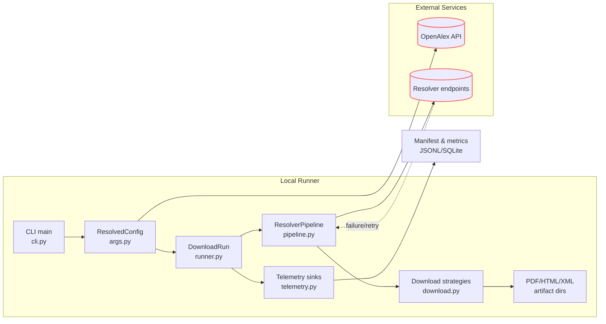
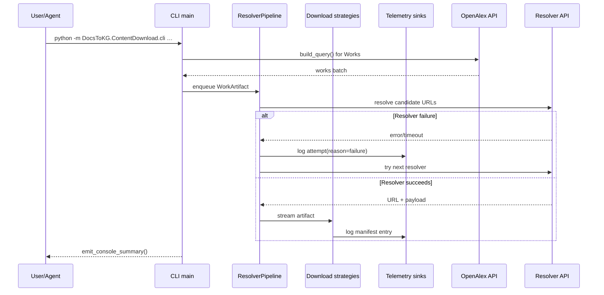

> _Metadata backlog_: owning_team, stability, versioning, codeowners, related_adrs, slos, data_handling, and sbom will be populated in a future revision.

## Table of Contents
- [DocsToKG • ContentDownload](#docstokg--contentdownload)
  - [Quickstart](#quickstart)
  - [CLI Quick Reference](#cli-quick-reference)
  - [Run Outputs](#run-outputs)
    - [Storage Layout & Lifecycle States](#storage-layout--lifecycle-states)
  - [Folder Map (top N)](#folder-map-top-n)
  - [System Overview](#system-overview)
  - [Run Lifecycle & Contracts](#run-lifecycle--contracts)
  - [Configuration Surfaces](#configuration-surfaces)
  - [Telemetry & Data Contracts](#telemetry--data-contracts)
  - [Error Handling & Diagnostics](#error-handling--diagnostics)
  - [Networking, Rate Limiting, and Politeness](#networking-rate-limiting-and-politeness)
  - [Interactions with Other Packages](#interactions-with-other-packages)
    - [Responsibilities & Contracts](#responsibilities--contracts)
    - [End-to-End Workflow](#end-to-end-workflow)
    - [CLI Surface (`ontofetch`)](#cli-surface-ontofetch)
    - [Module Reference Highlights](#module-reference-highlights)
    - [Extensibility & Testing](#extensibility--testing)
  - [OntologyDownload Deep Dive](#ontologydownload-deep-dive)
  - [Development & Testing](#development--testing)
  - [Operational Playbooks](#operational-playbooks)
  - [Agent Guardrails](#agent-guardrails)
  - [FAQ](#faq)

# DocsToKG • ContentDownload

Purpose: Coordinate resolver-driven acquisition of scholarly artifacts from OpenAlex metadata into local storage with manifest bookkeeping and telemetry.
Scope boundary: In-scope—resolver orchestration, HTTP download pipeline, caching/resume semantics, manifest/telemetry emission. Out-of-scope—knowledge graph ingestion, chunking/embedding, ontology alignment, downstream analytics.

---

## Quickstart

```bash
# Dev container (recommended)
# See openspec/AGENTS.md for container activation steps.

# Local
python -m venv .venv
source .venv/bin/activate
pip install -U pip
pip install -e ".[dev]"
# Optional but polite for OpenAlex/Unpaywall
export UNPAYWALL_EMAIL=you@example.org
python -m DocsToKG.ContentDownload.cli \
  --topic "machine learning" \
  --year-start 2023 \
  --year-end 2024 \
  --mailto you@example.org \
  --out runs/content \
  --staging \
  --resolver-preset fast \
  --workers 4
# Add --dry-run to exercise resolver coverage without writing files.
# Add --list-only to log resolver candidates without fetching content.
```

## CLI Quick Reference

- **Required selectors**: `--topic` or `--topic-id`, plus `--year-start` and `--year-end`. `resolve_topic_id_if_needed()` maps textual topics to OpenAlex IDs when possible.
- **Output layout**: `--out` points at the PDF root. `--staging` creates timestamped `PDF/`, `HTML/`, and `XML/` folders. `--html-out` and `--xml-out` override defaults. `--content-addressed` enables hashed storage with friendly symlinks.
- **Run controls**: `--max` caps processed works; `--dry-run` records resolver coverage only; `--list-only` skips HTTP downloads; `--workers` controls concurrency; `--sleep` throttles sequential runs; `--resume-from` reuses an existing manifest JSONL or CSV attempts log (the CSV path may live in any directory so long as a paired `*.sqlite3`/`*.sqlite` cache sits beside it); `--verify-cache-digest` recomputes SHA-256 for cache hits; OpenAlex pagination retries are tuned via `--openalex-retry-attempts` (default 3 retries), `--openalex-retry-backoff` (default 1.0 seconds, exponential with equal jitter), and `--openalex-max-retry-delay` (default 75 seconds, capping jitter and `Retry-After` sleeps).
- **Resolver configuration**: `--resolver-config` loads YAML/JSON that mirrors `ResolverConfig`. `--resolver-order`, `--resolver-preset {fast,broad}`, `--enable-resolver`, `--disable-resolver`, `--max-resolver-attempts`, `--resolver-timeout`, `--concurrent-resolvers`, `--max-concurrent-per-host`, `--domain-min-interval`, `--domain-token-bucket`, `--global-url-dedup`/`--no-global-url-dedup`, `--global-url-dedup-cap`, `--head-precheck`/`--no-head-precheck`, and `--accept` map directly to `ResolverConfig` fields.
- **Telemetry & logging**: `--manifest` overrides the manifest path; `--log-format {jsonl,csv}`, `--log-csv`, and `--log-rotate` tune sink behaviour. Selecting `--log-format csv` disables JSONL manifest emission in favour of CSV + SQLite outputs, so plan resumes on the same machine. `--warm-manifest-cache` preloads the SQLite manifest index for fast resume checks.
- **Classifier tuning**: `--sniff-bytes`, `--min-pdf-bytes`, and `--tail-check-bytes` adjust payload heuristics; HTML text extraction is enabled via `--extract-text html`.

## Run Outputs

- `manifest.jsonl` (plus `.001`, `.002`, … when `--log-rotate` is active) — JSONL attempts and manifest entries with `record_type` when `--log-format jsonl` is selected.
- `manifest.index.json` — incremental index keyed by URL for resolver dedupe.
- `manifest.summary.json` — aggregated resolver counts and latency metrics.
- `manifest.metrics.json` — human-readable summary produced by `summary.build_summary_record`.
- `manifest.last.csv` — most recent attempt per work for quick inspection.
- `manifest.sqlite3` — SQLite cache backing `ManifestUrlIndex` (`SQLITE_SCHEMA_VERSION = 4`).
- `manifest.csv` — attempts CSV produced when `--log-format csv` (JSONL disabled) or `--log-csv` is supplied.
- Artifact directories (`PDF/`, `HTML/`, `XML/`) rooted under `--out` (or staging run directory); HTML extraction writes `.txt` sidecars when enabled.
- Cached resume metadata (`sha256`, `etag`, `last_modified`) is embedded in manifest entries rather than separate files.

### Storage Layout & Lifecycle States

- **Run identifiers**: Each invocation generates a UUID `run_id` recorded in attempts/manifests and used to scope staging folders when `--staging` is enabled.
- **Content roots**: `DownloadConfig` coordinates sibling `PDF/`, `HTML/`, and `XML/` directories. When `--content-addressed` is set the pipeline additionally creates hashed payload paths and symlinks for human readability.
- **Resume caches**: JSONL manifests may rotate but remain co-located with a SQLite index (`manifest.sqlite3`) and lightweight index JSON (`manifest.index.json`). These files are treated as a unit when resuming.
- **Scratch space**: Temporary files live beside their destination (`*.part` suffix) during streaming writes to support atomic promotion and resumable downloads.

## Folder Map (top N)

- `src/DocsToKG/ContentDownload/cli.py` — CLI entry wiring argument parsing, telemetry setup, and the `DownloadRun` orchestrator.
- `src/DocsToKG/ContentDownload/args.py` — Argparse surface, `ResolvedConfig`, resolver bootstrap helpers (`load_resolver_config`, `resolve_topic_id_if_needed`).
- `src/DocsToKG/ContentDownload/runner.py` — `DownloadRun` lifecycle: sink initialisation, OpenAlex paging, worker orchestration, and summary emission.
- `src/DocsToKG/ContentDownload/pipeline.py` — `ResolverPipeline`, `ResolverConfig`, rate limiting, concurrency, and manifest bookkeeping primitives.
- `src/DocsToKG/ContentDownload/download.py` — Streaming download strategies, robots enforcement, resume handling, and artifact writers.
- `src/DocsToKG/ContentDownload/networking.py` — HTTP session factories, retry helpers, token buckets, conditional request utilities, and circuit breakers.
- `src/DocsToKG/ContentDownload/providers.py` — `WorkProvider` protocol and the `OpenAlexWorkProvider` adapter wrapping `pyalex.Works`.
- `src/DocsToKG/ContentDownload/core.py` — Shared enums (`Classification`, `ReasonCode`), classifiers, normalisation helpers, and the `WorkArtifact` data structure.
- `src/DocsToKG/ContentDownload/telemetry.py` — Manifest contracts (`MANIFEST_SCHEMA_VERSION = 3`), sink implementations, resume helpers (`load_previous_manifest`).
- `src/DocsToKG/ContentDownload/summary.py` — Run summary dataclass plus console reporting helpers.
- `src/DocsToKG/ContentDownload/statistics.py` — Optional runtime statistics and bandwidth sampling used by tests and diagnostics.
- `src/DocsToKG/ContentDownload/errors.py` — Structured download errors, actionable logging, and remediation messaging.
- `src/DocsToKG/ContentDownload/resolvers/` — Resolver implementations (Unpaywall, Crossref, ArXiv, Europe PMC, etc.) registered via `ResolverRegistry`.

## System Overview





## Run Lifecycle & Contracts

- Entry points: `DocsToKG.ContentDownload.cli:main()` and `python -m DocsToKG.ContentDownload.cli`.
- `args.resolve_config()` constructs an immutable `ResolvedConfig`. Mutate state via helpers (`bootstrap_run_environment`, `apply_config_overrides`) rather than dataclass mutation.
- `DownloadRun.run()` performs the orchestrated flow: `setup_sinks()` → `setup_resolver_pipeline()` → `setup_work_provider()` → `setup_download_state()` → per-work processing (sequential or threaded) followed by summary emission.
- Each `WorkArtifact` originates from `OpenAlexWorkProvider.iter_artifacts()` and is processed by `process_one_work()` which calls `ResolverPipeline.run()`; successful downloads invoke `download_candidate()` and strategy helpers.
- Telemetry sinks come from `telemetry.MultiSink`; every manifest record must include `record_type` and obey `MANIFEST_SCHEMA_VERSION`.
- Robots enforcement happens before any network preflights. When `RobotsCache.is_allowed()` denies a URL we log a skip outcome and bypass `head_precheck()` and subsequent HTTP requests entirely so disallowed origins never see traffic.
- Resume flow uses `telemetry.load_previous_manifest()` plus `ManifestUrlIndex`. When JSONL manifests are missing (for example when `--log-format csv` is active), the runner falls back to the SQLite cache and logs a warning so operators understand the resume locality constraint.

## Configuration Surfaces

- CLI flags in `args.py` hydrate `ResolverConfig`, `DownloadConfig`, and `DownloadContext` helpers. `DownloadOptions` remains as a compatibility shim that subclasses `DownloadConfig` for legacy imports.
- Resolver configuration files (`--resolver-config`) mirror `ResolverConfig` fields. Unknown keys raise `ValueError`; add new fields to `ResolverConfig` with defaults before accepting them via CLI.
- File overrides now cover concurrency and dedupe toggles: set `max_concurrent_resolvers` (must be >= 1) to fan out resolver threads per work item, and toggle `enable_global_url_dedup` to opt into or out of run-wide URL suppression.
- Environment variables:
  - `UNPAYWALL_EMAIL` — polite contact for Unpaywall resolver; fallback to `--mailto`.
  - `CORE_API_KEY`, `S2_API_KEY`, `DOAJ_API_KEY` — credentials for Core, Semantic Scholar, and DOAJ resolvers.
- Concurrency calculations derive from `workers * max_concurrent_resolvers`; high values (>32) log warnings but still honour token buckets and domain semaphores.

**Example resolver configuration (`resolvers/config.fast.yaml`)**

```yaml
# resolvers/config.fast.yaml
resolver_order:
  - openalex
  - unpaywall
  - crossref

max_concurrent_resolvers: 8
max_concurrent_per_host: 4
enable_global_url_dedup: false   # disable run-level dedupe when comparing resolver strategies
polite_headers:
  User-Agent: "DocsToKG-Downloader/1.0 (+mailto:you@example.org)"
  Accept: "application/pdf, text/html;q=0.9, */*;q=0.7"
resolver_toggles:
  wayback: false          # disable archival fallback unless explicitly needed
resolver_min_interval_s:
  unpaywall: 0.5          # seconds between resolver attempts
domain_token_buckets:
  crossref.org:
    rate_per_second: 4
    capacity: 12
    breaker_threshold: 15
    breaker_cooldown: 120
domain_content_rules:
  arxiv.org:
    allowed_types:
      - application/pdf
resolver_circuit_breakers:
  unpaywall:
    failure_threshold: 6
    cooldown_seconds: 90
```

> Keys map directly onto `ResolverConfig` fields. Unknown keys raise `ValueError`, so extend the dataclasses before using new options. Domain rate limits cascade to the networking layer’s token buckets, and resolver-specific toggles override defaults on a per-provider basis.

## Telemetry & Data Contracts

- Manifest and attempt records conform to `telemetry.ManifestEntry` (`MANIFEST_SCHEMA_VERSION = 3`); attempt payloads use `pipeline.AttemptRecord`.
- SQLite manifests use `SQLITE_SCHEMA_VERSION = 4`; consumers should access through `ManifestUrlIndex`.
- Summary payloads rely on `summary.build_summary_record()` and feed `manifest.summary.json` (machine-readable) and `manifest.metrics.json` (pretty-printed).
- CSV exports stay consistent with `scripts/export_attempts_csv.py` header ordering; update both sides when adding manifest fields.

## Error Handling & Diagnostics

- **Error taxonomy**: `errors.DownloadError`, `NetworkError`, `ContentPolicyError`, and `RateLimitError` capture structured context (`url`, `reason_code`, retryability). `download.log_download_failure()` converts them into consistent machine-readable log entries.
- **Reason codes**: `core.ReasonCode` enumerations (e.g., `robots_blocked`, `content_policy_violation`, `duplicate_url`) appear in manifest attempts and summaries. Downstream analytics rely on these enums—extend with care.
- **Console summaries**: `summary.emit_console_summary()` mirrors the JSON `manifest.metrics.json`, ensuring quick human feedback without parsing files.
- **Runtime counters**: `statistics.DownloadStatistics` and `ResolverStats` aggregate latency, byte, and success metrics per resolver. When enabled, these values flow into `summary` and `telemetry` sinks.
- **Troubleshooting pointers**:
  - Repeated `rate_limit` reasons signal token buckets that are too restrictive; consider lowering concurrency or relaxing the relevant `rate_limits` entry.
  - `content_policy_violation` indicates MIME types outside the configured allow-list—add the missing content type under `ResolverConfig.accept`.
  - `robots_blocked` shows the target host forbids automated access; only override with `--ignore-robots` when policy allows.

## Networking, Rate Limiting, and Politeness

- **Session factories**: `networking.ThreadLocalSessionFactory` provisions thread-scoped `requests.Session` instances, reusing pooled adapters while keeping sockets isolated per worker thread.
- **Retry policy**: `networking.request_with_retries()` implements capped exponential backoff with equal jitter, respecting `Retry-After` headers and the CLI’s `--openalex-*` tuning.
- **Token buckets & circuit breakers**: Domain- and resolver-level throttles are expressed via `TokenBucket` configs. Over-aggressive concurrency triggers polite sleeps rather than hard failures; persistent errors trip `CircuitBreaker` instances to give upstream services breathing room.
- **Robots enforcement**: `download.RobotsCache` fetches and caches `robots.txt`, short-circuiting resolvers when disallowed. Setting `--ignore-robots` bypasses the cache but is discouraged for production runs.
- **Conditional requests**: `networking.ConditionalRequestHelper` synthesises `If-None-Match`/`If-Modified-Since` headers so cached downloads can leverage HTTP 304 responses. Manifest records capture the resulting etag/last-modified data for later resumptions.
- **Bandwidth sampling**: `statistics.BandwidthTracker` (opt-in for diagnostics/tests) records time-windowed throughput; values surface in telemetry when enabled to help right-size concurrency.

## Interactions with Other Packages

- Upstream: `pyalex.Works` and `pyalex.Topics` supply metadata; CLI sets `pyalex.config.email` for polite API usage.
- Networking: all HTTP flows run through `requests` sessions configured in `networking.create_session()` with pooled adapters, circuit breakers, and token buckets.
- Downstream: `tools/manifest_to_index.py`, `tools/manifest_to_csv.py`, and `scripts/export_attempts_csv.py` expect stable manifest fields and JSONL structure.
- Guarantees: file naming (`slugify`) and SHA-256 digests remain stable to support resume semantics. Maintain robots compliance unless explicitly bypassed (`--ignore-robots`).

## OntologyDownload Deep Dive

The companion `DocsToKG.OntologyDownload` package (historically imported as `ontology_download`) is the ontology acquisition stack used by DocsToKG. It plans resolver fallbacks, streams artifacts into managed storage, normalises releases, and enforces schema guarantees for downstream ingestion clients.

### Responsibilities & Contracts
- Plans downloads from configuration/YAML (`FetchSpec`) and strict allowlists, emitting reproducible lockfiles (`ontologies.lock.json`) and manifest metadata (`MANIFEST_SCHEMA_VERSION = "1.0"` in `src/DocsToKG/OntologyDownload/planning.py`).
- Executes hardened HTTP streams via `io/network.py` (`StreamingDownloader`, `SessionPool`, TLS/policy validation) with shared rate limits (`io/rate_limit.py`) and checksum reconciliation (`checksums.py`).
- Normalises and validates payloads through `validation.py`, which orchestrates ROBOT, rdflib, Pronto, Owlready2, Arelle, and plugin validators with cooperative cancellation (`cancellation.py`) and budgeted concurrency.
- Persists ontology releases into pluggable storage backends (`settings.LocalStorageBackend` by default under `~/.data/ontology-fetcher/ontologies`, or `FsspecStorageBackend` when `ONTOFETCH_STORAGE_URL` is set) while emitting structured telemetry (`logging_utils.py` JSON logs, rotation, retention).
- Maintains compatibility via `manifests.py`/`migrations.py` (lock/manifest schema `1.0`) and the public API contract enumerated in `exports.py`/`__init__.py` (`PUBLIC_API_MANIFEST`).

### End-to-End Workflow
1. **Configuration** – `settings.get_default_config()` (Pydantic `ResolvedConfig`) merges defaults, environment overrides (`CACHE_DIR`, `LOG_DIR`, `LOCAL_ONTOLOGY_DIR`), per-resolver rate limits, and validator budgets.
2. **Planning** – `planning.plan_all()` expands `FetchSpec` inputs from YAML (via `settings.load_config`) into `PlannedFetch` graphs, contacting resolvers with optional HTTP head probes and service metadata sniffing.
3. **Lock & Diff** – `manifests.write_lockfile()` and `compute_plan_diff()` snapshot resolver candidates, normalised metadata, and checksum expectations; `plan-diff` compares against baselines or stored manifests.
4. **Download Execution** – `planning.fetch_all()` submits threaded downloads (`concurrent_downloads` from defaults), coordinates cancellation tokens, enforces per-host buckets, and streams payloads into staging directories guarded by `_version_lock()` file locks.
5. **Checksum & Integrity** – `checksums.ExpectedChecksum` attaches expected digests from configuration/resolver extras; `parse_checksum_url_extra()` can dereference remote checksum manifests with bounded fetch sizes.
6. **Validation & Normalisation** – `validation.run_validators()` multiplexes validator plugins, process pools (when `defaults.validation.use_process_pool`), size caps, and streaming normalisation thresholds; outputs (`ValidationResult`) feed manifest entries.
7. **Manifest & Storage** – `manifests.results_to_dict()` serialises attempt history, metadata, and target artifacts; `STORAGE.finalize_version()` promotes staged directories into the long-lived storage tree; manifests are materialised adjacent to artifact directories.
8. **Telemetry & Observability** – `logging_utils.setup_logging()` rotates JSONL logs with masked secrets, `checksums`/`planning` inject structured `logging.LoggerAdapter` context (correlation/ontology IDs), and CLI commands expose health (`doctor`) and plugins (`plugins`).

### CLI Surface (`ontofetch`)
- `pull` downloads one or more ontologies, honouring `--spec configs/sources.yaml`, resolver overrides, format lists, lockfiles (`--lock`), dry runs, and concurrency flags.
- `plan` generates resolver plans without fetching, with `--since`, probe toggles, `--lock-output`, and `--no-lock` controls.
- `plan-diff` compares freshly planned metadata against `~/.data/ontology-fetcher/cache/plans/baseline.json`, stored manifests (`--use-manifest`), or arbitrary baselines, optionally updating the baseline.
- `plugins` enumerates resolver/validator entry points (`docstokg.ontofetch.{resolver,validator}`) in table or JSON form.
- `show` inspects stored metadata/manifests for a specific ontology (`--versions` lists available releases).
- `validate` re-runs validators for a stored version with fine-grained toggles (`--rdflib`, `--robot`, etc.) and JSON summaries.
- `init` scaffolds an example `sources.yaml`; `config validate` runs JSON-schema validation against configuration files.
- `doctor` surfaces environment diagnostics, missing optional dependencies, and (with `--fix`) creates directories / rotates logs.
- `prune` enforces retention (`--keep`, `--older-than`, `--ids`, `--dry-run`) against the storage backend, reporting as JSON when requested.

### Module Reference Highlights
- `src/DocsToKG/OntologyDownload/api.py` – Public facade exposing `plan_all`, `fetch_all`, `run_validators`, plugin listings, and CLI entry points (`cli_main`, `validator_worker_main`), while masking sensitive data.
- `src/DocsToKG/OntologyDownload/planning.py` – Core orchestration (`FetchSpec`, `PlannedFetch`, `FetchResult`, batch fetch thread pool, checksum plumbing, manifest schema definition, per-version lockfiles).
- `src/DocsToKG/OntologyDownload/resolvers.py` – Built-in resolvers (OBO, OLS, BioPortal, LOV, SKOS, Direct, XBRL, Ontobee) plus plugin registry; applies license normalisation, host validation, and retry/backoff policies.
- `src/DocsToKG/OntologyDownload/io/network.py` & `io/rate_limit.py` – Session pooling, DNS pinning, TLS verification, Retry-After handling, shared token buckets (`SharedTokenBucket`, `RateLimiterRegistry`), and polite header injection.
- `src/DocsToKG/OntologyDownload/io/filesystem.py` – Archive extraction guards (`extract_*_safe`), filename sanitisation, SHA-256 helpers, correlation IDs, and disk quota tracking used during staging/finalisation.
- `src/DocsToKG/OntologyDownload/validation.py` – Validator registry loading, semaphore budgeting, optional process pools, memory instrumentation, and structured result serialization (`ValidationRequest`, `ValidationResult`, `ValidationTimeout`).
- `src/DocsToKG/OntologyDownload/settings.py` – Typed configuration models (`DownloadConfiguration`, `ValidationConfiguration`, `LoggingConfiguration`, `ResolvedConfig`), environment overrides, fsspec-backed storage, and optional dependency resolution (`get_rdflib`, `get_pronto`, etc.).
- `src/DocsToKG/OntologyDownload/manifests.py` & `migrations.py` – Manifest/lockfile writers, diff helpers, plan-to-dict normalisation, schema upgrades, and metadata collection utilities reused by CLI subcommands.
- `src/DocsToKG/OntologyDownload/plugins.py` & `optdeps.py` – Entry-point discovery, registry caching, runtime plugin registration/unregistration, and optional dependency stubs for resolver/validator ecosystems.
- `src/DocsToKG/OntologyDownload/checksums.py` – Normalises checksum extras, fetches remote checksum manifests with bounded memory, and integrates with download retries/token buckets.
- `src/DocsToKG/OntologyDownload/errors.py` – Exception taxonomy (`OntologyDownloadError`, `ResolverError`, `PolicyError`, `DownloadFailure`, `ValidationError`) consumed by CLI and API surfaces.
- `src/DocsToKG/OntologyDownload/logging_utils.py` – JSON log formatter, retention/rotation, gzip archival, and CLI-integrated cleanup routines.
- `src/DocsToKG/OntologyDownload/testing/` – Fixtures, fake resolvers, and sandbox harnesses powering `tests/ontology_download/*`.

### Extensibility & Testing
- Resolver/validator plugins register via `docstokg.ontofetch.resolver` / `docstokg.ontofetch.validator` entry points, with metadata exposed through `api.list_plugins()` and enforced by `plugins.ensure_*` guards.
- Tests live under `tests/ontology_download/` covering CLI flows, resolvers, configuration, validation, guardrails, and import-time budgets; golden fixtures reside in `tests/ontology_download/fixtures/`.
- Optional dependencies (rdflib, pronto, owlready2, pystow, fsspec, ontoportal-client, ols-client) are dynamically imported with clear error messages when missing; stubs allow lightweight testing via `optdeps`.
- When changing schema contracts or storage layouts, update `MANIFEST_SCHEMA_VERSION`/`LOCKFILE_SCHEMA_VERSION` together with `migrations.py` and the downstream docs under `docs/04-api/DocsToKG.OntologyDownload.*`.

## Development & Testing

```bash
ruff check src/DocsToKG/ContentDownload tests/content_download
mypy src/DocsToKG/ContentDownload
pytest -q tests/cli/test_cli_flows.py
pytest -q tests/content_download/test_runner_download_run.py
pytest -q tests/content_download/test_download_strategy_helpers.py
# Smoke test:
python -m DocsToKG.ContentDownload.cli --topic "vision" --year-start 2024 --year-end 2024 --max 5 --dry-run --manifest tmp/manifest.jsonl
```

## Operational Playbooks

- **Resume interrupted run**: `python -m DocsToKG.ContentDownload.cli --resume-from runs/content/manifest.jsonl --staging --out runs/content` picks up where a JSONL manifest left off. Include the matching SQLite cache if relocating runs across machines.
- **Convert attempts to CSV/Parquet**: Use `scripts/export_attempts_csv.py manifest.jsonl --out manifest.csv` or pair with downstream notebooks. Always keep the SQLite cache in sync when distributing CSVs.
- **Inspect resolver health**: `jq 'select(.record_type=="attempt") | .resolver_name, .reason' runs/content/manifest.jsonl | sort | uniq -c` highlights dominant failure modes. Matching metrics land in `manifest.metrics.json`.
- **Purge cached artifacts safely**: Remove run directories as a unit (artifact folders + `manifest.*` + `manifest.sqlite3`) to avoid orphaned resume state. If you must trim space selectively, regenerate manifests immediately to keep indexes coherent.
- **Verify concurrency posture**: `python -m DocsToKG.ContentDownload.cli ... --dry-run --log-format jsonl` captures attempt metadata without downloading; inspect `latency_ms` in `manifest.metrics.json` before scaling `--workers`.

## Agent Guardrails

- Do:
  - Preserve manifest schemas and bump `MANIFEST_SCHEMA_VERSION`/`SQLITE_SCHEMA_VERSION` in lockstep with downstream tooling.
  - Register new resolvers via `resolvers/__init__.py` so toggles and ordering remain centralised.
  - Maintain `ResolvedConfig` immutability; extend helper constructors when introducing fields.
  - Keep token bucket and circuit breaker defaults polite; document any relaxation.
- Do not:
  - Remove telemetry sinks or change `record_type` values without coordinating analytics consumers.
  - Disable robots enforcement or polite headers in committed code paths without explicit approval.
  - Commit credentials or widen rate limits beyond provider policies.
- Danger zone:
  - `rm -rf runs/content` (or similar) deletes cached artifacts and resume history—back up before purging.
  - `python -m DocsToKG.ContentDownload.cli --ignore-robots` bypasses robots.txt and should only run with explicit authorisation.

## FAQ

- Q: How do I resume a partially completed download run?
  A: Supply `--resume-from <manifest.jsonl>` (or the staging manifest path). CSV attempts logs are also supported when a paired SQLite cache (`*.sqlite3`/`*.sqlite`) lives next to the CSV—even if the resume target is outside the active manifest directory. The runner uses the SQLite index plus JSONL history (including rotated files) to skip completed works.

- Q: How can I target only open-access works?
  A: Add `--oa-only` so the Works query filters to open-access items before resolver execution.

- Q: What is the safest way to test resolver changes?
  A: Use `--dry-run --max <N>` to gather coverage without writing files. Inspect JSONL attempts via `jq` or `scripts/export_attempts_csv.py`, then drop `--dry-run` once satisfied.

- Q: How can I verify manifest integrity when reusing cached artifacts?
  A: Run with `--verify-cache-digest` to recompute SHA-256 for cache hits; the manifest will include refreshed hashes and mtimes.

- Q: How can I rotate telemetry logs for long sessions?
  A: Pass `--log-rotate 250MB` so `RotatingJsonlSink` handles rollover. Resumes read all rotated segments automatically.

- Q: What if I only need resolver coverage without downloads?
  A: Combine `--dry-run` with `--list-only` when you want manifest-level URL logging but no HTTP GETs.

```json x-agent-map
{
  "entry_points": [
    { "type": "cli", "module": "DocsToKG.ContentDownload.cli", "commands": ["main"] }
  ],
  "env": [
    { "name": "UNPAYWALL_EMAIL", "default": null, "required": false },
    { "name": "CORE_API_KEY", "default": null, "required": false },
    { "name": "S2_API_KEY", "default": null, "required": false },
    { "name": "DOAJ_API_KEY", "default": null, "required": false }
  ],
  "schemas": [
    { "kind": "jsonl", "path": "src/DocsToKG/ContentDownload/telemetry.py", "description": "ManifestEntry schema and MANIFEST_SCHEMA_VERSION" }
  ],
  "artifacts_out": [
    { "path": "runs/content/**", "consumed_by": ["../reports", "../tools"] },
    { "path": "runs/content/**/manifest.jsonl", "consumed_by": ["tools/manifest_to_index.py", "scripts/export_attempts_csv.py"] },
    { "path": "runs/content/**/manifest.sqlite3", "consumed_by": ["src/DocsToKG/ContentDownload/telemetry.py"] }
  ],
  "danger_zone": [
    { "command": "rm -rf runs/content pdfs html xml", "effect": "Deletes cached/downloaded artifacts and resume data" },
    { "command": "python -m DocsToKG.ContentDownload.cli --ignore-robots", "effect": "Bypasses robots.txt protections" }
  ]
}
```
