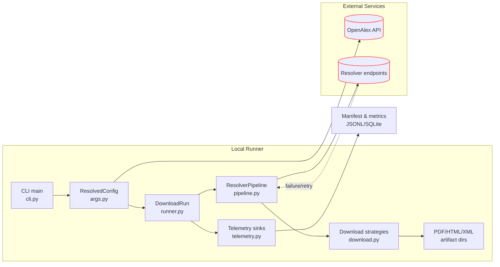
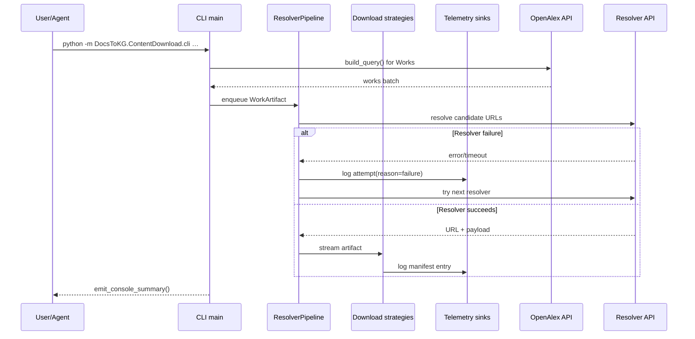

# DocsToKG • ContentDownload

Purpose: Coordinate resolver-driven acquisition of scholarly artifacts from OpenAlex metadata into local storage with manifest bookkeeping and telemetry.
Scope boundary: In-scope—resolver orchestration, HTTP download pipeline, caching/resume semantics, manifest/telemetry emission. Out-of-scope—knowledge graph ingestion, chunking/embedding, ontology alignment, downstream analytics.

---

## Quickstart

```bash
# Dev container (recommended)
# See openspec/AGENTS.md for container activation steps.

# Local
python -m venv .venv
source .venv/bin/activate
pip install -U pip
pip install -e ".[dev]"
# Optional but polite for OpenAlex/Unpaywall
export UNPAYWALL_EMAIL=you@example.org
python -m DocsToKG.ContentDownload.cli \
  --topic "machine learning" \
  --year-start 2023 \
  --year-end 2024 \
  --mailto you@example.org \
  --out runs/content \
  --staging \
  --resolver-preset fast \
  --workers 4
# Add --dry-run to exercise resolver coverage without writing files.
# Add --list-only to log resolver candidates without fetching content.
```

## CLI Quick Reference

- **Required selectors**: `--topic` or `--topic-id`, plus `--year-start` and `--year-end`. `resolve_topic_id_if_needed()` maps textual topics to OpenAlex IDs when possible.
- **Output layout**: `--out` points at the PDF root. `--staging` creates timestamped `PDF/`, `HTML/`, and `XML/` folders. `--html-out` and `--xml-out` override defaults. `--content-addressed` enables hashed storage with friendly symlinks.
- **Run controls**: `--max` caps processed works; `--dry-run` records resolver coverage only; `--list-only` skips HTTP downloads; `--workers` controls concurrency; `--sleep` throttles sequential runs; `--resume-from` reuses an existing manifest JSONL or CSV attempts log (the CSV path may live in any directory so long as a paired `*.sqlite3`/`*.sqlite` cache sits beside it); `--verify-cache-digest` recomputes SHA-256 for cache hits; OpenAlex pagination retries are tuned via `--openalex-retry-attempts` (default 3 retries) and `--openalex-retry-backoff` (default 1.0 seconds, exponential).
- **Resolver configuration**: `--resolver-config` loads YAML/JSON that mirrors `ResolverConfig`. `--resolver-order`, `--resolver-preset {fast,broad}`, `--enable-resolver`, `--disable-resolver`, `--max-resolver-attempts`, `--resolver-timeout`, `--concurrent-resolvers`, `--max-concurrent-per-host`, `--domain-min-interval`, `--domain-token-bucket`, `--head-precheck`/`--no-head-precheck`, and `--accept` map directly to `ResolverConfig` fields.
- **Telemetry & logging**: `--manifest` overrides the manifest path; `--log-format {jsonl,csv}`, `--log-csv`, and `--log-rotate` tune sink behaviour. Selecting `--log-format csv` disables JSONL manifest emission in favour of CSV + SQLite outputs, so plan resumes on the same machine. `--warm-manifest-cache` preloads the SQLite manifest index for fast resume checks.
- **Classifier tuning**: `--sniff-bytes`, `--min-pdf-bytes`, and `--tail-check-bytes` adjust payload heuristics; HTML text extraction is enabled via `--extract-text html`.

## Run Outputs

- `manifest.jsonl` (plus `.001`, `.002`, … when `--log-rotate` is active) — JSONL attempts and manifest entries with `record_type` when `--log-format jsonl` is selected.
- `manifest.index.json` — incremental index keyed by URL for resolver dedupe.
- `manifest.summary.json` — aggregated resolver counts and latency metrics.
- `manifest.metrics.json` — human-readable summary produced by `summary.build_summary_record`.
- `manifest.last.csv` — most recent attempt per work for quick inspection.
- `manifest.sqlite3` — SQLite cache backing `ManifestUrlIndex` (`SQLITE_SCHEMA_VERSION = 4`).
- `manifest.csv` — attempts CSV produced when `--log-format csv` (JSONL disabled) or `--log-csv` is supplied.
- Artifact directories (`PDF/`, `HTML/`, `XML/`) rooted under `--out` (or staging run directory); HTML extraction writes `.txt` sidecars when enabled.
- Cached resume metadata (`sha256`, `etag`, `last_modified`) is embedded in manifest entries rather than separate files.

## Folder Map (top N)

- `src/DocsToKG/ContentDownload/cli.py` — CLI entry wiring argument parsing, telemetry setup, and the `DownloadRun` orchestrator.
- `src/DocsToKG/ContentDownload/args.py` — Argparse surface, `ResolvedConfig`, resolver bootstrap helpers (`load_resolver_config`, `resolve_topic_id_if_needed`).
- `src/DocsToKG/ContentDownload/runner.py` — `DownloadRun` lifecycle: sink initialisation, OpenAlex paging, worker orchestration, and summary emission.
- `src/DocsToKG/ContentDownload/pipeline.py` — `ResolverPipeline`, `ResolverConfig`, rate limiting, concurrency, and manifest bookkeeping primitives.
- `src/DocsToKG/ContentDownload/download.py` — Streaming download strategies, robots enforcement, resume handling, and artifact writers.
- `src/DocsToKG/ContentDownload/networking.py` — HTTP session factories, retry helpers, token buckets, conditional request utilities, and circuit breakers.
- `src/DocsToKG/ContentDownload/providers.py` — `WorkProvider` protocol and the `OpenAlexWorkProvider` adapter wrapping `pyalex.Works`.
- `src/DocsToKG/ContentDownload/core.py` — Shared enums (`Classification`, `ReasonCode`), classifiers, normalisation helpers, and the `WorkArtifact` data structure.
- `src/DocsToKG/ContentDownload/telemetry.py` — Manifest contracts (`MANIFEST_SCHEMA_VERSION = 3`), sink implementations, resume helpers (`load_previous_manifest`).
- `src/DocsToKG/ContentDownload/summary.py` — Run summary dataclass plus console reporting helpers.
- `src/DocsToKG/ContentDownload/statistics.py` — Optional runtime statistics and bandwidth sampling used by tests and diagnostics.
- `src/DocsToKG/ContentDownload/errors.py` — Structured download errors, actionable logging, and remediation messaging.
- `src/DocsToKG/ContentDownload/resolvers/` — Resolver implementations (Unpaywall, Crossref, ArXiv, Europe PMC, etc.) registered via `ResolverRegistry`.

## System Overview





## Run Lifecycle & Contracts

- Entry points: `DocsToKG.ContentDownload.cli:main()` and `python -m DocsToKG.ContentDownload.cli`.
- `args.resolve_config()` constructs an immutable `ResolvedConfig`. Mutate state via helpers (`bootstrap_run_environment`, `apply_config_overrides`) rather than dataclass mutation.
- `DownloadRun.run()` performs the orchestrated flow: `setup_sinks()` → `setup_resolver_pipeline()` → `setup_work_provider()` → `setup_download_state()` → per-work processing (sequential or threaded) followed by summary emission.
- Each `WorkArtifact` originates from `OpenAlexWorkProvider.iter_artifacts()` and is processed by `process_one_work()` which calls `ResolverPipeline.run()`; successful downloads invoke `download_candidate()` and strategy helpers.
- Telemetry sinks come from `telemetry.MultiSink`; every manifest record must include `record_type` and obey `MANIFEST_SCHEMA_VERSION`.
- Robots enforcement happens before any network preflights. When `RobotsCache.is_allowed()` denies a URL we log a skip outcome and bypass `head_precheck()` and subsequent HTTP requests entirely so disallowed origins never see traffic.
- Resume flow uses `telemetry.load_previous_manifest()` plus `ManifestUrlIndex`. When JSONL manifests are missing (for example when `--log-format csv` is active), the runner falls back to the SQLite cache and logs a warning so operators understand the resume locality constraint.

## Configuration Surfaces

- CLI flags in `args.py` hydrate `ResolverConfig`, `DownloadConfig`, and `DownloadContext` helpers. `DownloadOptions` remains as a compatibility shim that subclasses `DownloadConfig` for legacy imports.
- Resolver configuration files (`--resolver-config`) mirror `ResolverConfig` fields. Unknown keys raise `ValueError`; add new fields to `ResolverConfig` with defaults before accepting them via CLI.
- Environment variables:
  - `UNPAYWALL_EMAIL` — polite contact for Unpaywall resolver; fallback to `--mailto`.
  - `CORE_API_KEY`, `S2_API_KEY`, `DOAJ_API_KEY` — credentials for Core, Semantic Scholar, and DOAJ resolvers.
- Concurrency calculations derive from `workers * max_concurrent_resolvers`; high values (>32) log warnings but still honour token buckets and domain semaphores.

## Telemetry & Data Contracts

- Manifest and attempt records conform to `telemetry.ManifestEntry` (`MANIFEST_SCHEMA_VERSION = 3`); attempt payloads use `pipeline.AttemptRecord`.
- SQLite manifests use `SQLITE_SCHEMA_VERSION = 4`; consumers should access through `ManifestUrlIndex`.
- Summary payloads rely on `summary.build_summary_record()` and feed `manifest.summary.json` (machine-readable) and `manifest.metrics.json` (pretty-printed).
- CSV exports stay consistent with `scripts/export_attempts_csv.py` header ordering; update both sides when adding manifest fields.

## Interactions with Other Packages

- Upstream: `pyalex.Works` and `pyalex.Topics` supply metadata; CLI sets `pyalex.config.email` for polite API usage.
- Networking: all HTTP flows run through `requests` sessions configured in `networking.create_session()` with pooled adapters, circuit breakers, and token buckets.
- Downstream: `tools/manifest_to_index.py`, `tools/manifest_to_csv.py`, and `scripts/export_attempts_csv.py` expect stable manifest fields and JSONL structure.
- Guarantees: file naming (`slugify`) and SHA-256 digests remain stable to support resume semantics. Maintain robots compliance unless explicitly bypassed (`--ignore-robots`).

## Development & Testing

```bash
ruff check src/DocsToKG/ContentDownload tests/content_download
mypy src/DocsToKG/ContentDownload
pytest -q tests/cli/test_cli_flows.py
pytest -q tests/content_download/test_runner_download_run.py
pytest -q tests/content_download/test_download_strategy_helpers.py
# Smoke test:
python -m DocsToKG.ContentDownload.cli --topic "vision" --year-start 2024 --year-end 2024 --max 5 --dry-run --manifest tmp/manifest.jsonl
```

## Agent Guardrails

- Do:
  - Preserve manifest schemas and bump `MANIFEST_SCHEMA_VERSION`/`SQLITE_SCHEMA_VERSION` in lockstep with downstream tooling.
  - Register new resolvers via `resolvers/__init__.py` so toggles and ordering remain centralised.
  - Maintain `ResolvedConfig` immutability; extend helper constructors when introducing fields.
  - Keep token bucket and circuit breaker defaults polite; document any relaxation.
- Do not:
  - Remove telemetry sinks or change `record_type` values without coordinating analytics consumers.
  - Disable robots enforcement or polite headers in committed code paths without explicit approval.
  - Commit credentials or widen rate limits beyond provider policies.
- Danger zone:
  - `rm -rf runs/content` (or similar) deletes cached artifacts and resume history—back up before purging.
  - `python -m DocsToKG.ContentDownload.cli --ignore-robots` bypasses robots.txt and should only run with explicit authorisation.

## FAQ

- Q: How do I resume a partially completed download run?
  A: Supply `--resume-from <manifest.jsonl>` (or the staging manifest path). CSV attempts logs are also supported when a paired SQLite cache (`*.sqlite3`/`*.sqlite`) lives next to the CSV—even if the resume target is outside the active manifest directory. The runner uses the SQLite index plus JSONL history (including rotated files) to skip completed works.

- Q: How can I target only open-access works?
  A: Add `--oa-only` so the Works query filters to open-access items before resolver execution.

- Q: What is the safest way to test resolver changes?
  A: Use `--dry-run --max <N>` to gather coverage without writing files. Inspect JSONL attempts via `jq` or `scripts/export_attempts_csv.py`, then drop `--dry-run` once satisfied.

- Q: How can I verify manifest integrity when reusing cached artifacts?
  A: Run with `--verify-cache-digest` to recompute SHA-256 for cache hits; the manifest will include refreshed hashes and mtimes.

- Q: How can I rotate telemetry logs for long sessions?
  A: Pass `--log-rotate 250MB` so `RotatingJsonlSink` handles rollover. Resumes read all rotated segments automatically.

- Q: What if I only need resolver coverage without downloads?
  A: Combine `--dry-run` with `--list-only` when you want manifest-level URL logging but no HTTP GETs.

```json x-agent-map
{
  "entry_points": [
    { "type": "cli", "module": "DocsToKG.ContentDownload.cli", "commands": ["main"] }
  ],
  "env": [
    { "name": "UNPAYWALL_EMAIL", "default": null, "required": false },
    { "name": "CORE_API_KEY", "default": null, "required": false },
    { "name": "S2_API_KEY", "default": null, "required": false },
    { "name": "DOAJ_API_KEY", "default": null, "required": false }
  ],
  "schemas": [
    { "kind": "jsonl", "path": "src/DocsToKG/ContentDownload/telemetry.py", "description": "ManifestEntry schema and MANIFEST_SCHEMA_VERSION" }
  ],
  "artifacts_out": [
    { "path": "runs/content/**", "consumed_by": ["../reports", "../tools"] },
    { "path": "runs/content/**/manifest.jsonl", "consumed_by": ["tools/manifest_to_index.py", "scripts/export_attempts_csv.py"] },
    { "path": "runs/content/**/manifest.sqlite3", "consumed_by": ["src/DocsToKG/ContentDownload/telemetry.py"] }
  ],
  "danger_zone": [
    { "command": "rm -rf runs/content pdfs html xml", "effect": "Deletes cached/downloaded artifacts and resume data" },
    { "command": "python -m DocsToKG.ContentDownload.cli --ignore-robots", "effect": "Bypasses robots.txt protections" }
  ]
}
```
