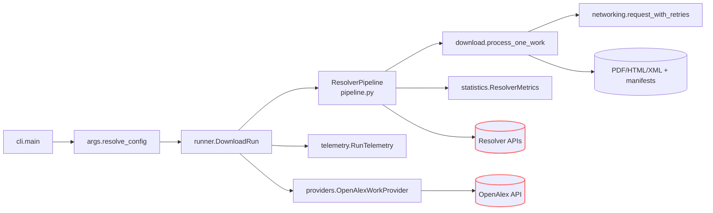

> _Metadata backlog_: owning_team, stability, versioning, codeowners, related_adrs, slos, data_handling, and sbom will be populated in a future revision.

## Table of Contents
- [DocsToKG • ContentDownload](#docstokg--contentdownload)
  - [Quickstart](#quickstart)
  - [CLI Quick Reference](#cli-quick-reference)
  - [Run Outputs](#run-outputs)
    - [Storage Layout & Lifecycle States](#storage-layout--lifecycle-states)
  - [Folder Map (Top Modules)](#folder-map-top-modules)
  - [System Overview](#system-overview)
  - [Run Lifecycle & Contracts](#run-lifecycle--contracts)
  - [Configuration Surfaces](#configuration-surfaces)
  - [Telemetry & Data Contracts](#telemetry--data-contracts)
  - [Error Handling & Diagnostics](#error-handling--diagnostics)
  - [Networking, Rate Limiting, and Politeness](#networking-rate-limiting-and-politeness)
  - [Interactions with Other Packages](#interactions-with-other-packages)
  - [Resolver & Download Deep Dive](#resolver--download-deep-dive)
  - [Development & Testing](#development--testing)
  - [Operational Playbooks](#operational-playbooks)
  - [Agent Guardrails](#agent-guardrails)
  - [FAQ](#faq)

# DocsToKG • ContentDownload

Purpose: Coordinate resolver-driven acquisition of scholarly artifacts sourced from OpenAlex metadata into local storage while emitting durable manifest/telemetry records that downstream knowledge-graph builders consume.

Scope boundary: In-scope—resolver orchestration, HTTP download pipeline, caching/resume semantics, manifest/telemetry emission, polite networking safeguards. Out-of-scope—knowledge graph ingestion, chunking/embedding, ontology alignment, downstream analytics.

---

## Quickstart

```bash
# Dev container (recommended)
# See openspec/AGENTS.md for container activation steps.

# Local (managed virtualenv; no installs)
export PIP_REQUIRE_VIRTUALENV=1 PIP_NO_INDEX=1 PYTHONNOUSERSITE=1
test -x .venv/bin/python || { echo "Missing .venv — STOP (no installs)."; exit 1; }

# Optional but polite for OpenAlex/Unpaywall
export UNPAYWALL_EMAIL=you@example.org

# Wrapper workflow keeps tooling scoped
./scripts/dev.sh doctor
./scripts/dev.sh python -m DocsToKG.ContentDownload.cli --help

# Direct invocation (no activation required)
./.venv/bin/python -m DocsToKG.ContentDownload.cli \
  --topic "machine learning" \
  --year-start 2023 \
  --year-end 2024 \
  --mailto you@example.org \
  --out runs/content \
  --staging \
  --resolver-preset fast \
  --workers 4 \
  --dry-run
# Remove --dry-run to fetch artifacts; add --list-only to log resolver candidates only.
```

- When bootstrapping this repository on a fresh machine, create `.venv` and run `pip install -e ".[dev]"` before switching back to the managed-venv workflow above.

## CLI Quick Reference

- **Selectors & filters**: `--topic` (free text), `--topic-id`, `--year-start`, `--year-end`, `--per-page` (1–200), `--oa-only`. `resolve_topic_id_if_needed()` upgrades free-text topics to OpenAlex IDs when possible.
- **Output layout**: `--out` controls the PDF root; `--html-out`/`--xml-out` override sibling locations; `--staging` produces timestamped `PDF/`, `HTML/`, `XML/` folders; `--content-addressed` moves finalized payloads into hashed directories while leaving friendly symlinks behind.
- **Run controls**: `--max`, `--workers`, `--sleep` (defaults to 0.05 for sequential runs and is automatically disabled when `--workers > 1` unless explicitly provided), `--mailto`, `--dry-run`, `--list-only`, `--ignore-robots`, `--resume-from`, `--verify-cache-digest`, `--warm-manifest-cache`, `--log-format {jsonl,csv}`, `--log-csv`, `--log-rotate SIZE`.
- **Pagination & retries**: `--openalex-retry-attempts`, `--openalex-retry-backoff`, `--openalex-retry-max-delay`, and `--retry-after-cap` configure `iterate_openalex()` and downstream resolver retry ceilings (equal-jitter backoff, honouring `Retry-After`).
- **Resolver configuration**: `--resolver-config` (YAML/JSON), `--resolver-order`, `--resolver-preset {fast,broad}`, `--enable-resolver`, `--disable-resolver`, `--max-resolver-attempts`, `--resolver-timeout`, `--concurrent-resolvers`, `--max-concurrent-per-host`, `--domain-min-interval`, `--domain-token-bucket`, `--global-url-dedup`/`--no-global-url-dedup`, `--global-url-dedup-cap`, `--head-precheck`/`--no-head-precheck`, `--accept`, plus credential overrides (`--unpaywall-email`, `--core-api-key`, `--semantic-scholar-api-key`, `--doaj-api-key`).
- **Classifier & extraction tuning**: `--sniff-bytes`, `--min-pdf-bytes`, `--tail-check-bytes`, `--extract-text {html,never}` control payload heuristics in `download.py`.

## Run Outputs

- Each invocation emits a UUID-backed `run_id` stamped on manifest entries, summary payloads, and staging directories created when `--staging` is active.
- `DownloadRun.setup_sinks()` fans telemetry into JSONL, optional CSV, SQLite, summary, metrics, and index sidecars so resume operations can hydrate from any surviving artifact.
- `summary.build_summary_record()` writes `manifest.metrics.json` (pretty) and `manifest.summary.json` (machine-friendly) while `RunTelemetry` maintains `manifest.last.csv` to surface the most recent attempt per work.
- `ManifestUrlIndex` (from SQLite) plus `persistent_seen_urls` enable global URL dedupe across the run when `enable_global_url_dedup` is on.

### Storage Layout & Lifecycle States

- **Artifacts**: `PDF/<slug>.pdf`, `HTML/<slug>.html`, `XML/<slug>.xml`, optional plaintext sidecars when HTML extraction is enabled.
- **Telemetry**:
  - `manifest.jsonl` (rotatable via `--log-rotate`) and `manifest.index.json` listing normalized URLs.
  - `manifest.summary.json`, `manifest.metrics.json`, `manifest.last.csv`, and optional `manifest.csv`.
  - `manifest.sqlite3` (`SQLITE_SCHEMA_VERSION = 4`) backing resume and dedupe helpers.
- **Temp files**: Atomic writes use `*.part.<uuid>` suffixes; content-addressed storage deposits artifacts under `<PDF>/<sha256[:2]>/<sha256>.pdf` with symlinks restored at the canonical path.
- **Resume**: Prior JSONL/CSV manifests plus SQLite caches are rehydrated via `JsonlResumeLookup` / `SqliteResumeLookup`; missing JSONL manifests trigger a warning when resuming purely from SQLite.

## Folder Map (Top Modules)

- `cli.py` – entry point wiring argument parsing, configuration resolution, run orchestration, and console summaries.
- `args.py` – CLI surface, validation rules, and `ResolvedConfig` construction (including resolver instantiation and manifest path planning).
- `runner.py` – `DownloadRun` lifecycle (telemetry sinks, thread pools, resume hydration, OpenAlex pagination, metrics emission).
- `pipeline.py` – resolver registry, `ResolverConfig`, concurrency/rate-limiting primitives, attempt logging, and `ResolverMetrics`.
- `download.py` – download strategies, cache validation, robots enforcement, payload classification, manifest emission, and resume logic.
- `networking.py` – HTTP session factory, retry policies, conditional requests, token buckets, circuit breakers, and polite head prechecks.
- `telemetry.py` – manifest schemas, sink implementations (`JsonlSink`, `RotatingJsonlSink`, `CsvSink`, `LastAttemptCsvSink`, `ManifestIndexSink`, `SqliteSink`, `SummarySink`, `MultiSink`), resume helpers, `RunTelemetry`.
- `providers.py` – `WorkProvider` protocol and `OpenAlexWorkProvider` that wraps `iterate_openalex()` with retry-aware pagination.
- `statistics.py` – lightweight runtime metrics (`DownloadStatistics`, `ResolverStats`, `BandwidthTracker`) consumed by summaries and tests.
- `resolvers/` – concrete resolver implementations plus default ordering/toggles exported through `ResolverRegistry`.

## System Overview



- `cli.main()` stitches parsed args to resolver instances, telemetry factories, and the run orchestration engine.
- `DownloadRun` owns telemetry sink lifetimes, thread-pool scheduling, session factories, and resume bookkeeping; it exposes hook points (`download_candidate_func`, sink factories) that tests monkeypatch.
- `ResolverPipeline` coordinates resolver execution, rate controls, circuit breakers, global URL dedupe, and manifest attempt logging before delegating to download strategies.
- `RunTelemetry` multiplexes manifest writes so JSONL, CSV, SQLite, summary, and metrics outputs stay consistent even when log rotation is enabled.
- `OpenAlexWorkProvider` streams `WorkArtifact` objects generated from a live `pyalex` query or supplied iterable, respecting CLI pagination, max counts, and retry policies.

## Run Lifecycle & Contracts

- `args.resolve_config()` validates CLI input, expands output directories, instantiates resolvers via `ResolverRegistry`, and seeds `ManifestUrlIndex`/`persistent_seen_urls` when global URL dedupe is enabled.
- `DownloadRun.setup_sinks()` must be invoked before pipeline construction; it wires `RunTelemetry` to `MultiSink` compositions of JSONL, CSV, SQLite, manifest-index, summary, metrics, and last-attempt outputs.
- `DownloadRun.setup_resolver_pipeline()` transfers run-level dedupe sets, global manifest indexes, and per-resolver configuration into `ResolverPipeline`, capturing a shared `ResolverMetrics`.
- `DownloadRun.setup_work_provider()` wraps `iterate_openalex()` (equal-jitter retry/backoff with optional `Retry-After` cap) into a provider that streams `WorkArtifact` objects to worker threads.
- `DownloadRun.setup_download_state()` hydrates resume data from JSONL or SQLite, seeds `DownloadConfig` (including robots checker, content-addressed flags, digest verification, and dedupe caches), and records cleanup callbacks.
- Worker execution uses `ThreadLocalSessionFactory` to reuse HTTP sessions per thread, invoking `process_one_work()` which handles resume skips, cached artifact detection, resolver execution, download strategies, telemetry emission, and aggregate counter updates.
- Concurrent worker pools respect user-supplied `--sleep` values but skip the sequential default delay unless operators explicitly request it; sequential runs retain the 0.05s polite pause.
- `summary.build_summary_record()` combines `ResolverMetrics` with aggregated counters to persist run metrics using `atomic_write_text`; the same payload powers console summaries.

## Configuration Surfaces

- **CLI**: `args.build_parser()` defines the public surface; validation ensures numeric bounds (`per_page`, `workers`, `concurrent_resolvers`, etc.) and enforces topic/topic-id requirements.
- **Resolver configuration**: `pipeline.ResolverConfig` captures resolver ordering, toggles, polite headers, timeout overrides, per-domain token buckets, min-interval throttles, host Accept overrides, HEAD precheck toggles, global URL dedupe (`global_url_dedup_cap`), and resolver/domain circuit breakers. Unknown keys raise `ValueError`.
- **Download configuration**: `download.DownloadConfig` normalises resume lookups, HTML extraction, robots enforcement (`RobotsCache`), content-addressed storage, digest verification, domain content rules, Accept overrides, optional chunk sizing, and exposes a `.to_context()` adapter for strategies.
- **Mailto/polite headers**: `pyalex_shim.apply_mailto()` updates the live `pyalex.config` object when CLI or resolver config supplies a contact email.
- **Environment variables**: `UNPAYWALL_EMAIL`, `CORE_API_KEY`, `S2_API_KEY`, `DOAJ_API_KEY` populate resolver credentials; `PIP_REQUIRE_VIRTUALENV`, `PIP_NO_INDEX`, `PYTHONNOUSERSITE` keep the managed environment immutable.
- **Concurrency safety**: The runner logs a warning when `workers * max_concurrent_resolvers > 32` but still honours token buckets, host semaphores, and circuit breakers to protect upstream services.

## Telemetry & Data Contracts

- Manifest schema is governed by `telemetry.ManifestEntry` (`MANIFEST_SCHEMA_VERSION = 3`), while SQLite caches respect `SQLITE_SCHEMA_VERSION = 4`. Update both when breaking schema compatibility.
- `RunTelemetry` exposes `log_attempt`, `record_manifest`, and `log_summary`, allowing `download.process_one_work()` and `ResolverPipeline` to emit consistent records across sinks.
- Sinks:
  - `JsonlSink` / `RotatingJsonlSink` manage `manifest.jsonl` with optional size-based rotation.
  - `CsvSink` outputs flat attempt logs when `--log-format csv` or `--log-csv` is supplied.
  - `LastAttemptCsvSink` maintains `manifest.last.csv` for quick diff inspection.
  - `ManifestIndexSink` emits normalized URL to path mappings used by resume/dedupe helpers.
  - `SqliteSink` writes attempts into SQLite (for resume queries, dedupe hydration, and analytics).
  - `SummarySink` records summary payloads; `MultiSink` fans out to all configured sinks.
- Resume helpers: `JsonlResumeLookup`, `SqliteResumeLookup`, `load_resume_completed_from_sqlite`, and `ManifestUrlIndex` detect completed works, load existing URLs (respecting caps), and skip already-processed artifacts.
- Downstream tooling (`scripts/export_attempts_csv.py`, `tools/manifest_to_index.py`) assumes schema parity with these sinks—update scripts alongside schema changes.

## Error Handling & Diagnostics

- `errors.DownloadError`, `NetworkError`, `ContentPolicyError`, and `RateLimitError` capture structured metadata; `log_download_failure()` emits actionable console and manifest records.
- `core.ReasonCode` enumerates failure/skip classifications consumed by telemetry and summaries (`resolver_breaker_open`, `domain_breaker_open`, `robots_blocked`, `pdf_too_small`, etc.). Extend enums cautiously and keep analytics teams informed.
- `download.validate_classification()` ensures resolver-reported classifications align with configuration (PDF vs HTML/XML expectations) and returns detailed `ValidationResult` objects.
- `statistics.ResolverMetrics` and `statistics.DownloadStatistics` aggregate per-resolver attempts, successes, reasons, latency distributions, and bandwidth tracking; `summary.emit_console_summary()` mirrors `manifest.metrics.json`.
- Worker crashes are recorded via a synthetic `worker-crash://` manifest entry to prevent silent drops; the runner tracks `worker_failures` for visibility.

## Networking, Rate Limiting, and Politeness

- `networking.ThreadLocalSessionFactory` provisions per-thread sessions backed by `create_session()` (shared adapter pools, default timeouts, polite headers).
- `request_with_retries()` implements capped exponential backoff with equal jitter, honours `Retry-After`, integrates domain content rules, and returns structured results differentiating cached vs modified responses.
- `head_precheck()` performs HEAD or conditional GET probes, classifying likely PDFs before downloading full payloads; resolvers can disable HEAD per host via configuration.
- `ConditionalRequestHelper` constructs `If-None-Match`/`If-Modified-Since` headers and interprets 304 responses as cache hits via `CachedResult`/`ModifiedResult`.
- `TokenBucket`, `CircuitBreaker`, domain semaphores, and per-resolver spacing maintain concurrency discipline. Resolver and domain breakers share telemetry; thresholds/cooldowns are configurable.
- `download.RobotsCache` caches robots.txt results per origin, respecting TTLs and user-agent configuration. When `--ignore-robots` is used the cache is bypassed entirely.

## Interactions with Other Packages

- Downstream ingestion relies on `manifest.jsonl`, `manifest.sqlite3`, and artifact directories under `runs/content/**`; avoid manual edits that desynchronise these surfaces.
- `tools/manifest_to_index.py` and `scripts/export_attempts_csv.py` consume manifest outputs; keep them aligned when changing schemas or file naming conventions.
- `docs/` and analytics dashboards ingest `manifest.metrics.json` as the contract for run metrics; `RunResult.summary_record` provides the canonical structure (`classification_totals`, `reason_totals`, per-resolver stats).
- Other DocsToKG subpackages treat `DocsToKG.ContentDownload.cli:main` as a callable entry point; avoid introducing side effects at import time.

## Resolver & Download Deep Dive

### ResolverPipeline

- `ResolverPipeline` stores resolvers by name, applies ordering overrides, and coordinates execution through per-resolver locks, global URL dedupe sets, and host-level semaphores.
- Domain policies: `resolver_min_interval_s`, `domain_min_interval_s`, and `domain_token_buckets` combine to throttle traffic while `resolver_circuit_breakers` and host breakers shed load after repeated failures.
- Attempt logging uses `AttemptRecord` to include resolver order, status, HTTP status, elapsed time, retry hints, and reason codes. Metrics track attempts, successes, skips, failures, latency percentiles, and error reasons per resolver.
- Global dedupe consults `ManifestUrlIndex` first, then updates in-memory sets under thread locks to prevent duplicate downloads across workers.

### Download Strategies

- `download.DownloadStrategy` protocol underpins PDF, HTML, and XML strategies, letting `process_one_work()` select outcome-specific handling (`PdfDownloadStrategy`, `HtmlDownloadStrategy`, `XmlDownloadStrategy`).
- Strategy context captures response metadata, temporary paths, SHA-256 digests, conditional request headers, and HEAD precheck status; finalization writes artifacts atomically, applies content-addressed storage, and updates manifest payloads.
- `handle_resume_logic()` reconciles previous manifest entries (including hashed storage, ETag/Last-Modified metadata, SHA-256 digests) to skip redundant downloads or downgrade to cache hits.
- `download_candidate()` executes network fetches, enforces domain content rules, runs HTML tail detection, applies `verify_cache_digest`, and logs detailed outcomes via `DownloadOutcome`.

### Resume & Dedup

- Resume flows inspect JSONL rotation segments, CSV attempts (with neighbouring SQLite cache), and `.sqlite3` manifests. Missing JSONL manifests trigger fallback to SQLite with warning logs.
- Persistent URL hydration respects `global_url_dedup_cap` and only retains successful classifications (`pdf`, `cached`, `xml`) to reduce noise. Deduped URLs skip resolver execution entirely.
- Manifest indices normalise paths relative to manifest location; `normalize_manifest_path()` keeps entries portable across machines.

## Development & Testing

```bash
ruff check src/DocsToKG/ContentDownload tests/content_download
mypy src/DocsToKG/ContentDownload
pytest -q tests/cli/test_cli_flows.py
pytest -q tests/content_download/test_runner_download_run.py
pytest -q tests/content_download/test_download_strategy_helpers.py
# Smoke test:
python -m DocsToKG.ContentDownload.cli --topic "vision" --year-start 2024 --year-end 2024 --max 5 --dry-run --manifest tmp/manifest.jsonl
```

- High-signal suites: `tests/content_download/test_runner_download_run.py`, `test_download_execution.py`, `test_networking.py`, `test_rate_control.py`, and `tests/cli/test_cli_flows.py`.
- Tests rely on deterministic manifests, fake resolvers, and in-memory HTTP fixtures—update fixtures under `tests/content_download/fakes/` when altering manifest schemas or resolver outputs.
- Type checking (`mypy`) and linting (`ruff`) run against `src/` to keep the public API stable; follow NAVMAP and coding standards documented in `docs/`.

## Operational Playbooks

- **Resume interrupted run**: `python -m DocsToKG.ContentDownload.cli --resume-from runs/content/manifest.jsonl --staging --out runs/content` (ensure matching `.sqlite3` cache travels with the manifest).
- **Convert attempts to CSV/Parquet**: `scripts/export_attempts_csv.py manifest.jsonl --out manifest.csv`; keep the SQLite cache in sync when distributing CSVs.
- **Inspect resolver health**: `jq 'select(.record_type=="attempt") | {resolver_name, reason}' runs/content/manifest.jsonl | sort | uniq -c` surfaces dominant failure modes; cross-check with `manifest.metrics.json`.
- **Purge cached artifacts safely**: delete run directories as a unit (artifact folders + `manifest.*` + `manifest.sqlite3`) to avoid orphaned resume state. Regenerate manifests immediately if manual cleanup occurs.
- **Validate concurrency posture**: run `--dry-run --log-format jsonl` workloads, inspect `latency_ms` and `status_counts` blocks in `manifest.metrics.json` before increasing `--workers` or `--concurrent-resolvers`.

## Agent Guardrails

- Preserve manifest schemas (`MANIFEST_SCHEMA_VERSION`, `SQLITE_SCHEMA_VERSION`) and bump them in lockstep with downstream tooling when introducing breaking changes.
- Register new resolvers via `resolvers/__init__.py` so toggles and ordering remain centralised; follow `ApiResolverBase` conventions for retry/backoff integration.
- Maintain `ResolvedConfig` immutability; introduce helper constructors rather than mutating at runtime. Mutations should flow through `DownloadRun` or explicit helpers.
- Keep rate limits polite—adjust token buckets, min-intervals, and circuit breakers via configuration rather than hard sleeps. Document any relaxations before merging.
- Avoid disabling robots enforcement or polite headers in committed code paths; bypass only with explicit operator approval.
- Danger zone commands: `rm -rf runs/content` (deletes cached artifacts/resume history) and `python -m DocsToKG.ContentDownload.cli --ignore-robots` (bypasses robots protections).

## FAQ

- **How do I resume a partially completed download run?** Use `--resume-from <manifest.*>` pointing at JSONL or CSV attempt logs. When resuming from CSV ensure the colocated SQLite cache (`*.sqlite3`/`*.sqlite`) is present; the runner falls back to JSONL parsing otherwise.
- **Can I target only open-access works?** Add `--oa-only` so the Works query filters to open-access items before resolver execution.
- **How do I verify manifest integrity when reusing cached artifacts?** Run with `--verify-cache-digest` to recompute SHA-256 for cache hits; manifests capture refreshed hashes and mtimes.
- **How can I rotate telemetry logs for long sessions?** Provide `--log-rotate 250MB` so `RotatingJsonlSink` handles rollover. Resumes read all rotated segments automatically.
- **What if I only need resolver coverage without downloads?** Combine `--dry-run` with `--list-only` to record manifest-level URL coverage while skipping payload fetches.
- **Why did my run warn about missing manifest.jsonl when resuming?** The runner will hydrate from `manifest.sqlite3` when JSONL files are absent (e.g., CSV-only logging) but emits a warning so operators understand the resume relies solely on SQLite.
- **When should I disable global URL dedupe?** Use `--no-global-url-dedup` when comparing resolver ordering strategies or when testing cross-run caching behaviour. Otherwise keep it enabled to avoid duplicate downloads.

```json x-agent-map
{
  "entry_points": [
    { "type": "cli", "module": "DocsToKG.ContentDownload.cli", "commands": ["main"] }
  ],
  "env": [
    { "name": "UNPAYWALL_EMAIL", "default": null, "required": false },
    { "name": "CORE_API_KEY", "default": null, "required": false },
    { "name": "S2_API_KEY", "default": null, "required": false },
    { "name": "DOAJ_API_KEY", "default": null, "required": false }
  ],
  "schemas": [
    { "kind": "jsonl", "path": "src/DocsToKG/ContentDownload/telemetry.py", "description": "ManifestEntry schema and MANIFEST_SCHEMA_VERSION" }
  ],
  "artifacts_out": [
    { "path": "runs/content/**", "consumed_by": ["../reports", "../tools"] },
    { "path": "runs/content/**/manifest.jsonl", "consumed_by": ["tools/manifest_to_index.py", "scripts/export_attempts_csv.py"] },
    { "path": "runs/content/**/manifest.sqlite3", "consumed_by": ["src/DocsToKG/ContentDownload/telemetry.py"] }
  ],
  "danger_zone": [
    { "command": "rm -rf runs/content pdfs html xml", "effect": "Deletes cached/downloaded artifacts and resume data" },
    { "command": "python -m DocsToKG.ContentDownload.cli --ignore-robots", "effect": "Bypasses robots.txt protections" }
  ]
}
```
