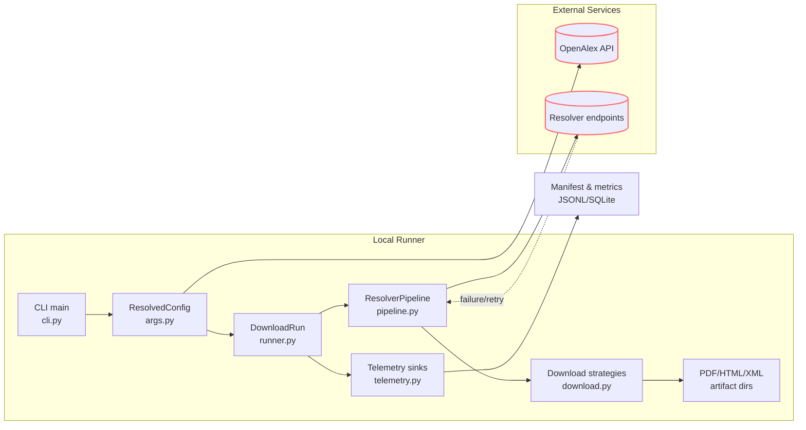
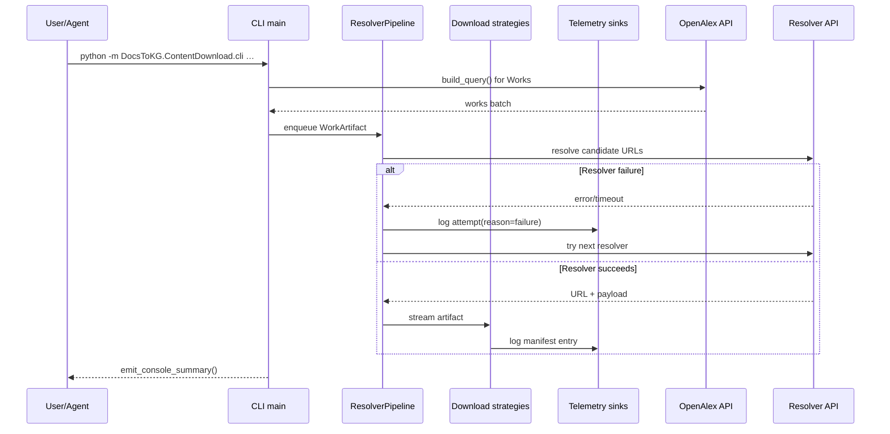

# DocsToKG • ContentDownload

Purpose: Coordinate resolver-driven acquisition of scholarly artifacts from OpenAlex metadata into local storage with manifest bookkeeping and telemetry.
Scope boundary: Handles discovery, downloading, classification, and logging for PDFs/HTML/XML; it does not perform downstream KG ingestion, embedding, or ontology alignment (TODO: confirm).

---

## Quickstart

> One-shot setup, then run the main src/DocsToKG/HybridSearchworkflow.

```bash
# Dev container (recommended)
# See openspec/AGENTS.md for activation steps inside the managed environment.

# Local
python -m venv .venv
source .venv/bin/activate
pip install -U pip
pip install -e ".[dev]"
python -m DocsToKG.ContentDownload.cli \
  --topic "machine learning" \
  --year-start 2022 \
  --year-end 2024 \
  --mailto you@example.org \
  --out pdfs/runs
# Append --dry-run to exercise resolver coverage without writing files.
```

## Common commands

```bash
python -m DocsToKG.ContentDownload.cli --help
python -m DocsToKG.ContentDownload.cli --topic "oncology" --year-start 2020 --year-end 2024 --dry-run --max 50
python -m DocsToKG.ContentDownload.cli --resume-from pdfs/manifest.jsonl --workers 4
python tools/manifest_to_index.py pdfs/manifest.jsonl pdfs/manifest.index.json
python scripts/export_attempts_csv.py pdfs/manifest.jsonl reports/attempts.csv
```

## Folder map (top N)

- `src/DocsToKG/ContentDownload/cli.py` - CLI entry that wires argument parsing, telemetry sinks, and the `DownloadRun` orchestrator.
- `src/DocsToKG/ContentDownload/args.py` - Argparse surface, `ResolvedConfig`, and resolver bootstrapping helpers.
- `src/DocsToKG/ContentDownload/pipeline.py` - Resolver orchestration, rate limiting, `ResolverConfig`, and pipeline execution primitives.
- `src/DocsToKG/ContentDownload/download.py` - Streaming download strategies, robots enforcement, cache validation, and artifact writers.
- `src/DocsToKG/ContentDownload/core.py` - Shared enums, classifiers, normalization helpers, and the `WorkArtifact` data structure.
- `src/DocsToKG/ContentDownload/networking.py` - HTTP session factory, retry logic, token buckets, and circuit breaker utilities.
- `src/DocsToKG/ContentDownload/runner.py` - `DownloadRun` lifecycle managing worker pools and summary emission.
- `src/DocsToKG/ContentDownload/telemetry.py` - Manifest schema contracts (`MANIFEST_SCHEMA_VERSION`), sink interfaces, and SQLite manifest index helpers.
- `src/DocsToKG/ContentDownload/providers.py` - `WorkProvider` protocol and the `OpenAlexWorkProvider` adapter around `pyalex`.
- `src/DocsToKG/ContentDownload/summary.py` - Run summary dataclass plus console reporting helpers.
- `src/DocsToKG/ContentDownload/statistics.py` - Optional runtime statistics and bandwidth tracking utilities consumed by examples.
- `src/DocsToKG/ContentDownload/errors.py` - Structured download errors, actionable logging, and remediation messaging.
- `src/DocsToKG/ContentDownload/resolvers/` - Resolver implementations (Unpaywall, Crossref, ArXiv, etc.) registered via `ResolverRegistry`.

## System overview





## Entry points & contracts

- Entry points: `src/DocsToKG/ContentDownload/cli.py:main`, `python -m DocsToKG.ContentDownload.cli`.
- `ResolvedConfig` (args.py) is immutable; mutate via helper functions (`bootstrap_run_environment`, `apply_config_overrides`) rather than altering dataclass fields.
- `DownloadRun.setup_sinks()` must precede `setup_resolver_pipeline()` because the pipeline depends on telemetry sinks for attempt logging.
- `ResolverPipeline` executes resolvers in configured order, respecting `ResolverConfig.resolver_toggles`, rate limits, and global URL deduplication.
- Download strategies enforce classification invariants (`PDF_LIKE`, HTML, XML) and robots compliance before persisting artifacts.
- Manifest outputs must remain JSONL with `record_type` markers (`attempt`, `manifest`, `summary`) to keep downstream analytics compatible.

## Configuration

- CLI flags defined in `args.py` cover topics, date windows, concurrency, resolver ordering, and telemetry sinks.
- Resolver credentials load from `config/resolver_credentials.yaml` plus `--resolver-config` overrides; unknown fields raise `ValueError`.
- Environment variables:
  - `UNPAYWALL_EMAIL` (default: `None`) - polite contact for Unpaywall resolver; fallback to `--mailto`.
  - `CORE_API_KEY` (default: `None`) - API key for the CORE resolver.
  - `S2_API_KEY` (default: `None`) - Semantic Scholar Graph API key.
  - `DOAJ_API_KEY` (default: `None`) - DOAJ resolver API key.
- Configuration checks: run `python -m DocsToKG.ContentDownload.cli --topic "<term>" --year-start 2024 --year-end 2024 --dry-run --max 5 --manifest tmp/manifest.jsonl` to validate resolver bootstrap and telemetry writes (TODO: automate).

## Data contracts & schemas

- Manifest and attempt records conform to `telemetry.ManifestEntry` (`MANIFEST_SCHEMA_VERSION = 3`); see `src/DocsToKG/ContentDownload/telemetry.py`.
- Manifest SQLite index obeys `SQLITE_SCHEMA_VERSION = 4`; consumers should query via `ManifestUrlIndex`.
- Metrics sidecar (`manifest.metrics.json`) serializes `summary.build_summary_record` output with resolver totals and aggregate counters.
- CSV exports use `scripts/export_attempts_csv.py` header ordering to stay compatible with legacy analytics.
- TODO: Document any formal schema artifacts if manifest schema is externalized (e.g., JSON Schema file).

## Interactions with other packages

- Upstream inputs: `pyalex.Works` and `pyalex.Topics` provide work metadata; CLI config ensures polite usage via `oa_config.email`.
- Resolver implementations hit external services (Unpaywall, Crossref, Core, etc.) through `src/DocsToKG/ContentDownload/resolvers/`.
- Downstream consumers:
  - `tools/manifest_to_index.py` generates manifest index JSON for fast lookups.
  - `tools/manifest_to_csv.py` and `scripts/export_attempts_csv.py` convert JSONL to CSV for analytics.
  - Reports in `reports/` (TODO: audit) assume stable manifest columns.
- Guarantees: directory layout (`PDF`, `HTML`, `XML`) and manifest SHA-256 fields remain stable to avoid breaking resume/retry logic.

## Observability

- Telemetry: `telemetry.MultiSink` multiplexes JSONL manifests, `.index.json`, `.last.csv`, `.sqlite3`, `.summary.json`, and `.metrics.json`.
- Logging: standard Python logging under the `DocsToKG.ContentDownload` namespace; configure verbosity via `LOGLEVEL` or logging config.
- Dashboards: TODO: link dashboards that visualize resolver success and latency.
- SLIs/SLOs:
  - Download success rate (`saved / processed`). SLO: TODO define threshold (e.g., ≥0.95).
  - Resolver P95 latency (ms) per `summary.latency_ms`. SLO: TODO cap (e.g., ≤5000 ms).
  - Manifest write failure rate (errors / attempts). SLO: target 0 failures.
- Health check: `python -m DocsToKG.ContentDownload.cli --topic "<term>" --year-start 2024 --year-end 2024 --dry-run --max 5` should exit 0 without writing artifacts.

## Security & data handling

- ASVS level: TODO (likely L1; confirm with security review).
- Data classification: `no-pii`; module handles public scholarly metadata and documents.
- Secrets handling: API keys are sourced from environment variables or secure config files—never commit secrets to the repo.
- STRIDE threats & mitigations:
  - Spoofing: enforce HTTPS endpoints and domain allowlists in resolver configs.
  - Tampering: SHA-256 digests verified for cached artifacts (`download._cached_sha256`).
  - Repudiation: JSONL manifest entries include timestamps, run IDs, and resolver names.
  - Denial of service: token buckets and circuit breakers (`networking.TokenBucket`, `CircuitBreaker`) throttle abusive traffic.
  - Information disclosure: logs avoid storing raw payloads; ensure manifests stay on trusted storage (TODO: document retention policy).
- External input is untrusted; treat downloaded artifacts as unsafe and never execute them directly.

## Development tasks

```bash
pytest -q tests/cli/test_cli_flows.py
pytest -q tests/pipeline/test_execution.py -k ResolverPipeline
ruff check src/DocsToKG/ContentDownload
black src/DocsToKG/ContentDownload
mypy src/DocsToKG/ContentDownload
# Inner loop: tweak resolver/pipeline code, run targeted pytest, then execute a --dry-run --max 10 CLI run to inspect telemetry outputs.
```

## Agent guardrails

- Do:
  - Preserve manifest schemas and update `MANIFEST_SCHEMA_VERSION` alongside downstream tooling.
  - Register new resolvers through `resolvers/__init__.py` so toggles and ordering remain centralized.
  - Maintain `ResolvedConfig` immutability; add helper methods for new fields instead of mutating instances.
- Do not:
  - Disable robots enforcement or polite headers in committed code paths without legal approval.
  - Remove telemetry sinks or change `record_type` values without coordinating analytics consumers.
  - Commit credentials or modify default limits to unsafe values.
- Danger zone:
  - `rm -rf pdfs html xml` deletes cached artifacts and resumes; keep backups before purging.
  - `python -m DocsToKG.ContentDownload.cli --ignore-robots` bypasses robots.txt and should only run with explicit authorization.

## FAQ

- Q: How do I resume a partially completed download run?
  A: Re-run the CLI with `--resume-from <manifest.jsonl>`; the runner skips completed works using the SQLite manifest index.

- Q: How can I target only open-access works?
  A: Add `--oa-only` so the Works query filters to open-access locations before resolver execution.

- Q: What is the safest way to test resolver changes?
  A: Use `--dry-run --max <N>` to gather coverage without writing files, inspect JSONL attempts, then drop `--dry-run` once satisfied.

- Q: Where do I find latency and success metrics after a run?
  A: Check `manifest.metrics.json` for aggregate counters and `manifest.summary.json` for resolver-specific latency/attempt stats.

- Q: How can I rotate telemetry logs for long sessions?
  A: Supply `--log-rotate 250MB` (or similar) so `RotatingJsonlSink` handles rollover while preserving manifest schema.

```json x-agent-map
{
  "entry_points": [
    { "type": "cli", "module": "DocsToKG.ContentDownload.cli", "commands": ["main"] }
  ],
  "env": [
    { "name": "UNPAYWALL_EMAIL", "default": null, "required": false },
    { "name": "CORE_API_KEY", "default": null, "required": false },
    { "name": "S2_API_KEY", "default": null, "required": false },
    { "name": "DOAJ_API_KEY", "default": null, "required": false }
  ],
  "schemas": [
    { "kind": "jsonl", "path": "src/DocsToKG/ContentDownload/telemetry.py", "description": "ManifestEntry schema and MANIFEST_SCHEMA_VERSION" }
  ],
  "artifacts_out": [
    { "path": "pdfs/**", "consumed_by": ["../reports", "../tools"] },
    { "path": "pdfs/manifest.jsonl", "consumed_by": ["tools/manifest_to_index.py", "scripts/export_attempts_csv.py"] },
    { "path": "pdfs/manifest.sqlite3", "consumed_by": ["src/DocsToKG/ContentDownload/telemetry.py"] }
  ],
  "danger_zone": [
    { "command": "rm -rf pdfs html xml", "effect": "Deletes cached/downloaded artifacts" },
    { "command": "python -m DocsToKG.ContentDownload.cli --ignore-robots", "effect": "Bypasses robots.txt protections" }
  ]
}
```
