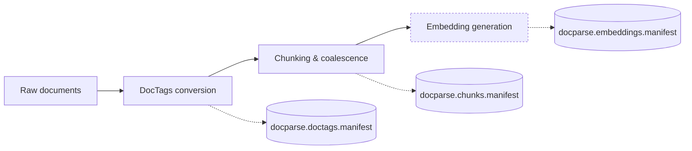

# Agents Guide - DocParsing

Last updated: 2025-10-20

## Mission and Scope
- Mission: Produce deterministic DocTags → chunk → embedding pipelines that scale to large corpora while preserving provenance, manifests, and schema contracts.
- Scope boundary: In-scope—document conversion, chunk coalescence, embedding generation, manifest/telemetry; out-of-scope—vector store ingestion, downstream ranking, embedding model training.

## High-Level Architecture & Data Flow

- Components: `doctags.py` converters, `chunking/HybridChunker`, `embedding/EmbeddingRunner`, `formats` schemas, `core` orchestration.
- Primary data edges: DocTags files (`*.doctags`) → chunk JSONL (`*.chunks.jsonl`) → embedding JSONL (`*.vectors.jsonl`) with manifest rows at each stage.
- One failure path to consider: embedding runner exhausting GPU memory—ensure batch sizing/resume logic handle partial outputs without corrupting manifests.

## Hot Paths & Data Shapes
- Hot paths:
  - `embedding.runner.EmbeddingRunner.run()` — heavy GPU/CPU work for dense+ sparse vectors.
  - `chunking.hybrid_chunker.generate_chunks()` — token windowing and structural merge loops.
  - `formats.manifest_writer.write_entry()` — manifests for thousands of docs; ensure buffered I/O.
  - `core.pipeline.execute_stage()` — orchestrates resume/force semantics.
- Typical payload sizes: DocTags ~200 KB per document, chunk JSONL ~100 KB per document, and vector payloads ~500 KB per document with Qwen3-4B dense dimension 2560 (float32) plus SPLADE/BM25 sparse data (see `openspec/changes/archive/2025-10-15-refactor-docparsing-pipeline/design.md`).
- Key schemas/models: `formats.CHUNK_ROW_SCHEMA`, `formats.VECTOR_ROW_SCHEMA`, `config.ChunkingConfig`, `config.EmbeddingConfig`, `types.ChunkPayload`.

## Performance Objectives & Baselines
- Targets: Stage throughput baselines—HTML → DocTags 30–50 docs/min on a 12-core CPU, PDF → DocTags 5–10 docs/min on an A100, chunking 10–20 docs/min on an 8-core CPU, embeddings 5–8 docs/min on an A100 (see `openspec/changes/archive/2025-10-15-refactor-docparsing-pipeline/design.md`). Keep embedding `--validate-only` P50 ≤2.2 s per document, matching the DocParsing README SLO.
- Known baseline: The synthetic benchmark (`tests/docparsing/test_synthetic_benchmark.py`) models streaming embeddings for 512 chunks × 384 tokens at dense dim 2560 and reports ~1.72× throughput gain with ~58 % memory reduction (`tests/docparsing/synthetic.py`).
- Measurement recipe:
  ```bash
  direnv exec . pytest tests/docparsing/test_synthetic_benchmark.py -q
  direnv exec . python -m cProfile -m DocsToKG.DocParsing.core.cli embed --chunks-dir Data/ChunkedDocTagFiles --out-dir /tmp/embeddings --limit 10
  ```

## Profiling & Optimization Playbook
- Quick profile commands:
  ```bash
  direnv exec . python -m cProfile -m DocsToKG.DocParsing.core.cli chunk --in-dir Data/DocTagsFiles --out-dir /tmp/chunks --limit 50
  direnv exec . pyinstrument -r html -o profile.html python -m DocsToKG.DocParsing.core.cli embed --chunks-dir Data/ChunkedDocTagFiles --out-dir /tmp/embeddings --limit 50
  ```
- Tactics:
  - Stream DocTags/Chunk/Embedding data; avoid loading whole corpora into memory.
  - Batch structural operations (tokenization, embedding inference) to minimize model warm-up.
  - Cache tokenizer/model instances per worker; reuse Qwen/SPLADE clients.
  - Reduce allocations by reusing buffers in chunk generator (e.g., pre-size token arrays).
  - Avoid quadratic merges—ensure chunk coalescence only inspects neighboring spans.
  - Parallelize across shards via `--shard-count`/`--shard-index` when CPU-bound.

## Complexity & Scalability Guidance
- DocTags conversion roughly O(number_of_pages); chunking O(total_tokens); embedding O(num_chunks * vector_dim). Watch for nested loops over all chunks; maintain near-linear behavior.
- Memory grows with open DocTags/chunk batches; ensure streaming iterators and release references post-write.
- Large-N strategy: use deterministic sharding and resume manifests; consider pipeline-level concurrency but avoid over-saturating GPU with too many workers.

## I/O, Caching & Concurrency
- I/O: read/write JSONL from `Data/…` directories; use append-only manifests and atomic file writes.
- Cache keys: resume logic keyed by content hash + manifest entry; embedding cache tuples produced via `_qwen_cache_key` in `embedding/runtime.py` (model_dir, dtype, tensor-parallelism, GPU util, quantization).
- Concurrency: `doctags` uses process pool (spawn) for PDFs, `chunk`/`embed` may use thread/process pools; avoid manual threads around GPU contexts without spawn semantics.

## Invariants to Preserve (change with caution)
- Directory layout: DocTags, chunks, embeddings mirror input hierarchy; altering breaks resume and hybrid search.
- Manifest schema/order: field names, ordering, and status semantics consumed by pipeline diagnostics.
- Deterministic chunk IDs & embedding records: rely on DocTags ordering; avoid reordering without version bump + migration.
- Resume/force semantics: `--resume` must skip completed outputs; `--force` must regenerate without leaving stale artifacts.

## Preferred Refactor Surfaces
- Extend chunking heuristics inside `chunking/` while keeping `ChunkPayload` contract.
- Swap embedding backends via adapters under `embedding/` (respect `EmbeddingConfig`).
- Add manifest enrichment in `formats` / `core.pipeline` ensuring schemas updated.
- High-risk zones: `formats` schema constants, `io.py` manifest writer, global config detection in `env.py`.

## Code Documentation Requirements
- Maintain NAVMAP headers in major modules (`core`, `chunking`, `embedding`, `formats`, `types`).
- Public APIs (CLI entry points, chunk/embedding classes) need docstrings documenting arguments, returns, and exceptions; include staged examples.
- Keep README/AGENTS synchronized with CLI flags and schema changes; update `schemas.py` docstrings when adding fields.
- Follow `MODULE_ORGANIZATION_GUIDE.md`, `CODE_ANNOTATION_STANDARDS.md`, and `STYLE_GUIDE.md`; ensure tests validate docstring presence when possible.

## Test Matrix & Quality Gates
```bash
direnv exec . ruff check src/DocsToKG/DocParsing tests/docparsing
direnv exec . mypy src/DocsToKG/DocParsing
direnv exec . pytest tests/docparsing -q
direnv exec . pytest tests/docparsing/test_synthetic_benchmark.py -q  # performance smoke
```
- Golden files: Canonical chunk/vector fixtures live under `tests/data/docparsing/golden/` (`sample.chunks.jsonl`, `sample.vectors.jsonl`) and are guarded by `tests/docparsing/test_cli_and_tripwires.py`.
- Stress test: chunk/embedding pipeline on synthetic corpora (`test_synthetic_benchmark`).
- Coverage expectation: Maintain ≥85 % coverage for new DocParsing utility modules per the refactor success metrics (`openspec/changes/archive/2025-10-15-refactor-docparsing-pipeline/design.md`).

## Failure Modes & Debug Hints
| Symptom | Likely cause | Quick checks |
|---|---|---|
| `CUDA error: reinitializing context` | Forked child touching CUDA before spawn | Ensure PDF pipeline uses spawn; reduce workers; set `CUDA_VISIBLE_DEVICES`. |
| Chunk counts mismatch | Resume logic skipped DocTags | Inspect manifests (`docparse.chunks.manifest.jsonl`); rerun chunk with `--force` for affected doc. |
| Embedding shape mismatch | Config `--qwen-dim` incorrect or model drift | Validate with `--validate-only`; check vector dimensionality vs config. |
| Slow chunking | Structural markers causing quadratic merges | Profile `HybridChunker.generate_chunks`; reduce nested marker checks or adjust thresholds. |
| Manifest corruption | Manual edits or partial writes | Use `docparse` CLI to rebuild manifests; avoid editing JSONL manually. |

## Canonical Commands
```bash
direnv exec . python -m DocsToKG.DocParsing.core.cli doctags --mode pdf --input Data/PDFs --output Data/DocTagsFiles --resume
direnv exec . python -m DocsToKG.DocParsing.core.cli chunk --in-dir Data/DocTagsFiles --out-dir Data/ChunkedDocTagFiles --min-tokens 256 --max-tokens 512
direnv exec . python -m DocsToKG.DocParsing.core.cli embed --chunks-dir Data/ChunkedDocTagFiles --out-dir Data/Embeddings --batch-size-qwen 24
direnv exec . python -m DocsToKG.DocParsing.core.cli embed --validate-only --chunks-dir Data/ChunkedDocTagFiles
```

## Indexing Hints
- Read first: `core/pipeline.py`, `chunking/hybrid_chunker.py`, `embedding/runner.py`, `formats/__init__.py`, `config.py`.
- High-signal tests: `tests/docparsing/test_cli_and_tripwires.py`, `test_docparsing_core.py`, `test_synthetic_benchmark.py`.
- Schemas/contracts: `formats.py`, `schemas.py`, `config.py` dataclasses.

## Ownership & Documentation Links
- Owners/reviewers: Owning team `docs-to-kg`, codeowner `@paul-heyse` (see `src/DocsToKG/DocParsing/README.md` front matter).
- Related docs: `src/DocsToKG/DocParsing/README.md`, `docs/06-operations/docparsing-changelog.md`, and OpenSpec archives under `openspec/changes/`.

## Changelog and Update Procedure
- Update hot paths, baselines, and schema references when CLI flags or output formats change.
- Keep examples runnable; refresh this guide when new stages or configs are introduced; bump "Last updated" after significant edits.
