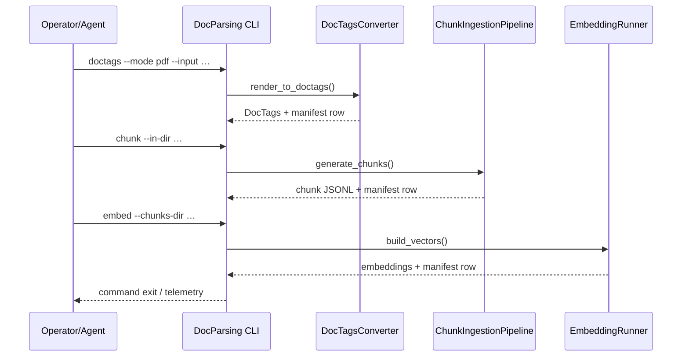

# DocsToKG • DocParsing

Purpose: Convert raw documents (PDF/HTML/etc.) into DocTags, topic-aware chunks, and embeddings with resumable manifests.  
Scope boundary: Handles conversion, chunking, embedding, and telemetry; does not persist vectors to external stores or orchestrate downstream ingestion.

---

## Quickstart
> Bootstrap environment, run DocTags → chunking → embedding on a sample corpus.
```bash
./scripts/bootstrap_env.sh
direnv allow                                     # or source .venv/bin/activate

# Convert PDFs/HTML to DocTags
direnv exec . python -m DocsToKG.DocParsing.core.cli doctags \
  --mode pdf \
  --input Data/PDFs \
  --output Data/DocTagsFiles

# Chunk DocTags
direnv exec . python -m DocsToKG.DocParsing.core.cli chunk \
  --in-dir Data/DocTagsFiles \
  --out-dir Data/ChunkedDocTagFiles

# Generate embeddings
direnv exec . python -m DocsToKG.DocParsing.core.cli embed \
  --chunks-dir Data/ChunkedDocTagFiles \
  --out-dir Data/Embeddings
```

## Common commands
```bash
# Discover tasks (TODO add justfile entry if available)
just --list

# Table stakes CLI flows
direnv exec . python -m DocsToKG.DocParsing.core.cli doctags --help
direnv exec . python -m DocsToKG.DocParsing.core.cli chunk --help
direnv exec . python -m DocsToKG.DocParsing.core.cli embed --help
direnv exec . python -m DocsToKG.DocParsing.core.cli doctor               # TODO: confirm health command

# Focused reruns
direnv exec . python -m DocsToKG.DocParsing.core.cli doctags --input Data/PDFs/doc-001.pdf --force
direnv exec . python -m DocsToKG.DocParsing.core.cli chunk --resume
direnv exec . python -m DocsToKG.DocParsing.core.cli embed --validate-only
```

## Folder map
- `cli_errors.py` – Structured CLI exception types.
- `config.py` / `config_loaders.py` – Pydantic-style configuration loaders (YAML/JSON/TOML) for chunking/embedding.
- `core/` – Pipeline orchestration (DocTags converters, chunk coalescence, embedding runners).
- `chunking/` – Hybrid chunker implementation and heuristics.
- `embedding/` – Dense/sparse embedding wrappers (Qwen, SPLADE, BM25).
- `formats/` – Schemas and JSON codecs for DocTags/chunk/vector manifests.
- `interfaces.py` – Protocol definitions for converters, chunkers, embedder backends.
- `io.py` – Filesystem helpers, manifest writers, doc discovery.
- `logging.py` / `telemetry.py` – Structured logging and telemetry sinks.
- `schemas.py` – Pydantic models and schema introspection utilities.
- `token_profiles.py` – Tokenizer profiles/presets shared across stages.
- `tests/docparsing/` – Unit/integration tests and synthetic benchmarks (with stubs).

## System overview
```mermaid
flowchart LR
  A[Raw documents (PDF/HTML/ZIP)] --> B[DocTags conversion]
  B --> C[Chunking & coalescence]
  C --> D[Embedding generation]
  B -.-> MB[DocTags manifest]
  C -.-> MC[Chunk manifest]
  D -.-> ME[Embedding manifest]
  classDef boundary stroke:#f00;
  B:::boundary
  C:::boundary
  D:::boundary
```


## Entry points & contracts
- Entry points: `python -m DocsToKG.DocParsing.core.cli` subcommands (`doctags`, `chunk`, `embed`, TODO `doctor`), Python APIs in `core` for embedding/chunking.
- Contracts/invariants:
  - DocTags → chunk → embedding outputs mirror directory hierarchy and use consistent doc IDs.
  - Manifests (`docparse.*.manifest.jsonl`) are append-only and idempotent for resume logic.
  - Chunk and embedding schemas versioned via `formats.validate_schema_version`.

## Configuration
- Config sources: environment (`DOCSTOKG_DATA_ROOT`, TODO others), YAML/TOML via `config_loaders`.
- CLI flags: shared `--resume`, `--force`, `--log-level`; stage-specific `--min-tokens`, `--max-tokens`, `--shard-count/index`, `--batch-size-*`, `--tokenizer-model`, `--format`, etc.
- Validate configuration: TODO provide `docparse doctor` or `python -m DocsToKG.DocParsing.core.cli embed --validate-only`.

## Data contracts & schemas
- Schemas: `formats.CHUNK_ROW_SCHEMA`, `formats.VECTOR_ROW_SCHEMA`, DocTags manifest schema (TODO add path).
- Manifests stored under `Data/Manifests/docparse.*.manifest.jsonl` (DocTags, chunking, embeddings).
- Chunk output: JSONL lines with `ChunkPayload`, `ProvenanceMetadata`, token spans; embeddings output: JSONL with dense vector (float32 list) + sparse weights.

## Interactions with other packages
- Upstream: consumes raw documents, optional DocTags produced by external systems.
- Downstream: supplies chunked text and embeddings to `HybridSearch`, `OntologyDownload` is independent.
- Guarantees: stable doc IDs across stages; chunk/embedding outputs designed for direct ingestion by hybrid search pipeline.

## Observability
- Logs: `logging.py` provides structured logs with doc IDs, stage, durations.
- Metrics: `telemetry.py` & `ChunkIngestionPipeline` emit counters/histograms (TODO document exporters).
- **SLIs/SLOs**: TODO establish stage latency targets (DocTags/Chunk/Embed) and success rate metrics.
- Health check: TODO confirm `docparse doctor` command or provide recommended validation sequence.

## Security & data handling
- ASVS level: TODO (likely L2 due to document ingestion/processing).
- Threats:
  - Tampering: ensure DocTags/Chunks/Embeddings stored in controlled directories; keep manifests append-only.
  - DoS: guard via `--shard-count`, `--batch-size` controls; manifest resume prevents redundant work.
  - Information disclosure: treat source documents as sensitive; TODO classify data (PII/PHI) if used.
  - Supply chain: verify Docling/vLLM dependencies; prefer locked versions.
- Data classification: TODO specify (likely mixed—documents may contain PII; follow organizational policy).

## Development tasks
```bash
direnv exec . ruff check src/DocsToKG/DocParsing tests/docparsing
direnv exec . mypy src/DocsToKG/DocParsing
direnv exec . pytest tests/docparsing -q
direnv exec . pytest tests/docparsing/test_synthetic_benchmark.py -q  # optional perf check
```
- Format / lint: TODO add `just fmt` or `python -m ruff format`.
- Use dependency stubs in tests (`tests.docparsing.stubs`) to run without GPUs.

## Agent guardrails
- Do:
  - Extend chunking/embedding via interfaces and keep manifests consistent.
  - Document new schema fields and migrate manifest validators.
- Do not:
  - Break directory layout or doc ID conventions without downstream coordination.
  - Bypass manifests or resume logic (tools depend on accurate entries).
- Danger zone:
  - `rm -rf Data/DocTagsFiles` or manually editing manifests may break resume; use CLI `--force` and allow pipeline to rebuild artifacts.
  - Changing embedding formats (`--format`) requires updating `formats` validators and downstream loaders.

## FAQ
- Q: How do I resume after a failure?  
  A: Use `--resume` on the affected stage; manifests mark completed docs. Combine with `--force` for targeted reruns.

- Q: How do I validate outputs without writing new files?  
  A: Run `chunk` or `embed` with `--validate-only` to check existing JSONL artifacts and exit with status.

<!-- Machine-readable appendix -->
```json x-agent-map
{
  "entry_points":[
    {"type":"cli","module":"DocsToKG.DocParsing.core.cli","commands":["doctags","chunk","embed"]},
    {"type":"python","module":"DocsToKG.DocParsing.core","symbols":["ChunkIngestionPipeline","EmbeddingRunner"]},
    {"type":"python","module":"DocsToKG.DocParsing.chunking","symbols":["HybridChunker"]},
    {"type":"python","module":"DocsToKG.DocParsing.embedding","symbols":["EmbeddingRunner","SPLADEAdapter","QwenAdapter"]}
  ],
  "env":[
    {"name":"DOCSTOKG_DATA_ROOT","default":"<repo>/Data","required":false}
  ],
  "schemas":[
    {"kind":"python","path":"src/DocsToKG/DocParsing/formats.py"},
    {"kind":"pydantic","path":"src/DocsToKG/DocParsing/config.py"}
  ],
  "artifacts_out":[
    {"path":"Data/DocTagsFiles/**/*.doctags","consumed_by":["chunk stage"]},
    {"path":"Data/ChunkedDocTagFiles/**/*.chunks.jsonl","consumed_by":["embedding stage","hybrid search"]},
    {"path":"Data/Embeddings/**/*.vectors.jsonl","consumed_by":["hybrid search"]}
  ],
  "danger_zone":[
    {"command":"direnv exec . python -m DocsToKG.DocParsing.core.cli doctags --force --input Data/PDFs","effect":"Reprocesses entire corpus; can overwrite manifests"}
  ]
}
```
