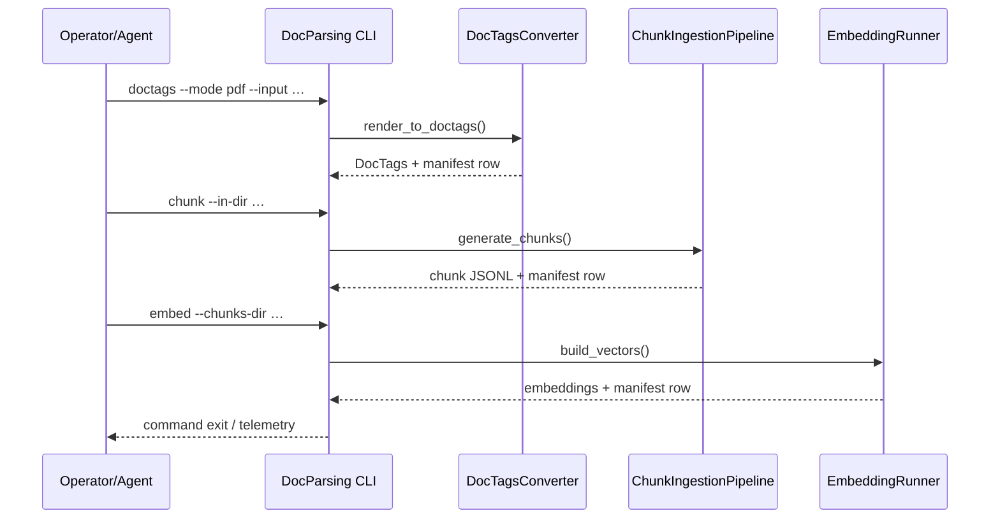

> _Metadata backlog_: owning_team, stability, versioning, codeowners, related_adrs, slos, data_handling, and sbom will be populated in a future revision.

## Table of Contents
- [DocsToKG • DocParsing](#docstokg--docparsing)
  - [Prerequisites & optional dependencies](#prerequisites--optional-dependencies)
  - [Quickstart](#quickstart)
  - [Common commands](#common-commands)
    - [CLI command matrix](#cli-command-matrix)
    - [Planner previews](#planner-previews)
  - [Core capabilities](#core-capabilities)
  - [Folder map](#folder-map)
  - [System overview](#system-overview)
  - [Entry points & contracts](#entry-points--contracts)
  - [Configuration](#configuration)
    - [Content hashing defaults](#content-hashing-defaults)
  - [Data contracts & schemas](#data-contracts--schemas)
  - [Interactions with other packages](#interactions-with-other-packages)
  - [Observability](#observability)
  - [Security & data handling](#security--data-handling)
  - [Development tasks](#development-tasks)
  - [Agent guardrails](#agent-guardrails)
  - [FAQ](#faq)

# DocsToKG • DocParsing

Purpose: Convert raw documents (PDF/HTML/etc.) into DocTags, topic-aware chunks, and embeddings with resumable manifests.
Scope boundary: Handles conversion, chunking, embedding, and telemetry; does not persist vectors to external stores or orchestrate downstream ingestion.

---

## Prerequisites & optional dependencies
- **Runtime**: Linux, Python 3.10 or newer. GPU strongly recommended for PDF DocTags (vLLM) and Qwen embeddings; CPU-only execution is supported with lower throughput.
- **Installation extras**:
  - Core pipeline: `pip install "DocsToKG[docparse]"`.
  - PDF DocTags (vLLM + Docling PDF extras): `pip install "DocsToKG[docparse-pdf]"`.
  - SPLADE sparse embeddings: `pip install sentence-transformers`.
  - Qwen dense embeddings: `pip install vllm` plus CUDA 12 runtime libraries (`libcudart.so.12`, `libcublas.so.12`, `libopenblas.so.0`, `libjemalloc.so.2`, `libgomp.so.1`). CPU-only runs automatically fall back to a `float32` dtype when neither CLI nor `DOCSTOKG_QWEN_DTYPE` override is set, ensuring vLLM receives a CPU-safe precision.
  - Parquet vector export & validation: `pip install "DocsToKG[docparse-parquet]"` (installs `pyarrow`).
- **Model caches**:
  - DocTags PDF model `granite-docling-258M` stored beneath `${DOCSTOKG_MODEL_ROOT}` (defaults to `~/.cache/docs-to-kg/models`).
- SPLADE/Qwen weights downloaded to `${DOCSTOKG_SPLADE_DIR}` / `${DOCSTOKG_QWEN_DIR}` (defaults resolved by `env.py`; legacy `${DOCSTOKG_QWEN_MODEL_DIR}` is still accepted and normalised).
- **Data directories** (defaults derived from `${DOCSTOKG_DATA_ROOT}` or CLI `--data-root`):
  - `Data/PDFs`, `Data/HTML` – raw corpora.
  - `Data/DocTagsFiles` – `*.doctags.jsonl`.
  - `Data/ChunkedDocTagFiles` – `*.chunk.jsonl`.
  - `Data/Embeddings` – `*.vectors.jsonl` (default) or `*.vectors.parquet` when `--format parquet` is selected.
  - `Data/Manifests` – `docparse.*.manifest.jsonl`.
- **Environment overrides**: `DOCSTOKG_*` variables configure stage-specific defaults (`DOCSTOKG_DOCTAGS_INPUT`, `DOCSTOKG_CHUNK_MIN_TOKENS`, `DOCSTOKG_EMBED_QWEN_DIR`, etc.); see “Configuration” below for details.

## Quickstart
> Bootstrap environment, run DocTags → chunking → embedding on a sample corpus end to end.
```bash
./scripts/bootstrap_env.sh
direnv allow                                     # or source .venv/bin/activate

# Preview the work to be scheduled
direnv exec . python -m DocsToKG.DocParsing.core.cli plan \
  --data-root Data \
  --mode auto \
  --limit 10

# Convert PDFs/HTML to DocTags
direnv exec . python -m DocsToKG.DocParsing.core.cli doctags \
  --mode pdf \
  --input Data/PDFs \
  --output Data/DocTagsFiles

# Chunk DocTags
direnv exec . python -m DocsToKG.DocParsing.core.cli chunk \
  --in-dir Data/DocTagsFiles \
  --out-dir Data/ChunkedDocTagFiles

# Generate embeddings
direnv exec . python -m DocsToKG.DocParsing.core.cli embed \
  --chunks-dir Data/ChunkedDocTagFiles \
  --out-dir Data/Embeddings
#   --format parquet  # optional: emit columnar parquet vectors when pyarrow is installed
```

## Common commands
```bash
# Table stakes CLI flows
direnv exec . python -m DocsToKG.DocParsing.core.cli doctags --help
direnv exec . python -m DocsToKG.DocParsing.core.cli chunk --help
direnv exec . python -m DocsToKG.DocParsing.core.cli embed --help

# Focused reruns
direnv exec . python -m DocsToKG.DocParsing.core.cli doctags --input Data/PDFs/doc-001.pdf --force
direnv exec . python -m DocsToKG.DocParsing.core.cli chunk --resume
direnv exec . python -m DocsToKG.DocParsing.core.cli embed --validate-only
direnv exec . python -m DocsToKG.DocParsing.core.cli embed --validate-only --format parquet

# Operational tooling
direnv exec . python -m DocsToKG.DocParsing.core.cli plan --data-root Data --mode auto    # stage preview
direnv exec . python -m DocsToKG.DocParsing.core.cli manifest --stage chunk --tail 20     # inspect manifests
direnv exec . python -m DocsToKG.DocParsing.core.cli token-profiles --doctags-dir Data/DocTagsFiles
direnv exec . python -m DocsToKG.DocParsing.core.cli all --resume                         # orchestrate all stages
direnv exec . python -m DocsToKG.DocParsing.core.cli plan-diff --lock-output baseline.json --ids hp --mode auto
```

> ℹ️ If `docparse embed` cannot find any chunk files (for example when
> `--chunks-dir` points to a missing directory) it logs a "No chunk files
> found" warning and exits with status 0 without writing new vectors, so the
> run can be retried after preparing the inputs.

## Core capabilities
- **Pipeline orchestration** – `core.cli` exposes subcommands (`doctags`, `chunk`, `embed`, `plan`, `manifest`, `token-profiles`, `all`) that share staging, logging, and resume semantics while honouring advisory locks to prevent duplicate work.
- **DocTags conversion** – `doctags.py` manages Docling-powered HTML/PDF conversion, vLLM lifecycle (port discovery, GPU sizing, resume/force switches), and manifest telemetry (`docparse.doctags-*.manifest.jsonl`).
- **Chunking heuristics** – `chunking.runtime` performs hybrid structural + token-aware chunk coalescence, span hashing, and chunk UUID generation that remains consistent across reruns.
- **Embedding runtime** – `embedding.runtime` wraps dense (vLLM/Qwen), sparse (SPLADE), and lexical (BM25) backends with caching, optional dependency checks, and quarantine tooling for failed vectors.
- **Telemetry & manifests** – `telemetry.py` and `io.py` provide structured manifest appenders, resume lookup helpers, and content hashing utilities that guarantee idempotent resume across stages.
- **Configuration & environment** – `config.py`, `config_loaders.py`, and `env.py` read YAML/TOML configs, infer defaults from `DOCSTOKG_*` environment variables, and expose `StageConfigBase` dataclasses for shared CLI options.
- **Developer tooling** – `core.manifest`, `core.token_profiles`, and `testing` harnesses surface manifest diffs, tokenizer statistics, and dependency fakes for reliable local and CI execution.

### CLI command matrix
| Command | Description | Core flags |
| --- | --- | --- |
| `docparse doctags` | Convert HTML/PDF corpora to DocTags with Docling + optional vLLM | `--mode`, `--workers`, `--model`, `--served-model-name`, `--resume`, `--force`, `--vllm-wait-timeout` |
| `docparse chunk` | Produce topic-aware chunks from DocTags | `--profile`, `--min-tokens`, `--max-tokens`, `--shard-count`, `--validate-only`, `--inject-anchors` |
| `docparse embed` | Generate BM25, SPLADE, and Qwen vectors | `--profile`, `--offline`, `--files-parallel`, `--no-cache`, `--validate-only`, `--vector-format` |
| `docparse plan` | Classify pending work using manifests + directory scan | `--mode`, `--limit`, `--json`, `--since`, `--plan-only` |
| `docparse plan-diff` | Compare live plan vs baseline (`--lock-output` optional) | `--baseline`, `--lock`, `--ids`, `--since`, `--with-manifests` |
| `docparse manifest` | Inspect manifest history safely | `--stage`, `--tail`, `--json`, `--since`, `--filter` |
| `docparse token-profiles` | Report token statistics for DocTags samples | `--comparators`, `--sample-size`, `--output` |
| `docparse all` | Orchestrate DocTags → chunk → embed + optional plan | `--resume`, `--plan-only`, `--dry-run`, `--force`, `--log-level` |

### Planner previews
- `--plan-only` mode reports total document counts per bucket and shows up to
  five representative IDs for each category (`process`, `skip`, `validate`,
  etc.). Larger plans keep the counts accurate while truncating previews with a
  `... (+N more)` suffix so operators can gauge scale without loading thousands
  of identifiers.

## Folder map
- `cli_errors.py` – Structured CLI exception types surfaced by `core.cli`.
- `config.py` / `config_loaders.py` – Stage configuration dataclasses plus YAML/JSON/TOML loaders that hydrate them.
- `core/` – CLI entry points, planning helpers, manifest utilities, and shared directory discovery (`env.py`).
- `doctags.py` – DocTags pipeline orchestration, vLLM control plane, shared CLI option injection.
- `chunking/` – Hybrid chunker runtime, streaming chunk workers, and validation utilities (`chunking.runtime`).
- `embedding/` – Embedding runtime, queue workers, and backend adapters for dense & sparse generation (`embedding.runtime`).
- `formats/` – Schemas and JSON codecs for DocTags, chunks, and vector manifests (versioned validators).
- `interfaces.py` – Protocol definitions for converters, chunkers, embedding writers, and telemetry sinks.
- `io.py` – Filesystem helpers, manifest append/load utilities, content hashing, and concurrency-safe file writes.
- `logging.py` / `telemetry.py` – Structured logging, event emission, and telemetry sinks (JSONL manifests, resume helpers).
- `schemas.py` – Pydantic models, schema validation, and API used by `formats`.
- `token_profiles.py` – Tokenizer presets and analysis helpers exposed via `core.cli token-profiles`.
- `testing/` – Test doubles (Docling stubs, fake StageTelemetry sinks) and fixtures used across pytest suites.

## System overview
```mermaid
flowchart LR
  A[Raw documents (PDF/HTML/ZIP)] --> B[DocTags conversion]
  B --> C[Chunking & coalescence]
  C --> D[Embedding generation]
  B -.-> MB[DocTags manifest]
  C -.-> MC[Chunk manifest]
  D -.-> ME[Embedding manifest]
  classDef boundary stroke:#f00;
  B:::boundary
  C:::boundary
  D:::boundary
```


## Entry points & contracts
- Entry points: `python -m DocsToKG.DocParsing.core.cli` subcommands (`doctags`, `chunk`, `embed`, `plan`, `manifest`, `token-profiles`, `all`), programmatic APIs in `core`, `chunking`, and `embedding`.
- Contracts/invariants:
  - DocTags → chunk → embedding outputs mirror directory hierarchy and use consistent doc IDs.
  - Manifests (`docparse.*.manifest.jsonl`) are append-only and idempotent for resume logic.
  - Chunk and embedding schemas versioned via `formats.validate_schema_version`.

## Configuration
- Config sources: environment (`DOCSTOKG_DATA_ROOT`, `DOCSTOKG_MODEL_ROOT`, optional `DOCSTOKG_SPLADE_DEVICE`, `DOCSTOKG_QWEN_DEVICE`, etc.), YAML/TOML via `config_loaders`.
- CLI flags: shared `--resume`, `--force`, `--log-level`; stage-specific `--min-tokens`, `--max-tokens`, `--shard-count/index`, `--batch-size-*`, `--tokenizer-model`, `--format`, etc. PDF DocTags runs additionally accept `--vllm-wait-timeout` (mirrored by `docparse all`) so operators can extend the readiness window for vLLM backends.
- Environment overrides:
  - DocTags: `DOCSTOKG_DOCTAGS_*` family (`_INPUT`, `_OUTPUT`, `_MODEL`, `_WORKERS`, `_VLLM_WAIT_TIMEOUT`, etc.).
  - Worker sizing: DocTags auto-sizes `--workers` to `max(1, min(12, cpu_count - 4))`, ensuring at least one process is scheduled even when `os.cpu_count()` reports very small values.
- Chunking: `DOCSTOKG_CHUNK_*` toggles for tokenizer, shard count, and validation.
- Embedding: `DOCSTOKG_EMBED_*` flags plus `DOCSTOKG_QWEN_DIR`, `DOCSTOKG_SPLADE_DIR` for model caches.
- Vector format negotiation: `DOCSTOKG_EMBED_VECTOR_FORMAT` overrides the default (`jsonl`) for runs launched without an explicit `--format` CLI flag; set it to `parquet` to opt into columnar outputs globally.
- Validate-only runs reuse the configured `--qwen-dim` (or `DOCSTOKG_EMBED_QWEN_DIM`) when present; omit the override to accept previously generated vectors without enforcing a dimension.
- Validate configuration: run `python -m DocsToKG.DocParsing.core.cli chunk --validate-only` or `... embed --validate-only` before production runs.

### Content hashing defaults
- **Current default:** `compute_content_hash`, `compute_chunk_uuid`, and `resolve_hash_algorithm()` use SHA-256 by default. SHA-1 remains available via `DOCSTOKG_HASH_ALG=sha1` or explicit function arguments for legacy resume scenarios.
- **Operational impact:** Switching digest algorithms changes manifest `input_hash` values and chunk UUIDs. Set `DOCSTOKG_HASH_ALG=sha1` temporarily when resuming runs generated with the previous default, then revert to SHA-256 once caught up.

## Data contracts & schemas
- Schemas: Pydantic models in `formats.ChunkRow` / `formats.VectorRow` and manifest payloads coordinated through `telemetry.ManifestEntry`.
- Manifests: append-only JSONL files at `Data/Manifests/docparse.*.manifest.jsonl` for each stage (`doctags`, `chunk`, `embeddings`) with companion attempt logs at `Data/Manifests/docparse.*.attempts.jsonl` resolved by [`io.resolve_manifest_path`](io.py) / [`io.resolve_attempts_path`](io.py).
- Status taxonomy: all manifest and attempt entries record `status="success|skip|failure"` (no `error` state). Attempts include timing, byte counts, and optional reasons via [`telemetry.Attempt`](telemetry.py); manifests merge metadata from [`telemetry.StageTelemetry`](telemetry.py) and enforce the same status enum.
- Example manifest row (with metadata merged by `StageTelemetry.write_manifest_entry`):
  ```json
  {
    "run_id": "2025-10-19T09:30:12Z",
    "file_id": "doc-001",
    "doc_id": "doc-001",
    "stage": "chunk",
    "tokens": 3842,
    "status": "success",
    "schema_version": "v3",
    "duration_s": 1.284,
    "input_hash": "sha256:1e9c...",
    "hash_alg": "sha256",
    "chunk_count": 12,
    "output_path": "Data/ChunkedDocTagFiles/doc-001.chunk.jsonl"
  }
  ```
- Resume contract: [`core.manifest.ResumeController`](core/manifest.py) compares `status` and `input_hash` to decide whether to skip work, so metadata fields supplied by `StageTelemetry` (for example, `vector_format` in embedding runs) must stay in sync with their corresponding writers.
- `telemetry.StageTelemetry` acquires advisory locks via [`core.concurrency.acquire_lock`](core/concurrency.py) before appending JSON lines, guaranteeing atomic writes even with concurrent processes.

## Interactions with other packages
- Upstream: consumes raw documents, optional DocTags produced by external systems.
- Downstream: supplies chunked text and embeddings to `HybridSearch`, `OntologyDownload` is independent.
- Guarantees: stable doc IDs across stages; chunk/embedding outputs designed for direct ingestion by hybrid search pipeline.

## Observability
- Logs: `logging.py` emits structured records (JSON + console) that include `stage`, `doc_id`, elapsed durations, and correlation IDs. Output paths default to stdout plus `${DOCSTOKG_DATA_ROOT}/Logs/docparse-*.jsonl`; override using CLI `--log-level` or `DOCSTOKG_LOG_DIR`.
- Telemetry: `telemetry.TelemetrySink` writes attempt + manifest JSON lines (`docparse.*.attempts.jsonl` / `docparse.*.manifest.jsonl`) using advisory locks, ensuring atomic appends even with concurrent workers. Manifest rows now capture `vector_format` for success, skip, and validate-only entries so parquet adoption can be audited downstream.
- Metrics: `logging.telemetry_scope` and `telemetry.StageTelemetry` expose counters and histograms suitable for ingestion by dashboard jobs (see `tests/docparsing/test_chunk_manifest_resume.py` for usage).
- SLO tracking: maintain ≥99.5 % manifest success across stages and keep embedding validation (`--validate-only`) under 2.2 s P50 per document based on synthetic benchmark fixtures.
- Health checks: prefer `docparse chunk --validate-only` / `docparse embed --validate-only` when validating environments—these commands read existing JSONL artifacts without mutating outputs.

## Security & data handling
- ASVS level: L2 baseline for pipelines that ingest untrusted documents and invoke GPU services.
- Threats:
  - Tampering: ensure DocTags/Chunks/Embeddings stored in controlled directories; keep manifests append-only.
  - DoS: guard via `--shard-count`, `--batch-size` controls; manifest resume prevents redundant work.
  - Information disclosure: treat source documents as sensitive; data contains regulated or customer-provided content.
  - Supply chain: verify Docling/vLLM dependencies; prefer locked versions.
- Data classification: `restricted-pii`; raw corpora and derived embeddings may include sensitive personal or proprietary data—scope storage and access controls accordingly.

## Development tasks
```bash
direnv exec . ruff check src/DocsToKG/DocParsing tests/docparsing
direnv exec . mypy src/DocsToKG/DocParsing
direnv exec . pytest tests/docparsing -q
direnv exec . pytest tests/docparsing/test_synthetic_benchmark.py -q  # optional perf check
```
- Format / lint: `direnv exec . ruff format src/DocsToKG/DocParsing tests/docparsing`.
- Fixtures: `tests/docparsing/fakes` hosts Docling, vLLM, and pydantic stubs for offline testing; sample corpora live under `tests/data/docparsing`.
- Use dependency stubs in tests (`tests.docparsing.stubs`) to run without GPUs.

## Agent guardrails
- Do:
  - Extend chunking/embedding via interfaces and keep manifests consistent.
  - Document new schema fields and migrate manifest validators.
- Do not:
  - Break directory layout or doc ID conventions without downstream coordination.
  - Bypass manifests or resume logic (tools depend on accurate entries).
- Danger zone:
  - `rm -rf Data/DocTagsFiles` or manually editing manifests may break resume; use CLI `--force` and allow pipeline to rebuild artifacts.
  - Changing embedding formats (`--format`) requires updating `formats` validators and downstream loaders.
  - Terminating vLLM/Qwen worker processes manually can leave stale lock files; use CLI cancel/resume flags so `concurrency.acquire_lock` can tidy state.

## FAQ
- Q: How do I resume after a failure?
  A: Use `--resume` on the affected stage; manifests mark completed docs. Combine with `--force` (or per-doc overrides) for targeted reruns.

- Q: How do I validate outputs without writing new files?
  A: Run `chunk` or `embed` with `--validate-only` to check existing JSONL artifacts and exit with status.

- Q: How do I extend DocParsing with a custom chunker or embedder?
  A: Implement the relevant protocol from `interfaces.py` (for example `ChunkingSerializerProvider`, `VectorWriter`), register it via config/CLI overrides, and update manifest validators to include any new metadata fields.

- Q: Where can I find representative fixtures for tests or demos?
  A: `tests/docparsing` ships synthetic corpora plus dependency stubs so you can run the entire pipeline without GPUs. The quickstart uses these fixtures when `DOCSTOKG_DATA_ROOT` points to the repo `tests/data/docparsing` directory.

- Q: What inputs are safe to delete to reclaim space?
  A: Remove `Data/Embeddings` or `Data/ChunkedDocTagFiles` after downstream ingestion completes; manifests will schedule reprocessing if those directories are missing. Avoid deleting manifests unless you are prepared to recompute everything.

<!-- Machine-readable appendix -->
```json x-agent-map
{
  "entry_points":[
    {"type":"cli","module":"DocsToKG.DocParsing.core.cli","commands":["doctags","chunk","embed"]},
    {"type":"python","module":"DocsToKG.DocParsing.core","symbols":["ChunkIngestionPipeline","EmbeddingRunner"]},
    {"type":"python","module":"DocsToKG.DocParsing.chunking","symbols":["HybridChunker"]},
    {"type":"python","module":"DocsToKG.DocParsing.embedding","symbols":["EmbeddingRunner","SPLADEAdapter","QwenAdapter"]}
  ],
  "env":[
    {"name":"DOCSTOKG_DATA_ROOT","default":"<repo>/Data","required":false}
  ],
  "schemas":[
    {"kind":"python","path":"src/DocsToKG/DocParsing/formats.py"},
    {"kind":"pydantic","path":"src/DocsToKG/DocParsing/config.py"}
  ],
  "artifacts_out":[
    {"path":"Data/DocTagsFiles/**/*.doctags","consumed_by":["chunk stage"]},
    {"path":"Data/ChunkedDocTagFiles/**/*.chunks.jsonl","consumed_by":["embedding stage","hybrid search"]},
    {"path":"Data/Embeddings/**/*.vectors.jsonl","consumed_by":["hybrid search"]}
  ],
  "danger_zone":[
    {"command":"direnv exec . python -m DocsToKG.DocParsing.core.cli doctags --force --input Data/PDFs","effect":"Reprocesses entire corpus; can overwrite manifests"}
  ]
}
```
