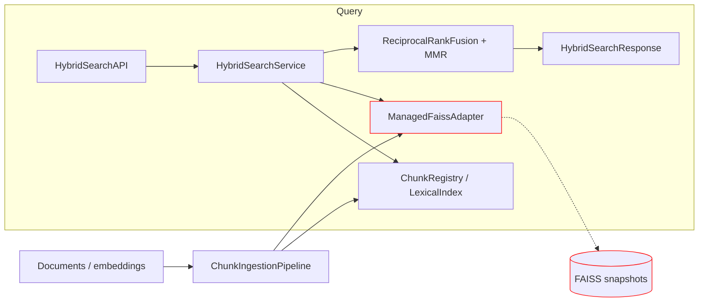
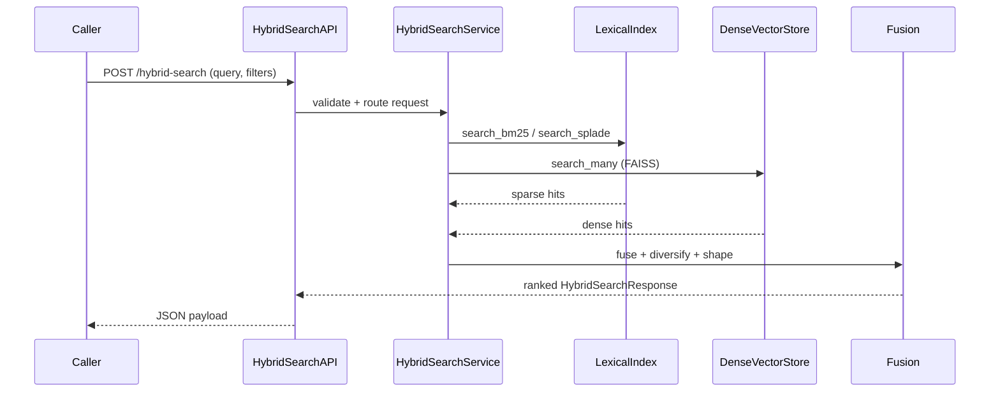

> _Metadata backlog_: owning_team, stability, versioning, codeowners, related_adrs, slos, data_handling, and sbom will be populated in a future revision.

## Table of Contents
- [DocsToKG • HybridSearch](#docstokg--hybridsearch)
  - [⚠️ Required Prereading: FAISS GPU Wheel & Library](#️-required-prereading-faiss-gpu-wheel--library)
  - [Prerequisites & dependencies](#prerequisites--dependencies)
  - [Data inputs & expected layout](#data-inputs--expected-layout)
  - [Quickstart](#quickstart)
  - [GPU prerequisites & validation checklist](#gpu-prerequisites--validation-checklist)
  - [Common commands](#common-commands)
  - [Module architecture](#module-architecture)
  - [Core capabilities](#core-capabilities)
    - [Ingestion workflow](#ingestion-workflow)
    - [Search API contract](#search-api-contract)
    - [Configuration quick reference](#configuration-quick-reference)
    - [Failure recovery & snapshot management](#failure-recovery--snapshot-management)
    - [Deployment considerations](#deployment-considerations)
  - [Folder map](#folder-map)
  - [System overview](#system-overview)
  - [Entry points & contracts](#entry-points--contracts)
  - [Configuration](#configuration)
  - [Data contracts & schemas](#data-contracts--schemas)
  - [Interactions with other packages](#interactions-with-other-packages)
  - [Observability](#observability)
  - [Security & data handling](#security--data-handling)
  - [Development tasks](#development-tasks)
  - [Agent guardrails](#agent-guardrails)
  - [FAQ](#faq)

### ⚠️ Required Prereading: FAISS GPU Wheel & Library

Before modifying or operating HybridSearch, read the entire [`faiss-gpu-wheel-reference.md`](./faiss-gpu-wheel-reference.md) and inspect the installed FAISS package at `.venv/lib/python3.13/site-packages/faiss`:

- **Customized wheel** – The repository ships a bespoke `faiss-1.12.0` CUDA 12 wheel with cuVS integration, altered loader behaviour, and environment knobs (`FAISS_OPT_LEVEL`, cuVS toggles). The reference file documents runtime prerequisites, memory pooling, index variants, and known pitfalls not covered by upstream FAISS docs.
- **Mathematically intensive kernels** – FAISS GPU search relies on optimized L2/IP distance kernels, IVF/PQ quantization, and cuVS acceleration; understanding tiling, batching, and resource heuristics (e.g., `GpuDistanceParams`, `StandardGpuResources`) is essential when tuning performance or diagnosing accuracy/regression issues.
- **CUDA-specific workflows** – The wheel exposes GPU helper functions (`knn_gpu`, `pairwise_distance_gpu`, `GpuMultipleClonerOptions`) and stream management APIs. Reviewing the actual Python bindings/array wrappers in `.venv/.../faiss` clarifies dtype/layout expectations, memory limits, and error handling paths used by `store.py`.
- **Operational safety** – Misconfiguring memory pools, replica strategies, or snapshot flows can corrupt indexes or exhaust GPU VRAM. The reference plus source code review equips agents with the guardrails needed to modify HybridSearch responsibly.

The `.venv/.../faiss` package contains SWIG bindings (`swigfaiss.py`), GPU helpers (`gpu_wrappers.py`), class wrappers, contrib modules (Torch utilities, array conversions), and loader logic. Read these modules after the reference to internalize the exposed API surface, dtype requirements, and optional cuVS pathways leveraged by HybridSearch.

# DocsToKG • HybridSearch

Purpose: Hybrid retrieval engine combining lexical and dense vector search with configurable fusion and observability.
Scope boundary: Ingests chunked documents, maintains FAISS/OpenSearch-style indexes, and exposes search APIs; does not train embedding models or manage downstream ranking pipelines.

---

## Prerequisites & dependencies
- **Runtime**: Linux with CUDA 12-capable NVIDIA GPUs; Python 3.10+. CPU-only usage is possible (fallback to FAISS CPU) but sacrifices latency/fusion quality.
- **Packages**: Install `DocsToKG[hybrid-search]` plus the bundled `faiss-gpu` wheel. The wheel surface area, CUDA/OpenBLAS requirements, and GPU helper APIs are documented in [faiss-gpu-wheel-reference.md](./faiss-gpu-wheel-reference.md); keep that file handy whenever you upgrade drivers or CUDA runtimes. Optional extras:
  - `torch` / `sentence-transformers` when running lexical transformers externally.
  - `uvicorn` / FastAPI (or similar) when embedding the service in an API server.
- **Upstream data**: Requires DocParsing outputs:
  - Chunk JSONL (`ChunkPayload`) with lexical features (BM25 stats, SPLADE weights).
  - Embedding JSONL containing dense vectors (Qwen) and sparse payloads.
- **Environment variables**:
  - `DOCSTOKG_DATA_ROOT` (defaults to `./Data`) for locating chunk/embedding directories.
  - `DOCSTOKG_HYBRID_CONFIG` optional path to configuration file.
  - `TEMP_DIR`/`TMPDIR` influences snapshot staging when serializing FAISS payloads.
- **External stores (optional)**:
  - OpenSearch cluster if using the simulator as a drop-in for real lexical search.
  - Object storage if persisting FAISS snapshots outside of local disk.

## Data inputs & expected layout
- **Chunk payloads** (`ChunkPayload` JSONL; typically from DocParsing):
  ```json
  {
    "doc_id": "guide-restore",
    "chunk_id": "guide-restore#0001",
    "text": "... chunk text ...",
    "tokens": 384,
    "metadata": {
      "namespace": "support",
      "channel": "docs",
      "doc_tags": ["faiss", "backup"]
    },
    "lexical": {
      "bm25": {"doc_len": 412, "avg_doc_len": 356.8},
      "splade": {"indices": [17, 109, 742], "values": [0.21, 0.08, 0.03]}
    }
  }
  ```
- **Embedding vectors** (JSONL; aligned by `chunk_id`):
  ```json
  {
    "chunk_id": "guide-restore#0001",
    "vector": [... 2560 float32 values ...],
    "sparse": {"indices": [17, 109, 742], "values": [0.21, 0.08, 0.03]},
    "metadata": {"namespace": "support"}
  }
  ```
- **Directory layout**:
  ```
  ${DOCSTOKG_DATA_ROOT:-./Data}/
    ChunkedDocTagFiles/*.chunk.jsonl
    Embeddings/*.vectors.jsonl
    Manifests/docparse.chunks.manifest.jsonl
    Manifests/docparse.embeddings.manifest.jsonl
  ```
- Chunk and embedding manifests are consumed to ensure ingestion can resume or skip previously processed chunks. The ingestion pipeline trusts DocParsing to produce consistent `chunk_id` and `doc_id` values; divergences require re-ingestion after fixing inputs.

## Quickstart
> Bootstrap the virtual environment, ensure GPU-ready `faiss` is available, then ingest the sample dataset and run a hybrid search.
>
> Requirements:
> - NVIDIA GPU with CUDA 12 runtime available to Python and `faiss` built with GPU support (`faiss-gpu` wheel shipped with the repo).
> - Sample dataset `tests/data/hybrid_dataset.jsonl` (part of the tree).
>
```bash
./scripts/bootstrap_env.sh
direnv allow                       # or source .venv/bin/activate

# Ingest + search: writes tmp/hybrid_quickstart.config.json on first run
python examples/hybrid_search_quickstart.py
```

Expected output includes an ingestion summary similar to:

```
[hybrid-quickstart] wrote default config -> tmp/hybrid_quickstart.config.json
[hybrid-quickstart] Ingested 3 chunks from 3 documents across namespaces: ['research', 'support']
[hybrid-quickstart] Top result doc_id=doc-1 (fused score=...)
  01. doc_id=doc-1 ...
```

The harness accepts `--query`, `--namespace`, `--page-size`, and `--no-diversify` flags for ad-hoc searches against the in-memory stack.

## GPU prerequisites & validation checklist
- Ensure the GPU runtime exposes the shared libraries required by the custom FAISS wheel: `libcudart.so.12`, `libcublas.so.12`, `libopenblas.so.0`, `libjemalloc.so.2`, and `libgomp.so.1`. Linux glibc/glibcxx versions must satisfy the wheel’s `GLIBC_2.38` / `GLIBCXX_3.4.32` requirements.
- Confirm your `LD_LIBRARY_PATH` (or distro-specific loader config) includes the directories that host the CUDA 12 runtime and OpenBLAS libraries; install the CUDA toolkit or runtime packages if any of the libraries are missing.
- Optional tuning knobs provided by the wheel loader: set `FAISS_OPT_LEVEL=<generic|avx2|avx512>` to bypass CPU feature probes, and `FAISS_DISABLE_CPU_FEATURES=...` to opt out of specific instruction sets when debugging.
- Full compatibility notes live in the [Custom FAISS GPU wheel reference](./faiss-gpu-wheel-reference.md); keep it nearby when upgrading drivers or containers.

**Quick validation before running ingestion**

```bash
# 1) Verify the loader can locate required CUDA/OpenBLAS libraries
ldconfig -p | grep -E 'libcudart|libcublas|libopenblas'

# 2) Sanity-check FAISS import, version, and visible GPUs
python - <<'PY'
import faiss
print('faiss version:', getattr(faiss, '__version__', 'unknown'))
print('visible GPUs:', faiss.get_num_gpus())
PY

# 3) (Optional) Lock FAISS to a known CPU code path if needed
export FAISS_OPT_LEVEL=avx2  # or unset once the environment is stable
```

If the GPU count is `0`, double-check driver installation and ensure `nvidia-smi` reports healthy devices before retrying ingestion.

## Common commands
```bash
# Re-run the quickstart search with a different query/namespace
python examples/hybrid_search_quickstart.py --query "snapshot restore runbook" --namespace support

# Inspect more candidates without diversification
python examples/hybrid_search_quickstart.py --page-size 5 --no-diversify

# Hybrid search regression (requires CUDA faiss + GPU)
pytest tests/hybrid_search/test_suite.py::test_hybrid_retrieval_end_to_end -q

# Inspect FAISS router stats / snapshots during development
python - <<'PY'
from DocsToKG.HybridSearch.store import ManagedFaissAdapter
adapter = ManagedFaissAdapter.from_config()
print(adapter.stats())
PY
```

## Module architecture
HybridSearch is organised as a set of focused modules that mirror the end-to-end ingestion → storage → query flow. Read these alongside the FAISS wheel reference to understand how CUDA resources and tensor shapes propagate through the system.

- `config.py` – Dataclass-based configuration surface (`ChunkingConfig`, `DenseIndexConfig`, `FusionConfig`, `RetrievalConfig`, `HybridSearchConfig`). `DenseIndexConfig` maps directly to FAISS GPU constructs such as `GpuMultipleClonerOptions`, `StandardGpuResources` sizing, FP16/cuVS toggles, and tiling limits used during ingestion and search. `HybridSearchConfigManager` provides thread-safe JSON/YAML loading, legacy key normalisation, and snapshot persistence.
- `pipeline.py` – Ingestion engine (`ChunkIngestionPipeline`) that streams DocParsing artifacts, applies deterministic normalisation (BM25, SPLADE, dense vectors), and coordinates lexical + FAISS GPU adapters while emitting observability data.
- `store.py` – Dense retrieval backbone (`FaissVectorStore`, `ManagedFaissAdapter`) that trains CPU indexes, migrates them to GPU via `faiss.index_cpu_to_gpu(_multiple)`, manages `StandardGpuResources` pools, and exposes cosine/inner-product helpers built on `knn_gpu` and `pairwise_distance_gpu`. Handles snapshots, chunk registries, cuVS/FP16 overrides, and adapter telemetry.
- `router.py` – Namespace router that provisions managed FAISS adapters per tenant, caches serialized payloads when evicting inactive namespaces, and rehydrates snapshots lazily while tracking last-use timestamps.
- `service.py` – Synchronous hybrid search orchestration: validates requests, issues concurrent lexical + dense searches, fuses scores (RRF + optional MMR), enforces pagination budgets, and surfaces diagnostics expected by the API contract.
- `types.py` & `interfaces.py` – Shared dataclasses and protocols (`LexicalIndex`, `DenseVectorStore`) that keep ingestion, storage, and service layers decoupled. All tensor dtypes/contiguity expectations and result shapes are defined here.
- `devtools/` – Deterministic feature generators and an in-memory OpenSearch simulator that implement the above interfaces for unit tests and notebooks without external dependencies.

## Core capabilities
- **Ingestion pipeline** – `pipeline.ChunkIngestionPipeline` coordinates lexical and dense ingestion in lockstep. It verifies manifests, normalises chunk payloads into contiguous `float32` tensors, and ensures FAISS adapters receive the shapes/dtypes required by GPU kernels while capturing metrics through `Observability`.
- **Vector store management** – `store.ManagedFaissAdapter` and `FaissVectorStore` encapsulate FAISS GPU lifecycle operations: CPU training, multi-GPU cloning (replication/sharding), `StandardGpuResources` provisioning, and snapshot/restore with accompanying metadata. GPU similarity helpers (`cosine_against_corpus_gpu`, `cosine_topk_blockwise`, `pairwise_inner_products`) expose “no-index” cosine/inner-product routines built on FAISS `knn_gpu` / `pairwise_distance_gpu`, respecting cuVS and FP16 settings from `DenseIndexConfig`.
- **Namespace routing** – `router.FaissRouter` owns the namespace→adapter map, lazily instantiating `ManagedFaissAdapter` instances, caching serialized snapshots when evicting idle namespaces, and aggregating per-namespace stats for health checks.
- **Hybrid retrieval** – `service.HybridSearchService` validates `HybridSearchRequest`, fans out lexical (`LexicalIndex`) and dense (`DenseVectorStore`) searches concurrently, applies reciprocal-rank fusion with optional MMR diversification, and returns channel-attributed scores plus diagnostics expected by clients.
- **Configuration surface** – `config.py` contains dataclass-backed configuration objects and a thread-safe `HybridSearchConfigManager` that loads, caches, and atomically reloads JSON/YAML files while normalising legacy keys (e.g., `gpu_default_null_stream*`).
- **Developer tooling** – `devtools.OpenSearchSimulator`, `FeatureGenerator`, and the `examples/hybrid_search_quickstart.py` script provide a fully in-memory stack that still exercises FAISS GPU behaviours, making regression tests deterministic.
- **Observability** – `pipeline.Observability`, `store.AdapterStats`, and `service.build_stats_snapshot` collect GPU memory usage, latency histograms, fusion counters, and namespace activity to feed dashboards and smoke tests.

### Ingestion workflow
1. **Source artifacts** – Copy DocParsing outputs (`ChunkedDocTagFiles/*.chunk.jsonl`, `Embeddings/*.vectors.jsonl`) and their manifests into the configured data root.
2. **Load configuration** – Build a `HybridSearchConfig` via `HybridSearchConfigManager.from_path(...)`, describing namespaces, budgets, and the snapshot directory.
3. **Initialise indexes** – Call `ManagedFaissAdapter.from_config(config)` to create FAISS stores (GPU shards, CPU fallbacks) and a chunk registry. Optional lexical indexes are brought up by `pipeline.ChunkIngestionPipeline`.
4. **Stream ingestion** – Invoke `ChunkIngestionPipeline.ingest()` to iterate chunks/vectors lazily, normalise features (BM25/SPLADE), and populate dense + lexical indices. Metrics are emitted via `Observability`.
5. **Snapshot & persist** – Use `FaissRouter.serialize_all()` (or call `ManagedFaissAdapter.serialize()` / `snapshot_meta()` per namespace) to capture FAISS bytes plus metadata. Persist the resulting payloads in durable storage (object store or persistent disk) so workers can restore quickly.
6. **Serve queries** – Wire `HybridSearchService` into an application server or instantiate `HybridSearchAPI` for direct programmatic access; load snapshots on worker start-up for low-latency readiness.

### Search API contract
- **Request** (`HybridSearchRequest`):
  ```json
  {
    "query": "restore faiss snapshot",
    "namespace": "support",
    "dense": {"top_k": 50, "weight": 0.65, "filters": {"channel": ["docs"]}},
    "lexical": {"top_k": 80, "weight": 0.35, "mode": "bm25"},
    "diversify": {"enabled": true, "mmr_lambda": 0.7, "token_budget": 1400}
  }
  ```
- **Response** (`HybridSearchResponse`):
  ```json
  {
    "results": [
      {
        "doc_id": "guide-restore",
        "score": 0.82,
        "scores": {"dense": 0.78, "lexical": 0.61},
        "highlights": ["Restore snapshots with `faiss.read_index` ..."],
        "metadata": {"namespace": "support", "channel": "docs"}
      }
    ],
    "diagnostics": {
      "dense_latency_ms": 27.4,
      "lexical_latency_ms": 12.1,
      "fusion": {"algorithm": "rrf+mmr", "k0": 60, "mmr_lambda": 0.7}
    }
  }
  ```
- **Error handling** – Invalid inputs raise `RequestValidationError` with a JSON body describing missing fields or budget violations; pagination tripwires respond with 400 and diagnostics.

### Configuration quick reference
```yaml
hybrid_search:
  namespace_mode: per-document
  snapshot_dir: ./snapshots
  ingestion:
    chunk_dir: ${DOCSTOKG_DATA_ROOT}/ChunkedDocTagFiles
    vector_dir: ${DOCSTOKG_DATA_ROOT}/Embeddings
    batch_size: 1024
dense_index:
  factory: faiss_gpu
  gpu_settings:
    replication: 1
    use_default_null_stream: true
    temp_memory_mb: 512
fusion:
  k0: 60
  mmr_lambda: 0.7
  token_budget: 1800
retrieval:
  dense_weight: 0.6
  lexical_weight: 0.4
  top_k: 50
  diversify: true
```
Load with:
```python
from DocsToKG.HybridSearch.config import HybridSearchConfigManager
config = HybridSearchConfigManager.from_path("configs/hybrid.yaml")
service = config.build_service()
```

### Failure recovery & snapshot management
- Call `ManagedFaissAdapter.serialize_all()` after ingestion to capture FAISS payloads plus metadata (ID mappings, meta dictionaries).
- Store snapshots under `HybridSearchConfig.snapshot_dir`; replicate to object storage for disaster recovery.
- Use `ManagedFaissAdapter.restore_all(payloads)` to rehydrate stores. The router also caches evicted namespaces and restores them lazily upon access.
- Clean up stale chunks via `ChunkRegistry.prune()` and re-run ingestion to align dense store contents with manifests.

### Deployment considerations
- **Service hosting**: mount `HybridSearchService` behind FastAPI/Starlette, or wrap it in a gRPC/REST adapter. Ensure each process loads snapshots before advertising readiness.
- **GPU pinning**: set `CUDA_VISIBLE_DEVICES` per worker and mirror that in `DenseIndexConfig.gpu_settings`.
- **Scale-out ingestion**: use multiple workers feeding namespace-specific queues, then merge snapshots via `store.merge_snapshots`.
- **Blue/green upgrades**: ingest new embeddings into an alternate snapshot directory, warm new workers, and flip traffic once validation passes.

## Folder map
- `service.py` – Hybrid search orchestration (`HybridSearchService`, `HybridSearchAPI`, fusion, pagination guards).
- `pipeline.py` – Chunk ingestion pipeline, feature generation, observability logging.
- `store.py` – Managed FAISS adapter, OpenSearch simulator, vector math utilities, snapshot/restore helpers.
- `router.py` – Namespace-aware FAISS router with snapshot caching/resume logic.
- `config.py` – Pydantic models and manager for loading/storing hybrid search configuration.
- `interfaces.py` – Protocol definitions for dense/lexical index adapters and search strategies.
- `features.py` – Tokenisation, feature extraction, and sliding window helpers.
- `types.py` – Typed DTOs (`DocumentInput`, `HybridSearchRequest`, `HybridSearchResponse`, `AdapterStats`).
- `devtools/` – OpenSearch simulator and supporting harnesses.
- `examples/` – Quickstart scripts (`hybrid_search_quickstart.py`) for ingestion + querying.
- `tests/hybrid_search/` – End-to-end, unit, and regression suites (GPU + CPU modes).

## System overview



## Entry points & contracts
- Entry points: Python APIs (`HybridSearchService`, `HybridSearchAPI`), ingestion helpers (`ChunkIngestionPipeline`), FAISS router/service glue in `router.py`, and CLI-compatible quickstart in `examples/hybrid_search_quickstart.py`.
- Contracts/invariants:
  - Stable mapping between vector UUIDs and FAISS ids (`_vector_uuid_to_faiss_int`).
  - Fusion output deterministic given identical inputs/config (`FusionConfig`, `RetrievalConfig`).
  - Chunk registry and dense store must stay in sync on add/remove operations.

## Configuration
- Config surfaces (Pydantic models in `config.py`):
  - `HybridSearchConfig` – top-level settings (namespace strategy, ingestion policies, retrieval budgets).
  - `DenseIndexConfig` – FAISS init knobs (GPU replication, memory pooling, null-stream toggles).
  - `FusionConfig` – Reciprocal-rank fusion/MMR parameters (`k0`, `mmr_lambda`, `token_budget`, `byte_budget`).
  - `RetrievalConfig` – channel weights, top-k limits, namespace routing behaviour.
- Configuration manager (`HybridSearchConfigManager`) loads/merges JSON or YAML payloads and persists snapshots under `tmp/hybrid_quickstart.config.json`.
- Validate configs by invoking `HybridSearchConfigManager.from_path(...)` or running the quickstart harness (fails fast on schema violations).

## Data contracts & schemas
- Typed dataclasses in `types.py` (e.g., `HybridSearchRequest`, `HybridSearchResponse`, `ValidationReport`, `ScoreBreakdown`).
- Chunk artifacts: JSONL lines with `ChunkPayload` (from DocParsing) plus lexical feature enrichments.
- Vector snapshots: `store.serialize_state` / `restore_state` produce dictionaries keyed by namespace storing FAISS payload + metadata.

## Interactions with other packages
- Upstream: expects pre-generated embeddings/chunks (DocParsing pipeline) and optional lexical index implementations.
- Downstream: exposes ranked results and diagnostics consumed by application layer / API gateway.
- ID/path guarantees: vector IDs are UUIDs; chunk paths referenced by `ChunkRegistry`; FAISS snapshots stored alongside service state.

## Observability
- **Logs**: `pipeline.Observability` attaches structured logs per ingestion batch and search request (fields: `namespace`, `elapsed_ms`, `dense_latency_ms`, GPU utilisation). Configure `HybridSearchConfig.logging.dir` to persist JSONL under `logs/hybrid-search-*.jsonl`.
- **Metrics/tracing**: `AdapterStats`, pagination verifiers, and fusion diagnostics expose counters (e.g., `faiss_search_failures`, `lexical_hits_returned`) and percentiles suitable for Prometheus/OpenTelemetry exporters. Hook into `Observability.emit_metric` to forward to your monitoring stack.
- **SLIs/SLOs**: track ≥99 % successful query responses, P50 latency ≤150 ms, P99 ≤600 ms. Surface ingestion lag (`ChunkIngestionPipeline.last_ingested_timestamp`) to ensure snapshots stay current.
- **Health checks**: expose `HybridSearchService.build_stats_snapshot()` via `/healthz` to summarise namespace counts, snapshot age, and recent latency. The quickstart harness supports `--stats` for local debugging.

## Security & data handling
- ASVS alignment: L2 controls assumed; rely on upstream gateway for auth/authz.
- Threat considerations (STRIDE):
  - Spoofing: terminate TLS and authenticate requests before reaching `HybridSearchAPI`.
  - Tampering: guard FAISS snapshots and chunk registries with checksums and filesystem ACLs.
  - Repudiation: structured logs include namespace, query hash, and correlation IDs (`Observability.context_id`).
  - Information disclosure: avoid returning raw embeddings; highlight strings are trimmed/sanitised by downstream presenter.
  - DoS: `FusionConfig.token_budget`, `RetrievalConfig.top_k`, and pagination verification cap work per request.
- Data classification: embeddings and chunk payloads treated as internal/non-PII; production secrets (index paths, GPU affinity) provided via config management.

## Development tasks
```bash
direnv exec . ruff check src/DocsToKG/HybridSearch tests/hybrid_search
direnv exec . mypy src/DocsToKG/HybridSearch
direnv exec . pytest tests/hybrid_search/test_suite.py -q
# Optional: run GPU-focused subset
direnv exec . pytest tests/hybrid_search/test_gpu_similarity.py -q
```
- For GPU-specific tests, ensure FAISS w/ GPU available or skip markers (`pytest -q -k gpu --maxfail=1`).
- Snapshot serialization tests (`tests/hybrid_search/test_store_snapshot.py`) require sufficient disk space; set `HYBRID_SNAPSHOT_DIR` to tmpfs when iterating locally.
- Maintain quickstart parity by running `python examples/hybrid_search_quickstart.py --stats` after dependency upgrades to verify env setup.

## Agent guardrails
- Do:
  - Extend ingestion/search pipelines via protocols (`LexicalIndex`, `DenseVectorStore`).
  - Add metrics/observability using existing `Observability` hooks.
- Do not:
  - Change vector UUID to FAISS mapping without updating snapshot compatibility.
  - Bypass `ResultShaper` budgets or disable pagination verification.
- Danger zone:
  - `direnv exec . python -m DocsToKG.HybridSearch.store --rebuild-all` (TODO confirm command) may delete/rebuild FAISS indices.
  - Modifying serialization formats (`serialize_state`, `ChunkPayload`) without coordinated migrations.

## FAQ
- Q: How do I add a new dense store implementation?
  A: Implement `DenseVectorStore` protocol, wire into `FaissRouter` via factory, update `HybridSearchConfigManager`.

- Q: How can I run the end-to-end test suite?
  A: `direnv exec . pytest tests/hybrid_search/test_suite.py -q`; ensure optional GPU tests skipped or satisfied.

<!-- Machine-readable appendix -->
```json x-agent-map
{
  "entry_points":[
    {"type":"python","module":"DocsToKG.HybridSearch.service","symbols":["HybridSearchService","HybridSearchAPI"]},
    {"type":"python","module":"DocsToKG.HybridSearch.pipeline","symbols":["ChunkIngestionPipeline","Observability"]},
    {"type":"python","module":"DocsToKG.HybridSearch.store","symbols":["ManagedFaissAdapter","serialize_state","restore_state"]}
  ],
  "env":[
    {"name":"DOCSTOKG_HYBRID_CONFIG","default":"tmp/hybrid_quickstart.config.json","required":false},
    {"name":"DOCSTOKG_DATA_ROOT","default":"./Data","required":false},
    {"name":"CUDA_VISIBLE_DEVICES","default":null,"required":false}
  ],
  "schemas":[
    {"kind":"python-typing","path":"src/DocsToKG/HybridSearch/types.py"}
  ],
  "artifacts_out":[
    {"path":"faiss_snapshots/*.bin","consumed_by":["service restore"]},
    {"path":"chunk_registry/*.jsonl","consumed_by":["lexical index loaders"]}
  ],
  "danger_zone":[
    {"command":"rm -rf ${snapshot_dir}", "effect":"Deletes FAISS snapshots required for restore"}
  ]
}
```
