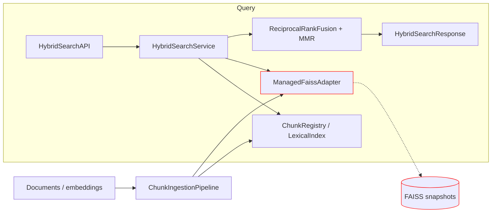
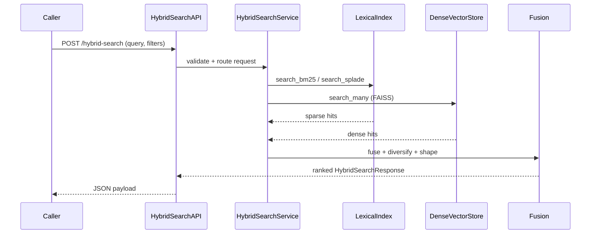

# DocsToKG • HybridSearch

Purpose: Hybrid retrieval engine combining lexical and dense vector search with configurable fusion and observability.
Scope boundary: Ingests chunked documents, maintains FAISS/OpenSearch-style indexes, and exposes search APIs; does not train embedding models or manage downstream ranking pipelines.

---

## Quickstart
> Bootstrap a virtualenv, ensure a CUDA-enabled `faiss-gpu` build is available, then run the bundled demo harness to ingest a toy dataset and execute a hybrid search.
>
> Requirements:
> - NVIDIA GPU with drivers exposed to the runtime and CUDA-enabled `faiss-gpu` installed into the virtualenv.
> - The repo’s sample dataset at `tests/data/hybrid_dataset.jsonl` (installed by default).

```bash
./scripts/bootstrap_env.sh
source .venv/bin/activate        # or run `direnv allow` if you use direnv

# Ingest + search: writes tmp/hybrid_quickstart.config.json on first run
python examples/hybrid_search_quickstart.py
```

Expected output includes an ingestion summary similar to:

```
[hybrid-quickstart] wrote default config -> tmp/hybrid_quickstart.config.json
[hybrid-quickstart] Ingested 3 chunks from 3 documents across namespaces: ['research', 'support']
[hybrid-quickstart] Top result doc_id=doc-1 (fused score=...)
  01. doc_id=doc-1 ...
```

The harness accepts `--query`, `--namespace`, `--page-size`, and `--no-diversify` flags for ad-hoc searches against the in-memory stack.

## GPU prerequisites & validation checklist
- Ensure the GPU runtime exposes the shared libraries required by the custom FAISS wheel: `libcudart.so.12`, `libcublas.so.12`, `libopenblas.so.0`, `libjemalloc.so.2`, and `libgomp.so.1`. Linux glibc/glibcxx versions must satisfy the wheel’s `GLIBC_2.38` / `GLIBCXX_3.4.32` requirements.
- Confirm your `LD_LIBRARY_PATH` (or distro-specific loader config) includes the directories that host the CUDA 12 runtime and OpenBLAS libraries; install the CUDA toolkit or runtime packages if any of the libraries are missing.
- Optional tuning knobs provided by the wheel loader: set `FAISS_OPT_LEVEL=<generic|avx2|avx512>` to bypass CPU feature probes, and `FAISS_DISABLE_CPU_FEATURES=...` to opt out of specific instruction sets when debugging.
- Full compatibility notes live in the [Custom FAISS GPU wheel reference](./faiss-gpu-wheel-reference.md); keep it nearby when upgrading drivers or containers.

**Quick validation before running ingestion**

```bash
# 1) Verify the loader can locate required CUDA/OpenBLAS libraries
ldconfig -p | grep -E 'libcudart|libcublas|libopenblas'

# 2) Sanity-check FAISS import, version, and visible GPUs
python - <<'PY'
import faiss
print('faiss version:', getattr(faiss, '__version__', 'unknown'))
print('visible GPUs:', faiss.get_num_gpus())
PY

# 3) (Optional) Lock FAISS to a known CPU code path if needed
export FAISS_OPT_LEVEL=avx2  # or unset once the environment is stable
```

If the GPU count is `0`, double-check driver installation and ensure `nvidia-smi` reports healthy devices before retrying ingestion.

## Common commands
```bash
# Re-run the quickstart search with a different query/namespace
python examples/hybrid_search_quickstart.py --query "snapshot restore runbook" --namespace support

# Inspect more candidates without diversification
python examples/hybrid_search_quickstart.py --page-size 5 --no-diversify

# Hybrid search regression (requires CUDA faiss + GPU)
pytest tests/hybrid_search/test_suite.py::test_hybrid_retrieval_end_to_end -q
```

## Folder map
- `service.py` – Hybrid search orchestration API (validation, fusion, pagination guards).
- `pipeline.py` – Chunk ingestion, feature generation, observability helpers.
- `store.py` – FAISS/OpenSearch adapters, vector math utilities, snapshotting.
- `config.py` – Pydantic-style configuration models for indexing, fusion, retrieval.
- `interfaces.py` – Protocol definitions for dense and lexical adapters.
- `router.py` – Namespace-aware FAISS router with snapshot/restore.
- `types.py` – Typed data contracts (`DocumentInput`, `HybridSearchRequest/Response`).
- `features.py` – Tokenization, sliding window, and feature generation primitives.
- `devtools/` – Simulation utilities (OpenSearch simulator, test harness helpers).
- `tests/hybrid_search/` – End-to-end and scale test suites.

## System overview



## Entry points & contracts
- Entry points: Python APIs (`HybridSearchService`, `HybridSearchAPI`), ingestion helpers in `pipeline.py`, FAISS router/service glue in `router.py`.
- Contracts/invariants:
  - Stable mapping between vector UUIDs and FAISS ids (`_vector_uuid_to_faiss_int`).
  - Fusion output deterministic given identical inputs/config (`FusionConfig`, `RetrievalConfig`).
  - Chunk registry and dense store must stay in sync on add/remove operations.

## Configuration
- Env/config knobs (Pydantic models in `config.py`):
  - `HybridSearchConfig` – top-level settings (namespace mode, chunking, retrieval budgets).
  - `DenseIndexConfig` – FAISS knobs including GPU replication, memory pooling, and null-stream toggles (`gpu_use_default_null_stream`, `gpu_use_default_null_stream_all_devices`).
  - `FusionConfig` – RRF/MMR parameters (`k0`, `mmr_lambda`, `token_budget`, `byte_budget`).
  - `RetrievalConfig` – channel weights, top-k, filter policy.
- Configuration manager (`HybridSearchConfigManager`) loads JSON/YAML (TODO document sample path).
- Validate config: `direnv exec . python - <<'PY'` (TODO provide doctor command).

## Data contracts & schemas
- Typed dataclasses in `types.py` (e.g., `HybridSearchRequest`, `HybridSearchResponse`, `ValidationReport`).
- TODO: link JSON schema if exported (e.g., `docs/schemas/hybrid-search-request.json`).
- Chunk artifact formats: JSONL with `ChunkPayload` structure; vector dumps via `serialize_state`.

## Interactions with other packages
- Upstream: expects pre-generated embeddings/chunks (DocParsing pipeline) and optional lexical index implementations.
- Downstream: exposes ranked results and diagnostics consumed by application layer / API gateway.
- ID/path guarantees: vector IDs are UUIDs; chunk paths referenced by `ChunkRegistry`; FAISS snapshots stored alongside service state.

## Observability
- Logs: standard library logging via `Observability` (structured counters, histograms).
- Metrics/tracing: `MetricsCollector`, `TraceRecorder` emit samples that can be forwarded to Prometheus/OpenTelemetry (TODO detail exporters).
- **SLIs/SLOs**: TODO define success rate and latency targets; monitor `AdapterStats` for GPU availability.
- Health: TODO add/describe doctor or heartbeat command (e.g., `python -m DocsToKG.HybridSearch.service --healthcheck`).

## Security & data handling
- ASVS level: TODO (assume L2 while APIs exposed).
- Threats (STRIDE):
  - Spoofing: ensure query/auth handled by upstream gateway.
  - Tampering: protect FAISS snapshots and chunk artifacts (checksum, ACLs).
  - Repudiation: log search requests/namespace dispatch with correlation ids.
  - Information disclosure: sanitize highlights, avoid leaking embeddings; no PII stored by default.
  - DoS: enforce `FusionConfig.token_budget` and `RetrievalConfig.top_k` to cap workload.
- Data classification: no PII by default; embeddings treated as internal data; secrets (GPU credentials, index paths) managed via config.

## Development tasks
```bash
direnv exec . ruff check src/DocsToKG/HybridSearch tests/hybrid_search
direnv exec . mypy src/DocsToKG/HybridSearch
direnv exec . pytest tests/hybrid_search/test_suite.py -q
# TODO add fmt/lint/typecheck orchestrated via Justfile when available
```
- For GPU-specific tests, ensure FAISS w/ GPU available or skip markers (`pytest -q -k gpu --maxfail=1`).

## Agent guardrails
- Do:
  - Extend ingestion/search pipelines via protocols (`LexicalIndex`, `DenseVectorStore`).
  - Add metrics/observability using existing `Observability` hooks.
- Do not:
  - Change vector UUID to FAISS mapping without updating snapshot compatibility.
  - Bypass `ResultShaper` budgets or disable pagination verification.
- Danger zone:
  - `direnv exec . python -m DocsToKG.HybridSearch.store --rebuild-all` (TODO confirm command) may delete/rebuild FAISS indices.
  - Modifying serialization formats (`serialize_state`, `ChunkPayload`) without coordinated migrations.

## FAQ
- Q: How do I add a new dense store implementation?
  A: Implement `DenseVectorStore` protocol, wire into `FaissRouter` via factory, update `HybridSearchConfigManager`.

- Q: How can I run the end-to-end test suite?
  A: `direnv exec . pytest tests/hybrid_search/test_suite.py -q`; ensure optional GPU tests skipped or satisfied.

<!-- Machine-readable appendix -->
```json x-agent-map
{
  "entry_points":[
    {"type":"python","module":"DocsToKG.HybridSearch.service","symbols":["HybridSearchService","HybridSearchAPI"]},
    {"type":"python","module":"DocsToKG.HybridSearch.pipeline","symbols":["ChunkIngestionPipeline","Observability"]},
    {"type":"python","module":"DocsToKG.HybridSearch.store","symbols":["ManagedFaissAdapter","serialize_state","restore_state"]}
  ],
  "env":[
    {"name":"TODO_HYBRID_CONFIG_PATH","default":"configs/hybrid-search.yaml","required":false},
    {"name":"TODO_HYBRID_EXPECTED_NTOTAL","default":null,"required":false}
  ],
  "schemas":[
    {"kind":"python-typing","path":"src/DocsToKG/HybridSearch/types.py"}
  ],
  "artifacts_out":[
    {"path":"faiss_snapshots/*.bin","consumed_by":["service restore"]},
    {"path":"chunk_registry/*.jsonl","consumed_by":["lexical index loaders"]}
  ],
  "danger_zone":[
    {"command":"TODO_rebuild_command","effect":"Rebuilds or deletes FAISS indexes"}
  ]
}
```
