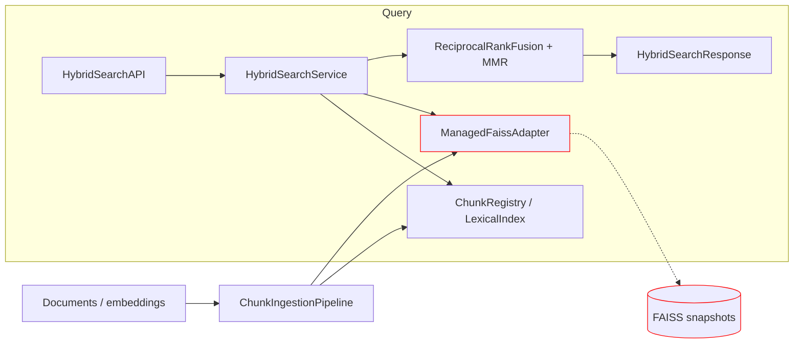
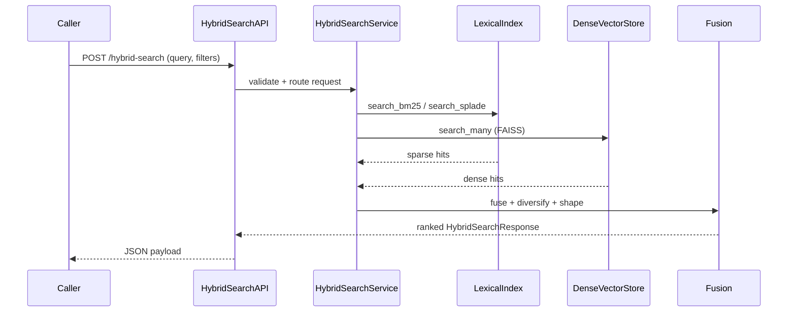

> _Metadata backlog_: owning_team, stability, versioning, codeowners, related_adrs, slos, data_handling, and sbom will be populated in a future revision.

## Table of Contents
- [DocsToKG • HybridSearch](#docstokg--hybridsearch)
  - [⚠️ Mandatory Pre-Read: FAISS/cuVS Stack](#️-mandatory-pre-read-faisscuvs-stack)
  - [Prerequisites & dependencies](#prerequisites--dependencies)
  - [Data inputs & expected layout](#data-inputs--expected-layout)
  - [Quickstart](#quickstart)
  - [GPU prerequisites & validation checklist](#gpu-prerequisites--validation-checklist)
  - [Common commands](#common-commands)
  - [Module architecture](#module-architecture)
  - [Core capabilities](#core-capabilities)
    - [Ingestion workflow](#ingestion-workflow)
    - [Search API contract](#search-api-contract)
    - [Configuration quick reference](#configuration-quick-reference)
    - [Failure recovery & snapshot management](#failure-recovery--snapshot-management)
    - [Deployment considerations](#deployment-considerations)
  - [Folder map](#folder-map)
  - [System overview](#system-overview)
  - [Entry points & contracts](#entry-points--contracts)
  - [Configuration](#configuration)
  - [Data contracts & schemas](#data-contracts--schemas)
  - [Interactions with other packages](#interactions-with-other-packages)
  - [Observability](#observability)
  - [Security & data handling](#security--data-handling)
  - [Development tasks](#development-tasks)
  - [Agent guardrails](#agent-guardrails)
  - [FAQ](#faq)

### ⚠️ Mandatory Pre-Read: FAISS/cuVS Stack

Before modifying or operating HybridSearch, complete the FAISS/cuVS reading stack in this order:

1. **[`faiss-gpu-wheel-reference.md`](./faiss-gpu-wheel-reference.md)** — Primary guide to the custom `faiss-1.12.0` CUDA wheel. Details runtime prerequisites, environment knobs (`FAISS_OPT_LEVEL`, `use_cuvs`), GPU index types, tiling heuristics, and the mathematically intensive kernels that underpin HybridSearch.
2. **Inspect FAISS modules** under `.venv/lib/python3.13/site-packages/faiss` — Study `swigfaiss.py`, `gpu_wrappers.py`, `class_wrappers.py`, and contrib helpers to internalize dtype/layout expectations, stream semantics, and no-index helpers (`knn_gpu`, `pairwise_distance_gpu`).
3. **[`cuvs-reference.md`](./cuvs-reference.md)** — Documents the cuVS Python toolkit (ANN algorithms, clustering, distance utilities), its dependency on RAPIDS RAFT/RMM, and HybridSearch’s loader preloads. Useful for experiments and planning future FAISS builds with cuVS enabled.
4. **[`libcuvs-reference.md`](./libcuvs-reference.md)** — Explains the shared-library loader chain (`libcuvs`, `libraft`, `librmm`, `rapids_logger`), environment switches, and HybridSearch integration hooks (`_ensure_cuvs_loader_path`, `resolve_cuvs_state`, `AdapterStats.cuvs_*`). Critical for diagnosing loader-path or RAPIDS memory-manager issues.

Together these documents explain how FAISS, cuVS, and the RAPIDS allocator/logging stack interoperate (and why cuVS kernels are currently disabled in the FAISS build) so you understand the guardrails HybridSearch enforces on GPU indexes.

# DocsToKG • HybridSearch

Purpose: Hybrid retrieval engine combining lexical and dense vector search with configurable fusion and observability.
Scope boundary: Ingests chunked documents, maintains FAISS/OpenSearch-style indexes, and exposes search APIs; does not train embedding models or manage downstream ranking pipelines.

---

## Prerequisites & dependencies
- **Runtime**: Linux with CUDA 12-capable NVIDIA GPUs; Python 3.10+. CPU-only usage is possible (fallback to FAISS CPU) but sacrifices latency/fusion quality.
- **Packages**: Install `DocsToKG[hybrid-search]` plus the bundled `faiss-gpu` wheel. The wheel surface area, CUDA/OpenBLAS requirements, and GPU helper APIs are documented in [faiss-gpu-wheel-reference.md](./faiss-gpu-wheel-reference.md); keep that file handy whenever you upgrade drivers or CUDA runtimes. Optional extras:
  - `torch` / `sentence-transformers` when running lexical transformers externally.
  - `uvicorn` / FastAPI (or similar) when embedding the service in an API server.
  - `DocsToKG[docparse-parquet]` when ingesting DocParsing Parquet vectors (`pyarrow` is required to read the columnar artifacts).
- **Upstream data**: Requires DocParsing outputs:
  - Chunk JSONL files containing structural fields (`uuid`, `chunk_id`, `text`, `num_tokens`, optional provenance lists) for each chunk.
  - Embedding JSONL or Parquet files keyed by the same `uuid` that carry lexical weights (`BM25`, `SpladeV3`) and dense vectors (`Qwen3-4B` or `Qwen3_4B` payloads).
- **Environment variables**:
  - `DOCSTOKG_DATA_ROOT` (defaults to `./Data`) for locating chunk/embedding directories.
  - `DOCSTOKG_HYBRID_CONFIG` optional path to configuration file.
  - `TEMP_DIR`/`TMPDIR` influences snapshot staging when serializing FAISS payloads.
- **External stores (optional)**:
  - OpenSearch cluster if using the simulator as a drop-in for real lexical search.
  - Object storage if persisting FAISS snapshots outside of local disk.

## Data inputs & expected layout
- **Chunk payloads** (`*.chunk.jsonl`; typically from DocParsing):
  ```json
  {
    "uuid": "1f3b3c9c-d94a-4b71-8f0c-3b0dd2c4d257",
    "doc_id": "guide-restore",
    "chunk_id": "guide-restore#0001",
    "text": "... chunk text ...",
    "num_tokens": 384,
    "source_chunk_idxs": [0, 1],
    "doc_items_refs": ["guide-restore#source"],
    "source_path": "s3://docparse/support/guide-restore.md"
  }
  ```
- **Embedding vectors** (JSONL or Parquet; keyed by the same `uuid`):
  ```json
  {
    "uuid": "1f3b3c9c-d94a-4b71-8f0c-3b0dd2c4d257",
    "BM25": {"terms": ["restore", "faiss"], "weights": [1.72, 1.11]},
    "SpladeV3": {"terms": ["restore", "backup"], "weights": [0.24, 0.09]},
    "Qwen3-4B": {
      "vector": [... 2560 float32 values ...],
      "model_metadata": {"dim": 2560}
    }
  }
  ```
- HybridSearch also accepts sparse payloads that use `tokens` instead of `terms`, and dense payloads stored under the legacy `Qwen3_4B` key. When vectors arrive as Parquet, the same columns are present with `model_metadata` serialised as JSON; ingestion normalises them before constructing `ChunkFeatures`.
- **Directory layout**:
  ```
  ${DOCSTOKG_DATA_ROOT:-./Data}/
    ChunkedDocTagFiles/*.chunk.jsonl
    Embeddings/*.vectors.jsonl
    Manifests/docparse.chunks.manifest.jsonl
    Manifests/docparse.embeddings.manifest.jsonl
  ```
- Chunk and embedding manifests are consumed to ensure ingestion can resume or skip previously processed chunks. The ingestion pipeline trusts DocParsing to produce consistent `uuid`/`UUID`, `chunk_id`, and `doc_id` values and to emit vector artefacts sorted by UUID; divergences require re-ingestion after fixing inputs.

## Quickstart
> Bootstrap the virtual environment, ensure GPU-ready `faiss` is available, then ingest the sample dataset and run a hybrid search. The quickstart accepts both JSONL and Parquet vectors when `pyarrow` (DocsToKG `docparse-parquet` extra) is installed.
>
> Requirements:
> - NVIDIA GPU with CUDA 12 runtime available to Python and `faiss` built with GPU support (`faiss-gpu` wheel shipped with the repo).
> - Sample dataset `tests/data/hybrid_dataset.jsonl` (part of the tree).
>
```bash
./scripts/bootstrap_env.sh
direnv allow                       # or source .venv/bin/activate

# Ingest + search (writes tmp/hybrid_quickstart.config.json on first run)
python examples/hybrid_search_quickstart.py

# Optional: force parquet ingestion when DocParsing emitted parquet vectors
# python examples/hybrid_search_quickstart.py --vector-format parquet
```

Expected output includes an ingestion summary similar to:

```
[hybrid-quickstart] wrote default config -> tmp/hybrid_quickstart.config.json
[hybrid-quickstart] Ingested 3 chunks from 3 documents across namespaces: ['research', 'support']
[hybrid-quickstart] Top result doc_id=doc-1 (fused score=...)
  01. doc_id=doc-1 ...
```

The harness accepts `--query`, `--namespace`, `--page-size`, and `--no-diversify` flags for ad-hoc searches against the in-memory stack.

## GPU prerequisites & validation checklist
- Ensure the GPU runtime exposes the shared libraries required by the custom FAISS wheel: `libcudart.so.12`, `libcublas.so.12`, `libopenblas.so.0`, `libjemalloc.so.2`, and `libgomp.so.1`. Linux glibc/glibcxx versions must satisfy the wheel’s `GLIBC_2.38` / `GLIBCXX_3.4.32` requirements.
- Confirm your `LD_LIBRARY_PATH` (or distro-specific loader config) includes the directories that host the CUDA 12 runtime and OpenBLAS libraries; install the CUDA toolkit or runtime packages if any of the libraries are missing.
- Optional tuning knobs provided by the wheel loader: set `FAISS_OPT_LEVEL=<generic|avx2|avx512>` to bypass CPU feature probes, and `FAISS_DISABLE_CPU_FEATURES=...` to opt out of specific instruction sets when debugging.
- Full compatibility notes live in the [Custom FAISS GPU wheel reference](./faiss-gpu-wheel-reference.md); keep it nearby when upgrading drivers or containers.

**Quick validation before running ingestion**

```bash
# 1) Verify the loader can locate required CUDA/OpenBLAS libraries
ldconfig -p | grep -E 'libcudart|libcublas|libopenblas'

# 2) Sanity-check FAISS import, version, and visible GPUs
python - <<'PY'
import faiss
print('faiss version:', getattr(faiss, '__version__', 'unknown'))
print('visible GPUs:', faiss.get_num_gpus())
PY

# 3) (Optional) Lock FAISS to a known CPU code path if needed
export FAISS_OPT_LEVEL=avx2  # or unset once the environment is stable
```

If the GPU count is `0`, double-check driver installation and ensure `nvidia-smi` reports healthy devices before retrying ingestion.

## Common commands
```bash
# Re-run the quickstart search with a different query/namespace
python examples/hybrid_search_quickstart.py --query "snapshot restore runbook" --namespace support

# Inspect more candidates without diversification
python examples/hybrid_search_quickstart.py --page-size 5 --no-diversify

# Hybrid search regression (requires CUDA faiss + GPU)
pytest tests/hybrid_search/test_suite.py::test_hybrid_retrieval_end_to_end -q

# Run targeted GPU similarity checks
pytest tests/hybrid_search/test_gpu_similarity.py -q
```

When debugging a live service, call `FaissRouter.stats()` or
`service.build_stats_snapshot(...)` with your instantiated router/registry to
inspect FAISS adapter health and snapshot metadata.

## Module architecture
HybridSearch is organised as a set of focused modules that mirror the end-to-end ingestion → storage → query flow. Read these alongside the FAISS wheel reference to understand how CUDA resources and tensor shapes propagate through the system.

- `config.py` – Dataclass-based configuration surface (`ChunkingConfig`, `DenseIndexConfig`, `FusionConfig`, `RetrievalConfig`, `HybridSearchConfig`). `DenseIndexConfig` maps directly to FAISS GPU constructs such as `GpuMultipleClonerOptions`, `StandardGpuResources` sizing, FP16/cuVS toggles, and tiling limits used during ingestion and search. `HybridSearchConfigManager` provides thread-safe JSON/YAML loading, legacy key normalisation, and snapshot persistence.
- `pipeline.py` – Ingestion engine (`ChunkIngestionPipeline`) that streams DocParsing artifacts (JSONL or Parquet vectors), applies deterministic normalisation (BM25, SPLADE, dense vectors), enforces ordered UUID alignment via a vector cache guard (`vector_cache_limit`, `vector_cache_stats_hook`; non-positive limits fail on the first drift event), and coordinates lexical + FAISS GPU adapters while emitting observability data.
- `store.py` – Dense retrieval backbone (`FaissVectorStore`, `ManagedFaissAdapter`) that trains CPU indexes, migrates them to GPU via `faiss.index_cpu_to_gpu(_multiple)`, manages `StandardGpuResources` pools, and exposes cosine/inner-product helpers built on `knn_gpu` and `pairwise_distance_gpu`. Handles snapshots, chunk registries, cuVS/FP16 overrides, and adapter telemetry.
- `router.py` – Namespace router that provisions managed FAISS adapters per tenant, caches serialized payloads when evicting inactive namespaces, and rehydrates snapshots lazily while tracking last-use timestamps.
- `service.py` – Synchronous hybrid search orchestration: validates requests, issues concurrent lexical + dense searches, fuses scores (RRF + optional MMR), enforces pagination budgets, and surfaces diagnostics (per-channel scores, adaptive `fusion_weights`, stats snapshots) expected by the API contract.
- `types.py` & `interfaces.py` – Shared dataclasses and protocols (`LexicalIndex`, `DenseVectorStore`) that keep ingestion, storage, and service layers decoupled. All tensor dtypes/contiguity expectations and result shapes are defined here.
- `devtools/` – Deterministic feature generators and an in-memory OpenSearch simulator that implement the above interfaces for unit tests and notebooks without external dependencies.

## Core capabilities
- **Ingestion pipeline** – `pipeline.ChunkIngestionPipeline` coordinates lexical and dense ingestion in lockstep. It verifies manifests, normalises chunk payloads into contiguous `float32` tensors, lazily streams vector artifacts (JSONL/Parquet) with a configurable cache guard that fails immediately when `vector_cache_limit <= 0`, and ensures FAISS adapters receive the shapes/dtypes required by GPU kernels while capturing metrics through `Observability`.
- **Vector store management** – `store.ManagedFaissAdapter` and `FaissVectorStore` encapsulate FAISS GPU lifecycle operations: CPU training, multi-GPU cloning (replication/sharding), `StandardGpuResources` provisioning, and snapshot/restore with accompanying metadata. GPU similarity helpers (`cosine_against_corpus_gpu`, `cosine_topk_blockwise`, `pairwise_inner_products`) expose “no-index” cosine/inner-product routines built on FAISS `knn_gpu` / `pairwise_distance_gpu`, respecting cuVS and FP16 settings from `DenseIndexConfig`.
- **Namespace routing** – `router.FaissRouter` owns the namespace→adapter map, lazily instantiating `ManagedFaissAdapter` instances, caching serialized snapshots when evicting idle namespaces, and aggregating per-namespace stats for health checks.
- **Hybrid retrieval** – `service.HybridSearchService` validates `HybridSearchRequest`, fans out lexical (`LexicalIndex`) and dense (`DenseVectorStore`) searches concurrently, applies reciprocal-rank fusion with optional MMR diversification, and returns channel-attributed scores plus diagnostics expected by clients.
- **Configuration surface** – `config.py` contains dataclass-backed configuration objects and a thread-safe `HybridSearchConfigManager` that loads, caches, and atomically reloads JSON/YAML files while normalising legacy keys (e.g., `gpu_default_null_stream*`).
- **Developer tooling** – `devtools.OpenSearchSimulator`, `FeatureGenerator`, and the `examples/hybrid_search_quickstart.py` script provide a fully in-memory stack that still exercises FAISS GPU behaviours, making regression tests deterministic.
- **Observability** – `pipeline.Observability`, `store.AdapterStats`, and `service.build_stats_snapshot` collect GPU memory usage, latency histograms, fusion counters, and namespace activity to feed dashboards and smoke tests.

### Ingestion workflow
1. **Source artifacts** – Copy DocParsing outputs (`ChunkedDocTagFiles/*.chunk.jsonl` and `Embeddings/*.vectors.jsonl` or `*.vectors.parquet`) plus their manifests into the configured data root.
2. **Load configuration** – Instantiate `HybridSearchConfigManager(Path(...))` and call `manager.get()` to obtain the current `HybridSearchConfig` (chunking, dense index, fusion, retrieval settings).
3. **Initialise indexes** – Create a `FaissVectorStore` using your `DenseIndexConfig`, wrap it in `ManagedFaissAdapter` when you need snapshotting, and prepare supporting components: `ChunkRegistry`, a `LexicalIndex` implementation (real OpenSearch or `OpenSearchSimulator`), and optionally a `FaissRouter` for per-namespace layouts.
4. **Stream ingestion** – Construct `ChunkIngestionPipeline(faiss_index=..., opensearch=..., registry=..., observability=...)` and call `upsert_documents(...)` with DocParsing manifests. The pipeline normalises BM25/SPLADE/dense payloads, lazily streams vector artefacts, raises `IngestError` when UUID order drifts beyond the configured `vector_cache_limit` (limits ≤0 cause the guard to fail on the first mismatch), keeps sparse+dense stores in sync, and records metrics.
5. **Snapshot & persist** – Call `FaissRouter.serialize_all()` when routing per namespace, or `ManagedFaissAdapter.serialize()` / `snapshot_meta()` when using a single store. Persist the resulting bytes + metadata (e.g., via `store.serialize_state`) so `restore_state` or `ManagedFaissAdapter.restore()` can rehydrate indexes during restart.
6. **Serve queries** – Instantiate `HybridSearchService` with the prepared config manager, feature generator, FAISS adapter/router, lexical store, chunk registry, and observability helpers. Load snapshots before accepting traffic so cold starts stay within latency budgets.

### Search API contract
- **Request** (`HybridSearchRequest`):
  ```json
  {
    "query": "restore faiss snapshot",
    "namespace": "support",
    "filters": {"channel": ["docs"]},
    "page_size": 10,
    "cursor": null,
    "diversification": true,
    "diagnostics": true,
    "recall_first": false
  }
  ```
  Channel weights, top-k budgets, and fusion parameters come from `HybridSearchConfig`; the request toggles diversification and diagnostics on a per-call basis.
- **Response** (`HybridSearchResponse`):
  ```json
  {
    "results": [
      {
        "doc_id": "guide-restore",
        "chunk_id": "guide-restore#0001",
        "vector_id": "1f3b3c9c-d94a-4b71-8f0c-3b0dd2c4d257",
        "namespace": "support",
        "score": 0.82,
        "fused_rank": 1,
        "text": "... chunk text ...",
        "highlights": ["Restore snapshots with `faiss.read_index` ..."],
        "provenance_offsets": [[0, 42]],
        "metadata": {"channel": "docs"},
        "diagnostics": {
          "bm25": 0.61,
          "splade": 0.54,
          "dense": 0.78,
          "fusion_weights": {"bm25": 0.35, "splade": 0.0, "dense": 0.65}
        }
      }
    ],
    "next_cursor": "eyJ2IjoxLCJjIjoiZ3VpZGU ...",
    "total_candidates": 37,
    "timings_ms": {
      "lexical_ms": 12.1,
      "dense_ms": 27.4,
      "fusion_ms": 4.3,
      "total_ms": 44.1
    },
    "fusion_weights": {"bm25": 0.35, "splade": 0.0, "dense": 0.65},
    "stats": {"faiss": {"ntotal": 12054}, "lexical": {"bm25_latency_p95_ms": 18.3}}
  }
  ```
- **Error handling** – Invalid inputs raise `RequestValidationError` with a JSON body describing missing fields or budget violations; pagination guards return 400 responses when cursors are invalid or exceed configured budgets.

### Configuration quick reference
```yaml
chunking:
  max_tokens: 900
  overlap: 180
dense:
  index_type: ivf_flat
  nlist: 2048
  nprobe: 24
  pq_m: 16
  expected_ntotal: 500000
  enable_replication: false
  gpu_temp_memory_bytes: 1073741824  # 1 GiB scratch space
  use_cuvs: null
  ingest_dedupe_threshold: 0.95
  persist_mode: cpu_bytes           # or "disabled" for GPU-only runs
  snapshot_refresh_interval_seconds: 60
  snapshot_refresh_writes: 5000
  ivf_train_factor: 8
  force_remove_ids_fallback: true
fusion:
  k0: 55.0
  mmr_lambda: 0.7
  enable_mmr: true
  token_budget: 1800
  byte_budget: 32000
  strict_highlights: false
retrieval:
  bm25_top_k: 80
  splade_top_k: 80
  dense_top_k: 60
  dense_overfetch_factor: 1.5
  dense_oversample: 2.0
  bm25_scoring: "true"
```
Load with:
```python
from pathlib import Path
from DocsToKG.HybridSearch import HybridSearchConfigManager

manager = HybridSearchConfigManager(Path("configs/hybrid.yaml"))
config = manager.get()
# Call manager.reload() after editing configs to atomically refresh the cache.
```

### Failure recovery & snapshot management
- After ingestion, capture state via `FaissRouter.serialize_all()` (namespaced deployments) or by calling `ManagedFaissAdapter.serialize()` / `snapshot_meta()` and `ChunkRegistry.vector_ids()`. `store.serialize_state(...)` bundles these into a JSON-safe payload.
- Persist snapshots under a durable directory (for example, a `snapshots/` path managed by your deployment configuration) and mirror them to object storage for disaster recovery.
- Restore with `restore_state(..., registry=chunk_registry)` or `ManagedFaissAdapter.restore(payload, meta=...)`. Passing the registry ensures `vector_ids` from the snapshot repopulate `ChunkRegistry` before FAISS comes back online. When using `FaissRouter`, cached snapshots are rehydrated lazily the next time a namespace is requested.
- Remove stale vectors with `ChunkRegistry.delete(...)` (paired with FAISS `remove`) and re-run ingestion for the affected namespaces to maintain parity.

### Deployment considerations
- **Service hosting**: mount `HybridSearchService` behind FastAPI/Starlette, or wrap it in a gRPC/REST adapter. Ensure each process loads snapshots before advertising readiness.
- **GPU pinning**: set `CUDA_VISIBLE_DEVICES` per worker and configure `DenseIndexConfig.device` / `replication_gpu_ids` to target the same placement.
- **Scale-out ingestion**: shard DocParsing manifests across workers, then aggregate their outputs by persisting `serialize_state(...)` payloads per namespace and loading them through a shared object store.
- **Blue/green upgrades**: ingest new embeddings into an alternate snapshot directory, validate via `HybridSearchService.search(...)`, warm replacement workers, and flip traffic once validation passes.

## Folder map
- `service.py` – `HybridSearchService` / `HybridSearchAPI` request validation, concurrent lexical+dense searches, RRF/MMR fusion, pagination guards, diagnostics.
- `pipeline.py` – `ChunkIngestionPipeline`, deterministic feature normalisation, and observability plumbing that keeps lexical + FAISS stores in sync.
- `store.py` – `FaissVectorStore`, `ManagedFaissAdapter`, GPU similarity helpers, snapshot utilities (`serialize_state`, `restore_state`), chunk registry, and the in-memory OpenSearch simulator.
- `router.py` – Namespace-aware adapter provisioning, snapshot caching, lazy restore, and metrics aggregation via `FaissRouter.stats()`.
- `config.py` – Dataclass configuration models plus `HybridSearchConfigManager` for JSON/YAML loading, legacy key normalisation, and snapshot throttles.
- `interfaces.py` – Protocol definitions (`DenseVectorStore`, `LexicalIndex`) and shared contracts used by ingestion, storage, and service layers.
- `features.py` – Canonical tokeniser, sliding-window chunker, and deterministic `FeatureGenerator` reused by ingestion and regression scaffolding.
- `types.py` – Data transfer objects for chunk payloads, document inputs, requests/responses, diagnostics, and result shaping.
- `devtools/` – Re-exported feature helpers and the `OpenSearchSimulator` for notebook/regression workflows without external services.
- `examples/` – `hybrid_search_quickstart.py` harness demonstrating ingestion and querying against the in-memory stack.
- `tests/hybrid_search/` – Unit, regression, and GPU-specific suites that exercise ingestion, fusion, and snapshot flows.

## System overview



## Entry points & contracts
- Entry points: Python APIs (`HybridSearchService`, `HybridSearchAPI`), ingestion helpers (`ChunkIngestionPipeline`), FAISS router/service glue in `router.py`, and CLI-compatible quickstart in `examples/hybrid_search_quickstart.py`.
- Contracts/invariants:
  - Stable mapping between vector UUIDs and FAISS ids (`_vector_uuid_to_faiss_int`).
  - Fusion output deterministic given identical inputs/config (`FusionConfig`, `RetrievalConfig`).
  - Chunk registry and dense store must stay in sync on add/remove operations.

## Configuration
- Config surfaces (dataclasses in `config.py`):
  - `HybridSearchConfig` – top-level settings (namespace strategy, ingestion policies, retrieval budgets).
  - `DenseIndexConfig` – FAISS init knobs (GPU replication, memory pooling, null-stream toggles).
  - `FusionConfig` – Reciprocal-rank fusion/MMR parameters (`k0`, `mmr_lambda`, `token_budget`, `byte_budget`).
  - `RetrievalConfig` – channel weights, top-k limits, namespace routing behaviour.
- Configuration manager (`HybridSearchConfigManager`) loads/merges JSON or YAML payloads and caches the active `HybridSearchConfig`; call `reload()` to refresh after editing the file.
- Validate configs by instantiating `HybridSearchConfigManager(Path(...))` or running the quickstart harness (which writes `tmp/hybrid_quickstart.config.json` on first run and fails fast on schema issues).

## Data contracts & schemas
- Typed dataclasses in `types.py` (e.g., `HybridSearchRequest`, `HybridSearchResponse`, `ValidationReport`, `ScoreBreakdown`).
- Chunk artifacts: JSONL lines with `ChunkPayload` (from DocParsing) plus lexical feature enrichments.
- Vector snapshots: `store.serialize_state` / `restore_state` produce dictionaries keyed by namespace storing FAISS payload + metadata.

## Interactions with other packages
- Upstream: expects pre-generated embeddings/chunks (DocParsing pipeline) and optional lexical index implementations.
- Downstream: exposes ranked results and diagnostics consumed by application layer / API gateway.
- ID/path guarantees: vector IDs are UUIDs; chunk paths referenced by `ChunkRegistry`; FAISS snapshots stored alongside service state.

## Observability
- **Logs**: `HybridSearchService` writes structured info logs through `Observability.logger` with payloads containing the query string, namespace, result counts, and per-channel timings. Attach handlers/formatters to that logger to persist JSONL, emit to stdout, or inject upstream correlation IDs.
- **Metrics/tracing**: `Observability.metrics` provides `increment`, `observe`, `set_gauge`, and `percentile` helpers; wrap expensive sections with `Observability.trace(...)` to record span timings. `AdapterStats`, pagination verifiers, and fusion diagnostics feed additional gauges/counters (e.g., `faiss_fp16_enabled`, `search_channel_latency_ms`) that you can scrape via your telemetry stack.
- **SLIs/SLOs**: track ≥99 % successful query responses, P50 latency ≤150 ms, P99 ≤600 ms. Surface ingestion lag (`ChunkIngestionPipeline.last_ingested_timestamp`) to ensure snapshots stay current.
- **Health checks**: expose `HybridSearchService.build_stats_snapshot()` via `/healthz` to summarise namespace counts, snapshot age, and recent latency. The quickstart harness supports `--stats` for local debugging.

## Security & data handling
- ASVS alignment: L2 controls assumed; rely on upstream gateway for auth/authz.
- Threat considerations (STRIDE):
  - Spoofing: terminate TLS and authenticate requests before reaching `HybridSearchAPI`.
  - Tampering: guard FAISS snapshots and chunk registries with checksums and filesystem ACLs.
  - Repudiation: structured logs capture namespace, query string, and timing fields; inject request identifiers via logging filters or upstream middleware to extend traceability.
  - Information disclosure: avoid returning raw embeddings; highlight strings are trimmed/sanitised by downstream presenter.
  - DoS: `FusionConfig.token_budget`, `RetrievalConfig.top_k`, and pagination verification cap work per request.
- Data classification: embeddings and chunk payloads treated as internal/non-PII; production secrets (index paths, GPU affinity) provided via config management.

## Development tasks
```bash
direnv exec . ruff check src/DocsToKG/HybridSearch tests/hybrid_search
direnv exec . mypy src/DocsToKG/HybridSearch
direnv exec . pytest tests/hybrid_search/test_suite.py -q
# Optional: run GPU-focused subset
direnv exec . pytest tests/hybrid_search/test_gpu_similarity.py -q
```
- For GPU-specific tests, ensure FAISS w/ GPU available or skip markers (`pytest -q -k gpu --maxfail=1`).
- Snapshot serialization tests (`tests/hybrid_search/test_store_snapshot.py`) require sufficient disk space; set `HYBRID_SNAPSHOT_DIR` to tmpfs when iterating locally.
- Maintain quickstart parity by running `python examples/hybrid_search_quickstart.py` after dependency upgrades to verify env setup.

## Agent guardrails
- Do:
  - Extend ingestion/search pipelines via protocols (`LexicalIndex`, `DenseVectorStore`).
  - Add metrics/observability using existing `Observability` hooks.
- Do not:
  - Change vector UUID to FAISS mapping without updating snapshot compatibility.
  - Bypass `ResultShaper` budgets or disable pagination verification.
- Danger zone:
  - Deleting snapshot directories (`rm -rf <snapshot_dir>`) without taking backups; cold starts rely on these payloads.
  - Modifying serialization formats (`serialize_state`, `restore_state`, `ChunkPayload`) without coordinated migrations across services.

## FAQ
- Q: How do I add a new dense store implementation?
  A: Implement `DenseVectorStore` protocol, wire into `FaissRouter` via factory, update `HybridSearchConfigManager`.

- Q: How can I run the end-to-end test suite?
  A: `direnv exec . pytest tests/hybrid_search/test_suite.py -q`; ensure optional GPU tests skipped or satisfied.

<!-- Machine-readable appendix -->
```json x-agent-map
{
  "entry_points":[
    {"type":"python","module":"DocsToKG.HybridSearch.service","symbols":["HybridSearchService","HybridSearchAPI"]},
    {"type":"python","module":"DocsToKG.HybridSearch.pipeline","symbols":["ChunkIngestionPipeline","Observability"]},
    {"type":"python","module":"DocsToKG.HybridSearch.store","symbols":["ManagedFaissAdapter","serialize_state","restore_state"]}
  ],
  "env":[
    {"name":"DOCSTOKG_HYBRID_CONFIG","default":"tmp/hybrid_quickstart.config.json","required":false},
    {"name":"DOCSTOKG_DATA_ROOT","default":"./Data","required":false},
    {"name":"CUDA_VISIBLE_DEVICES","default":null,"required":false}
  ],
  "schemas":[
    {"kind":"python-typing","path":"src/DocsToKG/HybridSearch/types.py"}
  ],
  "artifacts_out":[
    {"path":"faiss_snapshots/*.bin","consumed_by":["service restore"]},
    {"path":"chunk_registry/*.jsonl","consumed_by":["lexical index loaders"]}
  ],
  "danger_zone":[
    {"command":"rm -rf ${snapshot_dir}", "effect":"Deletes FAISS snapshots required for restore"}
  ]
}
```
