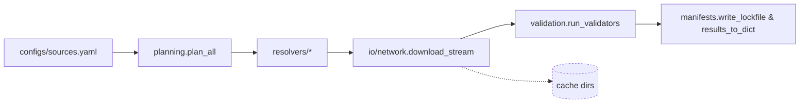

# Agents Guide - OntologyDownload

Last updated: 2025-10-19

## Mission & Scope
- **Mission**: Plan, download, and validate third-party ontologies with deterministic manifests so downstream DocsToKG ingestion can trust provenance and integrity.
- **Scope**: Resolver planning, secure HTTP streaming, manifest/lockfile generation, validator orchestration, configuration tooling.
- **Out-of-scope**: Knowledge-graph ingestion, ontology-specific parsing beyond validation, embedding/analysis of ontology content.

## Quickstart (per README)
```bash
./scripts/bootstrap_env.sh
direnv allow                     # or source .venv/bin/activate
direnv exec . python -m DocsToKG.OntologyDownload.cli config validate configs/sources.yaml
direnv exec . python -m DocsToKG.OntologyDownload.cli pull hp --config configs/sources.yaml --dry-run --json
```
- Use `pull` without `--dry-run` to write artifacts under `LOCAL_ONTOLOGY_DIR/<id>/<version>/`.

## Core Capabilities & Flow
- `planning.plan_all` expands `FetchSpec` inputs (YAML/lockfiles) into deterministic resolver attempts with allowlists and rate limits.
- `resolvers.py` hosts first-party resolvers (OBO, BioPortal, Europe PMC, Zenodo, Wayback, XBRL, etc.) plus plugin discovery.
- `io.network.StreamingDownloader` handles TLS enforcement, DNS pinning, token buckets, and retry-after logic (`io/rate_limit.py`).
- `io.filesystem` manages secure extraction, SHA-256 fingerprints, sanitized filenames, and staging directories.
- `validation.run_validators` executes ROBOT, rdflib, Arelle, schematron, etc., with cooperative cancellation (`cancellation.py`) and per-validator budgets.
- `manifests.py` + `migrations.py` define schema version 1.0, diff helpers, persistence, and compatibility checks.
- `settings.py` models typed configs (defaults, env, lockfiles); `optdeps.py` lazily loads optional packages.
- `logging_utils.py` emits structured JSONL logs; `checksums.py` fetches remote checksum manifests.


## CLI Reference
```bash
direnv exec . python -m DocsToKG.OntologyDownload.cli pull hp
direnv exec . python -m DocsToKG.OntologyDownload.cli plan hp
direnv exec . python -m DocsToKG.OntologyDownload.cli plan-diff hp --lock-output ontologies.lock.json
direnv exec . python -m DocsToKG.OntologyDownload.cli doctor
direnv exec . python -m DocsToKG.OntologyDownload.cli prune --keep 3 --json
direnv exec . python -m DocsToKG.OntologyDownload.cli plugins --kind resolver --json
```
- Additional subcommands: `config`, `show`, `init`, `validate`, `prune`, `plan-diff`, `plan`, `pull`, `doctor`, `plugins`.

## Folder Map Highlights
- `api.py`: Public facade (`plan_all`, `fetch_all`, `run_validators`, `PUBLIC_API_MANIFEST`).
- `cli.py`: Argparse entry point for `ontofetch` subcommands.
- `planning.py`: Planner graph, lockfile writers, manifest validation.
- `resolvers.py`: Resolver registry + third-party integrations.
- `io/network.py`, `io/rate_limit.py`: Session pooling, retry-after, token buckets, circuit breakers.
- `io/filesystem.py`: Archive extraction, checksum sidecars, sanitized filenames.
- `validation.py`: Validator harness + subprocess supervision.
- `manifests.py`, `migrations.py`: Manifest schema v1.0, diff helpers, compatibility upgrades.
- `settings.py`: Typed config defaults, env/CLI overrides, fsspec/local storage selection.
- `plugins.py`, `exports.py`: Entry-point discovery, public export manifest.
- `checksums.py`: Remote checksum parsing, retry policies.
- `logging_utils.py`: Structured logging configuration.
- `testing/`: Fixtures and harness for pytest suites.

## Configuration & Environment
- Config sources: `configs/sources.yaml`, environment variables, CLI overrides.
- Key environment variables:
  | Variable | Purpose | Default |
  | --- | --- | --- |
  | `ONTOLOGY_FETCHER_CONFIG` | Override config path used by CLI. | Auto-detected `configs/sources.yaml`. |
  | `ONTOFETCH_LOG_DIR` | Redirect JSONL logs. | `LOG_DIR` (defaults to `~/.data/ontology-fetcher/logs`). |
  | `LOCAL_ONTOLOGY_DIR` | Artifact destination. | `~/.data/ontology-fetcher/ontologies`. |
  | `CACHE_DIR`, `CONFIG_DIR` | Derived from pystow (`~/.data/ontology-fetcher/{cache,configs}`). | |
  | Resolver credentials (e.g., `BIOPORTAL_API_KEY`) | Injected into resolver configs. | Required per resolver. |
  | `PYSTOW_HOME` | Global pystow cache root. | `~/.data`. |
- Validate config: `python -m DocsToKG.OntologyDownload.cli config validate configs/sources.yaml` or `config show`.
- Lockfiles: `plan-diff --lock-output ontologies.lock.json` produces deterministic resolver inputs for `pull --lock`.

## Outputs & Artifacts
| Artifact | Contents | Producer | Consumer |
| --- | --- | --- | --- |
| `LOCAL_ONTOLOGY_DIR/<id>/<version>/` | Extracted ontology payloads, checksum sidecars, normalized RDF/archives. | `planning.fetch_all` + `io.filesystem`. | DocParsing pipelines, downstream ingestion. |
| `CACHE_DIR/manifests/<timestamp>.json` | Manifest with resolver attempts + validation summary. | `manifests.write_lockfile`, `results_to_dict`. | Auditing, plan diffs. |
| `ontologies.lock.json` | Resolver URL/version metadata for deterministic replays. | `plan - lock-output`. | `pull --lock`, CI. |
| `LOG_DIR/ontofetch-*.jsonl` | Structured logs with `stage`, `resolver`, latency metrics. | `logging_utils.setup_logging`. | Observability stack. |
- Manifest schema: see `manifests.py`. Validators recorded as `{"name": "...", "status": "...", "duration_s": ...}`.

## Error Handling & Observability
- Structured logs (JSONL) capture retries, `sleep_sec`, error payloads; tail via `jq` for quick triage.
- Failures appear in manifests with resolver outcomes + validator errors; use `doctor` to diagnose environment and optional dependencies.
- Common failure cues:
  - Repeated 429/503 → adjust `settings.DownloadConfiguration` rate limits (`domain_rate_limits`, token buckets).
  - Checksums mismatched → clear local cache, refetch, verify `expected_checksum`.
  - Validator OOM/timeouts → tune validator budgets in config or limit parallel validators.

## Extensibility
- **Resolvers**: Implement `Resolver` protocol, expose via `docstokg.ontofetch.resolver` entry point, register with `plugins.register_resolver`, supply polite headers/checksum metadata.
- **Validators**: Provide callable returning `ValidationResult`, register under `docstokg.ontofetch.validator`, respect semaphore budgets (`_ValidatorBudget`).
- **Plugin observability**: `python -m DocsToKG.OntologyDownload.cli plugins` lists resolver/validator metadata and load issues.

## Test Matrix & Quality Gates
```bash
just fmt && just lint && just typecheck   # if repo uses justfile
pytest tests/ontology_download -q
pytest tests/ontology_download/test_download.py::test_download_stream_retries -q
```
- High-signal suites: `tests/ontology_download/test_cli.py`, `test_download.py`, `test_resolvers.py`, `test_validators.py`.
- Maintain fixtures under `tests/ontology_download/fixtures/` when altering resolver/validator behaviour.

## Operational Tips
- Use `plan hp --json` for dry plan inspection; `plan-diff --baseline` to compare against previous runs.
- `doctor` surfaces missing optional dependencies, rotates logs, scaffolds API key placeholders when `--fix` is passed.
- `prune --keep N` enforces retention across versions; dry run before deleting artifacts.
- Storage backends determined by `settings.get_storage_backend()` (`LOCAL_ONTOLOGY_DIR` or fsspec when `ONTOFETCH_STORAGE_URL` set).
- Streaming downloader uses 1 MiB chunks; adjust rate limits rather than chunk size for performance tuning.

## Reference Docs
- `src/DocsToKG/OntologyDownload/README.md`
- API docs under `docs/04-api/DocsToKG.OntologyDownload.*`
- Schema references in `docs/schemas/ontology-downloader-config.json`
