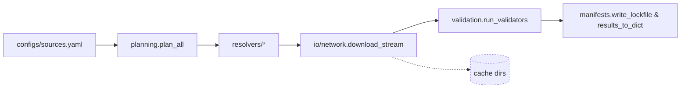

## Table of Contents

- [0) Guard rails (set once per session)](#0-guard-rails-set-once-per-session)
- [1) Verify the environment exists (no install)](#1-verify-the-environment-exists-no-install)
- [2) Run commands strictly from the project `.venv`](#2-run-commands-strictly-from-the-project-venv)
- [3) Quick health checks (no network)](#3-quick-health-checks-no-network)
- [4) Typical tasks (all no-install)](#4-typical-tasks-all-no-install)
- [5) Troubleshooting (stay no-install)](#5-troubleshooting-stay-no-install)
- [6) “Absolutely no installs” policy (what you may do)](#6-absolutely-no-installs-policy-what-you-may-do)
- [7) Fallback (only with **explicit approval** to install)](#7-fallback-only-with-explicit-approval-to-install)
- [8) One-page quick reference (copy/paste safe)](#8-one-page-quick-reference-copy-paste-safe)
- [Mission & Scope](#mission-scope)
- [Quickstart (per README)](#quickstart-per-readme)
- [Core Capabilities & Flow](#core-capabilities-flow)
- [CLI Reference](#cli-reference)
- [Folder Map Highlights](#folder-map-highlights)
- [Configuration & Environment](#configuration-environment)
- [Outputs & Artifacts](#outputs-artifacts)
- [Error Handling & Observability](#error-handling-observability)
- [Extensibility](#extensibility)
- [Test Matrix & Quality Gates](#test-matrix-quality-gates)
- [Operational Tips](#operational-tips)
- [Reference Docs](#reference-docs)
- [Coding Standards & Module Organization](#coding-standards-module-organization)

# Project Environment — **No-Install** Runbook (for AI agents)

> **Prime directive:** **Use the packages already installed in `./.venv`.**
> Do **not** fetch or install anything unless you are explicitly told to. The project `.venv` includes custom wheels and GPU-specific builds that must not be disturbed.

---

## 0) Guard rails (set once per session)

To make accidental installs impossible:

```bash
# Always run inside the project venv (enforced)
export PIP_REQUIRE_VIRTUALENV=1

# Never hit the network/package index unless explicitly allowed
export PIP_NO_INDEX=1

# Don’t read user site-packages (avoid leakage)
export PYTHONNOUSERSITE=1
```

> If you later receive explicit approval to install, temporarily unset `PIP_NO_INDEX` (and only follow the “Fallback (with approval)” section at the end).

---

## 1) Verify the environment exists (no install)

```bash
# from repo root
test -x .venv/bin/python || { echo "ERROR: .venv is missing — STOP (no installs)."; exit 1; }
```

If missing or broken: **stop and report**. Do **not** create or modify the environment without authorization.

---

## 2) Run commands strictly from the project `.venv`

Pick **one** method below. All of them resolve **imports and console scripts from `./.venv`** and avoid installs.

### A) Most explicit (activation-free; recommended for agents)

```bash
# Call tools by absolute path inside the venv
./.venv/bin/python -m pip --version      # proves you're on ./.venv/bin/python
./.venv/bin/python -m DocsToKG.OntologyDownload.cli --help
./.venv/bin/pytest -q
./.venv/bin/ruff check .
./.venv/bin/mypy src
```

### B) `direnv` (auto-env; if available)

```bash
direnv allow                             # trust once per machine
direnv exec . python -m pip --version
direnv exec . python -m DocsToKG.OntologyDownload.cli --help
direnv exec . pytest -q
```

### C) `./scripts/dev.sh` (portable wrapper; no direnv needed)

```bash
./scripts/dev.sh doctor                  # prints interpreter/env and importability
./scripts/dev.sh python -m DocsToKG.OntologyDownload.cli --help
./scripts/dev.sh exec pytest -q
./scripts/dev.sh pip list                # safe: listing does not install
```

### D) Classic activation (if explicitly requested)

```bash
# Linux/macOS
source .venv/bin/activate
export PYTHONPATH="\$PWD/src:${PYTHONPATH:-}"    # mirrors project behavior
python -m pip --version
python -m DocsToKG.OntologyDownload.cli --help
pytest -q
```

> Prefer **A–C** for automation. **D** is acceptable in interactive shells but easier to get wrong.

---

## 3) Quick health checks (no network)

Run these **before** heavy work:

```bash
# 1) Interpreter identity (must be the project venv)
./.venv/bin/python - <<'PY'
import sys
assert sys.executable.endswith("/.venv/bin/python"), sys.executable
print("OK: using", sys.executable)
PY

# 2) Package presence WITHOUT installing (examples)
./.venv/bin/python -c "import DocsToKG, pkgutil; print('DocsToKG OK');"
./.venv/bin/python -c "import faiss; print('FAISS OK')"
./.venv/bin/python -c "import cupy; import numpy; print('CuPy OK', cupy.__version__)"
```

If any import fails: **do not install**. Go to Troubleshooting.

---

## 4) Typical tasks (all no-install)

```bash
# CLIs (module form)
./.venv/bin/python -m DocsToKG.OntologyDownload.cli --help

# Tests
./.venv/bin/pytest -q

# Lint/format
./.venv/bin/ruff check .
./.venv/bin/black --check .

# Type check
./.venv/bin/mypy src
```

> Always prefer `python -m <module>` and `.venv/bin/<tool>` — these guarantee resolution from the project environment.

---

## 5) Troubleshooting (stay no-install)

**Symptom → Action (no installs):**

- **`ModuleNotFoundError`**
  You’re not using the project interpreter. Re-run via one of §2 methods, then re-check `sys.executable`.

- **GPU/FAISS/CuPy errors** (e.g., missing `.so`/DLL)
  Do **not** build or fetch wheels. Report the exact error. These packages are customized; replacing them may break GPU paths.

- **`pip` tries to fetch**
  You forgot the guard rails. Ensure `PIP_REQUIRE_VIRTUALENV=1` and `PIP_NO_INDEX=1` are set. Never pass `-U/--upgrade`.

---

## 6) “Absolutely no installs” policy (what you may do)

- You **may**:

  - Inspect environment: `./.venv/bin/pip list`, `./.venv/bin/pip show <pkg>`.
  - Run any console script from `./.venv/bin/…`.
  - Read code and run module CLIs with `python -m …`.

- You **must not**:

  - Run `pip install`, `pip wheel`, `pip cache purge`, or `pip uninstall`.
  - Upgrade/downgrade packages (including `pip` itself).
  - Recreate or modify `./.venv` without explicit approval.

---

## 7) Fallback (only with **explicit approval** to install)

If (and only if) you have written approval to modify the environment, apply the **smallest necessary** action **inside** the venv:

```bash
# ensure you are in the project venv first:
source .venv/bin/activate  # or use ./.venv/bin/python -m pip ...
unset PIP_NO_INDEX         # allow index access if instructed

# project code (editable) and pinned deps ONLY:
pip install -e .
pip install -r requirements.txt

# If a local wheelhouse exists (to avoid network):
# pip install --no-index --find-links ./ci/wheels -r requirements.txt
```

> Never “try versions” or compile GPU libs. If a wheel is missing, escalate.

---

## 8) One-page quick reference (copy/paste safe)

```bash
# Guard rails (no accidental installs)
export PIP_REQUIRE_VIRTUALENV=1 PIP_NO_INDEX=1 PYTHONNOUSERSITE=1

# Verify venv exists (stop if missing)
test -x .venv/bin/python || { echo "Missing .venv — STOP (no installs)."; exit 1; }

# Preferred run patterns (choose ONE)
./.venv/bin/python -m DocsToKG.OntologyDownload.cli --help
./.venv/bin/pytest -q
# or
direnv exec . python -m DocsToKG.OntologyDownload.cli --help
direnv exec . pytest -q
# or
./scripts/dev.sh doctor
./scripts/dev.sh python -m DocsToKG.OntologyDownload.cli --help
./scripts/dev.sh exec pytest -q

# Health checks (no network)
./.venv/bin/python - <<'PY'
import sys; assert sys.executable.endswith("/.venv/bin/python"); print("OK:", sys.executable)
PY
./.venv/bin/python -c "import DocsToKG, faiss, cupy; print('Core imports OK')"
```

---

### Final note for agents

This repository’s environment includes **custom wheels and GPU-optimized packages**. Treat the `.venv` as **immutable** unless you are explicitly told to modify it. Your default posture is **execute only**: run what’s already installed, verify, and report issues rather than “fixing” them by installing.

# Agents Guide - OntologyDownload

Last updated: 2025-02-15

## Mission & Scope

- **Mission**: Plan, download, and validate third-party ontologies with deterministic manifests so downstream DocsToKG ingestion can trust provenance and integrity.
- **Scope**: Resolver planning, secure HTTP streaming, manifest/lockfile generation, validator orchestration, configuration tooling.
- **Out-of-scope**: Knowledge-graph ingestion, ontology-specific parsing beyond validation, embedding/analysis of ontology content.

## Quickstart (per README)

```bash
./scripts/bootstrap_env.sh
./.venv/bin/python -m DocsToKG.OntologyDownload.cli doctor --json
./.venv/bin/python -m DocsToKG.OntologyDownload.cli config validate --spec configs/sources.yaml
./.venv/bin/python -m DocsToKG.OntologyDownload.cli pull hp --spec configs/sources.yaml --dry-run --json
```

- Use `pull` without `--dry-run` to persist artefacts under `LOCAL_ONTOLOGY_DIR/<id>/<version>/`.
- Alternative wrappers (`./scripts/dev.sh exec …`, `direnv exec . …`) are `.venv`-aware but default to the explicit `./.venv/bin/python` form for automation.

## Core Capabilities & Flow

- `planning.plan_all`/`fetch_all` transform `FetchSpec` inputs into `PlannedFetch`/`Manifest` objects, coordinate workers with `CancellationTokenGroup`, enforce `validate_url_security`, supervise retries, and persist manifests/lockfiles capturing fingerprints plus streaming checksum fields.
- `resolvers.py` ships first-party resolvers (OBO, OLS, BioPortal, Ontobee, SKOS, LOV, XBRL, direct), normalises licence metadata, negotiates polite headers, enforces token-bucket budgets, and extends via `docstokg.ontofetch.resolver` plugins.
- `io.network.StreamingDownloader` offers shared `SESSION_POOL` management, redirect/DNS auditing, resume support, Retry-After aware throttling, and integrates with `io.rate_limit` and `checksums.ExpectedChecksum`.
- `io.filesystem` sanitises filenames, enforces archive expansion ceilings, generates correlation IDs, masks sensitive data, and writes artefacts beneath `LOCAL_ONTOLOGY_DIR/<id>/<version>/` or CAS mirrors when enabled.
- `validation.run_validators` executes rdflib/pronto/owlready2/ROBOT/Arelle validators with `_ValidatorBudget`, optional process pools, cooperative cancellation, and disk-backed normalisation helpers.
- `manifests.py` + `migrations.py` encode manifest schema 1.0, atomic writes, plan diffs, lockfile helpers, and backwards-compatible migrations.
- `settings.py` models typed defaults/env overrides (`DownloadConfiguration`, `PlannerConfig`, `ValidationConfig`), selects local or fsspec-backed storage (plus CAS mirroring), and exposes optional dependency shims.
- `api.py`, `exports.py`, `formatters.py`, `logging_utils.py`, `cancellation.py`, and `checksums.py` surface the public API, export manifest, table renderers, structured logging, cooperative cancellation, and checksum tooling shared by CLI and automation.



## CLI Reference

```bash
./.venv/bin/python -m DocsToKG.OntologyDownload.cli pull hp --spec configs/sources.yaml --force --concurrent-downloads 2 --json
./.venv/bin/python -m DocsToKG.OntologyDownload.cli plan hp --spec configs/sources.yaml --no-planner-probes --lock-output ontologies.lock.json --json
./.venv/bin/python -m DocsToKG.OntologyDownload.cli plan-diff hp --spec configs/sources.yaml --use-manifest --update-baseline --json
./.venv/bin/python -m DocsToKG.OntologyDownload.cli pull hp --lock ontologies.lock.json --allowed-hosts internal.example.org
./.venv/bin/python -m DocsToKG.OntologyDownload.cli show hp --versions
./.venv/bin/python -m DocsToKG.OntologyDownload.cli validate hp 2025-01-01 --rdflib --owlready2 --json
./.venv/bin/python -m DocsToKG.OntologyDownload.cli plugins --kind all --json
./.venv/bin/python -m DocsToKG.OntologyDownload.cli config show --spec configs/sources.yaml --no-redact-secrets --json
./.venv/bin/python -m DocsToKG.OntologyDownload.cli doctor --fix --json
./.venv/bin/python -m DocsToKG.OntologyDownload.cli prune --keep 3 --older-than 2024-01-01 --dry-run --json
```

- Additional subcommands: `init`, `config validate`, `plan --no-lock`, `validate --pronto/--robot/--arelle`, `pull --dry-run`.

## Folder Map Highlights

- `api.py`: CLI/programmatic orchestration (`fetch_all`, `list_plugins`, `about`, table helpers) tied to the export manifest.
- `cli.py`: Argparse entrypoint exposing `pull`, `plan`, `plan-diff`, `show`, `validate`, `plugins`, `config`, `doctor`, `prune`, `init`, with secret masking and default-subcommand inference.
- `planning.py`: Planner/executor pipeline, manifest dataclasses, checksum enforcement, cancellation handling, validator dispatch, lockfile writers.
- `manifests.py` & `migrations.py`: Manifest schema v1.0 helpers, atomic writers, plan diff utilities, lockfile generation, backwards-compatible upgrades.
- `resolvers.py`: Resolver implementations, polite header negotiation, fallback candidate capture, license normalisation, and plugin registry wiring.
- `io/network.py`, `io/rate_limit.py`, `io/filesystem.py`: Streaming downloads with DNS/redirect guards, shared token buckets, secure extraction, CAS mirroring, correlation IDs.
- `checksums.py`: Expected checksum parsing, checksum URL retrieval, streaming digest helpers feeding manifests and planners.
- `validation.py`: Validator harness with `_ValidatorBudget`, process/thread pools, disk-backed normalisation, plugin cache loaders, rich result serialization.
- `settings.py`: Typed defaults (planner/http/validation/logging), environment overrides, storage backends (local/fsspec plus CAS), optional dependency shims.
- `plugins.py`, `exports.py`, `formatters.py`, `logging_utils.py`, `cancellation.py`: Plugin registries, export manifest, table renderers, structured logging, cooperative cancellation primitives.
- `testing/`: Loopback HTTP harness, temporary storage, resolver/validator injection utilities for end-to-end and CLI tests.

## Configuration & Environment

- Config resolution order: baked-in defaults → environment overrides (`ONTOFETCH_*`, `PYSTOW_HOME`) → YAML (`--spec /path/to/sources.yaml`) → CLI flags. `settings.build_resolved_config` merges and validates before any network access.
- Defaults cover `continue_on_error`, `enable_cas_mirror`, `planner.probing_enabled`, HTTP concurrency (`concurrent_downloads`/`concurrent_plans`), checksum budgets, and validation process-pool toggles.
- Default directories live under `${PYSTOW_HOME:-~/.data}/ontology-fetcher/{configs,cache,logs,ontologies}`; remote storage is enabled via `ONTOFETCH_STORAGE_URL`.
- Key environment variables:

  | Variable | Purpose | Default |
  | --- | --- | --- |
  | `PYSTOW_HOME` | Relocates `CONFIG_DIR`, `CACHE_DIR`, `LOG_DIR`, `LOCAL_ONTOLOGY_DIR`. | `~/.data` |
  | `ONTOFETCH_LOG_DIR` | Override JSONL/rotated log directory. | `${PYSTOW_HOME}/ontology-fetcher/logs` |
  | `ONTOFETCH_STORAGE_URL` | Use fsspec backend (e.g., `file:///mnt/shared`, `s3://bucket/path`). | Local filesystem |
  | `ONTOFETCH_SHARED_RATE_LIMIT_DIR` | Directory for shared token-bucket state. | `${CACHE_DIR}/rate-limits` |
  | `ONTOFETCH_MAX_RETRIES`, `ONTOFETCH_TIMEOUT_SEC`, `ONTOFETCH_DOWNLOAD_TIMEOUT_SEC`, `ONTOFETCH_PER_HOST_RATE_LIMIT`, `ONTOFETCH_BACKOFF_FACTOR`, `ONTOFETCH_MAX_UNCOMPRESSED_SIZE_GB`, `ONTOFETCH_LOG_LEVEL` | Override download/logging config without editing YAML. | Values from `defaults.http` / `defaults.logging` |
  | Resolver credentials (`BIOPORTAL_API_KEY`, `EUROPE_PMC_API_KEY`, …) | Injected into resolver extras via `settings.get_env_overrides`. | Required per resolver when applicable |

- Validate configuration: `./.venv/bin/python -m DocsToKG.OntologyDownload.cli config validate --spec configs/sources.yaml` or `config show --spec … --json`.
- Deterministic runs: `./.venv/bin/python -m DocsToKG.OntologyDownload.cli plan hp --spec configs/sources.yaml --lock-output ontologies.lock.json` then `pull --lock ontologies.lock.json`.

## Outputs & Artifacts

| Artifact | Contents | Producer | Consumer |
| --- | --- | --- | --- |
| `LOCAL_ONTOLOGY_DIR/<id>/<version>/` | Downloaded artefacts, normalized formats, validator reports, checksum sidecars. | `planning.fetch_all` + `io.filesystem`. | DocParsing pipelines, downstream ingestion, manual QA. |
| `LOCAL_ONTOLOGY_DIR/<id>/<version>/manifest.json` | Schema v1.0 manifest capturing resolver attempts, expected checksums, fingerprints, streaming hashes, validation summaries. | `planning.Manifest` via `_write_manifest`. | `cli show`, `plan-diff --use-manifest`, audit tooling. |
| `ontologies.lock.json` | Deterministic plan derived from latest run (resolver, URL, version, checksum). | `manifests.write_lockfile` via `plan`/`plan-diff`. | `pull --lock`, CI/CD replays, change review. |
| `LOCAL_ONTOLOGY_DIR/by-<alg>/<prefix>/<digest>` | Content-addressable mirrors when `enable_cas_mirror` = true. | `settings.STORAGE.mirror_cas_artifact`. | Deduplication, downstream cache warmup. |
| `LOG_DIR/ontofetch-*.jsonl` | Structured logs with `stage`, `resolver`, durations, retries, correlation IDs, masked secrets. | `logging_utils.setup_logging`. | Observability stack, incident response, rate-limit tuning. |

- Manifest schema lives in `manifests.py` (schema version `1.0`) and includes normalized hashes, streaming checksum fields, expected checksum payloads, and validator mappings (`"validation": {"rdflib": {"ok": true, "details": {...}, "output_files": [...]}}`).

## Error Handling & Observability

- Structured logs (`LOG_DIR/ontofetch-*.jsonl`) capture retries, `sleep_sec`, status codes, correlation IDs, and are secret-masked/compressed per retention policy; tail with `jq` or ship to ELK for triage.
- `./.venv/bin/python -m DocsToKG.OntologyDownload.cli doctor --json` audits environment, disk space, optional dependencies, credentials, rate-limit configuration, and token-bucket health without side-effects.
- `DocsToKG.OntologyDownload.api.about()` surfaces package version, manifest schema, plugin inventory, rate limits, and storage paths for dashboards or support tooling.
- Manifests record resolver attempts plus validator outcomes (`validation` mapping). Use `plan-diff --use-manifest` to compare against stored metadata when diagnosing regressions.
- Common failure cues:
  - Repeated 429/503 → adjust `settings.DownloadConfiguration` rate limits (`rate_limits`, token buckets).
  - Checksums mismatched → clear local cache, refetch, verify `expected_checksum`.
  - Validator OOM/timeouts → tune validator budgets in config or limit parallel validators.

## Extensibility

- **Resolvers**: Implement `resolvers.Resolver` (or subclass `BaseResolver`), expose via the `docstokg.ontofetch.resolver` entry-point group, and keep polite headers, expected checksums, and target format hints in metadata. For tests, use `plugins.register_resolver`.
- **Validators**: Provide a callable returning `ValidationResult`, register under `docstokg.ontofetch.validator`, and honour `_ValidatorBudget`/process pool guidance to avoid starvation; use `plugins.register_validator` when stubbing.
- **Plugin observability**: `./.venv/bin/python -m DocsToKG.OntologyDownload.cli plugins --kind all --json` lists resolver/validator inventory, qualified import paths, and load issues sourced from the plugin registries.
- **Checksums**: Prefer `checksums.ExpectedChecksum` helpers when introducing new checksum sources (`expected_checksum`, `checksum_url`) so manifests and lockfiles stay consistent.

## Test Matrix & Quality Gates

```bash
./.venv/bin/ruff check src/DocsToKG/OntologyDownload tests/ontology_download
./.venv/bin/mypy src/DocsToKG/OntologyDownload
./.venv/bin/pytest tests/ontology_download -q
./.venv/bin/pytest tests/ontology_download/test_download.py::test_download_stream_retries -q
# Optional: if a Justfile is available locally, `just fmt && just lint && just typecheck`
```

- High-signal suites: `tests/ontology_download/test_cli.py`, `test_download.py`, `test_resolvers.py`, `test_validators.py`.
- Maintain fixtures under `tests/ontology_download/fixtures/` when altering resolver/validator behaviour.

## Operational Tips

- `./.venv/bin/python -m DocsToKG.OntologyDownload.cli plan hp --spec configs/sources.yaml --json --no-planner-probes` for dry plan inspection; add `--no-lock` to avoid writing lockfiles when probing is unnecessary.
- `./.venv/bin/python -m DocsToKG.OntologyDownload.cli plan-diff hp --spec configs/sources.yaml --update-baseline --json` seeds/updates baseline snapshots; `--use-manifest` compares against stored manifests.
- `./.venv/bin/python -m DocsToKG.OntologyDownload.cli show hp --versions` quickly inspects stored manifests; pair with `--json` for scripting.
- `./.venv/bin/python -m DocsToKG.OntologyDownload.cli doctor --json` surfaces missing optional dependencies, rotates logs, and scaffolds API key placeholders when `--fix` is passed.
- `./.venv/bin/python -m DocsToKG.OntologyDownload.cli prune --keep N --dry-run` previews retention; omit `--dry-run` with caution (per guardrails).
- Storage backends determined by `settings.get_storage_backend()` (`LOCAL_ONTOLOGY_DIR` or fsspec when `ONTOFETCH_STORAGE_URL` set); CAS mirrors live under `by-<algorithm>/<digest>` when enabled.
- Use `--allowed-hosts host1,host2` on `plan`/`pull` invocations to reach private endpoints; note that supplying `--lock` disables resolver fallback (`prefer_source` replaced with direct downloads).
- Streaming downloader uses 1 MiB chunks; adjust rate limits rather than chunk size for performance tuning.

## Reference Docs

- `src/DocsToKG/OntologyDownload/README.md`
- API docs under `docs/04-api/DocsToKG.OntologyDownload.*`
- Schema references in `docs/schemas/ontology-downloader-config.json`

## Coding Standards & Module Organization

- Follow the documentation in [CODE_ANNOTATION_STANDARDS.md](../../../docs/CODE_ANNOTATION_STANDARDS.md) when adding or updating inline documentation and NAVMAP headers.
- Structure modules according to [MODULE_ORGANIZATION_GUIDE.md.txt](../../../docs/html/_sources/MODULE_ORGANIZATION_GUIDE.md.txt), ensuring imports, type aliases, dataclasses, and public API sections remain predictable for downstream agents.
