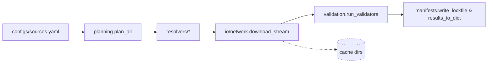

## Table of Contents

- [0) Guard rails (set once per session)](#0-guard-rails-set-once-per-session)
- [1) Verify the environment exists (no install)](#1-verify-the-environment-exists-no-install)
- [2) Run commands strictly from the project `.venv`](#2-run-commands-strictly-from-the-project-venv)
- [3) Quick health checks (no network)](#3-quick-health-checks-no-network)
- [4) Typical tasks (all no-install)](#4-typical-tasks-all-no-install)
- [5) Troubleshooting (stay no-install)](#5-troubleshooting-stay-no-install)
- [6) “Absolutely no installs” policy (what you may do)](#6-absolutely-no-installs-policy-what-you-may-do)
- [7) Fallback (only with **explicit approval** to install)](#7-fallback-only-with-explicit-approval-to-install)
- [8) One-page quick reference (copy/paste safe)](#8-one-page-quick-reference-copy-paste-safe)
- [Mission & Scope](#mission-scope)
- [Quickstart (per README)](#quickstart-per-readme)
- [Core Capabilities & Flow](#core-capabilities-flow)
- [CLI Reference](#cli-reference)
- [Folder Map Highlights](#folder-map-highlights)
- [Configuration & Environment](#configuration-environment)
- [Outputs & Artifacts](#outputs-artifacts)
- [Error Handling & Observability](#error-handling-observability)
- [Extensibility](#extensibility)
- [Test Matrix & Quality Gates](#test-matrix-quality-gates)
- [Operational Tips](#operational-tips)
- [Reference Docs](#reference-docs)
- [Coding Standards & Module Organization](#coding-standards-module-organization)

# Project Environment — **No-Install** Runbook (for AI agents)

> **Prime directive:** **Use the packages already installed in `./.venv`.**
> Do **not** fetch or install anything unless you are explicitly told to. The project `.venv` includes custom wheels and GPU-specific builds that must not be disturbed.

---

## 0) Guard rails (set once per session)

To make accidental installs impossible:

```bash
# Always run inside the project venv (enforced)
export PIP_REQUIRE_VIRTUALENV=1

# Never hit the network/package index unless explicitly allowed
export PIP_NO_INDEX=1

# Don’t read user site-packages (avoid leakage)
export PYTHONNOUSERSITE=1
```

> If you later receive explicit approval to install, temporarily unset `PIP_NO_INDEX` (and only follow the “Fallback (with approval)” section at the end).

---

## 1) Verify the environment exists (no install)

```bash
# from repo root
test -x .venv/bin/python || { echo "ERROR: .venv is missing — STOP (no installs)."; exit 1; }
```

If missing or broken: **stop and report**. Do **not** create or modify the environment without authorization.

---

## 2) Run commands strictly from the project `.venv`

Pick **one** method below. All of them resolve **imports and console scripts from `./.venv`** and avoid installs.

### A) Most explicit (activation-free; recommended for agents)

```bash
# Call tools by absolute path inside the venv
./.venv/bin/python -m pip --version      # proves you're on ./.venv/bin/python
./.venv/bin/python -m DocsToKG.ContentDownload.cli --help
./.venv/bin/pytest -q
./.venv/bin/ruff check .
./.venv/bin/mypy src
```

### B) `direnv` (auto-env; if available)

```bash
direnv allow                             # trust once per machine
direnv exec . python -m pip --version
direnv exec . python -m DocsToKG.ContentDownload.cli --help
direnv exec . pytest -q
```

### C) `./scripts/dev.sh` (portable wrapper; no direnv needed)

```bash
./scripts/dev.sh doctor                  # prints interpreter/env and importability
./scripts/dev.sh python -m DocsToKG.ContentDownload.cli --help
./scripts/dev.sh exec pytest -q
./scripts/dev.sh pip list                # safe: listing does not install
```

### D) Classic activation (if explicitly requested)

```bash
# Linux/macOS
source .venv/bin/activate
export PYTHONPATH="\$PWD/src:${PYTHONPATH:-}"    # mirrors project behavior
python -m pip --version
python -m DocsToKG.ContentDownload.cli --help
pytest -q
```

> Prefer **A–C** for automation. **D** is acceptable in interactive shells but easier to get wrong.

---

## 3) Quick health checks (no network)

Run these **before** heavy work:

```bash
# 1) Interpreter identity (must be the project venv)
./.venv/bin/python - <<'PY'
import sys
assert sys.executable.endswith("/.venv/bin/python"), sys.executable
print("OK: using", sys.executable)
PY

# 2) Package presence WITHOUT installing (examples)
./.venv/bin/python -c "import DocsToKG, pkgutil; print('DocsToKG OK');"
./.venv/bin/python -c "import faiss; print('FAISS OK')"
./.venv/bin/python -c "import cupy; import numpy; print('CuPy OK', cupy.__version__)"
```

If any import fails: **do not install**. Go to Troubleshooting.

---

## 4) Typical tasks (all no-install)

```bash
# CLIs (module form)
./.venv/bin/python -m DocsToKG.ContentDownload.cli --help

# Tests
./.venv/bin/pytest -q

# Lint/format
./.venv/bin/ruff check .
./.venv/bin/black --check .

# Type check
./.venv/bin/mypy src
```

> Always prefer `python -m <module>` and `.venv/bin/<tool>` — these guarantee resolution from the project environment.

---

## 5) Troubleshooting (stay no-install)

**Symptom → Action (no installs):**

- **`ModuleNotFoundError`**
  You’re not using the project interpreter. Re-run via one of §2 methods, then re-check `sys.executable`.

- **GPU/FAISS/CuPy errors** (e.g., missing `.so`/DLL)
  Do **not** build or fetch wheels. Report the exact error. These packages are customized; replacing them may break GPU paths.

- **`pip` tries to fetch**
  You forgot the guard rails. Ensure `PIP_REQUIRE_VIRTUALENV=1` and `PIP_NO_INDEX=1` are set. Never pass `-U/--upgrade`.

---

## 6) “Absolutely no installs” policy (what you may do)

- You **may**:

  - Inspect environment: `./.venv/bin/pip list`, `./.venv/bin/pip show <pkg>`.
  - Run any console script from `./.venv/bin/…`.
  - Read code and run module CLIs with `python -m …`.

- You **must not**:

  - Run `pip install`, `pip wheel`, `pip cache purge`, or `pip uninstall`.
  - Upgrade/downgrade packages (including `pip` itself).
  - Recreate or modify `./.venv` without explicit approval.

---

## 7) Fallback (only with **explicit approval** to install)

If (and only if) you have written approval to modify the environment, apply the **smallest necessary** action **inside** the venv:

```bash
# ensure you are in the project venv first:
source .venv/bin/activate  # or use ./.venv/bin/python -m pip ...
unset PIP_NO_INDEX         # allow index access if instructed

# project code (editable) and pinned deps ONLY:
pip install -e .
pip install -r requirements.txt

# If a local wheelhouse exists (to avoid network):
# pip install --no-index --find-links ./ci/wheels -r requirements.txt
```

> Never “try versions” or compile GPU libs. If a wheel is missing, escalate.

---

## 8) One-page quick reference (copy/paste safe)

```bash
# Guard rails (no accidental installs)
export PIP_REQUIRE_VIRTUALENV=1 PIP_NO_INDEX=1 PYTHONNOUSERSITE=1

# Verify venv exists (stop if missing)
test -x .venv/bin/python || { echo "Missing .venv — STOP (no installs)."; exit 1; }

# Preferred run patterns (choose ONE)
./.venv/bin/python -m DocsToKG.ContentDownload.cli --help
./.venv/bin/pytest -q
# or
direnv exec . python -m DocsToKG.ContentDownload.cli --help
direnv exec . pytest -q
# or
./scripts/dev.sh doctor
./scripts/dev.sh python -m DocsToKG.ContentDownload.cli --help
./scripts/dev.sh exec pytest -q

# Health checks (no network)
./.venv/bin/python - <<'PY'
import sys; assert sys.executable.endswith("/.venv/bin/python"); print("OK:", sys.executable)
PY
./.venv/bin/python -c "import DocsToKG, faiss, cupy; print('Core imports OK')"
```

---

### Final note for agents

This repository’s environment includes **custom wheels and GPU-optimized packages**. Treat the `.venv` as **immutable** unless you are explicitly told to modify it. Your default posture is **execute only**: run what’s already installed, verify, and report issues rather than “fixing” them by installing.

# Agents Guide - OntologyDownload

Last updated: 2025-10-19

## Mission & Scope

- **Mission**: Plan, download, and validate third-party ontologies with deterministic manifests so downstream DocsToKG ingestion can trust provenance and integrity.
- **Scope**: Resolver planning, secure HTTP streaming, manifest/lockfile generation, validator orchestration, configuration tooling.
- **Out-of-scope**: Knowledge-graph ingestion, ontology-specific parsing beyond validation, embedding/analysis of ontology content.

## Quickstart (per README)

```bash
./scripts/bootstrap_env.sh
direnv allow                     # or source .venv/bin/activate
direnv exec . python -m DocsToKG.OntologyDownload.cli config validate configs/sources.yaml
direnv exec . python -m DocsToKG.OntologyDownload.cli pull hp --config configs/sources.yaml --dry-run --json
```

- Use `pull` without `--dry-run` to write artifacts under `LOCAL_ONTOLOGY_DIR/<id>/<version>/`.

## Core Capabilities & Flow

- `planning.plan_all` expands `FetchSpec` inputs (YAML/lockfiles) into deterministic resolver attempts with allowlists and rate limits.
- `resolvers.py` hosts first-party resolvers (OBO, BioPortal, Europe PMC, Zenodo, Wayback, XBRL, etc.) plus plugin discovery.
- `io.network.StreamingDownloader` handles TLS enforcement, DNS pinning, token buckets, and retry-after logic (`io/rate_limit.py`).
- `io.filesystem` manages secure extraction, SHA-256 fingerprints, sanitized filenames, and staging directories.
- `validation.run_validators` executes ROBOT, rdflib, Arelle, schematron, etc., with cooperative cancellation (`cancellation.py`) and per-validator budgets.
- `manifests.py` + `migrations.py` define schema version 1.0, diff helpers, persistence, and compatibility checks.
- `settings.py` models typed configs (defaults, env, lockfiles); `optdeps.py` lazily loads optional packages.
- `logging_utils.py` emits structured JSONL logs; `checksums.py` fetches remote checksum manifests.



## CLI Reference

```bash
direnv exec . python -m DocsToKG.OntologyDownload.cli pull hp
direnv exec . python -m DocsToKG.OntologyDownload.cli plan hp
direnv exec . python -m DocsToKG.OntologyDownload.cli plan-diff hp --lock-output ontologies.lock.json
direnv exec . python -m DocsToKG.OntologyDownload.cli doctor
direnv exec . python -m DocsToKG.OntologyDownload.cli prune --keep 3 --json
direnv exec . python -m DocsToKG.OntologyDownload.cli plugins --kind resolver --json
```

- Additional subcommands: `config`, `show`, `init`, `validate`, `prune`, `plan-diff`, `plan`, `pull`, `doctor`, `plugins`.

## Folder Map Highlights

- `api.py`: Public facade (`plan_all`, `fetch_all`, `run_validators`, `PUBLIC_API_MANIFEST`).
- `cli.py`: Argparse entry point for `ontofetch` subcommands.
- `planning.py`: Planner graph, lockfile writers, manifest validation.
- `resolvers.py`: Resolver registry + third-party integrations.
- `io/network.py`, `io/rate_limit.py`: Session pooling, retry-after, token buckets, circuit breakers.
- `io/filesystem.py`: Archive extraction, checksum sidecars, sanitized filenames.
- `validation.py`: Validator harness + subprocess supervision.
- `manifests.py`, `migrations.py`: Manifest schema v1.0, diff helpers, compatibility upgrades.
- `settings.py`: Typed config defaults, env/CLI overrides, fsspec/local storage selection.
- `plugins.py`, `exports.py`: Entry-point discovery, public export manifest.
- `checksums.py`: Remote checksum parsing, retry policies.
- `logging_utils.py`: Structured logging configuration.
- `testing/`: Fixtures and harness for pytest suites.

## Configuration & Environment

- Config sources: `configs/sources.yaml`, environment variables, CLI overrides.
- Key environment variables:

  | Variable | Purpose | Default |
  | --- | --- | --- |
  | `ONTOLOGY_FETCHER_CONFIG` | Override config path used by CLI. | Auto-detected `configs/sources.yaml`. |
  | `ONTOFETCH_LOG_DIR` | Redirect JSONL logs. | `LOG_DIR` (defaults to `~/.data/ontology-fetcher/logs`). |
  | `LOCAL_ONTOLOGY_DIR` | Artifact destination. | `~/.data/ontology-fetcher/ontologies`. |
  | `CACHE_DIR`, `CONFIG_DIR` | Derived from pystow (`~/.data/ontology-fetcher/{cache,configs}`). | |
  | Resolver credentials (e.g., `BIOPORTAL_API_KEY`) | Injected into resolver configs. | Required per resolver. |
  | `PYSTOW_HOME` | Global pystow cache root. | `~/.data`. |

- Validate config: `python -m DocsToKG.OntologyDownload.cli config validate configs/sources.yaml` or `config show`.
- Lockfiles: `plan-diff --lock-output ontologies.lock.json` produces deterministic resolver inputs for `pull --lock`.

## Outputs & Artifacts

| Artifact | Contents | Producer | Consumer |
| --- | --- | --- | --- |
| `LOCAL_ONTOLOGY_DIR/<id>/<version>/` | Extracted ontology payloads, checksum sidecars, normalized RDF/archives. | `planning.fetch_all` + `io.filesystem`. | DocParsing pipelines, downstream ingestion. |
| `CACHE_DIR/manifests/<timestamp>.json` | Manifest with resolver attempts + validation summary. | `manifests.write_lockfile`, `results_to_dict`. | Auditing, plan diffs. |
| `ontologies.lock.json` | Resolver URL/version metadata for deterministic replays. | `plan - lock-output`. | `pull --lock`, CI. |
| `LOG_DIR/ontofetch-*.jsonl` | Structured logs with `stage`, `resolver`, latency metrics. | `logging_utils.setup_logging`. | Observability stack. |

- Manifest schema: see `manifests.py`. Validators recorded as `{"name": "...", "status": "...", "duration_s": ...}`.

## Error Handling & Observability

- Structured logs (JSONL) capture retries, `sleep_sec`, error payloads; tail via `jq` for quick triage.
- Failures appear in manifests with resolver outcomes + validator errors; use `doctor` to diagnose environment and optional dependencies.
- Common failure cues:
  - Repeated 429/503 → adjust `settings.DownloadConfiguration` rate limits (`domain_rate_limits`, token buckets).
  - Checksums mismatched → clear local cache, refetch, verify `expected_checksum`.
  - Validator OOM/timeouts → tune validator budgets in config or limit parallel validators.

## Extensibility

- **Resolvers**: Implement `Resolver` protocol, expose via `docstokg.ontofetch.resolver` entry point, register with `plugins.register_resolver`, supply polite headers/checksum metadata.
- **Validators**: Provide callable returning `ValidationResult`, register under `docstokg.ontofetch.validator`, respect semaphore budgets (`_ValidatorBudget`).
- **Plugin observability**: `python -m DocsToKG.OntologyDownload.cli plugins` lists resolver/validator metadata and load issues.

## Test Matrix & Quality Gates

```bash
just fmt && just lint && just typecheck   # if repo uses justfile
pytest tests/ontology_download -q
pytest tests/ontology_download/test_download.py::test_download_stream_retries -q
```

- High-signal suites: `tests/ontology_download/test_cli.py`, `test_download.py`, `test_resolvers.py`, `test_validators.py`.
- Maintain fixtures under `tests/ontology_download/fixtures/` when altering resolver/validator behaviour.

## Operational Tips

- Use `plan hp --json` for dry plan inspection; `plan-diff --baseline` to compare against previous runs.
- `doctor` surfaces missing optional dependencies, rotates logs, scaffolds API key placeholders when `--fix` is passed.
- `prune --keep N` enforces retention across versions; dry run before deleting artifacts.
- Storage backends determined by `settings.get_storage_backend()` (`LOCAL_ONTOLOGY_DIR` or fsspec when `ONTOFETCH_STORAGE_URL` set).
- Streaming downloader uses 1 MiB chunks; adjust rate limits rather than chunk size for performance tuning.

## Reference Docs

- `src/DocsToKG/OntologyDownload/README.md`
- API docs under `docs/04-api/DocsToKG.OntologyDownload.*`
- Schema references in `docs/schemas/ontology-downloader-config.json`

## Coding Standards & Module Organization

- Follow the documentation in [CODE_ANNOTATION_STANDARDS.md](../../../docs/CODE_ANNOTATION_STANDARDS.md) when adding or updating inline documentation and NAVMAP headers.
- Structure modules according to [MODULE_ORGANIZATION_GUIDE.md.txt](../../../docs/html/_sources/MODULE_ORGANIZATION_GUIDE.md.txt), ensuring imports, type aliases, dataclasses, and public API sections remain predictable for downstream agents.
