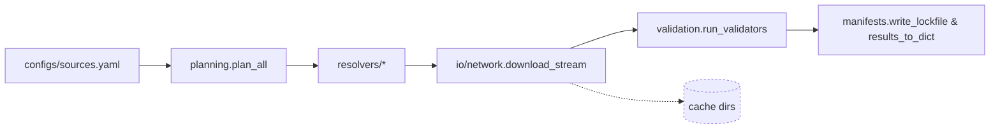

## Environment Setup

Use the uv bootstrap to stand up the project environment:
1. Optionally run `direnv allow` once per machine to trust `.envrc`.
2. For CPU-only work, run `./scripts/bootstrap_env.sh`.
3. For GPU work (requires wheels in `.wheelhouse/`), run `./scripts/bootstrap_env.sh --gpu`.
4. Activate with `direnv exec . <command>` or `source .venv/bin/activate`.

The script installs uv if it is missing, respects `UV_PROJECT_ENVIRONMENT`, and installs DocsToKG in editable mode. After activation, use the tools in `.venv/bin/` (for example `pytest -q`, `ruff check`, or `python -m DocsToKG.<module>`).

## Code Style & Architecture References

- Follow [docs/Formats and Standards/CODESTYLE.md](<../../../../docs/Formats and Standards/CODESTYLE.md>) for Python 3.12+ compatibility, uv-based tooling, and the NAVMAP/docstring requirements.
- Architecture context: [OntologyDownload overview](<../../../../docs/architecture/110-ontology-download.updated.md>) and [Level 2 planning/execution details](<../../../../docs/architecture/110-ontology-download.level2.updated.md>).

## Mission & Scope

- **Mission**: Plan, download, and validate third-party ontologies with deterministic manifests so downstream DocsToKG ingestion can trust provenance and integrity.
- **Scope**: Resolver planning, secure HTTP streaming, manifest/lockfile generation, validator orchestration, configuration tooling.
- **Out-of-scope**: Knowledge-graph ingestion, ontology-specific parsing beyond validation, embedding/analysis of ontology content.

## Quickstart (per README)

```bash
./scripts/bootstrap_env.sh
./.venv/bin/python -m DocsToKG.OntologyDownload.cli doctor --json
./.venv/bin/python -m DocsToKG.OntologyDownload.cli config validate --spec configs/sources.yaml
./.venv/bin/python -m DocsToKG.OntologyDownload.cli pull hp --spec configs/sources.yaml --dry-run --json
```

- Use `pull` without `--dry-run` to persist artefacts under `LOCAL_ONTOLOGY_DIR/<id>/<version>/`.
- Alternative wrappers (`./scripts/dev.sh exec …`, `direnv exec . …`) are `.venv`-aware but default to the explicit `./.venv/bin/python` form for automation.

## Core Capabilities & Flow

- `planning.plan_all`/`fetch_all` transform `FetchSpec` inputs into `PlannedFetch`/`Manifest` objects, coordinate workers with `CancellationTokenGroup`, enforce `validate_url_security`, supervise retries, and persist manifests/lockfiles capturing fingerprints plus streaming checksum fields.
- `resolvers.py` ships first-party resolvers (OBO, OLS, BioPortal, Ontobee, SKOS, LOV, XBRL, direct), normalises licence metadata, negotiates polite headers, enforces token-bucket budgets, and extends via `docstokg.ontofetch.resolver` plugins.
- `io.network.download_stream` reuses the shared HTTPX + Hishel client (`DocsToKG.OntologyDownload.net.get_http_client`), handles redirect/DNS auditing, resume support, Retry-After aware throttling, integrates with `io.rate_limit`/`checksums.ExpectedChecksum`, and enforces allowlists that treat IANA documentation networks as public while still blocking private ranges. Progress telemetry frequency and HEAD preflight behaviour can be adjusted via `DownloadConfiguration`.
- Unit tests should prefer `use_mock_http_client` with `httpx.MockTransport` to exercise streaming behaviour without depending on the real network. `PatchManager` in `tests.conftest` helps apply temporary monkeypatch-style overrides without reintroducing the `pytest.monkeypatch` fixture.
- `io.filesystem` sanitises filenames, enforces archive expansion ceilings, generates correlation IDs, masks sensitive data, and writes artefacts beneath `LOCAL_ONTOLOGY_DIR/<id>/<version>/` or CAS mirrors when enabled.
- `validation.run_validators` executes rdflib/pronto/owlready2/ROBOT/Arelle validators with `_ValidatorBudget`, optional process pools, cooperative cancellation, disk-backed normalisation helpers, and signals `RetryableValidationError` so resolver fallbacks can continue when configured.
- `manifests.py` + `migrations.py` encode manifest schema 1.0, atomic writes, plan diffs, lockfile helpers, and backwards-compatible migrations.
- `settings.py` models typed defaults/env overrides (`DownloadConfiguration`, `PlannerConfig`, `ValidationConfig`), selects local or fsspec-backed storage (plus CAS mirroring), and exposes optional dependency shims.
- `api.py`, `exports.py`, `formatters.py`, `logging_utils.py`, `cancellation.py`, and `checksums.py` surface the public API, export manifest, table renderers, structured logging, cooperative cancellation, and checksum tooling shared by CLI and automation.



## CLI Reference

```bash
./.venv/bin/python -m DocsToKG.OntologyDownload.cli pull hp --spec configs/sources.yaml --force --concurrent-downloads 2 --json
./.venv/bin/python -m DocsToKG.OntologyDownload.cli plan hp --spec configs/sources.yaml --no-planner-probes --lock-output ontologies.lock.json --json
./.venv/bin/python -m DocsToKG.OntologyDownload.cli plan-diff hp --spec configs/sources.yaml --use-manifest --update-baseline --json
./.venv/bin/python -m DocsToKG.OntologyDownload.cli pull hp --lock ontologies.lock.json --allowed-hosts internal.example.org
./.venv/bin/python -m DocsToKG.OntologyDownload.cli show hp --versions
./.venv/bin/python -m DocsToKG.OntologyDownload.cli validate hp 2025-01-01 --rdflib --owlready2 --json
./.venv/bin/python -m DocsToKG.OntologyDownload.cli plugins --kind all --json
./.venv/bin/python -m DocsToKG.OntologyDownload.cli config show --spec configs/sources.yaml --no-redact-secrets --json
./.venv/bin/python -m DocsToKG.OntologyDownload.cli doctor --fix --json
./.venv/bin/python -m DocsToKG.OntologyDownload.cli prune --keep 3 --older-than 2024-01-01 --dry-run --json
```

- Additional subcommands: `init`, `config validate`, `plan --no-lock`, `validate --pronto/--robot/--arelle`, `pull --dry-run`.

## Folder Map Highlights

- `api.py`: CLI/programmatic orchestration (`fetch_all`, `list_plugins`, `about`, table helpers) tied to the export manifest.
- `cli.py`: Argparse entrypoint exposing `pull`, `plan`, `plan-diff`, `show`, `validate`, `plugins`, `config`, `doctor`, `prune`, `init`, with secret masking and default-subcommand inference.
- `planning.py`: Planner/executor pipeline, manifest dataclasses, checksum enforcement, cancellation handling, validator dispatch, lockfile writers.
- `manifests.py` & `migrations.py`: Manifest schema v1.0 helpers, atomic writers, plan diff utilities, lockfile generation, backwards-compatible upgrades.
- `resolvers.py`: Resolver implementations, polite header negotiation, fallback candidate capture, license normalisation, and plugin registry wiring.
- `io/network.py`, `io/rate_limit.py`, `io/filesystem.py`: Streaming downloads with DNS/redirect guards, shared token buckets, secure extraction, CAS mirroring, correlation IDs.
- `checksums.py`: Expected checksum parsing, checksum URL retrieval, streaming digest helpers feeding manifests and planners.
- `validation.py`: Validator harness with `_ValidatorBudget`, process/thread pools, disk-backed normalisation, plugin cache loaders, rich result serialization.
- `settings.py`: Typed defaults (planner/http/validation/logging), environment overrides, storage backends (local/fsspec plus CAS), optional dependency shims.
- `plugins.py`, `exports.py`, `formatters.py`, `logging_utils.py`, `cancellation.py`: Plugin registries, export manifest, table renderers, structured logging, cooperative cancellation primitives.
- `testing/`: Loopback HTTP harness, temporary storage, resolver/validator injection utilities for end-to-end and CLI tests.

## Configuration & Environment

- Config resolution order: baked-in defaults → environment overrides (`ONTOFETCH_*`, `PYSTOW_HOME`) → YAML (`--spec /path/to/sources.yaml`) → CLI flags. `settings.build_resolved_config` merges and validates before any network access.
- Defaults cover `continue_on_error`, `enable_cas_mirror`, `planner.probing_enabled`, HTTP concurrency (`concurrent_downloads`/`concurrent_plans`), checksum budgets, and validation process-pool toggles.
- Default directories live under `${PYSTOW_HOME:-~/.data}/ontology-fetcher/{configs,cache,logs,ontologies}`; remote storage is enabled via `ONTOFETCH_STORAGE_URL`.
- Key environment variables:

  | Variable | Purpose | Default |
  | --- | --- | --- |
  | `PYSTOW_HOME` | Relocates `CONFIG_DIR`, `CACHE_DIR`, `LOG_DIR`, `LOCAL_ONTOLOGY_DIR`. | `~/.data` |
  | `ONTOFETCH_LOG_DIR` | Override JSONL/rotated log directory. | `${PYSTOW_HOME}/ontology-fetcher/logs` |
  | `ONTOFETCH_STORAGE_URL` | Use fsspec backend (e.g., `file:///mnt/shared`, `s3://bucket/path`). | Local filesystem |
  | `ONTOFETCH_SHARED_RATE_LIMIT_DIR` | Directory for shared token-bucket state. | `${CACHE_DIR}/rate-limits` |
  | `ONTOFETCH_MAX_RETRIES`, `ONTOFETCH_TIMEOUT_SEC`, `ONTOFETCH_DOWNLOAD_TIMEOUT_SEC`, `ONTOFETCH_PER_HOST_RATE_LIMIT`, `ONTOFETCH_BACKOFF_FACTOR`, `ONTOFETCH_MAX_UNCOMPRESSED_SIZE_GB`, `ONTOFETCH_LOG_LEVEL` | Override download/logging config without editing YAML. | Values from `defaults.http` / `defaults.logging` |
  | Resolver credentials (`BIOPORTAL_API_KEY`, `EUROPE_PMC_API_KEY`, …) | Injected into resolver extras via `settings.get_env_overrides`. | Required per resolver when applicable |

- Host allowlists remain TLS-first: `DownloadConfiguration.allow_private_networks_for_host_allowlist` only controls whether allowlisted hosts may resolve to private/loopback space, while `allow_plain_http_for_host_allowlist` must be set when explicit HTTP endpoints should skip the automatic HTTPS upgrade.

- Validate configuration: `./.venv/bin/python -m DocsToKG.OntologyDownload.cli config validate --spec configs/sources.yaml` or `config show --spec … --json`.
- Deterministic runs: `./.venv/bin/python -m DocsToKG.OntologyDownload.cli plan hp --spec configs/sources.yaml --lock-output ontologies.lock.json` then `pull --lock ontologies.lock.json`.

## Outputs & Artifacts

| Artifact | Contents | Producer | Consumer |
| --- | --- | --- | --- |
| `LOCAL_ONTOLOGY_DIR/<id>/<version>/` | Downloaded artefacts, normalized formats, validator reports, checksum sidecars. | `planning.fetch_all` + `io.filesystem`. | DocParsing pipelines, downstream ingestion, manual QA. |
| `LOCAL_ONTOLOGY_DIR/<id>/<version>/manifest.json` | Schema v1.0 manifest capturing resolver attempts, expected checksums, fingerprints, streaming hashes, validation summaries. | `planning.Manifest` via `_write_manifest`. | `cli show`, `plan-diff --use-manifest`, audit tooling. |
| `ontologies.lock.json` | Deterministic plan derived from latest run (resolver, URL, version, checksum). | `manifests.write_lockfile` via `plan`/`plan-diff`. | `pull --lock`, CI/CD replays, change review. |
| `LOCAL_ONTOLOGY_DIR/by-<alg>/<prefix>/<digest>` | Content-addressable mirrors when `enable_cas_mirror` = true. | `settings.STORAGE.mirror_cas_artifact`. | Deduplication, downstream cache warmup. |
| `LOG_DIR/ontofetch-*.jsonl` | Structured logs with `stage`, `resolver`, durations, retries, correlation IDs, masked secrets. | `logging_utils.setup_logging`. | Observability stack, incident response, rate-limit tuning. |

- Manifest schema lives in `manifests.py` (schema version `1.0`) and includes normalized hashes, streaming checksum fields, expected checksum payloads, and validator mappings (`"validation": {"rdflib": {"ok": true, "details": {...}, "output_files": [...]}}`).

## Error Handling & Observability

- Structured logs (`LOG_DIR/ontofetch-*.jsonl`) capture retries, `sleep_sec`, status codes, correlation IDs, and are secret-masked/compressed per retention policy; tail with `jq` or ship to ELK for triage.
- `./.venv/bin/python -m DocsToKG.OntologyDownload.cli doctor --json` audits environment, disk space, optional dependencies, credentials, rate-limit configuration, and token-bucket health without side-effects.
- `DocsToKG.OntologyDownload.api.about()` surfaces package version, manifest schema, plugin inventory, rate limits, and storage paths for dashboards or support tooling.
- Manifests record resolver attempts plus validator outcomes (`validation` mapping). Use `plan-diff --use-manifest` to compare against stored metadata when diagnosing regressions.
- Common failure cues:
  - Repeated 429/503 → adjust `settings.DownloadConfiguration` rate limits (`rate_limits`, token buckets).
  - Checksums mismatched → clear local cache, refetch, verify `expected_checksum`.
  - Validator OOM/timeouts → tune validator budgets in config or limit parallel validators.

## Extensibility

- **Resolvers**: Implement `resolvers.Resolver` (or subclass `BaseResolver`), expose via the `docstokg.ontofetch.resolver` entry-point group, and keep polite headers, expected checksums, and target format hints in metadata. For tests, use `plugins.register_resolver`.
- **Validators**: Provide a callable returning `ValidationResult`, register under `docstokg.ontofetch.validator`, and honour `_ValidatorBudget`/process pool guidance to avoid starvation; use `plugins.register_validator` when stubbing.
- **Plugin observability**: `./.venv/bin/python -m DocsToKG.OntologyDownload.cli plugins --kind all --json` lists resolver/validator inventory, qualified import paths, and load issues sourced from the plugin registries.
- **HTTP transport**: Reuse the shared `httpx.Client` via `DocsToKG.OntologyDownload.net.get_http_client`. Install custom transports (e.g., `httpx.MockTransport`) with `configure_http_client` or the `testing.use_mock_http_client` context manager; `reset_http_client` restores the default Hishel-backed client (`CACHE_DIR/http/ontology`) and event hooks that inject polite headers and audit redirects.
- **Checksums**: Prefer `checksums.ExpectedChecksum` helpers when introducing new checksum sources (`expected_checksum`, `checksum_url`) so manifests and lockfiles stay consistent.

## Test Matrix & Quality Gates

```bash
./.venv/bin/ruff check src/DocsToKG/OntologyDownload tests/ontology_download
./.venv/bin/mypy src/DocsToKG/OntologyDownload
./.venv/bin/pytest tests/ontology_download -q
./.venv/bin/pytest tests/ontology_download/test_download.py::test_download_stream_retries -q
# Optional: if a Justfile is available locally, `just fmt && just lint && just typecheck`
```

- High-signal suites: `tests/ontology_download/test_cli.py`, `test_download.py`, `test_resolvers.py`, `test_validators.py`.
- Maintain fixtures under `tests/ontology_download/fixtures/` when altering resolver/validator behaviour.

## Operational Tips

- `./.venv/bin/python -m DocsToKG.OntologyDownload.cli plan hp --spec configs/sources.yaml --json --no-planner-probes` for dry plan inspection; add `--no-lock` to avoid writing lockfiles when probing is unnecessary.
- `./.venv/bin/python -m DocsToKG.OntologyDownload.cli plan-diff hp --spec configs/sources.yaml --update-baseline --json` seeds/updates baseline snapshots; `--use-manifest` compares against stored manifests.
- `./.venv/bin/python -m DocsToKG.OntologyDownload.cli show hp --versions` quickly inspects stored manifests; pair with `--json` for scripting.
- `./.venv/bin/python -m DocsToKG.OntologyDownload.cli doctor --json` surfaces missing optional dependencies, rotates logs, and scaffolds API key placeholders when `--fix` is passed.
- `./.venv/bin/python -m DocsToKG.OntologyDownload.cli prune --keep N --dry-run` previews retention; omit `--dry-run` with caution (per guardrails).
- Storage backends determined by `settings.get_storage_backend()` (`LOCAL_ONTOLOGY_DIR` or fsspec when `ONTOFETCH_STORAGE_URL` set); CAS mirrors live under `by-<algorithm>/<digest>` when enabled.
- Use `--allowed-hosts host1,host2` on `plan`/`pull` invocations to reach private endpoints; note that supplying `--lock` disables resolver fallback (`prefer_source` replaced with direct downloads).
- Streaming downloader uses 1 MiB chunks; adjust rate limits rather than chunk size for performance tuning.

## Reference Docs

- `src/DocsToKG/OntologyDownload/README.md`
- API docs under `docs/04-api/DocsToKG.OntologyDownload.*`
- Schema references in `docs/schemas/ontology-downloader-config.json`

## Coding Standards & Module Organization

- Follow the documentation in [CODE_ANNOTATION_STANDARDS.md](../../../docs/CODE_ANNOTATION_STANDARDS.md) when adding or updating inline documentation and NAVMAP headers.
- Structure modules according to [MODULE_ORGANIZATION_GUIDE.md.txt](../../../docs/html/_sources/MODULE_ORGANIZATION_GUIDE.md.txt), ensuring imports, type aliases, dataclasses, and public API sections remain predictable for downstream agents.
