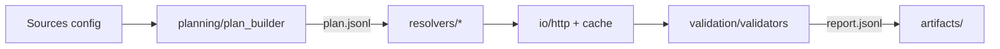
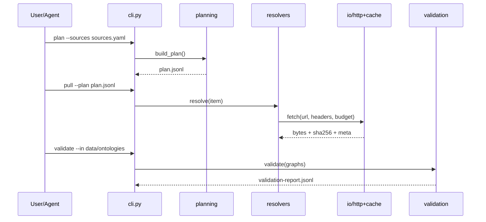

# DocsToKG • OntologyDownload

**Purpose:** Fetch, normalize, and validate ontologies (OWL/TTL/JSON/ZIP) from multiple providers with strict provenance and reproducibility.  
**Scope boundary:** Download & validate only. No mutation of downstream vector stores or graphs.

_Last updated: 2025-10-18_

---

## Quickstart

> One-shot setup, then plan -> pull -> validate.

```bash
# From repo root (recommended)
python -m venv .venv && source .venv/bin/activate
pip install -U pip
pip install -e ".[dev]"

# If you use a dev container, open in VS Code -> "Reopen in Container"
```

### Common commands

```bash
# If you ship a justfile:
just ontology.plan              # build a plan from sources config
just ontology.pull              # execute plan with retries + caching
just ontology.validate          # run RDF parse/shape checks; produce reports
just ontology.doctor            # environment and network sanity checks

# Fallback: direct CLI invocation
python -m DocsToKG.OntologyDownload plan     --sources ./configs/ontology-sources.yaml --out ./artifacts/plan.jsonl
python -m DocsToKG.OntologyDownload pull     --plan ./artifacts/plan.jsonl --out ./data/ontologies
python -m DocsToKG.OntologyDownload validate --in   ./data/ontologies --report ./artifacts/validation-report.jsonl
python -m DocsToKG.OntologyDownload doctor
```

---

## Folder map (this package)

- `cli.py` — single CLI surface (plan / pull / validate / doctor)
- `settings/` — typed config (Pydantic) + `.env` loading
- `planning/` — build deterministic plan(s) from source manifests
- `resolvers/` — provider plugins (e.g., SNOMED, ICD-11, RxNorm, LOINC, HPO, MONDO, MeSH, Zenodo, etc.)
- `io/` — HTTP client, caching, integrity (SHA-256), decompression, content sniffing
- `validation/` — RDF parse checks, basic SHACL/shape checks, MIME/size/graph sanity
- `schema/` — JSON Schemas for `plan`, `fetch-report`, `manifest`
- `tests/ontology_download/` — unit + integration tests for this package only

---

## System overview



**Happy path (sequence):**



---

## Entry points & contracts

**Public CLI (single surface)**
- `plan` -> emits `plan.jsonl` (one item per artifact, deterministically ordered)
- `pull` -> downloads, deduplicates, verifies SHA-256, writes to `data/ontologies/`
- `validate` -> parses RDF, checks shapes & sizes; emits `validation-report.jsonl`
- `doctor` -> checks environment (Python, openssl, network, disk), prints actionable fixes

**Provider Protocol (for `resolvers/`)**
- `def plan(self, ctx) -> Iterable[PlanItem]`
- `def fetch(self, item: PlanItem, ctx) -> FetchResult`
- Must not perform writes outside `io/` (no direct filesystem scattering).
- All network I/O goes through `io/http.py` (retries, backoff, timeouts, rate limits).

**Invariants**
- All artifacts have a content hash (sha256) and immutable cache path.
- Plan/build is pure & deterministic for the same inputs and clock cutoff.
- No writes to KG/Neo4j/FAISS from this package—only artifacts + reports.

---

## Configuration

Values are defined in `settings/` (Pydantic). Typical env vars (see `.env.example`):

- `ONTOLOGY_SOURCES_FILE=./configs/ontology-sources.yaml`
- `ONTOLOGY_DATA_DIR=./data/ontologies`
- `ARTIFACTS_DIR=./artifacts`
- `HTTP_MAX_CONCURRENCY=8`
- `HTTP_TIMEOUT_S=30`
- `RETRY_MAX=4`
- `RATE_LIMIT_TOKENS_PER_MIN=60` (per provider; token bucket)

Validate your config quickly:

```bash
python -m DocsToKG.OntologyDownload doctor
```

---

## Artifact schemas (machine-readable)

- `schema/ontology_plan.schema.json` — structure of `plan.jsonl`
- `schema/ontology_fetch_report.schema.json` — structure of `validation-report.jsonl`
- `api/openapi.yaml` (optional) — if exposing a local HTTP status/metrics tap

Agents should use these schemas to construct/validate inputs and to parse outputs during automation.

---

## Provider integration (plugins)

Each provider lives in `resolvers/<provider>/` and implements the Provider Protocol.  
Common fields on a `PlanItem`:
- `source_id`, `url`, `format`, `license`, `etag/last_modified`, `target_relpath`
- `priority`, `expected_sha256` (if known), `notes`

**Adding a provider (quick checklist)**
1. Create `resolvers/acme/adapter.py` implementing `plan`/`fetch`.
2. Register it in `resolvers/__init__.py` or your pluggy registry.
3. Extend tests in `tests/ontology_download/test_acme.py`.
4. Document source in `configs/ontology-sources.yaml`.

---

## Validation

Baseline checks (fast, deterministic):
- RDF parseability (RDF/XML, Turtle, JSON-LD)
- MIME/size guardrails; UTF-8 assumptions documented where relevant
- Optional SHACL shape checks for minimal structure (class/property presence)
- Report fields: `status`, `reason`, `content_type`, `bytes`, `sha256`, `warnings[]`

Outputs:
- `./artifacts/plan.jsonl`
- `./artifacts/validation-report.jsonl`
- `./data/ontologies/<source>/<artifact>.<ext>`

---

## Development tasks

```bash
# Discover tasks
just --list

# Typical inner loop
just fmt && just lint && just typecheck && just test-ontology

# Direct pytest (package-scoped)
pytest -q tests/ontology_download
```

**Pre-commit:** ship `.pre-commit-config.yaml` so all edits are formatted and linted on commit.

---

## Observability

- Logs: structlog JSON to stdout
- Metrics: optional HTTP endpoint for basic counters (fetch success, bytes, retries)
- Health: `doctor` CLI with exit codes suitable for CI gating

---

## Interactions with other packages

- Upstream: none (reads only configs and network)
- Downstream: emits artifacts + reports that other packages consume (DocParsing, KnowledgeGraph)
- ID/Path bridging: this package is authoritative for artifact IDs & paths; no caller-side renames.

---

## Agent guardrails (read this)

- You may: add providers, refactor planners/validators, improve tests & docs.
- You may: adjust retry/backoff/timeouts in `settings/` (document rationale).
- You must not: write to vector stores or KG here; do not auto-import into Neo4j.
- You must not: change cache hashing or deterministic plan ordering without updating schemas + migration notes.
- Treat all external content as untrusted. Sanitize filenames, enforce content types, and avoid executing any downloaded file.

---

## FAQ (for agents)

- Where are the authoritative schemas? -> `schema/*.schema.json` inside this package.  
- How do I add a new provider? -> See "Provider integration (plugins)".  
- Do we support ZIP/TAR? -> Yes, via `io/compression.py`; normalized flat targets, no path traversal.  
- How do I test without the network? -> Use `tests/fixtures/` and the `HTTP_RECORD=replay` mode (or your VCR of choice).
