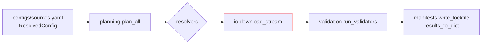
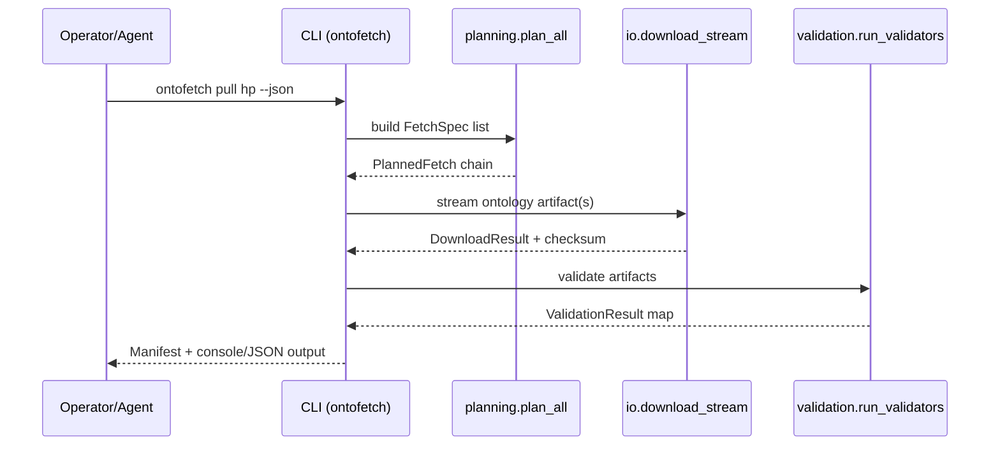

> _Metadata backlog_: owning_team, stability, versioning, codeowners, related_adrs, slos, data_handling, and sbom will be populated in a future revision.

## Table of Contents
- [DocsToKG • OntologyDownload](#docstokg--ontologydownload)
  - [Quickstart](#quickstart)
  - [Common commands](#common-commands)
  - [Core capabilities](#core-capabilities)
  - [Folder map (top files)](#folder-map-top-files)
  - [System overview](#system-overview)
    - [Pipeline walkthrough](#pipeline-walkthrough)
  - [Entry points & contracts](#entry-points--contracts)
  - [Configuration](#configuration)
  - [Data contracts & schemas](#data-contracts--schemas)
  - [Outputs & artifacts](#outputs--artifacts)
  - [Interactions with other packages](#interactions-with-other-packages)
  - [Extensibility](#extensibility)
  - [Observability](#observability)
  - [Security & data handling](#security--data-handling)
  - [Testing & quality gates](#testing--quality-gates)
  - [Development tasks](#development-tasks)
  - [Agent guardrails](#agent-guardrails)
  - [FAQ](#faq)

# DocsToKG • OntologyDownload

Purpose: Plan, download, and validate third-party ontologies for DocsToKG ingestion.
Scope boundary: Handles resolver planning, secure HTTP streaming, and manifest/validator orchestration; does **not** parse downstream documents or manage non-ontology assets.

---

## Quickstart
> Provision the virtual environment, validate configuration, then run a dry-run pull to exercise the full pipeline without writing artifacts.
```bash
./scripts/bootstrap_env.sh
direnv allow                     # or source .venv/bin/activate
direnv exec . python -m DocsToKG.OntologyDownload.cli config validate configs/sources.yaml
direnv exec . python -m DocsToKG.OntologyDownload.cli pull hp --config configs/sources.yaml --dry-run --json
```

## Common commands
```bash
direnv exec . python -m DocsToKG.OntologyDownload.cli pull hp            # download ontology hp
direnv exec . python -m DocsToKG.OntologyDownload.cli plan hp            # preview resolver plan
direnv exec . python -m DocsToKG.OntologyDownload.cli plan-diff hp       # compare plan to baseline
direnv exec . python -m DocsToKG.OntologyDownload.cli doctor             # environment diagnostics
direnv exec . python -m DocsToKG.OntologyDownload.cli prune --keep 3 --json
direnv exec . python -m DocsToKG.OntologyDownload.cli config validate configs/sources.yaml
```

## Core capabilities
- **Planning & orchestration** – `planning.plan_all` expands `FetchSpec` inputs into concrete resolver attempts, enforces allowlists/rate limits, and emits deterministic plans/lockfiles suitable for replay.
- **Resolver catalog** – `resolvers.py` ships first-party resolvers (OBO, BioPortal, Europe PMC, XBRL, etc.) with templated extras, polite header handling, and heuristics for fallback ordering.
- **Download runtime** – `io.network.StreamingDownloader` provides hardened HTTP streaming with TLS enforcement, DNS pinning, shared session pools, and exponential backoff tied to `rate_limit.py`.
- **Artifact safety** – `io.filesystem` offers archive extraction with path traversal defenses, SHA256 fingerprints, and sanitized file names reused by downstream ingestion.
- **Validation pipeline** – `validation.run_validators` fans out to pluggable validators (ROBOT, rdflib, Arelle, schematron) with per-validator budgets, process isolation, and cooperative cancellation via `cancellation.py`.
- **Configuration & overrides** – `settings.py` models default and per-run overrides (env, CLI, lockfiles), while `optdeps.py` lazily imports optional dependencies to keep core execution lean.
- **Public consumption** – `api.py` and `exports.py` define the sanctioned programmatic surface area (planning/fetching/validation functions plus manifest metadata) consumed by automation and agents.
- **Observability & tooling** – `logging_utils.py` unifies console/JSONL logging, `checksums.py` records provenance for remote checksum manifests, and `doctor`/`plugins` CLI commands surface operational health and plugin inventory.

## Folder map (top files)
- `api.py` – Holds customer-facing functions (`plan_all`, `fetch_all`) and PUBLIC_API_MANIFEST metadata.
- `cli.py` – Argparse-based `ontofetch` entry point exposing `pull`, `plan`, `plan-diff`, `doctor`, `prune`, `config`, `plugins`, and `init`.
- `planning.py` – Resolver planning graph, chunked execution, lockfile rendering, and manifest validation helpers.
- `resolvers.py` – Resolver registry plus third-party integrations (OBO, BioPortal, OpenAlex, Figshare, Zenodo, Wayback, XBRL) with throttling and retry policy hooks.
- `cancellation.py` – Cooperative cancellation tokens/groups shared between planners, download workers, and validators.
- `io/network.py` & `io/rate_limit.py` – Hardened HTTP client stack (session pooling, DNS controls, Retry-After handling) with distributed token bucket registries.
- `io/filesystem.py` – Secure filesystem utilities, archive handling, correlation ID generation, and size accounting helpers.
- `validation.py` – Validator execution harness, subprocess supervision, timeout/error types, and structured results.
- `manifests.py` – Manifest schema (v1.0), diff helpers, persistence utilities, and compatibility checks/migrations (`migrations.py`).
- `settings.py` – Typed config models, environment overrides, rate-limit coercion, and compatibility aliases for legacy consumers.
- `plugins.py` & `exports.py` – Entry-point discovery, registry management, and export manifest describing the supported Python API.
- `checksums.py` – External checksum manifest fetch/parse utilities with caching and trust guardrails.
- `logging_utils.py` – Structured logging configuration, rotating file handlers, telemetry helpers.
- `testing/` – Test harnesses and fixtures (sandbox environments, fake resolvers) reused by the pytest suite.
- `AGENTS.md` – Specialized guidance for autonomous agents extending or invoking OntologyDownload.

## System overview



### Pipeline walkthrough
1. **Configuration resolution** – `settings.get_default_config()` composes defaults with YAML and CLI overrides, producing a `ResolvedConfig` object.
2. **Plan synthesis** – `planning.plan_all` expands each `FetchSpec` into a `PlannedFetch`, resolves resolver plugins, and persists optional lockfiles for deterministic replays.
3. **Streaming download** – `io.network.StreamingDownloader` fetches artefacts using shared session pools, rate-limit registries, and checksum guards from `checksums.py`.
4. **Staging & extraction** – Files are written beneath `LOCAL_ONTOLOGY_DIR/<id>/<version>/` with names sanitised by `io.filesystem`; archives are extracted only after size and checksum validation.
5. **Validation & budget enforcement** – `validation.run_validators` executes configured validators under concurrency budgets (`_ValidatorBudget`) and cooperative cancellation tokens.
6. **Manifest emission** – `manifests.results_to_dict` collates resolver attempts, validator outcomes, and derived metadata into schema-versioned manifests for downstream ingestion.

## Entry points & contracts
- Entry points: `python -m DocsToKG.OntologyDownload.cli`, `DocsToKG.OntologyDownload.api`, `DocsToKG.OntologyDownload.validation.load_validator_plugins`.
- Contracts/invariants:
  - Manifests must conform to `MANIFEST_SCHEMA_VERSION == "1.0"` and include resolver attempt history.
  - Resolver planning must respect host allowlists and rate limits defined in `DownloadConfiguration`.
  - Download output directories follow `LOCAL_ONTOLOGY_DIR/<id>/<version>/` with immutable content fingerprints.

## Configuration

Configuration is layered: baked-in defaults → YAML file (`--config /path/to/sources.yaml`) → environment variables → CLI overrides. The `settings.py` models (`DefaultsConfig`, `DownloadConfiguration`, `ValidationConfig`, `ResolvedConfig`) combine those sources before any network call occurs.

Example YAML (`configs/sources.yaml`):

```yaml
defaults:
  http:
    polite_headers:
      User-Agent: DocsToKG-OntologyDownload/0.2
    rate_limits:
      bioportal.org: { tokens_per_sec: 0.5, burst: 1 }
  validation:
    max_concurrent_validators: 3
ontologies:
  hp:
    resolvers:
      - type: bioportal
        ontology_id: HP
        api_key_env: BIOPORTAL_API_KEY
      - type: obo
        ontology_id: hp
    validators: [robot, rdflib]
```

Key environment variables:

| Variable | Purpose | Default |
|----------|---------|---------|
| `ONTOLOGY_FETCHER_CONFIG` | Path to override the config file loaded by the CLI. | Auto-discovered from `configs/sources.yaml`. |
| `ONTOFETCH_LOG_DIR` | Redirect JSONL logs generated by `logging_utils`. | `LOG_DIR` from defaults. |
| `LOCAL_ONTOLOGY_DIR` | Override ontology artifact destination. | `~/.cache/docstokg/ontologies`. |
| `BIOPORTAL_API_KEY`, `OBO_API_KEY`, etc. | Resolver credentials pulled in at runtime. | Required per resolver. |
| `PYSTOW_HOME` | Shared cache location used by pystow-compatible resolvers. | `~/.data`. |

Validate the effective configuration at any time:

```bash
direnv exec . python -m DocsToKG.OntologyDownload.cli config validate --json configs/sources.yaml
direnv exec . python -m DocsToKG.OntologyDownload.cli config validate configs/sources.yaml
```

> **Note:** A dedicated `config show` subcommand is not yet available. To review the
> active settings, inspect `configs/sources.yaml` (or your override file) directly,
> or rely on the JSON emitted by `config validate --json` for a resolved snapshot.

## Data contracts & schemas
- Ontology manifest schema and helpers: `src/DocsToKG/OntologyDownload/manifests.py` (schema version 1.0).
- Configuration JSON Schema reference: `docs/schemas/ontology-downloader-config.json`.
- Lockfile format (`ontologies.lock.json`) maintained by `plan-diff --lock-output` and consumed by `pull --lock`.

## Outputs & artifacts

| Artifact | Contents | Producer | Consumer |
|----------|----------|----------|----------|
| `LOCAL_ONTOLOGY_DIR/<id>/<version>/` | Extracted ontology files, checksum sidecars, normalised RDF. | `planning.fetch_all` → `io.filesystem`. | DocParsing ingestion, hybrid search enrichment. |
| `CACHE_DIR/manifests/<timestamp>.json` | Raw execution manifest including resolver attempts and validation summary. | `manifests.write_lockfile` / `results_to_dict`. | Auditing, subsequent plan diffs. |
| `ontologies.lock.json` | Lockfile capturing resolver URLs/version metadata for deterministic replays. | `cli plan --lock-output`. | `cli pull --lock`, CI pipelines. |
| `LOG_DIR/ontofetch-*.jsonl` | Structured logs with correlation IDs, stages, timings, and error payloads. | `logging_utils.setup_logging`. | Observability stack, incident response. |

Example manifest excerpt:

```json
{
  "schema_version": "1.0",
  "id": "hp",
  "version": "2025-01-01",
  "resolver_attempts": [
    {
      "resolver": "bioportal",
      "status": "success",
      "url": "https://data.bioontology.org/ontologies/HP/submissions/123",
      "sha256": "d2c3…",
      "expected_checksum": "sha256:d2c3…",
      "content_length": 43821920
    }
  ],
  "validators": [
    {"name": "robot", "status": "passed", "duration_s": 124.5},
    {"name": "rdflib", "status": "passed", "duration_s": 4.8}
  ]
}
```

## Interactions with other packages
- Upstream: consumes resolver-specific APIs (OBO, OLS, BioPortal, Ontobee, SKOS endpoints) plus checksum sources configured in specs.
- Downstream: produces manifests and downloaded ontology artifacts under `LOCAL_ONTOLOGY_DIR` used by downstream ingestion (e.g., DocParsing pipelines).
- Shared utilities: exports strongly-typed classes for other packages via `__init__.py` and `exports.py`.
- ID/path guarantees: ontology IDs map to directory-safe names; artifact filenames sanitized via `io.filesystem.sanitize_filename`.

## Extensibility
- **Resolvers**: Implement the `Resolver` protocol (`resolvers.Resolver`), register via the `docstokg.ontofetch.resolver` entry-point group, and lean on `plugins.register_resolver` for dynamic tests. Ensure new resolvers surface polite headers and checksum metadata.
- **Validators**: Expose a callable that accepts `ValidationRequest` and returns `ValidationResult`; ship it under `docstokg.ontofetch.validator`. Respect concurrency budgets by using `_ValidatorBudget` helpers.
- **Plugin discovery**: `python -m DocsToKG.OntologyDownload.cli plugins` reveals the resolver and validator registries, their source packages, and any load failures gathered by `plugins.get_registered_plugin_meta`.
- **Optional deps**: Add heavy libraries to `optdeps.py` so missing dependencies yield friendly error messages instead of import-time crashes.

## Observability
- Logs: `logging_utils.setup_logging` emits console logs and JSONL files (`LOG_DIR/ontofetch-YYYYMMDD.jsonl`) carrying `stage`, `resolver`, latency, and retry counts—easy to ship into ELK/OpenSearch.
- Metrics: Parse JSONL logs to derive success rates and validator runtimes; attach Prometheus scraping by tailing the log or wrapping the CLI in exporter scripts.
- Health check: `python -m DocsToKG.OntologyDownload.cli doctor` inspects credentials, resolver reachability, and cache directories; non-zero exit means the run is unsafe to execute.
- Tracing: Every download attempt reuses a correlation ID from `io.filesystem.generate_correlation_id`, allowing distributed tracing or log aggregation across retries and validators.

## Security & data handling
- Controls align with OWASP ASVS L1: TLS-only URLs, checksum verification, DNS validation, and strict allowlists defend against tampering and spoofing.
- Threats considered (STRIDE):
  - Spoofing: enforce resolver allowlists and DNS validation via `_cached_getaddrinfo`.
  - Tampering: checksums and fingerprint comparison guard against artifact corruption.
  - Repudiation: structured logging with correlation IDs (`generate_correlation_id`).
  - Information disclosure: credentials in URLs rejected; JSON logs mask sensitive headers.
  - Denial of service: rate limiting (`io.rate_limit`) and retry backoff guard remote services.
- Data classification: ontology artefacts are treated as low risk/public; scrub JSONL logs before sharing outside engineering.
- Secrets: resolve API keys from environment/secret stores; specs should reference env variable names (`api_key_env`) rather than embedding secrets.

## Testing & quality gates
- Unit & CLI integration: `direnv exec . pytest tests/ontology_download -q`.
- Loopback harness: use `testing.TestingEnvironment` with temporary resolvers/validators to exercise new integrations under controlled rate limits.
- Docs & NAVMAP checks: `python docs/scripts/validate_code_annotations.py` and `python docs/scripts/validate_docs.py`.
- Static analysis: run `ruff` and `mypy` (commands below) to match repository CI.

## Development tasks
```bash
./scripts/bootstrap_env.sh
direnv exec . ruff check src/DocsToKG/OntologyDownload tests/ontology_download
direnv exec . mypy src/DocsToKG/OntologyDownload
direnv exec . pytest tests/ontology_download -q
```
- Optional helpers: `./scripts/dev.sh exec <command>` wraps the virtualenv when `direnv` is unavailable.
- Run targeted suites (e.g., `pytest tests/ontology_download/test_cli.py -q`) before shipping CLI changes.

## Agent guardrails
- Do:
  - Extend resolvers/validators via `plugins.py` using entry points and registry helpers.
  - Update manifest schema only with matching migrations and test fixtures.
- Do not:
  - Modify `EXPORT_MAP`/`__all__` without reviewing public API compatibility.
  - Relax host/port validation in `io.network` without security review.
- Danger zone:
  - `python -m DocsToKG.OntologyDownload.cli prune --keep <n>` deletes stored ontology versions under `LOCAL_ONTOLOGY_DIR`.

## FAQ
- Q: How do I pin downloads to a previously generated plan?
  A: Use `ontofetch plan --lock-output ontologies.lock.json`, then run `ontofetch pull --lock ontologies.lock.json` to reuse resolver outputs.

- Q: How can I load a custom validator?
  A: Implement a callable exposed via the `docstokg.ontofetch.validator` entry-point group; `plugins.load_validator_plugins` will register it on startup.

```json x-agent-map
{
  "entry_points": [
    {"type": "cli", "module": "DocsToKG.OntologyDownload.cli", "commands": ["pull", "plan", "plan-diff", "plugins", "validate", "config", "doctor", "prune", "init"]},
    {"type": "python", "module": "DocsToKG.OntologyDownload.api", "symbols": ["plan_all", "fetch_all", "run_validators", "validate_manifest_dict"]}
  ],
  "env": [
    {"name": "ONTOFETCH_LOG_DIR", "default": "<LOG_DIR>", "required": false},
    {"name": "PYSTOW_HOME", "default": "~/.data", "required": false}
  ],
  "schemas": [
    {"kind": "json-schema", "path": "docs/schemas/ontology-downloader-config.json"},
    {"kind": "manifest", "path": "src/DocsToKG/OntologyDownload/manifests.py"}
  ],
  "artifacts_out": [
    {"path": "LOCAL_ONTOLOGY_DIR/<id>/<version>/**", "consumed_by": ["../DocParsing", "downstream ingestion"]},
    {"path": "LOG_DIR/ontofetch-*.jsonl", "consumed_by": ["observability tooling"]}
  ],
  "danger_zone": [
    {"command": "python -m DocsToKG.OntologyDownload.cli prune --keep <n>", "effect": "Deletes stored ontology versions beyond retention"}
  ]
}
```
