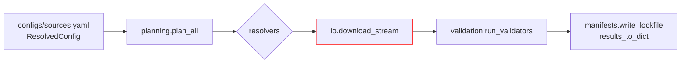
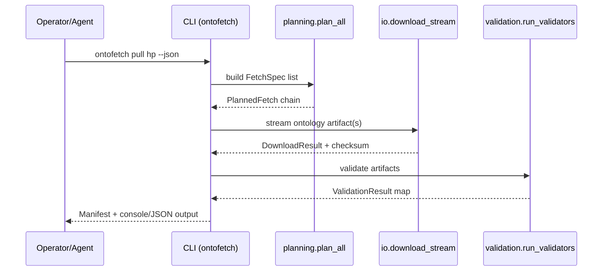

> _Metadata backlog_: owning_team, stability, versioning, codeowners, related_adrs, slos, data_handling, and sbom will be populated in a future revision.

## Table of Contents
- [DocsToKG • OntologyDownload](#docstokg--ontologydownload)
  - [Quickstart](#quickstart)
  - [Common commands](#common-commands)
  - [Core capabilities](#core-capabilities)
  - [Folder map (top files)](#folder-map-top-files)
  - [System overview](#system-overview)
    - [Pipeline walkthrough](#pipeline-walkthrough)
  - [Entry points & contracts](#entry-points--contracts)
  - [Configuration](#configuration)
  - [Data contracts & schemas](#data-contracts--schemas)
  - [Outputs & artifacts](#outputs--artifacts)
  - [Interactions with other packages](#interactions-with-other-packages)
  - [Extensibility](#extensibility)
  - [Observability](#observability)
  - [Security & data handling](#security--data-handling)
  - [Testing & quality gates](#testing--quality-gates)
  - [Development tasks](#development-tasks)
  - [Agent guardrails](#agent-guardrails)
  - [FAQ](#faq)

# DocsToKG • OntologyDownload

Purpose: Plan, download, and validate third-party ontologies for DocsToKG ingestion.
Scope boundary: Handles resolver planning, secure HTTP streaming, and manifest/validator orchestration; does **not** parse downstream documents or manage non-ontology assets.

---

## Quickstart
> Stay inside the managed `.venv` (see [AGENTS.md](./AGENTS.md) for guardrails), sanity-check the environment, then run a dry pull to exercise the full stack without persisting artefacts.
```bash
test -x .venv/bin/python || { echo "ERROR: .venv is missing — STOP"; exit 1; }
./.venv/bin/python -m DocsToKG.OntologyDownload.cli doctor --json
./.venv/bin/python -m DocsToKG.OntologyDownload.cli config validate --spec configs/sources.yaml
./.venv/bin/python -m DocsToKG.OntologyDownload.cli pull hp --spec configs/sources.yaml --dry-run --json
```
> Alternative wrappers: `./scripts/dev.sh exec <cmd>` or `direnv exec . <cmd>` are both `.venv`-aware, but the direct `./.venv/bin/python …` form is safest for automation.

## Common commands
```bash
./.venv/bin/python -m DocsToKG.OntologyDownload.cli pull hp --spec configs/sources.yaml --force --concurrent-downloads 2 --json
./.venv/bin/python -m DocsToKG.OntologyDownload.cli plan hp --spec configs/sources.yaml --no-planner-probes --lock-output ontologies.lock.json --json
./.venv/bin/python -m DocsToKG.OntologyDownload.cli plan-diff hp --spec configs/sources.yaml --use-manifest --update-baseline --json
./.venv/bin/python -m DocsToKG.OntologyDownload.cli pull hp --lock ontologies.lock.json --allowed-hosts internal.example.org
./.venv/bin/python -m DocsToKG.OntologyDownload.cli show hp --versions
./.venv/bin/python -m DocsToKG.OntologyDownload.cli validate hp 2025-01-01 --rdflib --owlready2 --json
./.venv/bin/python -m DocsToKG.OntologyDownload.cli plugins --kind all --json
./.venv/bin/python -m DocsToKG.OntologyDownload.cli config show --spec configs/sources.yaml --no-redact-secrets --json
./.venv/bin/python -m DocsToKG.OntologyDownload.cli doctor --fix --json
./.venv/bin/python -m DocsToKG.OntologyDownload.cli prune --keep 3 --older-than 2024-01-01 --dry-run --json
```

`plan-diff` writes lockfiles by default; add `--no-lock` when you only want the diff. When seeding a baseline for the first time, pair `--update-baseline` with `--json` to inspect the snapshot that was recorded.

## Core capabilities
- **Planning & execution** – `planning.plan_all`/`fetch_all` turn `FetchSpec` inputs into `PlannedFetch`/`Manifest` objects, coordinate workers with `CancellationTokenGroup`, enforce `validate_url_security`, and persist manifests/lockfiles that capture fingerprints, normalized hashes, and streaming checksum fields.
- **Resolver catalog & plugins** – `resolvers.py` ships first-party resolvers (OBO, OLS, BioPortal, Ontobee, SKOS, LOV, XBRL, direct), normalises licences, injects polite headers, enforces token-bucket budgets, and extends via the `docstokg.ontofetch.resolver` entry-point registry.
- **Download runtime** – `io.network.StreamingDownloader` provides shared `SESSION_POOL` instances, DNS caching, redirect auditing, resume support, and Retry-After aware rate limiting driven by `io.rate_limit`.
- **Filesystem & storage** – `io.filesystem` sanitises filenames, enforces archive expansion limits, generates correlation IDs, masks secrets, and cooperates with storage backends (local or fsspec) including optional CAS mirroring.
- **Checksum enforcement** – `checksums.py` parses `expected_checksum`/`checksum_url` extras, streams remote manifests, and returns `ExpectedChecksum` objects embedded throughout manifests and download results.
- **Validation pipeline** – `validation.run_validators` orchestrates rdflib/pronto/owlready2/ROBOT/Arelle validators with `_ValidatorBudget`, optional process pools, disk-backed normalisation, and plugin registries cached via `load_validator_plugins`.
- **Configuration & optional deps** – `settings.py` defines typed models (`DefaultsConfig`, `DownloadConfiguration`, `PlannerConfig`, `ValidationConfig`, `ResolvedConfig`), applies `ONTOFETCH_*` environment overrides, and exposes opt-dependency shims for rdflib/pronto/owlready2/pystow.
- **Public API & tooling** – `api.py`, `exports.py`, `formatters.py`, `logging_utils.py`, and `cancellation.py` expose CLI helpers, the `PUBLIC_API_MANIFEST`, table renderers, structured logging, and cooperative cancellation primitives.

## Folder map (top files)
- `api.py` – CLI/programmatic orchestration (`fetch_all`, `list_plugins`, `about`, table helpers) wired to the public export manifest.
- `cli.py` – Argparse `ontofetch` CLI exposing `pull`, `plan`, `plan-diff`, `show`, `validate`, `plugins`, `config`, `doctor`, `prune`, `init`, with secret redaction and default-subcommand inference.
- `planning.py` – Planner/executor pipeline, manifest dataclasses, checksum enforcement, cancellation management, validator dispatch, and lockfile writers.
- `manifests.py` – Manifest schema v1.0 helpers, atomic writers, plan diff/lockfile utilities, and manifest migration integration.
- `resolvers.py` – Resolver implementations, fallback candidate capture, polite header negotiation, license normalisation, and plugin registry glue.
- `io/` – `network.py` (streaming downloads, DNS/redirect guards, resume), `filesystem.py` (sanitize, extract, mask, CAS mirrors), `rate_limit.py` (shared token buckets), and top-level re-exports.
- `checksums.py` – Expected checksum parsing, checksum URL fetching, streaming digest helpers embedded throughout manifests.
- `validation.py` – Validator harness, `_ValidatorBudget`, process/thread pools, disk-backed normalisation, and plugin cache loaders.
- `settings.py` – Typed defaults (planner/http/validation/logging), environment overrides, storage backends (local/fsspec + CAS), and optional dependency shims.
- `plugins.py` – Resolver/validator registries, entry-point discovery, metadata for CLI inventory, and test helper context managers.
- `logging_utils.py` & `formatters.py` – Structured JSON logging with rotation/masking plus shared ASCII table renderers.
- `cancellation.py` – Cooperative cancellation primitives exchanged between planners, resolvers, and validators.
- `testing/` – Loopback HTTP harness, temporary storage environments, resolver/validator injection utilities for end-to-end tests.
- `AGENTS.md` – Guardrails, environment expectations, and operational quick-reference for agents.

## System overview



### Pipeline walkthrough
1. **Configuration resolution** – `settings.get_default_config()` merges baked-in defaults, `ONTOFETCH_*` overrides, YAML specs, and CLI flags into a `ResolvedConfig`, selecting storage backends and planner settings (`planner.probing_enabled`, `enable_cas_mirror`) before any network traffic.
2. **Plan synthesis** – `planning.plan_all` expands each `FetchSpec` into `PlannedFetch` objects, loads resolver plugins, honours `--allowed-hosts`/policy checks, executes optional metadata probes, and writes lockfiles unless `--no-lock` is requested.
3. **Streaming download** – `io.network.StreamingDownloader` leases shared sessions from `SESSION_POOL`, coordinates per-host/service token buckets, audits redirects, resumes partial transfers, and verifies checksum metadata via `checksums.ExpectedChecksum`.
4. **Staging & extraction** – `settings.STORAGE` prepares version directories, mirrors CAS artefacts when enabled, and `io.filesystem` sanitises filenames, enforces archive expansion thresholds, and masks secrets in diagnostic payloads.
5. **Validation & budget enforcement** – `validation.run_validators` hydrates validator plugins, applies `_ValidatorBudget` semaphores and optional process pools, streams large normalisation jobs to disk, and persists validator JSON alongside outputs.
6. **Manifest emission** – `manifests.results_to_dict` and `_write_manifest` assemble schema 1.0 manifests capturing resolver attempts, fingerprints, streaming hashes, and validator outcomes; optional lockfiles and plan baselines are updated in tandem.

## Entry points & contracts
- Entry points: `python -m DocsToKG.OntologyDownload.cli` (ontofetch CLI/default subcommand inference), `DocsToKG.OntologyDownload.api` (`fetch_all`, `list_plugins`, `about`, `format_table`, `validator_worker_main`), `DocsToKG.OntologyDownload.validation.load_validator_plugins`.
- Contracts/invariants:
  - Manifests conform to `MANIFEST_SCHEMA_VERSION == "1.0"` and include resolver attempts, fingerprints, expected checksums, and streaming hashes.
  - Resolver planning respects host allowlists (`validate_url_security`), rate limits (`DownloadConfiguration.rate_limits`), and honour planner probe toggles.
  - Storage paths follow `LOCAL_ONTOLOGY_DIR/<id>/<version>/` semantics regardless of backend, with CAS mirrors placed under `by-<algorithm>/<digest>` when enabled.

## Configuration

Configuration is layered: baked-in defaults → environment overrides (`ONTOFETCH_*`, `PYSTOW_HOME`) → YAML (`--spec /path/to/sources.yaml`) → CLI flags. `settings.build_resolved_config` combines those sources into a `ResolvedConfig` before any resolver is contacted.

CLI flags that accept files (`--spec`, `config show`, `config validate`, `pull --lock`) expand `~` and resolve symlinks, so commands like `ontofetch pull hp --spec ~/configs/sources.yaml` behave predictably in automation.

Example `configs/sources.yaml` aligned with the current schema:

```yaml
defaults:
  normalize_to: [ttl]
  prefer_source: [obo, ols, bioportal, direct]
  continue_on_error: true
  enable_cas_mirror: false
  planner:
    probing_enabled: true
  http:
    max_retries: 5
    timeout_sec: 30
    download_timeout_sec: 600
    backoff_factor: 0.5
    per_host_rate_limit: "4/second"
    concurrent_downloads: 2
    concurrent_plans: 8
    rate_limits:
      bioportal: "2/second"
      ols: "4/second"
  validation:
    max_concurrent_validators: 2
    parser_timeout_sec: 120
    use_process_pool: false
    process_pool_validators: [rdflib, owlready2]
  logging:
    level: INFO
    retention_days: 30
    max_log_size_mb: 100
ontologies:
  - id: hp
    resolver: obo
    target_formats: [owl, obo]
    extras:
      acronym: HP
  - id: efo
    resolver: ols
    extras:
      ontology_id: EFO
```

Key environment variables and overrides:

| Variable | Purpose | Default |
|----------|---------|---------|
| `PYSTOW_HOME` | Relocates `CONFIG_DIR`, `CACHE_DIR`, `LOG_DIR`, and `LOCAL_ONTOLOGY_DIR`. | `~/.data` |
| `ONTOFETCH_LOG_DIR` | Redirect JSONL/rotated logs produced by `logging_utils`. | `${PYSTOW_HOME}/ontology-fetcher/logs` |
| `ONTOFETCH_STORAGE_URL` | Switch storage backend to fsspec (e.g., `file:///mnt/shared`, `s3://bucket/prefix`). | Local filesystem under `LOCAL_ONTOLOGY_DIR` |
| `ONTOFETCH_SHARED_RATE_LIMIT_DIR` | Directory for cross-process token buckets. | `${CACHE_DIR}/rate-limits` |
| `ONTOFETCH_MAX_RETRIES`, `ONTOFETCH_TIMEOUT_SEC`, `ONTOFETCH_DOWNLOAD_TIMEOUT_SEC`, `ONTOFETCH_PER_HOST_RATE_LIMIT`, `ONTOFETCH_BACKOFF_FACTOR`, `ONTOFETCH_MAX_UNCOMPRESSED_SIZE_GB`, `ONTOFETCH_LOG_LEVEL` | Override download/logging configuration fields without editing YAML. | Values from `defaults.http` / `defaults.logging` |
| Resolver credentials (e.g., `BIOPORTAL_API_KEY`, `EUROPE_PMC_API_KEY`) | Injected into resolver extras via `settings.get_env_overrides`. | Required per resolver |

All managed directories inherit from `pystow`'s application root, so setting `PYSTOW_HOME` moves the entire tree (`configs/`, `cache/`, `logs/`, `ontologies/`). Remote storage backends inherit the same directory structure beneath the configured URL.

Validate the effective configuration at any time:

```bash
./.venv/bin/python -m DocsToKG.OntologyDownload.cli config show --spec configs/sources.yaml
./.venv/bin/python -m DocsToKG.OntologyDownload.cli config show --defaults --json
./.venv/bin/python -m DocsToKG.OntologyDownload.cli config validate --spec configs/sources.yaml
```

`config show` prints a summary table, active environment overrides, and the fully resolved YAML. Secrets (API keys, tokens) are masked by default; pass `--no-redact-secrets` for targeted debugging.

## Data contracts & schemas
- Ontology manifest schema and helpers: `src/DocsToKG/OntologyDownload/manifests.py` (schema version 1.0).
- Configuration JSON Schema reference: `docs/schemas/ontology-downloader-config.json`.
- Lockfile format (`ontologies.lock.json`) maintained by `plan-diff --lock-output` and consumed by `pull --lock`.

## Outputs & artifacts

| Artifact | Contents | Producer | Consumer |
|----------|----------|----------|----------|
| `LOCAL_ONTOLOGY_DIR/<id>/<version>/` | Downloaded artefacts, normalized formats, validator reports, checksum sidecars. | `planning.fetch_all` + `io.filesystem`. | DocParsing ingestion, manual inspection, `cli validate`. |
| `LOCAL_ONTOLOGY_DIR/<id>/<version>/manifest.json` | Schema v1.0 manifest including resolver attempts, expected checksums, fingerprints, streaming hashes, validation summaries. | `planning.Manifest.to_json` (`planning._write_manifest`). | `cli show`, `plan-diff --use-manifest`, audits. |
| `ontologies.lock.json` | Deterministic resolver plan (urls, versions, expected checksums). | `manifests.write_lockfile` via `cli plan/plan-diff`. | `cli pull --lock`, CI replays, change review. |
| `LOCAL_ONTOLOGY_DIR/by-<alg>/<prefix>/<digest>` | Content-addressable mirrors when `enable_cas_mirror` is enabled. | `settings.STORAGE.mirror_cas_artifact`. | Deduplicated storage, downstream cache priming. |
| `LOG_DIR/ontofetch-*.jsonl` | Structured logs with stage/resolver/status/duration fields and masked secrets. | `logging_utils.setup_logging`. | Observability tooling, incident response, rate-limit tuning. |

Example manifest excerpt:

```json
{
  "schema_version": "1.0",
  "id": "hp",
  "resolver": "obo",
  "url": "https://purl.obolibrary.org/obo/hp.owl",
  "filename": "hp.owl",
  "status": "success",
  "sha256": "d2c3…",
  "normalized_sha256": "9ab1…",
  "fingerprint": "sha256:d2c3…",
  "etag": "W/\"5f6a7b\"",
  "content_type": "application/rdf+xml",
  "content_length": 43821920,
  "source_media_type_label": "RDF/XML",
  "streaming_prefix_sha256": "a1b2…",
  "streaming_content_sha256": "c3d4…",
  "expected_checksum": {"algorithm": "sha256", "value": "d2c3…"},
  "downloaded_at": "2025-02-15T12:34:56Z",
  "target_formats": ["obo", "ttl"],
  "resolver_attempts": [
    {
      "resolver": "obo",
      "status": "success",
      "url": "https://purl.obolibrary.org/obo/hp.owl",
      "license": "CC-BY-4.0",
      "media_type": "application/rdf+xml",
      "service": "obo",
      "etag": "W/\"5f6a7b\"",
      "last_modified": "Mon, 03 Feb 2025 12:00:00 GMT",
      "content_length": 43821920,
      "expected_checksum": {"algorithm": "sha256", "value": "d2c3…"}
    }
  ],
  "validation": {
    "robot": {"ok": true, "details": {"report": "robot-report.tsv"}, "output_files": ["robot-report.tsv"]},
    "rdflib": {"ok": true, "details": {"triples": 64000}, "output_files": ["hp.ttl"]}
  },
  "artifacts": [
    "/home/docstokg/.data/ontology-fetcher/ontologies/hp/2025-02-15/hp.owl",
    "/home/docstokg/.data/ontology-fetcher/ontologies/hp/2025-02-15/hp.ttl"
  ]
}
```

## Interactions with other packages
- Upstream: consumes resolver-specific APIs (OBO, OLS, BioPortal, Ontobee, SKOS endpoints) plus checksum sources configured in specs.
- Downstream: produces manifests and downloaded ontology artifacts under `LOCAL_ONTOLOGY_DIR` used by downstream ingestion (e.g., DocParsing pipelines).
- Shared utilities: exports strongly-typed classes for other packages via `__init__.py` and `exports.py`.
- ID/path guarantees: ontology IDs map to directory-safe names; artifact filenames sanitized via `io.filesystem.sanitize_filename`.

## Extensibility
- **Resolvers**: Extend `resolvers.BaseResolver` or satisfy the `Resolver` protocol, then expose the implementation via the `docstokg.ontofetch.resolver` entry-point group (or `plugins.register_resolver` in tests). Provide polite headers, expected checksums, and target format hints.
- **Validators**: Implement a callable accepting `ValidationRequest` and returning `ValidationResult`; register it with the `docstokg.ontofetch.validator` entry point or `plugins.register_validator`. Honour `_ValidatorBudget` limits to avoid exhausting resources.
- **Plugin discovery**: `./.venv/bin/python -m DocsToKG.OntologyDownload.cli plugins --kind all --json` enumerates registered plugins, qualified import paths, and version metadata derived from distributions.
- **Optional deps**: Add heavy imports to `optdeps.py`/`settings.get_*` helpers so missing dependencies raise actionable guidance rather than import-time crashes.

## Observability
- Logs: `logging_utils.setup_logging` emits console logs and JSONL files (`LOG_DIR/ontofetch-YYYYMMDD.jsonl`) capturing `stage`, `resolver`, latency, retries, and correlation IDs for downstream ingestion.
- Metrics: Parse JSONL logs to derive success rates and validator runtimes; wrap CLI invocations with exporters or tail the log for Prometheus scraping.
- Health/Audit: `./.venv/bin/python -m DocsToKG.OntologyDownload.cli doctor --json` validates environment, disk, credentials, rate-limit configuration, and optional dependencies without modifying state.
- Inventory: `DocsToKG.OntologyDownload.api.about()` surfaces package version, manifest schema, plugin inventory, and resolved storage paths for dashboards or support tooling.
- Tracing: Every download attempt reuses a correlation ID from `io.filesystem.generate_correlation_id`, enabling cross-system log correlation and retry analysis.

## Security & data handling
- Controls align with OWASP ASVS L1: TLS-only URLs, checksum verification, DNS validation, and strict allowlists defend against tampering and spoofing.
- Host allowlists differentiate between domain names and IP literals. Domains continue to require public DNS results unless `allow_private_networks_for_host_allowlist` is explicitly enabled; IP literals may be allowlisted when the operator intends to reach private infrastructure. Opt into `allow_plain_http_for_host_allowlist` separately when HTTP endpoints should remain un-upgraded for allowlisted hosts; otherwise the downloader enforces HTTPS.
- Threats considered (STRIDE):
  - Spoofing: enforce resolver allowlists and DNS validation via `_cached_getaddrinfo`.
  - Tampering: checksums and fingerprint comparison guard against artifact corruption.
  - Repudiation: structured logging with correlation IDs (`generate_correlation_id`).
  - Information disclosure: credentials in URLs rejected; JSON logs mask sensitive headers.
  - Denial of service: rate limiting (`io.rate_limit`) and retry backoff guard remote services.
- Data classification: ontology artefacts are treated as low risk/public; scrub JSONL logs before sharing outside engineering.
- Secrets: resolve API keys from environment/secret stores; specs should reference env variable names (`api_key_env`) rather than embedding secrets.

## Testing & quality gates
- Unit & CLI integration: `./.venv/bin/pytest tests/ontology_download -q`.
- Loopback harness: use `testing.TestingEnvironment` with temporary resolvers/validators to exercise new integrations under controlled rate limits.
- Docs & NAVMAP checks: `./.venv/bin/python docs/scripts/validate_code_annotations.py` and `./.venv/bin/python docs/scripts/validate_docs.py`.
- Static analysis: run `./.venv/bin/ruff` and `./.venv/bin/mypy` (see snippet below) to mirror repository CI.

## Development tasks
```bash
./scripts/bootstrap_env.sh
./.venv/bin/ruff check src/DocsToKG/OntologyDownload tests/ontology_download
./.venv/bin/mypy src/DocsToKG/OntologyDownload
./.venv/bin/pytest tests/ontology_download -q
```
- Optional helpers: `./scripts/dev.sh exec <command>` wraps the virtualenv when `direnv` is unavailable.
- Run targeted suites (e.g., `./.venv/bin/pytest tests/ontology_download/test_cli.py -q`) before shipping CLI changes.

## Agent guardrails
- Do:
  - Extend resolvers/validators via `plugins.py` using entry points and registry helpers.
  - Update manifest schema only with matching migrations and test fixtures.
- Do not:
  - Modify `EXPORT_MAP`/`__all__` without reviewing public API compatibility.
  - Relax host/port validation in `io.network` without security review.
- Danger zone:
  - `./.venv/bin/python -m DocsToKG.OntologyDownload.cli prune --keep <n>` deletes stored ontology versions under `LOCAL_ONTOLOGY_DIR`.

## FAQ
- Q: How do I pin downloads to a previously generated plan?
  A: Use `ontofetch plan --lock-output ontologies.lock.json`, then run `ontofetch pull --lock ontologies.lock.json` to reuse resolver outputs.

- Q: How can I load a custom validator?
  A: Implement a callable exposed via the `docstokg.ontofetch.validator` entry-point group; `plugins.load_validator_plugins` will register it on startup.

```json x-agent-map
{
  "entry_points": [
    {"type": "cli", "module": "DocsToKG.OntologyDownload.cli", "commands": ["pull", "plan", "plan-diff", "show", "validate", "plugins", "config", "doctor", "prune", "init"]},
    {"type": "python", "module": "DocsToKG.OntologyDownload.api", "symbols": ["plan_all", "fetch_all", "run_validators", "validate_manifest_dict", "list_plugins", "about", "mask_sensitive_data"]}
  ],
  "env": [
    {"name": "PYSTOW_HOME", "default": "~/.data", "required": false},
    {"name": "ONTOFETCH_LOG_DIR", "default": "<LOG_DIR>", "required": false},
    {"name": "ONTOFETCH_STORAGE_URL", "default": "local filesystem", "required": false},
    {"name": "ONTOFETCH_SHARED_RATE_LIMIT_DIR", "default": "<CACHE_DIR>/rate-limits", "required": false},
    {"name": "BIOPORTAL_API_KEY", "default": null, "required": true}
  ],
  "schemas": [
    {"kind": "json-schema", "path": "docs/schemas/ontology-downloader-config.json"},
    {"kind": "manifest", "path": "src/DocsToKG/OntologyDownload/manifests.py"}
  ],
  "artifacts_out": [
    {"path": "LOCAL_ONTOLOGY_DIR/<id>/<version>/manifest.json", "consumed_by": ["plan-diff --use-manifest", "cli show"]},
    {"path": "LOCAL_ONTOLOGY_DIR/<id>/<version>/**", "consumed_by": ["../DocParsing", "downstream ingestion"]},
    {"path": "LOG_DIR/ontofetch-*.jsonl", "consumed_by": ["observability tooling"]}
  ],
  "danger_zone": [
    {"command": "./.venv/bin/python -m DocsToKG.OntologyDownload.cli prune --keep <n>", "effect": "Deletes stored ontology versions beyond retention"}
  ]
}
```
