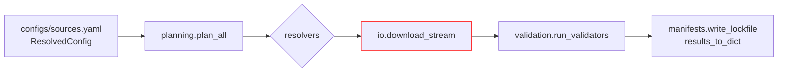
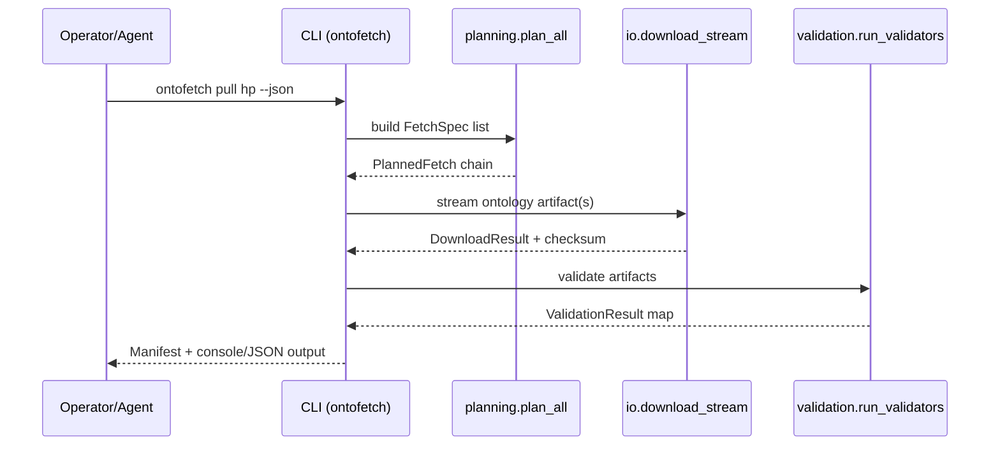

# DocsToKG • OntologyDownload

Purpose: Plan, download, and validate third-party ontologies for DocsToKG ingestion.
Scope boundary: Handles resolver planning, secure HTTP streaming, and manifest/validator orchestration; does **not** parse downstream documents or manage non-ontology assets.

---

## Quickstart
> Provision the virtual environment, then run a dry-run plan.
```bash
./scripts/bootstrap_env.sh
direnv allow                     # or source .venv/bin/activate
direnv exec . python -m DocsToKG.OntologyDownload.cli plan hp --dry-run
```

## Common commands
```bash
direnv exec . python -m DocsToKG.OntologyDownload.cli pull hp            # download ontology hp
direnv exec . python -m DocsToKG.OntologyDownload.cli plan hp            # preview resolver plan
direnv exec . python -m DocsToKG.OntologyDownload.cli doctor             # environment diagnostics
direnv exec . python -m DocsToKG.OntologyDownload.cli prune --keep 3 --json
direnv exec . python -m DocsToKG.OntologyDownload.cli config validate configs/sources.yaml
```

## Folder map (top files)
- `api.py` – Thin public surface exposing planning, fetching, validation helpers.
- `cli.py` – Argparse-based `ontofetch` entry point with plan/pull/prune/doctor workflows.
- `planning.py` – Resolver planning orchestration, manifests, manifest migration hooks.
- `resolvers.py` – Resolver implementations (OBO, OLS, BioPortal, SKOS, XBRL) plus retry/rate limiting logic.
- `io/network.py` – Hardened HTTP streaming, session pooling, DNS/cache policy enforcement.
- `io/filesystem.py` – Secure archive extraction, checksum utilities, cache helpers.
- `settings.py` – Pydantic configuration models (`DefaultsConfig`, `DownloadConfiguration`, etc.).
- `validation.py` – Validator plugin loader and execution (rdflib, ROBOT, Arelle, etc.).
- `manifests.py` – Manifest schema helpers, lockfile writer, diff utilities.
- `plugins.py` – Resolver/validator entry-point discovery and registry management.
- `checksums.py` – Expected checksum parsing and remote checksum fetch helpers.
- `migrations.py` – Manifest schema migration utilities.
- `logging_utils.py` – Logger setup producing console + JSONL output with rotation.

## System overview



## Entry points & contracts
- Entry points: `python -m DocsToKG.OntologyDownload.cli`, `DocsToKG.OntologyDownload.api`, `DocsToKG.OntologyDownload.validation.load_validator_plugins`.
- Contracts/invariants:
  - Manifests must conform to `MANIFEST_SCHEMA_VERSION == "1.0"` and include resolver attempt history.
  - Resolver planning must respect host allowlists and rate limits defined in `DownloadConfiguration`.
  - Download output directories follow `LOCAL_ONTOLOGY_DIR/<id>/<version>/` with immutable content fingerprints.

## Configuration
- Env vars:
  - `ONTOFETCH_LOG_DIR` (default: `${LOG_DIR}`) – optional override for JSONL log output directory.
  - `PYSTOW_HOME` (default: `~/.data`) – shared cache used by resolver clients (e.g., BioPortal, OLS).
- Core models: `DefaultsConfig`, `DownloadConfiguration`, `ResolvedConfig`, `ValidationConfig` in `settings.py`.
- Validate config: `direnv exec . python -m DocsToKG.OntologyDownload.cli config validate configs/sources.yaml`.

## Data contracts & schemas
- Ontology manifest schema and helpers: `src/DocsToKG/OntologyDownload/manifests.py` (schema version 1.0).
- Configuration JSON Schema reference: `docs/schemas/ontology-downloader-config.json`.
- Lockfile format (`ontologies.lock.json`) maintained by `plan-diff --lock-output` and consumed by `pull --lock`.

## Interactions with other packages
- Upstream: consumes resolver-specific APIs (OBO, OLS, BioPortal, Ontobee, SKOS endpoints) plus checksum sources configured in specs.
- Downstream: produces manifests and downloaded ontology artifacts under `LOCAL_ONTOLOGY_DIR` used by downstream ingestion (e.g., DocParsing pipelines).
- Shared utilities: exports strongly-typed classes for other packages via `__init__.py` and `exports.py`.
- ID/path guarantees: ontology IDs map to directory-safe names; artifact filenames sanitized via `io.filesystem.sanitize_filename`.

## Observability
- Logs: `logging_utils.setup_logging` emits human-readable console logs and JSONL files (`LOG_DIR/ontofetch-YYYYMMDD.jsonl`).
- Metrics: TODO integrate explicit metrics; current telemetry relies on structured log fields (`stage`, `resolver`, latency).
- SLIs/SLOs: TODO define download success rate target; TODO publish validator latency targets.
- Health check: `direnv exec . python -m DocsToKG.OntologyDownload.cli doctor` validates environment (exit 0 = healthy).

## Security & data handling
- ASVS level: TODO (review).
- Threats considered (STRIDE):
  - Spoofing: enforce resolver allowlists and DNS validation via `_cached_getaddrinfo`.
  - Tampering: checksums and fingerprint comparison guard against artifact corruption.
  - Repudiation: structured logging with correlation IDs (`generate_correlation_id`).
  - Information disclosure: credentials in URLs rejected; JSON logs mask sensitive headers.
  - Denial of service: rate limiting (`io.rate_limit`) and retry backoff guard remote services.
- Data classification: no PII handled; ontology artifacts treated as public data.
- Secrets: never embed API keys in specs; rely on resolver-specific environment configuration handled by external secret storage.

## Development tasks
```bash
./scripts/bootstrap_env.sh                            # ensure toolchain (idempotent)
direnv exec . ruff check src/DocsToKG/OntologyDownload tests/ontology_download   # TODO confirm linter target
direnv exec . mypy src/DocsToKG/OntologyDownload                                 # TODO confirm type checker
direnv exec . pytest tests/ontology_download -q
```
- Optional helpers: `./scripts/dev.sh exec <command>` wraps the virtualenv when `direnv` is unavailable.
- Run targeted suites (e.g., `pytest tests/ontology_download/test_cli.py -q`) before shipping CLI changes.

## Agent guardrails
- Do:
  - Extend resolvers/validators via `plugins.py` using entry points and registry helpers.
  - Update manifest schema only with matching migrations and test fixtures.
- Do not:
  - Modify `EXPORT_MAP`/`__all__` without reviewing public API compatibility.
  - Relax host/port validation in `io.network` without security review.
- Danger zone:
  - `python -m DocsToKG.OntologyDownload.cli prune --keep <n>` deletes stored ontology versions under `LOCAL_ONTOLOGY_DIR`.

## FAQ
- Q: How do I pin downloads to a previously generated plan?
  A: Use `ontofetch plan --lock-output ontologies.lock.json`, then run `ontofetch pull --lock ontologies.lock.json` to reuse resolver outputs.

- Q: How can I load a custom validator?
  A: Implement a callable exposed via the `docstokg.ontofetch.validator` entry-point group; `plugins.load_validator_plugins` will register it on startup.

```json x-agent-map
{
  "entry_points": [
    {"type": "cli", "module": "DocsToKG.OntologyDownload.cli", "commands": ["pull", "plan", "plan-diff", "plugins", "show", "validate", "config", "doctor", "prune", "init"]},
    {"type": "python", "module": "DocsToKG.OntologyDownload.api", "symbols": ["plan_all", "fetch_all", "run_validators", "validate_manifest_dict"]}
  ],
  "env": [
    {"name": "ONTOFETCH_LOG_DIR", "default": "<LOG_DIR>", "required": false},
    {"name": "PYSTOW_HOME", "default": "~/.data", "required": false}
  ],
  "schemas": [
    {"kind": "json-schema", "path": "docs/schemas/ontology-downloader-config.json"},
    {"kind": "manifest", "path": "src/DocsToKG/OntologyDownload/manifests.py"}
  ],
  "artifacts_out": [
    {"path": "LOCAL_ONTOLOGY_DIR/<id>/<version>/**", "consumed_by": ["../DocParsing", "downstream ingestion"]},
    {"path": "LOG_DIR/ontofetch-*.jsonl", "consumed_by": ["observability tooling"]}
  ],
  "danger_zone": [
    {"command": "python -m DocsToKG.OntologyDownload.cli prune --keep <n>", "effect": "Deletes stored ontology versions beyond retention"}
  ]
}
```
